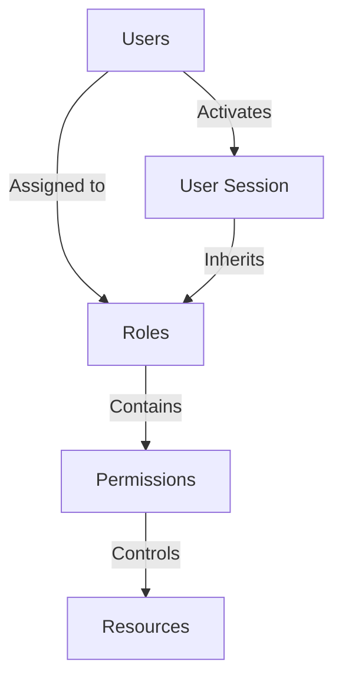
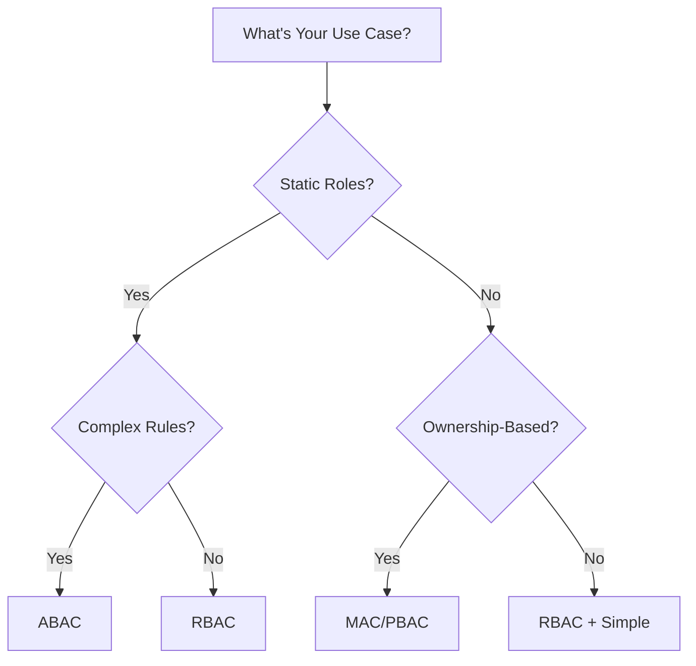
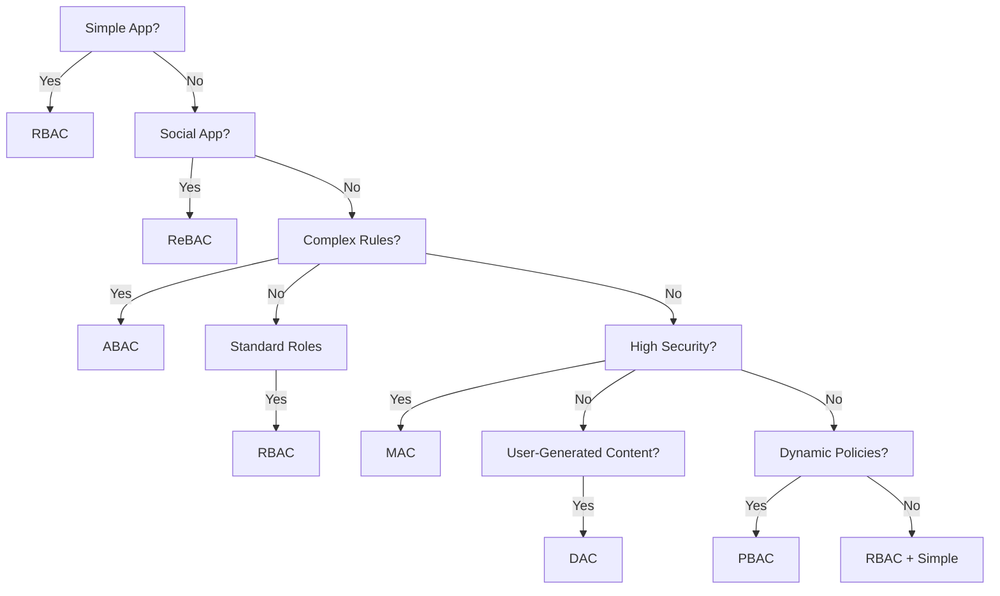

# Chapter 05: Authorization Methods

## Introduction

**📌 Authorization**: The process of determining what an authenticated user is allowed to do. Think of it like having different keys on your keycard - some keys open certain doors, others open different areas.

**Key Difference**: Authentication proves WHO you are, Authorization controls WHAT you can do.

This chapter covers different approaches to implementing authorization in APIs.

---

## RBAC (Role-Based Access Control)

### What is RBAC?

**RBAC (Role-Based Access Control)**: Authorization model where access permissions are assigned to roles, and users are assigned to appropriate roles.

**📌 Think of it like**: A company with different job titles - CEO, Manager, Employee. Each job title comes with specific permissions (access to certain floors, systems, or data).

### RBAC Components

| Component | Description | Example |
|-----------|-------------|---------|
| **Users** | System users needing access | John Doe, Jane Smith |
| **Roles** | Job functions with permissions | Admin, Manager, User, Guest |
| **Permissions** | Granular access rights | read:users, write:posts, delete:comments |
| **Sessions** | User-role activation context | Active user session |

### RBAC Architecture



### RBAC Implementation

#### Database Schema

```sql
-- Users table
CREATE TABLE users (
  id INT PRIMARY KEY,
  name VARCHAR(100),
  email VARCHAR(100) UNIQUE,
  password_hash VARCHAR(255),
  created_at TIMESTAMP
);

-- Roles table
CREATE TABLE roles (
  id INT PRIMARY KEY,
  name VARCHAR(50) UNIQUE,
  description TEXT
);

-- Permissions table
CREATE TABLE permissions (
  id INT PRIMARY KEY,
  name VARCHAR(100) UNIQUE,
  resource VARCHAR(100),
  action VARCHAR(50)
);

-- Role-Permission mapping
CREATE TABLE role_permissions (
  role_id INT REFERENCES roles(id),
  permission_id INT REFERENCES permissions(id),
  PRIMARY KEY (role_id, permission_id)
);

-- User-Role assignment
CREATE TABLE user_roles (
  user_id INT REFERENCES users(id),
  role_id INT REFERENCES roles(id),
  assigned_at TIMESTAMP,
  PRIMARY KEY (user_id, role_id)
);
```

#### Permission Checking Middleware

```javascript
// RBAC Authorization Middleware
async function checkPermission(requiredPermission) {
  return async (req, res, next) => {
    try {
      const userId = req.user.id;

      // Get user's roles
      const userRoles = await db.query(`
        SELECT r.* FROM roles r
        JOIN user_roles ur ON r.id = ur.role_id
        WHERE ur.user_id = ?
      `, [userId]);

      // Get permissions for user's roles
      const roleIds = userRoles.map(role => role.id);
      const permissions = await db.query(`
        SELECT p.* FROM permissions p
        JOIN role_permissions rp ON p.id = rp.permission_id
        WHERE rp.role_id IN (?)
      `, [roleIds]);

      // Check if user has required permission
      const hasPermission = permissions.some(
        perm => perm.name === requiredPermission
      );

      if (!hasPermission) {
        return res.status(403).json({
          error: 'Insufficient permissions',
          required: requiredPermission,
          message: 'You do not have permission to perform this action'
        });
      }

      req.userPermissions = permissions;
      next();

    } catch (error) {
      console.error('RBAC check error:', error);
      res.status(500).json({ error: 'Authorization error' });
    }
  };
}
```

#### RBAC Usage Example

```javascript
// Protect route with permission check
app.get('/api/admin/users',
  authenticateUser,          // First: Verify user identity
  checkPermission('read:users'),  // Second: Check authorization
  async (req, res) => {
    // Only reach here if user has 'read:users' permission
    const users = await userService.getAllUsers();
    res.json({ users });
  }
);

// Multiple permissions
app.delete('/api/posts/123',
  authenticateUser,
  checkPermission('read:posts', 'write:posts'),
  async (req, res) => {
    await postService.deletePost(123);
    res.json({ success: true });
  }
);
```

### RBAC Benefits and Challenges

| Aspect | Benefits | Challenges |
|--------|---------|------------|
| **Scalability** | Easy to manage | Role explosion possible |
| **Maintenance** | Centralized control | Complex permission mapping |
| **Auditability** | Clear access trails | Performance overhead |
| **Flexibility** | Fine-grained control | Can become complex |

---

## ABAC (Attribute-Based Access Control)

### What is ABAC?

**ABAC (Attribute-Based Access Control)**: Advanced authorization model that uses attributes (properties) of users, resources, and environment to make access decisions.

**📌 Think of it like**: A smart building where your keycard is checked against multiple factors - your job title, clearance level, time of day, and location - before deciding which doors you can open.

### ABAC Components

| Component | Description | Examples |
|-----------|-------------|----------|
| **User Attributes** | Properties of the user | role:manager, clearance:secret, department:finance |
| **Resource Attributes** | Properties of the resource | sensitivity:secret, owner:jane, classification:public |
| **Action Attributes** | Properties of the action | time:after-hours, type:bulk_operation |
| **Environment Attributes** | Context of access | location:office, time:night, device:mobile |

### ABAC Policy Languages

#### XACML (eXtensible Access Control Markup Language)

```xml
<!-- ABAC Policy Example -->
<Policy>
  <Target>
    <Subject AttributeDesignator="role" />
    <Resource AttributeDesignator="classification" />
    <Action AttributeDesignator="access" />
  </Target>

  <Rule Effect="Permit">
    <Subject AttributeDesignator="role" AttributeValue="admin" />
    <Resource AttributeDesignator="classification" AttributeValue="secret" />
  </Rule>

  <Rule Effect="Deny">
    <Subject AttributeDesignator="role" AttributeValue="user" />
    <Resource AttributeDesignator="classification" AttributeValue="secret" />
  </Rule>
</Policy>
```

#### ALFA (Abbreviated Language for Authorization)

```alica
// ABAC Policy in ALFA
// Managers can access financial records during business hours
user.role == "manager" AND
resource.type == "financial" AND
environment.time BETWEEN "09:00" AND "17:00" AND
action == "access"
-> permit;

// Users cannot access admin-only resources
user.role != "admin" AND
resource.type == "admin" AND
action == "access"
-> deny;
```

### ABAC Implementation

```javascript
// ABAC Policy Engine
class ABACPolicyEngine {
  constructor() {
    this.policies = [];
    this.attributes = {
      user: {},
      resource: {},
      environment: {}
    };
  }

  // Define policy
  addPolicy(condition, effect) {
    this.policies.push({ condition, effect });
  }

  // Evaluate policies
  async evaluate(user, resource, action, environment) {
    this.attributes.user = user;
    this.attributes.resource = resource;
    this.attributes.environment = environment;

    for (const policy of this.policies) {
      const result = await this.evaluateCondition(policy.condition);
      if (result && policy.effect === 'deny') {
        return { allowed: false, reason: policy.condition };
      }
    }

    // Check if any permit policy applies
    const hasPermit = this.policies.some(policy =>
      policy.effect === 'permit' &&
      this.evaluateCondition(policy.condition)
    );

    return {
      allowed: hasPermit || this.policies.length === 0,
      appliedPolicies: this.policies.length
    };
  }

  evaluateCondition(condition) {
    // Simple condition evaluator
    try {
      return eval(condition.replace(/\$(\w+)/g, 'this.attributes.$1'));
    } catch (error) {
      console.error('Condition evaluation error:', error);
      return false;
    }
  }
}
```

#### ABAC Usage Example

```javascript
// Initialize ABAC policy engine
const policyEngine = new ABACPolicyEngine();

// Define policies
policyEngine.addPolicy(
  'user.role === "admin" && resource.sensitivity === "secret"',
  'permit'
);

policyEngine.addPolicy(
  'user.role === "user" && resource.sensitivity === "public"',
  'permit'
);

policyEngine.addPolicy(
  'user.role === "guest"',
  'deny'
);

// Middleware to check ABAC policies
async function checkABACAuthorization(action) {
  return async (req, res, next) => {
    const user = req.user;
    const resource = { sensitivity: req.resource.sensitivity };
    const environment = {
      time: new Date().getHours(),
      location: req.ip,
      device: req.headers['user-agent']
    };

    const result = await policyEngine.evaluate(user, resource, action, environment);

    if (!result.allowed) {
      return res.status(403).json({
        error: 'Access denied',
        reason: result.appliedPolicies > 0 ?
          'No matching policies found' :
          'Access denied by policy rules'
      });
    }

    next();
  };
}

// Apply to route
app.get('/api/secret-data',
  authenticateUser,
  checkABACAuthorization('read'),
  async (req, res) => {
    const data = await secretService.getData();
    res.json({ data });
  }
);
```

### ABAC vs RBAC

| Aspect | ABAC | RBAC |
|--------|------|------|
| **Flexibility** | Very High | Medium |
| **Complexity** | Very High | Low |
| **Scalability** | High | Medium |
| **Maintenance** | Complex | Simple |
| **Performance** | Slower | Faster |
| **Use Cases** | Complex, dynamic | Simple, static |

---

## ReBAC (Relationship-Based Access Control)

### What is ReBAC?

**ReBAC (Relationship-Based Access Control)**: Authorization model where access decisions are based on relationships between entities (users, resources, and their connections).

**📌 Think of it like**: Social networks - you can see content from people you're connected to, but not from strangers, regardless of your role.

### ReBAC Components

| Component | Description | Examples |
|-----------|-------------|---------|
| **Subjects** | Entities requesting access | Users, Organizations |
| **Objects** | Resources being accessed | Documents, Folders, Groups |
| **Relationships** | Connections between subjects and objects | Friend-of, Member-of, Owner-of |
| **Access Rights** | Permissions based on relationships | View, Edit, Share |

### ReBAC Relationship Types

| Relationship | Description | Graph Pattern |
|------------|-------------|-------------|
| **Ownership** | User owns the resource | (User)-[:owns]->(Document) |
| **Friendship** | Users are connected socially | (User)-[:friend]->(User) |
| **Membership** | User belongs to a group | (User)-[:member]->(Group) |
| **Collaboration** | Users work together | (User)-[:collaborator]->(Project) |
| **Hierarchical** | Organizational structure | (User)-[:reports_to]->(User) |

### ReBAC Implementation

```javascript
// ReBAC Authorization System
class ReBACGraph {
  constructor() {
    this.nodes = new Map();  // Users, groups, resources
    this.edges = new Map();  // Relationships
  }

  // Add node (user, group, resource)
  addNode(id, attributes) {
    this.nodes.set(id, { ...attributes, relationships: [] });
  }

  // Add relationship
  addEdge(fromId, toId, type, permissions) {
    if (!this.nodes.has(fromId) || !this.nodes.has(toId)) {
      throw new Error('One or both nodes do not exist');
    }

    this.edges.set(`${fromId}:${toId}`, { type, permissions });

    // Update node relationships
    const fromNode = this.nodes.get(fromId);
    const toNode = this.nodes.get(toId);

    fromNode.relationships.push({ id: toId, type, permissions });
  }

  // Check if access is allowed
  async checkAccess(userId, resourceId, action) {
    const visited = new Set();
    const queue = [{ id: userId, depth: 0 }];

    while (queue.length > 0) {
      const current = queue.shift();
      visited.add(current.id);

      if (current.id === resourceId) {
        // Found path - check permissions
        const edgeId = `${userId}:${current.id}`;
        const edge = this.edges.get(edgeId);

        if (edge && edge.permissions.includes(action)) {
          return { allowed: true, path: reconstructPath(visited) };
        }
        continue;
      }

      // Check outgoing edges from current node
      const node = this.nodes.get(current.id);
      if (node) {
        for (const rel of node.relationships) {
          const relationship = this.edges.get(`${current.id}:${rel.id}`);
          if (relationship && !visited.has(rel.id)) {
            queue.push({ id: rel.id, depth: current.depth + 1 });
          }
        }
      }
    }

    // No path found
    return { allowed: false };
  }
}
```

#### ReBAC Usage Example

```javascript
// Initialize ReBAC graph
const graph = new ReBACGraph();

// Add entities
graph.addNode('user1', { type: 'user', name: 'John Doe' });
graph.addNode('user2', { type: 'user', name: 'Jane Smith' });
graph.addNode('doc1', { type: 'document', title: 'Project Report', owner: 'user1' });
graph.addNode('doc2', { type: 'document', title: 'Company Policy', owner: 'user2' });

// Add relationships
graph.addEdge('user1', 'doc1', 'owns', ['read', 'write', 'delete']);
graph.addEdge('user2', 'doc2', 'owns', ['read', 'write', 'delete']);
graph.addEdge('user1', 'user2', 'friend', ['view']);

// Authorization middleware
async function checkReBACAccess(resourceId, action) {
  return async (req, res, next) => {
    const userId = req.user.id;

    // Check if user can access resource through relationships
    const result = await graph.checkAccess(userId, resourceId, action);

    if (!result.allowed) {
      return res.status(403).json({
        error: 'Access denied',
        message: 'You do not have permission to access this resource',
        reason: 'No valid relationship path found'
      });
    }

    next();
  };
}

// Protect route
app.get('/api/documents/:id',
  authenticateUser,
  checkReBACAccess(req.params.id, 'read'),
  async (req, res) => {
    const document = await documentService.getDocument(req.params.id);
    res.json({ document });
  }
);
```

### ReBAC Use Cases

| Scenario | Description | Pattern |
|---------|-------------|----------|
| **Social Media** | Friends see friends' posts | Friend-of relationship |
| **Document Sharing** | Collaborators access shared docs | Member-of relationship |
| **File Systems** | Users see files in folders they own | Ownership hierarchy |
| **Organizational** | Managers access subordinate data | Reports-to relationship |

---

## DAC (Discretionary Access Control)

### What is DAC?

**DAC (Discretionary Access Control)**: Authorization model where the owner (creator) of a resource decides who can access it.

**📌 Think of it like**: Your personal diary - you decide who can read each page, regardless of their official roles or positions.

### DAC Components

| Component | Description | Examples |
|-----------|-------------|---------|
| **Resource Owner** | Creator of the resource | File creator, document author |
| **Access List** | List of users/roles with access | Share permissions, edit rights |
| **Inheritance** | Permission inheritance | Folder permissions apply to contents |

### DAC Implementation

```javascript
// DAC Authorization System
class DACController {
  async setResourceAccess(resourceId, owner, permissions) {
    return await db.query(`
      INSERT INTO resource_permissions
      (resource_id, user_id, permission, granted_by, granted_at)
      VALUES (?, ?, ?, ?, ?)
    `, [resourceId, owner.id, permissions.join(','), owner.id, new Date()]);
  }

  async checkAccess(userId, resourceId, action) {
    // First check if user is owner
    const owner = await db.query(`
      SELECT user_id FROM resources WHERE id = ? AND user_id = ?
    `, [resourceId, userId]);

    if (owner.length > 0) {
      return { allowed: true, reason: 'Resource owner' };
    }

    // Check explicit permissions
    const permissions = await db.query(`
      SELECT permission FROM resource_permissions
      WHERE resource_id = ? AND user_id = ?
    `, [resourceId, userId]);

    const userPermissions = permissions.map(p => p.permission);
    return {
      allowed: userPermissions.includes(action),
      reason: userPermissions.length > 0 ? 'Explicit permission granted' : 'No permission found'
    };
  }
}
```

#### DAC Usage Example

```javascript
// File sharing system
const fileSystem = new DACController();

// User uploads file (automatically becomes owner)
app.post('/api/files',
  authenticateUser,
  uploadMiddleware,
  async (req, res) => {
    const file = await fileService.saveFile(req.file);

    // Automatically set owner permissions
    await fileSystem.setResourceAccess(file.id, req.user, ['read', 'write', 'share']);

    res.json({ file });
  }
);

// User shares file with another user
app.post('/api/files/:id/share',
  authenticateUser,
  async (req, res) => {
    const { targetUserId, permissions } = req.body;

    await fileSystem.setResourceAccess(req.params.id, req.user, permissions, targetUserId);

    res.json({ success: true, message: 'File shared successfully' });
  }
);

// Check file access
app.get('/api/files/:id',
  authenticateUser,
  async (req, res) => {
    const result = await fileSystem.checkAccess(req.user.id, req.params.id, 'read');

    if (!result.allowed) {
      return res.status(403).json({
        error: 'Access denied',
        reason: result.reason
      });
    }

    const file = await fileService.getFile(req.params.id);
    res.json({ file });
  }
);
```

---

## MAC (Mandatory Access Control)

### What is MAC?

**MAC (Mandatory Access Control)**: Authorization model where access decisions are based on security labels and clearances assigned to both users and resources.

**📌 Think of it like**: Government security system - both the person and the document have security classifications, and access is only granted if the person's clearance meets or exceeds the document's classification.

### MAC Components

| Component | Description | Examples |
|-----------|-------------|---------|
| **Security Levels** | Hierarchical classifications | Confidential, Secret, Top Secret |
| **Clearances** | User's authorized level | Secret, Top Secret, Cosmic |
| **Categories** | Type of information | Nuclear, Financial, Personnel |
| **Access Rules** | Strict security policies | "Need-to-know" principle |

### MAC Implementation

```javascript
// MAC Authorization System
class MACController {
  constructor() {
    this.securityLevels = [
      { level: 1, name: 'Unclassified' },
      { level: 2, name: 'Confidential' },
      { level: 3, name: 'Secret' },
      { level: 4, name: 'Top Secret' }
    ];
  }

  async checkAccess(userId, resourceId, action) {
    // Get user clearance
    const user = await userService.getUser(userId);
    const userClearance = user.clearance.level;

    // Get resource classification
    const resource = await resourceService.getResource(resourceId);
    const resourceClassification = resource.classification.level;

    // Apply MAC rule: User clearance >= Resource classification
    if (userClearance >= resourceClassification) {
      // Check specific action permissions
      const actionPermissions = this.getActionPermissions(action);
      if (userClearance >= actionPermissions.requiredLevel) {
        return { allowed: true, reason: 'Clearance sufficient' };
      }
    }

    return {
      allowed: false,
      reason: 'Insufficient clearance level',
      required: resourceClassification,
      current: userClearance
    };
  }
}
```

#### MAC Usage Example

```javascript
// Document classification system
const macController = new MACController();

// Middleware to check MAC access
async function checkMACAuthorization(action) {
  return async (req, res, next) => {
    const result = await macController.checkAccess(req.user.id, req.params.id, action);

    if (!result.allowed) {
      return res.status(403).json({
        error: 'Access denied',
        reason: result.reason,
        currentClearance: result.current,
        requiredClearance: result.required
      });
    }

    // Log access attempt for audit
    await auditService.logAccessAttempt({
      userId: req.user.id,
      resourceId: req.params.id,
      action,
      allowed: true,
      timestamp: new Date()
    });

    next();
  };
}

// Protect classified documents
app.get('/api/classified/:id',
  authenticateUser,
  checkMACAuthorization('read'),
  async (req, res) => {
    const document = await classifiedService.getDocument(req.params.id);
    res.json({ document });
  }
);
```

---

## PBAC (Policy-Based Access Control)

### What is PBAC?

**PBAC (Policy-Based Access Control)**: Authorization model where access decisions are made by evaluating policies against a set of attributes.

**📌 Think of it like**: A smart home system where you can set rules like "No guests after 10 PM" or "Children cannot access parental controls" - the system evaluates these rules for each access request.

### PBAC Implementation

```javascript
// PBAC Policy Engine
class PBACEngine {
  constructor() {
    this.policies = [];
  }

  // Add policy
  addPolicy(name, condition, action) {
    this.policies.push({ name, condition, action });
  }

  // Evaluate all policies
  async evaluate(context) {
    const results = [];

    for (const policy of this.policies) {
      try {
        const conditionMet = this.evaluateCondition(policy.condition, context);
        results.push({
          policy: policy.name,
          condition: policy.condition,
          met: conditionMet,
          action: conditionMet ? policy.action : 'none'
        });
      } catch (error) {
        console.error(`Policy evaluation error for ${policy.name}:`, error);
      }
    }

    return { results, context };
  }

  evaluateCondition(condition, context) {
    // Simple condition parser
    // In production, use a proper expression parser
    try {
      return eval(condition.replace(/\$(\w+)/g, (match, key) => {
        return `context.${key}`;
      }));
    } catch (error) {
      return false;
    }
  }
}
```

#### PBAC Usage Example

```javascript
// Initialize PBAC engine
const pbac = new PBACEngine();

// Define policies
pbac.addPolicy(
  'business_hours_only',
  'context.time.hours >= 9 && context.time.hours <= 17',
  'allow'
);

pbac.addPolicy(
  'no_weekend_access',
  'context.time.dayOfWeek === 6 || context.time.dayOfWeek === 0',
  'deny'
);

pbac.addPolicy(
  'ip_restriction',
  'context.location.ip !== "external_ip"',
  'deny'
);

// PBAC authorization middleware
async function checkPBACAuthorization(action) {
  return async (req, res, next) => {
    const context = {
      user: req.user,
      resource: req.params,
      time: new Date(),
      location: { ip: req.ip, country: getCountryCode(req.ip) }
    };

    const results = await pbac.evaluate(context);

    // Check if any deny policies apply
    const denyPolicies = results.filter(r => r.action === 'deny' && r.met);
    if (denyPolicies.length > 0) {
      return res.status(403).json({
        error: 'Access denied by policy',
        policies: denyPolicies.map(p => p.policy)
      });
    }

    // Check if any allow policies apply
    const allowPolicies = results.filter(r => r.action === 'allow' && r.met);
    if (allowPolicies.length > 0) {
      next(); // Allow access
    } else {
      // Default deny if no policies apply
      return res.status(403).json({
        error: 'Access denied',
        reason: 'No applicable policies allow access'
      });
    }
  };
}
```

---

## Choosing the Right Authorization Model

### Decision Framework



### Comparison Matrix

| Model | Complexity | Flexibility | Scalability | Best For |
|------|------------|-------------|-------------|----------|
| **RBAC** | Low | Medium | Medium | Standard applications |
| **ABAC** | Very High | Very High | High | Complex security systems |
| **ReBAC** | Medium | High | Medium | Social/collaboration apps |
| **DAC** | Low | High | Low | User-generated content |
| **MAC** | Medium | Low | High | Government/military |
| **PBAC** | High | Very High | Medium | Dynamic rule-based systems |

### Implementation Recommendations

#### For Standard Business Applications
**Choose RBAC** if:
- Well-defined user roles
- Simple permission structure
- Centralized management needed
- Standard CRUD operations

#### For Social/Collaboration Platforms
**Choose ReBAC** if:
- User relationships drive access
- Dynamic connections between users
- Social features needed
- Collaborative work environment

#### For High-Security Systems
**Choose MAC** if:
- Government/regulatory compliance
- Strict security classifications
- "Need-to-know" principle
- Multiple clearance levels

#### For Complex/Rule-Based Systems
**Choose ABAC** if:
- Multiple attributes affect access
- Complex business rules
- Dynamic authorization required
- Fine-grained control needed

#### For User-Generated Content
**Choose DAC** if:
- Users own and control their content
- Sharing permissions needed
- Content management system
- File sharing features

---

## Hybrid Authorization Models

### RBAC + ABAC

**Description**: Use RBAC for basic role permissions, then use ABAC for additional contextual rules.

**Use Case**: E-commerce system where users have roles, but additional rules based on order value, location, etc.

```javascript
// Check RBAC first
if (!hasRolePermission(user, resource, action)) {
  return false;
}

// Then check ABAC policies
return abacEngine.evaluate({
  user: user,
  resource: resource,
  action: action,
  context: {
    time: new Date(),
    location: req.ip,
    device: req.headers['user-agent']
  }
});
```

### RBAC + ReBAC

**Description**: Use RBAC for organizational roles, and ReBAC for collaborative relationships.

**Use Case**: Enterprise document management with departments and sharing features.

---

## Best Practices for Authorization

### Security Principles

1. **Principle of Least Privilege**: Users should have only the permissions they absolutely need
2. **Separation of Concerns**: Authorization should be decoupled from business logic
3. **Audit Logging**: Log all authorization decisions for compliance and debugging
4. **Time-based Access**: Implement session timeouts and token expiration
5. **Attribute-based Validation**: Validate all input attributes before making decisions

### Implementation Checklist

| Practice | Why Important | Implementation |
|----------|----------------|----------------|
| **Centralized Auth** | Consistent enforcement | Single authorization service |
| **Caching** | Performance improvement | Cache permission results |
| **Rate Limiting** | Prevent abuse | Limit authorization checks |
| **Input Validation** | Prevent injection attacks | Sanitize all inputs |
| **Error Handling** | Good UX | Consistent error responses |
| **Testing** | Ensure correctness | Unit test all policies |

### Common Anti-Patterns

| Anti-Pattern | Problem | Solution |
|-------------|--------|----------|
| **Role Explosion** | Too many roles to manage | Combine similar roles |
| **Overly Complex Rules** | Difficult to maintain | Simplify where possible |
| **Implicit Permissions** | Unclear access rights | Make permissions explicit |
| **No Audit Trail** | Security and compliance risk | Log all auth decisions |
| **Hard-coded Policies** | Inflexible and error-prone | Externalize policies |

---

## Interview Questions

### Basic Questions

1. **What's the difference between authentication and authorization?**
   - Authentication: Who you are (identity verification)
   - Authorization: What you can do (permission checking)
   - Example: Authentication = showing driver's license, Authorization = checking if license allows driving a truck

2. **What is RBAC and when would you use it?**
   - Role-Based Access Control
   - Use when users have clear job functions (admin, manager, user)
   - Good for standard business applications

3. **How do you implement RBAC in APIs?**
   - Create users, roles, and permissions tables
   - Map roles to permissions
   - Assign users to roles
   - Check permissions in middleware before allowing access

### Intermediate Questions

4. **What is ABAC and how does it differ from RBAC?**
   - Attribute-Based Access Control vs Role-Based
   - ABAC uses dynamic attributes, RBAC uses static roles
   - ABAC more flexible but complex to implement
   - Use ABAC for complex, rule-based systems

5. **What is ReBAC and when would you use it?**
   - Relationship-Based Access Control
   - Use when access depends on user relationships
   - Good for social networks and collaborative apps
   - Determines access based on connections between users

6. **What's the difference between MAC and DAC?**
   - MAC: Mandatory Access Control (system-controlled)
   - DAC: Discretionary Access Control (user-controlled)
   - MAC used in high-security environments
   - DAC used when resource owners decide access

### Advanced Questions

7. **How would you implement a hybrid RBAC+ABAC system?**
   - Use RBAC for basic role permissions
   - Add ABAC for contextual rules (time, location, etc.)
   - Evaluate RBAC first, then ABAC policies
   - Combine results with AND/OR logic

8. **What are common security pitfalls in authorization systems?**
   - Over-privileged users (privilege escalation)
   - Missing authorization checks
   - Insecure policy evaluation
   - Lack of audit logging
   - Hard-coded permissions in code

9. **How would you design authorization for a microservices architecture?**
   - Centralized authorization service
   - Distributed policy evaluation
   - Cached permissions for performance
   - Service-to-service authentication
   - Event-driven authorization updates

---

## Summary

### Key Takeaways

1. **RBAC**: Most common, good for standard role-based permissions
2. **ABAC**: Most flexible, handles complex rule-based systems
3. **ReBAC**: Relationship-based, perfect for social/collaborative apps
4. **DAC**: User-controlled, ideal for content management systems
5. **MAC**: High-security, used in government/military systems
6. **PBAC**: Policy-driven, good for dynamic rule systems

### Best Practices Checklist

- [ ] Implement least privilege principle
- [ ] Centralized authorization service
- [ ] Comprehensive audit logging
- [ ] Input validation and sanitization
- [ ] Regular permission reviews
- [ ] Test authorization thoroughly
- [ ] Handle authorization failures gracefully
- [ ] Document authorization model clearly
- [ ] Use caching for performance
- [ ] Implement rate limiting

### Decision Framework



**Next Up**: Chapter 06 explores API Documentation Tools, covering how to create and maintain comprehensive API documentation that developers love to use.