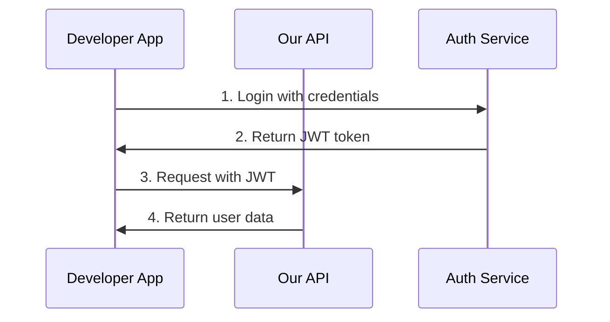
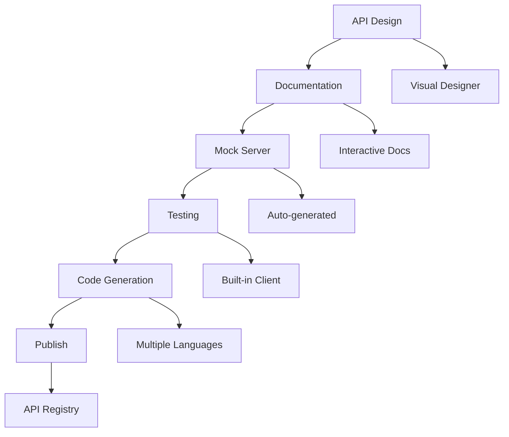
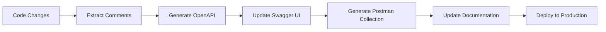
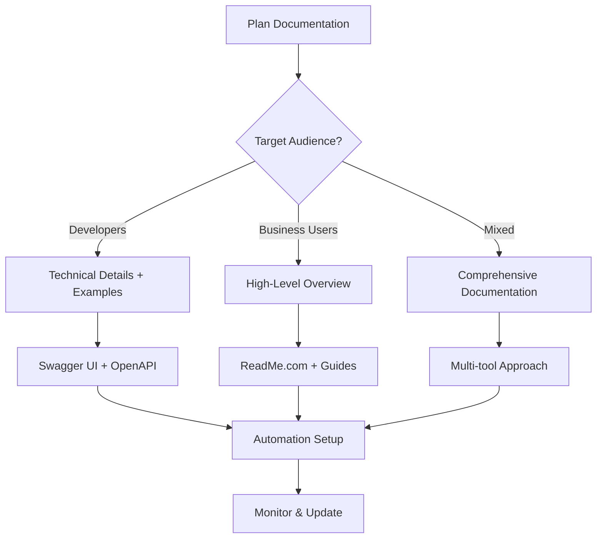

# Chapter 06: API Documentation Tools

## Introduction

**📌 API Documentation**: The detailed description of what an API does, how it works, and how to use it. Think of it like a user manual for your API that helps developers understand and use it effectively.

**📌 Why Documentation Matters**: Good documentation reduces support tickets, accelerates developer adoption, and makes your API more professional and maintainable.

This chapter covers the most important tools and practices for creating excellent API documentation.

---

## OpenAPI/Swagger

### What is OpenAPI?

**OpenAPI Specification (OAS)**: A standard for defining RESTful APIs that provides a formal, machine-readable description of how your API works.

**📌 Think of it like**: A blueprint for your API that both humans and machines can understand. It's like having a detailed menu that not only describes dishes but also tells you exactly how to order them.

### OpenAPI vs Swagger

| Term | Description | Current Status |
|------|-------------|----------------|
| **Swagger** | Original tool for API documentation | Now part of OpenAPI ecosystem |
| **OpenAPI** | Industry standard specification | Version 3.x is current |
| **Swagger UI** | Interactive documentation generator | Uses OpenAPI spec |
| **Swagger Editor** | API spec editor | Now called SwaggerHub |

### OpenAPI Specification Structure

```yaml
# Complete OpenAPI 3.0 example
openapi: 3.0.3
info:
  title: User Management API
  description: A comprehensive API for managing users, authentication, and profiles
  version: 1.0.0
  contact:
    name: API Team
    email: api@example.com
    url: https://example.com/support
  license:
    name: MIT
    url: https://opensource.org/licenses/MIT

servers:
  - url: https://api.example.com/v1
    description: Production server
  - url: https://staging-api.example.com/v1
    description: Staging server
  - url: http://localhost:3000/v1
    description: Development server

# Security schemes
security:
  - BearerAuth: []
  - ApiKeyAuth: []

components:
  securitySchemes:
    BearerAuth:
      type: http
      scheme: bearer
      bearerFormat: JWT
    ApiKeyAuth:
      type: apiKey
      in: header
      name: X-API-Key

  schemas:
    User:
      type: object
      required:
        - email
        - name
      properties:
        id:
          type: integer
          example: 123
        name:
          type: string
          example: "John Doe"
        email:
          type: string
          format: email
          example: "john@example.com"
        avatar:
          type: string
          format: uri
          example: "https://example.com/avatars/123.jpg"
        created_at:
          type: string
          format: date-time
          example: "2023-12-01T10:30:00Z"

    Error:
      type: object
      required:
        - code
        - message
      properties:
        code:
          type: string
          example: "USER_NOT_FOUND"
        message:
          type: string
          example: "User with ID 123 not found"
        details:
          type: object

# API endpoints
paths:
  /users:
    get:
      summary: Get all users
      description: Retrieve a paginated list of users with optional filtering
      tags:
        - Users
      parameters:
        - name: page
          in: query
          schema:
            type: integer
            default: 1
            minimum: 1
          description: Page number for pagination
        - name: limit
          in: query
          schema:
            type: integer
            default: 20
            minimum: 1
            maximum: 100
          description: Number of users per page
        - name: search
          in: query
          schema:
            type: string
          description: Search users by name or email
      responses:
        '200':
          description: Users retrieved successfully
          content:
            application/json:
              schema:
                type: object
                properties:
                  users:
                    type: array
                    items:
                      $ref: '#/components/schemas/User'
                  pagination:
                    type: object
                    properties:
                      page:
                        type: integer
                      limit:
                        type: integer
                      total:
                        type: integer
        '401':
          $ref: '#/components/responses/Unauthorized'
        '429':
          $ref: '#/components/responses/TooManyRequests'

    post:
      summary: Create a new user
      description: Create a new user account with the provided information
      tags:
        - Users
      requestBody:
        required: true
        content:
          application/json:
            schema:
              type: object
              required:
                - name
                - email
                - password
              properties:
                name:
                  type: string
                  example: "Jane Smith"
                email:
                  type: string
                  format: email
                  example: "jane@example.com"
                password:
                  type: string
                  format: password
                  minLength: 8
                  example: "password123"
      responses:
        '201':
          description: User created successfully
          content:
            application/json:
              schema:
                $ref: '#/components/schemas/User'
        '400':
          $ref: '#/components/responses/BadRequest'
        '409':
          description: User already exists
          content:
            application/json:
              schema:
                $ref: '#/components/schemas/Error'

  /users/{id}:
    get:
      summary: Get user by ID
      description: Retrieve detailed information about a specific user
      tags:
        - Users
      parameters:
        - name: id
          in: path
          required: true
          schema:
            type: integer
          description: Unique identifier of the user
      responses:
        '200':
          description: User retrieved successfully
          content:
            application/json:
              schema:
                $ref: '#/components/schemas/User'
        '404':
          $ref: '#/components/responses/NotFound'
        '401':
          $ref: '#/components/responses/Unauthorized'

# Common responses
components:
  responses:
    Unauthorized:
      description: Authentication required
      content:
        application/json:
          schema:
            $ref: '#/components/schemas/Error'
    NotFound:
      description: Resource not found
      content:
        application/json:
          schema:
            $ref: '#/components/schemas/Error'
    BadRequest:
      description: Invalid request parameters
      content:
        application/json:
          schema:
            $ref: '#/components/schemas/Error'
    TooManyRequests:
      description: Rate limit exceeded
      content:
        application/json:
          schema:
            $ref: '#/components/schemas/Error'

tags:
  - name: Users
    description: User management operations
```

### OpenAPI Best Practices

| Practice | Why It Matters | Implementation |
|----------|---------------|----------------|
| **Semantic Versioning** | Clear API evolution | Use `x.x.x` format |
| **Detailed Descriptions** | Better understanding | Markdown support in descriptions |
| **Examples** | Clarity for developers | Include request/response examples |
| **Error Responses** | Better error handling | Define all error scenarios |
| **Security Schemes** | Authentication clarity | Define all auth methods |

---

## Swagger UI

### What is Swagger UI?

**Swagger UI**: Interactive API documentation that lets developers explore and test your API directly from their browser.

**📌 Think of it like**: A web-based user manual for your API that lets you try things out as you read about them.

### Swagger UI Features

| Feature | Description | Developer Value |
|---------|-------------|-----------------|
| **Interactive Testing** | Try API calls from browser | Quick prototyping |
| **Parameter Validation** | Input validation before requests | Reduce errors |
| **Authentication Support** | Handle OAuth, API keys, etc. | Secure testing |
| **Schema Display** | Visual data structure | Better understanding |
| **Code Generation** | Generate client code | Faster development |

### Setting Up Swagger UI

#### With Node.js/Express

```javascript
const swaggerUi = require('swagger-ui-express');
const swaggerDocument = require('./swagger.json');

// Add Swagger UI route
app.use('/api-docs', swaggerUi.serve, swaggerUi.setup(swaggerDocument, {
  explorer: true,                    // Enable search bar
  customCss: '.swagger-ui .topbar { display: none }',
  customSiteTitle: "My API Documentation"
}));

// Add OpenAPI spec route
app.get('/api-docs.json', (req, res) => {
  res.setHeader('Content-Type', 'application/json');
  res.send(swaggerDocument);
});
```

#### With Docker

```yaml
# docker-compose.yml
version: '3.8'
services:
  swagger-ui:
    image: swaggerapi/swagger-ui
    ports:
      - "8080:8080"
    environment:
      - SWAGGER_JSON=/api-specs/openapi.json
      - BASE_URL=/api-docs
    volumes:
      - ./swagger.json:/api-specs/openapi.json
```

### Customizing Swagger UI

```javascript
const swaggerOptions = {
  explorer: true,
  deepLinking: true,
  displayRequestDuration: true,
  docExpansion: "none",
  filter: true,
  showExtensions: true,
  showCommonExtensions: true,
  tryItOutEnabled: true,
  operationsSorter: "alpha",
  tagsSorter: "alpha"
};
```

---

## Postman Collections

### What are Postman Collections?

**Postman Collections**: Organized groups of API requests that can be saved, shared, and documented.

**📌 Think of it like**: A recipe book for your API - each recipe is a specific request with all the ingredients and instructions ready to use.

### Postman Collection Structure

```json
{
  "info": {
    "name": "User Management API",
    "description": "Complete collection for User Management API testing",
    "schema": "https://schema.getpostman.com/json/collection/v2.1.0/collection.json"
  },
  "item": [
    {
      "name": "Authentication",
      "item": [
        {
          "name": "Login",
          "request": {
            "method": "POST",
            "header": [
              {
                "key": "Content-Type",
                "value": "application/json"
              }
            ],
            "body": {
              "mode": "raw",
              "raw": "{\n  \"email\": \"user@example.com\",\n  \"password\": \"password123\"\n}"
            },
            "url": {
              "raw": "{{baseUrl}}/auth/login",
              "host": ["{{baseUrl}}"],
              "path": ["auth", "login"]
            },
            "description": "Authenticate user and get access token"
          },
          "response": []
        },
        {
          "name": "Refresh Token",
          "request": {
            "method": "POST",
            "header": [
              {
                "key": "Content-Type",
                "value": "application/json"
              }
            ],
            "body": {
              "mode": "raw",
              "raw": "{\n  \"refreshToken\": \"{{refreshToken}}\"\n}"
            },
            "url": {
              "raw": "{{baseUrl}}/auth/refresh",
              "host": ["{{baseUrl}}"],
              "path": ["auth", "refresh"]
            }
          }
        }
      ]
    },
    {
      "name": "Users",
      "item": [
        {
          "name": "Get All Users",
          "request": {
            "method": "GET",
            "header": [
              {
                "key": "Authorization",
                "value": "Bearer {{accessToken}}"
              }
            ],
            "url": {
              "raw": "{{baseUrl}}/users?page=1&limit=20",
              "host": ["{{baseUrl}}"],
              "path": ["users"],
              "query": [
                {
                  "key": "page",
                  "value": "1"
                },
                {
                  "key": "limit",
                  "value": "20"
                }
              ]
            },
            "description": "Get paginated list of users with optional filtering"
          }
        },
        {
          "name": "Create User",
          "request": {
            "method": "POST",
            "header": [
              {
                "key": "Authorization",
                "value": "Bearer {{accessToken}}"
              },
              {
                "key": "Content-Type",
                "value": "application/json"
              }
            ],
            "body": {
              "mode": "raw",
              "raw": "{\n  \"name\": \"John Doe\",\n  \"email\": \"john@example.com\",\n  \"password\": \"password123\"\n}"
            },
            "url": {
              "raw": "{{baseUrl}}/users",
              "host": ["{{baseUrl}}"],
              "path": ["users"]
            }
          }
        }
      ]
    }
  ],
  "variable": [
    {
      "key": "baseUrl",
      "value": "https://api.example.com/v1"
    },
    {
      "key": "accessToken",
      "value": ""
    },
    {
      "key": "refreshToken",
      "value": ""
    }
  ]
}
```

### Postman Collection Best Practices

| Practice | Description | Benefits |
|----------|-------------|----------|
| **Environment Variables** | Different configs for dev/staging/prod | Easy environment switching |
| **Test Scripts** | Automated response validation | Better quality assurance |
| **Documentation** | Add request descriptions | Self-documenting collections |
| **Folders/Structure** | Logical organization | Better navigation |
| **Examples** | Sample requests and responses | Clear usage patterns |

### Postman Test Scripts

```javascript
// Example test script for API response
pm.test("Status code is 200", function () {
    pm.response.to.have.status(200);
});

pm.test("Response has valid structure", function () {
    const responseJson = pm.response.json();

    // Check if response has required fields
    pm.expect(responseJson).to.have.property('data');
    pm.expect(responseJson.data).to.be.an('array');

    // Check if user objects have required fields
    if (responseJson.data.length > 0) {
        const user = responseJson.data[0];
        pm.expect(user).to.have.property('id');
        pm.expect(user).to.have.property('name');
        pm.expect(user).to.have.property('email');
    }
});

// Extract and set variables
pm.test("Set user ID for next request", function () {
    const responseJson = pm.response.json();
    if (responseJson.data && responseJson.data.length > 0) {
        pm.globals.set('userId', responseJson.data[0].id);
    }
});
```

---

## ReadMe.com

### What is ReadMe.com?

**ReadMe.com**: A platform for creating beautiful, interactive API documentation with built-in developer tools.

**📌 Think of it like**: A modern website builder specifically designed for API documentation that includes everything from reference guides to interactive playgrounds.

### ReadMe.com Features

| Feature | Description | When to Use |
|---------|-------------|------------|
| **Interactive API Explorer** | Try API calls in browser | Public APIs |
| **Custom Domain** | Branded documentation URLs | Professional APIs |
| **Version Control** | Multiple API versions | Evolving APIs |
| **Analytics** | Track API usage | Business APIs |
| **Integration Options** | Multiple auth methods | Complex APIs |

### ReadMe.com Documentation Structure

```markdown
# User Management API Documentation

## Overview

Welcome to the User Management API! This API allows you to manage users, authentication, and profiles for your applications.

## Authentication

We use JWT tokens for authentication. Include the token in the Authorization header:

```bash
Authorization: Bearer your_jwt_token_here
```

## Getting Started

### 1. Get Your API Key

First, you'll need to get an API key from your dashboard.

### 2. Make Your First Request

```bash
curl -X GET "https://api.example.com/v1/users" \
     -H "Authorization: Bearer YOUR_API_KEY"
```

## Core Endpoints

### Get All Users

Retrieve a paginated list of all users.

{{code:lang="bash" src="https://api.example.com/v1/users"}}
```

### Authentication Flow Diagram



## Error Handling

| Error Code | Description | How to Fix |
|-----------|-------------|------------|
| 401 | Unauthorized | Check your API key |
| 403 | Forbidden | Verify permissions |
| 429 | Rate Limited | Wait and retry |
| 500 | Server Error | Contact support |

## SDKs and Libraries

We provide official SDKs for several languages:

{{tabs}}
{{tab name="JavaScript" }}

```bash
npm install @example/users-api
```

{{/tab}}
{{tab name="Python" }}

```bash
pip install example-users-api
```

{{/tab}}
{{tab name="Ruby" }}

```bash
gem install example_users_api
```

{{/tab}}
{{/tabs}}

## Community

- **Discord**: Join our developer community
- **GitHub**: Report issues and contribute
- **Blog**: Latest features and updates
```

### ReadMe.com Custom Blocks

#### Interactive API Explorer
```html
<InteractiveAPI
  endpoint="GET /users"
  description="Try our API right here!"
  authentication="Bearer"
/>
```

#### Code Examples with Language Tabs
```html
<CodeGroup>
<Code name="JavaScript">
```js
fetch('/api/users', {
  headers: { 'Authorization': 'Bearer token' }
})
</Code>
<Code name="Python">
```python
requests.get('/api/users',
  headers={'Authorization': 'Bearer token'})
</Code>
</CodeGroup>
```

---

## Stoplight Studio

### What is Stoplight?

**Stoplight Studio**: A visual API design and documentation platform that combines API design, documentation, and testing.

**📌 Think of it like**: A visual API builder where you can design, document, and test your API all in one place.

### Stoplight Features

| Feature | Description | Use Case |
|---------|-------------|---------|
| **Visual API Designer** | Drag-and-drop API design | Rapid prototyping |
| **HTTP Client** | Built-in API testing | Documentation testing |
| **Mock Servers** | Auto-generated mock APIs | Frontend development |
| **API Registry** | Central API catalog | Enterprise teams |
| **Design-First Approach** | Documentation before code | Contract-first development |

### Stoplight API Design

#### Visual API Designer

```markdown
# User API Design

## Endpoints

### GET /users
Retrieve all users with optional filtering.

**Parameters:**
- `page` (integer): Page number
- `limit` (integer): Results per page
- `search` (string): Search term

**Response:**
```json
{
  "users": [
    {
      "id": 1,
      "name": "John Doe",
      "email": "john@example.com"
    }
  ],
  "pagination": {
    "page": 1,
    "total": 100
  }
}
```

### POST /users
Create a new user.

**Request Body:**
```json
{
  "name": "Jane Smith",
  "email": "jane@example.com",
  "password": "password123"
}
```
```

#### Stoplight API Modeling

```javascript
// Stoplight Schema Example
const UserSchema = {
  type: 'object',
  required: ['name', 'email'],
  properties: {
    id: {
      type: 'integer',
      readOnly: true,
      example: 123
    },
    name: {
      type: 'string',
      minLength: 1,
      maxLength: 100,
      example: 'John Doe'
    },
    email: {
      type: 'string',
      format: 'email',
      example: 'john@example.com'
    }
  }
};
```

### Stoplight Workflow



---

## Documentation Best Practices

### Essential Documentation Elements

| Element | Description | Why It Matters |
|---------|-------------|----------------|
| **Overview** | High-level API description | Sets context and expectations |
| **Authentication** | How to authenticate | Essential for security |
| **Endpoints** | Complete endpoint list | Core reference material |
| **Examples** | Request/response examples | Practical guidance |
| **Error Codes** | All possible errors | Better error handling |
| **SDKs** | Client libraries | Easier integration |
| **Change Log** | API evolution tracking | Version management |

### Documentation Structure

```markdown
# API Documentation

## 1. Introduction
- Overview
- Getting started
- Use cases
- Support

## 2. Authentication
- Authentication methods
- API keys
- OAuth flow
- Rate limits

## 3. API Reference
- Complete endpoint list
- Detailed parameters
- Response formats
- Error codes

## 4. SDKs & Libraries
- Official SDKs
- Community libraries
- Code examples
- Integration guides

## 5. Guides & Tutorials
- Quick start
- Common workflows
- Best practices
- Troubleshooting

## 6. Resources
- Glossary
- FAQ
- Support
- Changelog
```

### Documentation Anti-Patterns

| Anti-Pattern | Problem | Solution |
|--------------|---------|----------|
| **Outdated Docs** | Documentation ≠ API behavior | Auto-sync with code |
| **No Examples** | Hard to understand usage | Include request/response examples |
| **Missing Error Codes** | Poor error handling | Document all error scenarios |
| **Unclear Authentication** | Security confusion | Clear auth instructions |
| **No Versioning Info** | API changes break clients | Version-specific documentation |

---

## Documentation Automation

### Automated Documentation Generation

#### From Code Comments

```javascript
/**
 * @swagger
 * /users/{id}:
 *   get:
 *     summary: Get user by ID
 *     description: Retrieve user details by unique identifier
 *     parameters:
 *       - in: path
 *         name: id
 *         required: true
 *         schema:
 *           type: integer
 *     responses:
 *       200:
 *         description: User retrieved successfully
 *         content:
 *           application/json:
 *             schema:
 *               $ref: '#/components/schemas/User'
 *       404:
 *         description: User not found
 */
async function getUserById(req, res) {
  // Implementation here
}
```

#### Automated Docs Pipeline



### Documentation CI/CD

```yaml
# .github/workflows/docs.yml
name: Generate Documentation

on:
  push:
    branches: [main]
  pull_request:
    branches: [main]

jobs:
  docs:
    runs-on: ubuntu-latest
    steps:
    - uses: actions/checkout@v2

    - name: Generate OpenAPI spec
      run: npm run generate:spec

    - name: Validate OpenAPI spec
      run: npx swagger-cli validate api-spec.json

    - name: Generate Swagger UI
      run: npm run build:docs

    - name: Deploy documentation
      run: npm run deploy:docs
```

### Documentation Monitoring

```javascript
// Documentation health check
async function checkDocumentationHealth() {
  const checks = [
    {
      name: 'OpenAPI Spec Valid',
      check: () => validateOpenAPI('./swagger.json')
    },
    {
      name: 'All Endpoints Documented',
      check: () => checkEndpointCoverage()
    },
    {
      name: 'Examples Valid',
      check: () => validateExamples()
    },
    {
      name: 'Links Working',
      check: () => checkLinks()
    }
  ];

  const results = await Promise.allSettled(
    checks.map(c => c.check().catch(e => ({ error: e.message })))
  );

  return results.map((result, index) => ({
    name: checks[index].name,
    status: result.status === 'fulfilled' ? 'passed' : 'failed',
    error: result.reason?.error
  }));
}
```

---

## Choosing the Right Documentation Tool

### Decision Framework

```mermaid
graph TD
    A[What's Your Goal?] --> B{Public API?}
    B -->|Yes| C{Budget Available?}
    B -->|No| D{Team Size?}

    C -->|Yes| E[ReadMe.com]
    C -->|No| F[OpenAPI + Custom]

    D -->|Large Team| G[Stoplight Studio]
    D -->|Small Team| H[Swagger UI]

    F -->{Development Need?}
    F -->|Yes| I[Swagger Hub]
    F -->|No| J[Static Docs]

    G -->{Enterprise?}
    G -->|Yes| K[ReadMe.com Enterprise]
    G -->|No| L[Stoplight]
```

### Tool Comparison

| Tool | Best For | Pricing | Learning Curve |
|------|----------|---------|---------------|
| **Swagger UI** | Simple REST APIs | Free | Low |
| **ReadMe.com** | Professional public APIs | Paid | Medium |
| **Postman** | API testing + documentation | Freemium | Low |
| **Stoplight** | Design-first approach | Paid | Medium |
| **GitHub Pages** | Static documentation | Free | Low |

### Implementation Recommendations

#### For Public APIs
**Choose ReadMe.com** if:
- Professional appearance matters
- Interactive documentation needed
- Analytics and usage tracking required
- Budget available for documentation

#### For Internal APIs
**Choose Swagger UI** if:
- Simple documentation needed
- Tight budget constraints
- Developer-focused audience
- OpenAPI standard preferred

#### For Enterprise Teams
**Choose Stoplight** if:
- Design-first development approach
- Large team collaboration needed
- Mock servers and testing required
- Comprehensive API lifecycle management

#### For Startups
**Choose Postman** if:
- Limited budget
- Testing and documentation combined
- Rapid prototyping needed
- Developer team familiar with Postman

---

## Interview Questions

### Basic Questions

1. **Why is API documentation important?**
   - Reduces support costs
   - Accelerates developer adoption
   - Improves API understanding
   - Essential for public APIs

2. **What is OpenAPI Specification?**
   - Standard for defining RESTful APIs
   - Machine-readable API description
   - Formerly known as Swagger
   - Enables tool generation

3. **What's the difference between Swagger and OpenAPI?**
   - Swagger was the original name
   - OpenAPI is the current industry standard
   - Swagger UI is a tool that renders OpenAPI specs
   - Swagger ecosystem includes multiple tools

### Intermediate Questions

4. **How do you structure good API documentation?**
   - Start with overview and getting started
   - Include authentication methods
   - Document all endpoints with examples
   - Provide error codes and troubleshooting
   - Include SDKs and integration guides

5. **What are the key components of OpenAPI spec?**
   - Info section (metadata, versioning)
   - Servers (base URLs)
   - Paths (endpoints)
   - Components (schemas, security schemes)
   - Security (authentication methods)

6. **How does Postman help with API documentation?**
   - Interactive request/response testing
   - Organized collections
   - Environment variables for different configs
   - Test scripts for validation
   - Sharing capabilities

### Advanced Questions

7. **How would you implement automated documentation generation?**
   - Extract doc comments from code
   - Generate OpenAPI spec automatically
   - Update Swagger UI on code changes
   - Validate generated documentation
   - Deploy with CI/CD pipeline

8. **What are the benefits of design-first documentation?**
   - Contract between teams
   - Parallel development
   - Clear API contracts
   - Better error handling design
   - Easier API evolution

9. **How would you monitor documentation quality?**
   - Validate OpenAPI specs
   - Check endpoint coverage
   - Test example validity
   - Monitor link integrity
   - Track documentation usage analytics

---

## Summary

### Key Takeaways

1. **OpenAPI/Swagger**: Industry standard for REST API specification
2. **Swagger UI**: Interactive documentation that enables API testing
3. **Postman Collections**: Organized API requests with testing capabilities
4. **ReadMe.com**: Professional documentation platform for public APIs
5. **Stoplight**: Visual API design with documentation and testing
6. **Documentation Automation**: Sync documentation with code automatically

### Documentation Best Practices Checklist

- [ ] Include comprehensive authentication guide
- [ ] Document all endpoints with examples
- [ ] Provide error codes and troubleshooting
- [ ] Use semantic versioning
- [ ] Include getting started guide
- [ ] Provide SDKs and code examples
- [ ] Monitor documentation accuracy
- [ ] Keep docs in sync with API changes
- [ ] Use visual elements (diagrams, examples)
- [ ] Include change logs and migration guides

### Documentation Strategy Framework



**Next Up**: Chapter 07 explores API Security, covering how to protect your APIs from common vulnerabilities and implement security best practices.