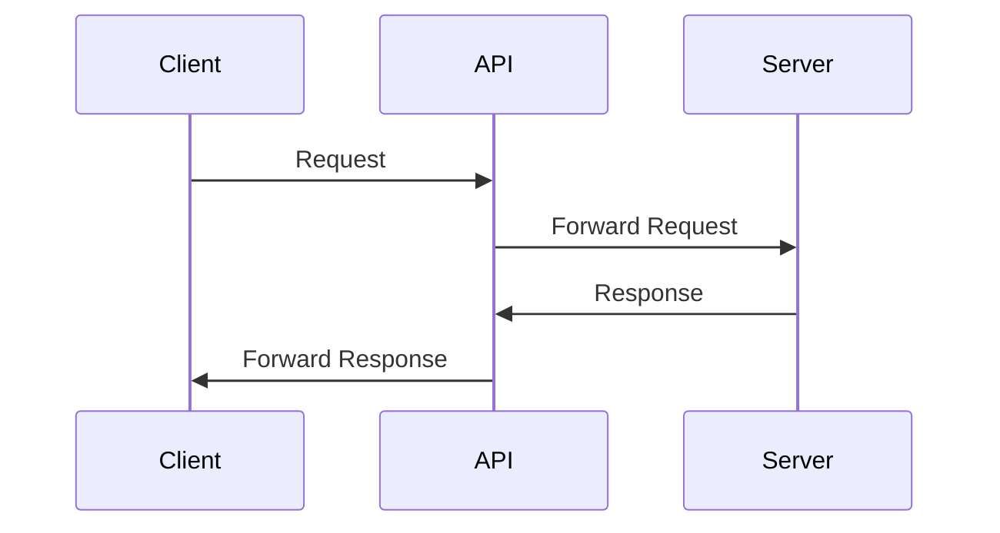
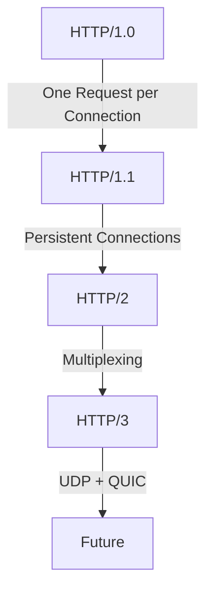
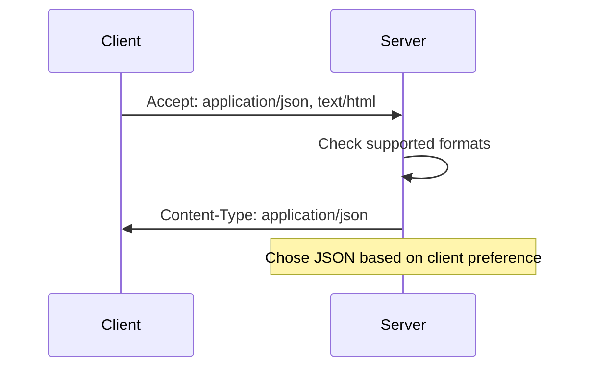
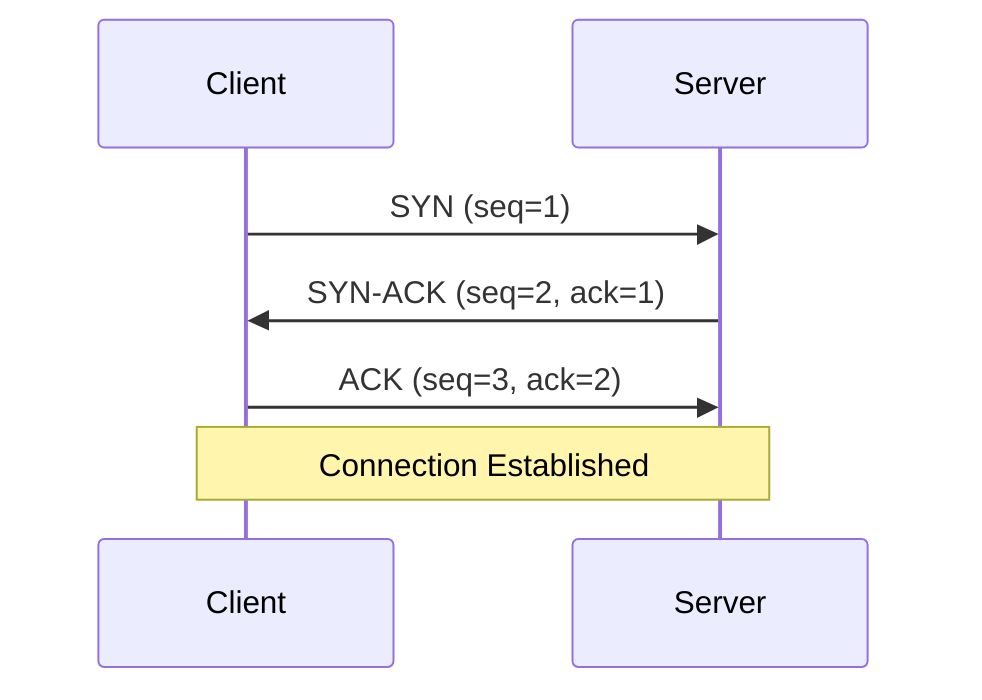
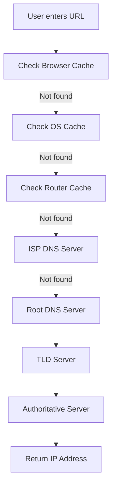

# Chapter 1: Learn the Basics

## Introduction

### What is an API?

**API** = Application Programming Interface

A set of rules and tools that allows different software applications to communicate with each other.

### How APIs Work



### API Types

| Type | Description | Example |
|------|-------------|---------|
| **Web APIs** | Communicate over HTTP/HTTPS | REST, GraphQL, SOAP |
| **Library APIs** | Programming language libraries | `Math.sqrt()` in JavaScript |
| **OS APIs** | Operating system interfaces | Windows API, POSIX |

### Key API Components

| Component | Purpose | Example |
|-----------|---------|---------|
| **Endpoint** | Resource URL | `/users/{id}` |
| **Method** | Action type | GET, POST, PUT, DELETE |
| **Headers** | Metadata | Authentication, content type |
| **Parameters** | Data passed | Query params, path variables |
| **Body** | Request data | JSON payload |

---

## HTTP Protocol

### What is HTTP?

**HTTP** = HyperText Transfer Protocol

Foundation protocol for data communication on the World Wide Web.

### HTTP Request Structure

```
GET /api/users HTTP/1.1
Host: example.com
Content-Type: application/json
Authorization: Bearer token123

{ "name": "John" }
```

### HTTP Response Structure

```
HTTP/1.1 200 OK
Content-Type: application/json
Content-Length: 50

{
  "id": 123,
  "name": "John",
  "email": "john@example.com"
}
```

### HTTP Characteristics

- **Stateless**: Each request is independent
- **Client-Server**: Clear separation of concerns
- **Text-Based**: Human-readable format

### HTTP Methods

| Method | Purpose | Idempotent | Safe |
|--------|---------|------------|------|
| **GET** | Retrieve data | Yes | Yes |
| **POST** | Create data | No | No |
| **PUT** | Update/Replace | Yes | No |
| **PATCH** | Partial update | No | No |
| **DELETE** | Remove data | Yes | No |

### HTTP vs HTTPS

| Feature | HTTP | HTTPS |
|---------|------|-------|
| **Security** | Unencrypted | Encrypted (SSL/TLS) |
| **Port** | 80 | 443 |
| **Performance** | Faster | Slower (handshake) |
| **SEO** | Lower ranking | Better ranking |

---

## HTTP Versions

### HTTP/1.0 (1996)
- **Connection**: New connection for each request
- **Limitations**: Slow, high overhead
- **Usage**: Legacy systems

### HTTP/1.1 (1997)
- **Connection**: Persistent connections (keep-alive)
- **Features**: Pipelining, chunked transfer
- **Usage**: Most common, widely supported

### HTTP/2 (2015)
- **Connection**: Multiplexing over single connection
- **Features**: Binary protocol, header compression, server push
- **Performance**: Faster, more efficient

### HTTP/3 (2022)
- **Connection**: UDP-based (QUIC protocol)
- **Features**: Built-in encryption, improved performance
- **Benefits**: Faster connection setup, better network efficiency



### Version Comparison

| Feature | HTTP/1.1 | HTTP/2 | HTTP/3 |
|---------|----------|--------|--------|
| **Transport** | TCP | TCP | UDP/QUIC |
| **Multiplexing** | No | Yes | Yes |
| **Header Compression** | No | Yes | Yes |
| **Server Push** | No | Yes | Yes |
| **Encryption** | Optional | Optional | Built-in |

---

## HTTP Methods

### GET
- **Purpose**: Retrieve data
- **Idempotent**: Yes
- **Safe**: Yes
- **Example**: `GET /api/users`

### POST
- **Purpose**: Create new resource
- **Idempotent**: No
- **Safe**: No
- **Example**: `POST /api/users`

### PUT
- **Purpose**: Update/replace entire resource
- **Idempotent**: Yes
- **Safe**: No
- **Example**: `PUT /api/users/123`

### PATCH
- **Purpose**: Partial update
- **Idempotent**: No
- **Safe**: No
- **Example**: `PATCH /api/users/123`

### DELETE
- **Purpose**: Remove resource
- **Idempotent**: Yes
- **Safe**: No
- **Example**: `DELETE /api/users/123`

### Method Selection Guide

| Action | HTTP Method | Example |
|--------|-------------|---------|
| **Read** | GET | `GET /users/123` |
| **Create** | POST | `POST /users` |
| **Replace** | PUT | `PUT /users/123` |
| **Update** | PATCH | `PATCH /users/123` |
| **Delete** | DELETE | `DELETE /users/123` |

---

## HTTP Status Codes

### 2xx Success Codes

| Code | Meaning | Usage |
|------|---------|-------|
| **200** | OK | Successful request |
| **201** | Created | Resource created successfully |
| **204** | No Content | Successful, no response body |

### 3xx Redirection Codes

| Code | Meaning | Usage |
|------|---------|-------|
| **301** | Moved Permanently | Resource permanently moved |
| **302** | Found | Temporary redirection |
| **304** | Not Modified | Use cached version |

### 4xx Client Error Codes

| Code | Meaning | Common Cause |
|------|---------|--------------|
| **400** | Bad Request | Invalid request format |
| **401** | Unauthorized | Missing/invalid authentication |
| **403** | Forbidden | No permission to access |
| **404** | Not Found | Resource doesn't exist |
| **409** | Conflict | Resource conflict |

### 5xx Server Error Codes

| Code | Meaning | Common Cause |
|------|---------|--------------|
| **500** | Internal Server Error | Server error |
| **502** | Bad Gateway | Invalid response from upstream |
| **503** | Service Unavailable | Server overloaded/down |

---

## HTTP Headers

### Request Headers

```http
Accept: application/json
Authorization: Bearer token123
Content-Type: application/json
User-Agent: MyApp/1.0
```

### Response Headers

```http
Content-Type: application/json
Content-Length: 1024
Cache-Control: max-age=3600
Set-Cookie: sessionId=abc123
```

### Common Headers Table

| Header | Purpose | Example |
|--------|---------|---------|
| **Content-Type** | Response format | `application/json` |
| **Authorization** | Authentication info | `Bearer token123` |
| **Cache-Control** | Caching instructions | `max-age=3600` |
| **Set-Cookie** | Client-side cookies | `sessionId=abc123` |
| **CORS** | Cross-origin permissions | `Access-Control-Allow-Origin: *` |

---

## Cookies

### What are Cookies?

Small pieces of data stored on the client's browser to maintain session state and user preferences.

### Cookie Structure

```http
Set-Cookie: sessionId=abc123; Path=/; Expires=Wed, 09 Jun 2025 10:00:00 GMT; Secure; HttpOnly
```

### Cookie Attributes

| Attribute | Purpose | Example |
|-----------|---------|---------|
| **Domain** | Which domain receives cookie | `example.com` |
| **Path** | URL path for cookie | `/api/` |
| **Expires** | Cookie expiration time | `Wed, 09 Jun 2025` |
| **Secure** | Only sent over HTTPS | `Secure` |
| **HttpOnly** | Not accessible via JavaScript | `HttpOnly` |

### Session vs Persistent Cookies

| Type | Duration | Use Case |
|------|----------|----------|
| **Session** | Browser session only | Shopping cart, temporary data |
| **Persistent** | Specified expiration | Login status, user preferences |

---

## CORS (Cross-Origin Resource Sharing)

### What is CORS?

Security mechanism that allows web applications to make requests to different domains.

### Same-Origin Policy

By default, browsers block requests between different origins for security:

```
Origin: https://app.example.com
Target: https://api.example.com ✅ Allowed (same domain)

Origin: https://myapp.com
Target: https://api.example.com ❌ Blocked (different domain)
```

### CORS Headers

| Header | Purpose | Example |
|--------|---------|---------|
| **Access-Control-Allow-Origin** | Allowed origins | `*` or `https://example.com` |
| **Access-Control-Allow-Methods** | Allowed HTTP methods | `GET, POST, PUT` |
| **Access-Control-Allow-Headers** | Allowed request headers | `Content-Type, Authorization` |

### Preflight Requests

For non-simple requests, browsers send preflight OPTIONS request:

```http
OPTIONS /api/users HTTP/1.1
Origin: https://myapp.com
Access-Control-Request-Method: POST
Access-Control-Request-Headers: Content-Type
```

---

## HTTP Caching

### Why Cache?

- **Performance**: Faster response times
- **Bandwidth**: Reduce data transfer
- **Server Load**: Decrease server requests

### Cache-Control Headers

```http
Cache-Control: max-age=3600, public, immutable
Cache-Control: no-cache, no-store, must-revalidate
```

### Cache Directives

| Directive | Purpose |
|-----------|---------|
| **max-age** | How long to cache (seconds) |
| **public** | Cacheable by any cache |
| **private** | Only cacheable by client |
| **no-cache** | Validate with server before use |
| **no-store** | Never cache |
| **must-revalidate** | Must validate after expiration |

### Cache Types

| Type | Location | Duration |
|------|----------|----------|
| **Browser Cache** | Client browser | Configurable |
| **CDN Cache** | Edge servers | Regional |
| **Proxy Cache** | Intermediate servers | Shared users |
| **Server Cache** | Application server | Application level |

---

## URL, Query & Path Parameters

### URL Structure

```
https://api.example.com/v1/users/123?active=true&limit=10
│          │          │    │     │        │         │
│          │          │    │     │        │         └─ Query Parameters
│          │          │    │     │        └─ Path Parameter
│          │          │    │     └─ Resource
│          │          │    └─ Version
│          │          └─ Domain
│          └─ Protocol
└─ Base URL
```

### Path Parameters

- **Usage**: Resource identification
- **Format**: Part of URL path
- **Example**: `/users/{id}`

```http
GET /api/users/123
# User ID = 123
```

### Query Parameters

- **Usage**: Filtering, pagination, options
- **Format**: After `?` with key=value pairs
- **Separator**: `&` between parameters

```http
GET /api/users?page=2&limit=10&sort=name
# Page 2, 10 items, sorted by name
```

### Best Practices

| Practice | Example | Why |
|----------|---------|-----|
| **Plural resources** | `/users` not `/user` | Consistency |
| **Nesting for relations** | `/users/123/posts` | Clear hierarchy |
| **Limit nesting depth** | `/posts/123` not `/users/123/posts/123` | Simplicity |
| **Use query for filters** | `/users?active=true` | Flexibility |

---

## Content Negotiation

### What is Content Negotiation?

Process of selecting the best representation for a given response when multiple representations are available.

### Accept Header

```http
Accept: application/json
Accept: text/html,application/xhtml+xml,application/xml;q=0.9
Accept: application/json;q=0.8,text/plain;q=0.7
```

### Content Types (MIME Types)

| Type | Format | Example |
|------|--------|---------|
| **application/json** | JSON | `{"name": "John"}` |
| **text/html** | HTML | `<h1>Title</h1>` |
| **application/xml** | XML | `<user><name>John</name></user>` |
| **text/plain** | Plain text | `Hello World` |
| **application/pdf** | PDF document | Binary PDF |

### Content Negotiation Process



### Quality Factors (q)

```http
Accept: application/json;q=1.0, text/html;q=0.8, text/plain;q=0.5
```

- **q=1.0**: Highest preference
- **q=0.8**: Second preference
- **q=0.5**: Lowest preference
- **No q**: Default = 1.0

---

## TCP/IP Fundamentals

### TCP/IP Model

| Layer | Protocol | Function |
|-------|----------|----------|
| **Application** | HTTP, FTP | Application services |
| **Transport** | TCP, UDP | End-to-end communication |
| **Internet** | IP | Routing and addressing |
| **Link** | Ethernet | Physical hardware |

### TCP vs UDP

| Feature | TCP | UDP |
|---------|-----|-----|
| **Reliability** | Guaranteed | Best effort |
| **Order** | Preserved | Not guaranteed |
| **Speed** | Slower | Faster |
| **Usage** | HTTP, FTP | DNS, streaming |
| **Connection** | Connection-oriented | Connectionless |

### TCP 3-Way Handshake



### Why TCP/IP Matters for APIs?

- **Reliability**: TCP ensures data delivery
- **Order**: Requests/responses stay in sequence
- **Connection Management**: Persistent connections improve performance
- **HTTP Foundation**: HTTP runs over TCP

---

## DNS Basics

### What is DNS?

**DNS** = Domain Name System

Translates human-readable domain names to IP addresses.

### DNS Resolution Process



### DNS Record Types

| Record | Purpose | Example |
|--------|---------|---------|
| **A** | IPv4 address | `example.com → 93.184.216.34` |
| **AAAA** | IPv6 address | `example.com → 2606:2800:220:1` |
| **CNAME** | Alias name | `www.example.com → example.com` |
| **MX** | Mail server | `example.com → mail.example.com` |
| **TXT** | Text records | SPF, DKIM, verification |

### DNS Caching

| Cache Level | Duration | Purpose |
|-------------|----------|---------|
| **Browser** | Minutes | Quick lookups |
| **OS** | Hours | System-wide cache |
| **Router** | Hours | Network cache |
| **ISP DNS** | Days | Regional cache |

### DNS and API Performance

- **DNS Lookup Time**: First request overhead
- **DNS Caching**: Subsequent requests faster
- **CDN Integration**: Geographic optimization
- **DNS Prefetching**: `<link rel="dns-prefetch">`

---

## Interview Questions

### **Q1: What is the difference between API and Web Service?**
**Answer:**
- **API**: Interface for software communication
- **Web Service**: API that uses web protocols (HTTP)
- All web services are APIs, but not all APIs are web services

### **Q2: Why do we need APIs instead of direct database access?**
**Answer:**
- **Security**: Controlled data access
- **Flexibility**: Change backend without affecting frontend
- **Scalability**: Load balancing, caching
- **Monitoring**: Track usage, implement rate limiting

### **Q3: What is the difference between HTTP and HTTPS?**
**Answer:**
- **HTTP**: Unencrypted, port 80, vulnerable to attacks
- **HTTPS**: Encrypted with SSL/TLS, port 443, secure communication
- HTTPS requires SSL certificate and has handshake overhead

### **Q4: What happens when you type a URL in browser?**
**Answer:**
1. Browser checks cache
2. DNS resolution gets IP address
3. TCP connection established (3-way handshake)
4. HTTP request sent
5. Server processes request
6. HTTP response received
7. Browser renders content

### **Q5: What is CORS and why is it needed?**
**Answer:**
- **CORS**: Cross-Origin Resource Sharing
- **Purpose**: Security mechanism allowing cross-origin requests
- **Needed**: Browsers block cross-origin requests by default
- **Implementation**: Server sends specific headers to allow origins

### **Q6: What is the difference between POST and PUT?**
**Answer:**
- **POST**: Create new resource, not idempotent
- **PUT**: Replace/Update existing resource, idempotent
- **POST**: No ID required, server generates
- **PUT**: Requires resource ID

### **Q7: What are cookies used for?**
**Answer:**
- **Session Management**: User authentication, shopping carts
- **Personalization**: User preferences, themes
- **Tracking**: Analytics, advertising
- **Security**: CSRF protection, secure tokens

---

## Quick Tips & Best Practices

### **API Design**
✅ Use HTTPS for all production APIs
✅ Implement proper error handling
✅ Use appropriate HTTP methods
✅ Version your APIs
✅ Document everything clearly

### **HTTP Best Practices**
✅ Set proper caching headers
✅ Use compression for large responses
✅ Implement rate limiting
✅ Handle CORS properly
✅ Use meaningful status codes

### **Performance**
✅ Minimize DNS lookups
✅ Use persistent connections
✅ Implement proper caching
✅ Optimize response size
✅ Consider CDN usage

### **Security**
✅ Validate all inputs
✅ Use secure headers
✅ Implement proper authentication
✅ Rate limit requests
✅ Log and monitor usage

---

## Chapter Summary

Chapter 1 covers the fundamental building blocks of API design:

- **APIs**: Interfaces for software communication
- **HTTP**: Foundation protocol for web APIs
- **HTTP Methods**: Proper usage for different operations
- **Status Codes**: Meaningful response indicators
- **Headers**: Metadata for communication
- **CORS**: Security for cross-origin requests
- **Caching**: Performance optimization
- **URL Design**: Clean, predictable endpoints
- **TCP/IP**: Underlying network protocols
- **DNS**: Domain resolution system

These concepts form the foundation for building robust, secure, and efficient APIs in subsequent chapters.