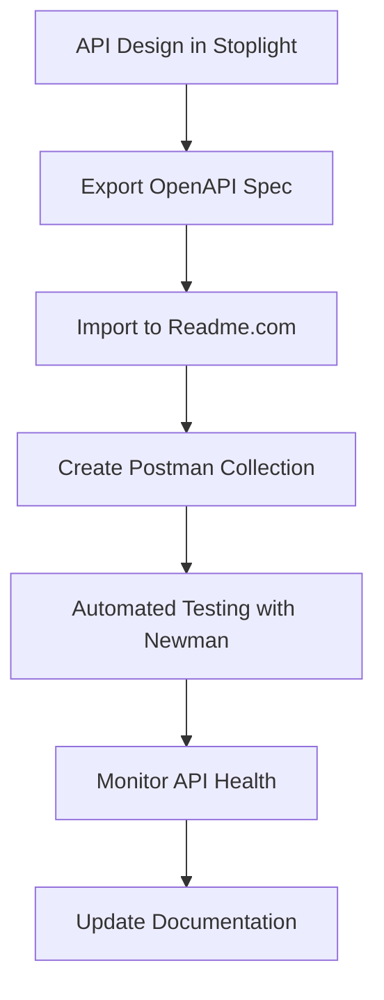

# Chapter 6: API Documentation Tools

## Swagger / OpenAPI

### What is OpenAPI?

**OpenAPI Specification (OAS)** = Standard for defining RESTful APIs

Formerly known as Swagger, OpenAPI provides a formal, machine-readable description of REST APIs.

### OpenAPI Specification Structure

```yaml
# OpenAPI 3.0.3 example
openapi: 3.0.3
info:
  title: User Management API
  description: API for managing users and their data
  version: 1.0.0
  contact:
    name: API Support
    email: support@example.com
  license:
    name: MIT
    url: https://opensource.org/licenses/MIT

servers:
  - url: https://api.example.com/v1
    description: Production server
  - url: https://staging-api.example.com/v1
    description: Staging server

security:
  - BearerAuth: []

paths:
  /users:
    get:
      summary: Get all users
      description: Retrieve a paginated list of users
      parameters:
        - name: page
          in: query
          description: Page number
          required: false
          schema:
            type: integer
            minimum: 1
            default: 1
        - name: limit
          in: query
          description: Number of users per page
          required: false
          schema:
            type: integer
            minimum: 1
            maximum: 100
            default: 20
      responses:
        '200':
          description: Successful response
          content:
            application/json:
              schema:
                type: object
                properties:
                  data:
                    type: array
                    items:
                      $ref: '#/components/schemas/User'
                  pagination:
                    $ref: '#/components/schemas/Pagination'
        '401':
          $ref: '#/components/responses/Unauthorized'

    post:
      summary: Create new user
      description: Create a new user account
      requestBody:
        required: true
        content:
          application/json:
            schema:
              $ref: '#/components/schemas/CreateUserRequest'
      responses:
        '201':
          description: User created successfully
          content:
            application/json:
              schema:
                $ref: '#/components/schemas/User'
        '400':
          $ref: '#/components/responses/BadRequest'
        '409':
          $ref: '#/components/responses/Conflict'

  /users/{userId}:
    get:
      summary: Get user by ID
      description: Retrieve user details by user ID
      parameters:
        - name: userId
          in: path
          required: true
          description: User ID
          schema:
            type: integer
            format: int64
      responses:
        '200':
          description: User details
          content:
            application/json:
              schema:
                $ref: '#/components/schemas/User'
        '404':
          $ref: '#/components/responses/NotFound'

    put:
      summary: Update user
      description: Update user information
      parameters:
        - name: userId
          in: path
          required: true
          schema:
            type: integer
            format: int64
      requestBody:
        required: true
        content:
          application/json:
            schema:
              $ref: '#/components/schemas/UpdateUserRequest'
      responses:
        '200':
          description: User updated successfully
          content:
            application/json:
              schema:
                $ref: '#/components/schemas/User'

    delete:
      summary: Delete user
      description: Delete user account
      parameters:
        - name: userId
          in: path
          required: true
          schema:
            type: integer
            format: int64
      responses:
        '204':
          description: User deleted successfully
        '404':
          $ref: '#/components/responses/NotFound'

components:
  schemas:
    User:
      type: object
      properties:
        id:
          type: integer
          format: int64
          example: 123
        username:
          type: string
          example: johndoe
        email:
          type: string
          format: email
          example: john@example.com
        firstName:
          type: string
          example: John
        lastName:
          type: string
          example: Doe
        role:
          type: string
          enum: [user, admin, moderator]
          example: user
        isActive:
          type: boolean
          example: true
        createdAt:
          type: string
          format: date-time
          example: 2024-01-15T10:30:00Z
        updatedAt:
          type: string
          format: date-time
          example: 2024-01-20T14:22:00Z
      required:
        - id
        - username
        - email
        - role
        - isActive

    CreateUserRequest:
      type: object
      properties:
        username:
          type: string
          minLength: 3
          maxLength: 50
        email:
          type: string
          format: email
        password:
          type: string
          minLength: 8
        firstName:
          type: string
          maxLength: 50
        lastName:
          type: string
          maxLength: 50
      required:
        - username
        - email
        - password

    UpdateUserRequest:
      type: object
      properties:
        email:
          type: string
          format: email
        firstName:
          type: string
          maxLength: 50
        lastName:
          type: string
          maxLength: 50
        role:
          type: string
          enum: [user, admin, moderator]
        isActive:
          type: boolean

    Pagination:
      type: object
      properties:
        page:
          type: integer
          minimum: 1
          example: 1
        limit:
          type: integer
          minimum: 1
          maximum: 100
          example: 20
        total:
          type: integer
          minimum: 0
          example: 100
        totalPages:
          type: integer
          minimum: 0
          example: 5

  responses:
    BadRequest:
      description: Bad request
      content:
        application/json:
          schema:
            type: object
            properties:
              error:
                type: string
                example: "Validation error"
              details:
                type: array
                items:
                  type: object
                  properties:
                    field:
                      type: string
                    message:
                      type: string

    Unauthorized:
      description: Unauthorized
      content:
        application/json:
          schema:
            type: object
            properties:
              error:
                type: string
                example: "Authentication required"

    NotFound:
      description: Resource not found
      content:
        application/json:
          schema:
            type: object
            properties:
              error:
                type: string
                example: "User not found"

    Conflict:
      description: Conflict
      content:
        application/json:
          schema:
            type: object
            properties:
              error:
                type: string
                example: "User already exists"

  securitySchemes:
    BearerAuth:
      type: http
      scheme: bearer
      bearerFormat: JWT
```

### OpenAPI Tools

#### **Swagger UI**

```javascript
// Express.js with Swagger UI
const express = require('express');
const swaggerUi = require('swagger-ui-express');
const swaggerDocument = require('./openapi.json');

const app = express();

// Serve Swagger UI
app.use('/api-docs', swaggerUi.serve, swaggerUi.setup(swaggerDocument, {
  explorer: true,
  customCss: '.swagger-ui .topbar { display: none }',
  customSiteTitle: "User Management API Documentation"
}));

// Custom Swagger UI options
const options = {
  definition: {
    openapi: '3.0.0',
    info: {
      title: 'User Management API',
      version: '1.0.0',
    },
  },
  apis: ['./routes/*.js'], // Path to API docs
};

// Generate OpenAPI from JSDoc comments
/**
 * @swagger
 * /users:
 *   get:
 *     summary: Get all users
 *     tags: [Users]
 *     responses:
 *       200:
 *         description: List of users
 *         content:
 *           application/json:
 *             schema:
 *               type: array
 *               items:
 *                 $ref: '#/components/schemas/User'
 */
app.get('/users', getUsers);
```

#### **Swagger Codegen**

```bash
# Generate server stubs
swagger-codegen generate \
  -i openapi.json \
  -l nodejs-server \
  -o ./generated-server

# Generate client SDKs
swagger-codegen generate \
  -i openapi.json \
  -l javascript \
  -o ./generated-client

# Generate API documentation
swagger-codegen generate \
  -i openapi.json \
  -l html2 \
  -o ./docs
```

#### **OpenAPI Generator**

```bash
# Generate TypeScript client
openapi-generator-cli generate \
  -i openapi.json \
  -g typescript-axios \
  -o ./client-ts

# Generate Spring Boot server
openapi-generator-cli generate \
  -i openapi.json \
  -g spring \
  -o ./server-spring
```

### OpenAPI Best Practices

| Practice | Description | Example |
|----------|-------------|---------|
| **Version Control** | Use API versioning in paths | `/v1/users` |
| **Consistent Naming** | Use consistent naming conventions | `userId`, `createdAt` |
| **Proper HTTP Status** | Use appropriate status codes | `200`, `201`, `400`, `404` |
| **Data Validation** | Define validation rules | `minLength: 3`, `pattern: "^[a-zA-Z0-9]+$"` |
| **Error Responses** | Document error responses | `401 Unauthorized`, `404 Not Found` |
| **Authentication** | Specify authentication schemes | `BearerAuth`, `ApiKeyAuth` |
| **Examples** | Provide example values | `example: "johndoe"` |
| **Schema Reuse** | Use `$ref` for common schemas | `$ref: '#/components/schemas/User'` |

---

## Readme.com

### What is Readme.com?

Modern API documentation platform that combines documentation, API reference, and developer hub features.

### Readme.com Features

| Feature | Description |
|---------|-------------|
| **Interactive API Explorer** | Test APIs directly in browser |
| **API Reference** | Auto-generated from OpenAPI/Swagger |
| **Custom Pages** | Markdown-based documentation |
| **Changelogs** | Version history and updates |
| **Developer Community** | Q&A and discussions |
| **SDK Generation** | Multiple programming languages |
| **Customization** | Branding and styling options |

### Readme.com Setup

#### **API Reference Import**

```bash
# Using CLI
readme login
readme sync openapi.json

# Using npm package
npm install -g readmeio
readme login
readme sync ./openapi.json --key=your-api-key
```

#### **Custom Documentation Pages**

```markdown
# Getting Started

Welcome to our User Management API! This guide will help you get up and running quickly.

## Authentication

Our API uses Bearer token authentication. Include your token in the Authorization header:

```bash
curl -H "Authorization: Bearer YOUR_TOKEN" \
     https://api.example.com/v1/users
```

## Quick Start

1. **Get your API key** from the developer dashboard
2. **Make your first API call** to test authentication
3. **Explore the API reference** for available endpoints

## Rate Limits

Our API implements rate limiting to ensure fair usage:

| Plan | Requests per hour |
|------|-------------------|
| Free | 1,000 |
| Pro | 10,000 |
| Enterprise | Unlimited |

## SDKs

We provide official SDKs for popular languages:

- [JavaScript/TypeScript](./sdks/javascript)
- [Python](./sdks/python)
- [Java](./sdks/java)
- [Ruby](./sdks/ruby)
```

#### **Interactive Examples**

```markdown
# Create a User

Use this endpoint to create a new user account.

```json http
POST /v1/users
Content-Type: application/json
Authorization: Bearer YOUR_TOKEN

{
  "username": "newuser",
  "email": "user@example.com",
  "password": "securePassword123",
  "firstName": "John",
  "lastName": "Doe"
}
```

```json
{
  "id": 123,
  "username": "newuser",
  "email": "user@example.com",
  "firstName": "John",
  "lastName": "Doe",
  "role": "user",
  "isActive": true,
  "createdAt": "2024-01-15T10:30:00Z",
  "updatedAt": "2024-01-15T10:30:00Z"
}
```

## Error Handling

Our API returns standard HTTP status codes and detailed error messages:

| Status Code | Description | Example Response |
|-------------|-------------|------------------|
| 400 | Bad Request | Invalid request parameters |
| 401 | Unauthorized | Missing or invalid API key |
| 404 | Not Found | Resource doesn't exist |
| 429 | Too Many Requests | Rate limit exceeded |

```json
{
  "error": {
    "code": "VALIDATION_ERROR",
    "message": "Invalid email format",
    "details": {
      "field": "email",
      "value": "invalid-email"
    }
  }
}
```
```

### Readme.com Integration

#### **GitHub Integration**

```yaml
# .github/workflows/docs.yml
name: Update Documentation

on:
  push:
    branches: [ main ]
    paths:
      - 'docs/**'
      - 'openapi.json'

jobs:
  update-docs:
    runs-on: ubuntu-latest
    steps:
    - uses: actions/checkout@v2

    - name: Sync to Readme
      run: |
        npm install -g readmeio
        readme sync ./openapi.json --key=${{ secrets.README_API_KEY }}

    - name: Update custom pages
      run: |
        readme upload ./docs/getting-started.md --key=${{ secrets.README_API_KEY }}
```

#### **Custom Domain**

```javascript
// Configure custom domain
const readmeConfig = {
  subdomain: 'api-docs.yourcompany.com',
  customCSS: `
    .hero {
      background-color: #your-brand-color;
    }
  `,
  logo: 'https://yourcompany.com/logo.png',
  favicon: 'https://yourcompany.com/favicon.ico'
};
```

---

## Stoplight

### What is Stoplight?

API design and documentation platform that provides visual API design, mock servers, and automated testing.

### Stoplight Features

| Feature | Description |
|---------|-------------|
| **Visual API Designer** | Drag-and-drop API modeling |
| **Mock Server** | Auto-generated mock responses |
| **Contract Testing** | Automated API testing |
| **Design-First** | API design before implementation |
| **Collaboration** | Team workflows and reviews |
| **Documentation** | Auto-generated API docs |
| **SDK Generation** | Multiple language support |

### Stoplight Studio

#### **API Design Example**

```yaml
# stoplight.yml
name: User Management API
description: API for managing users and authentication
version: 1.0.0

models:
  User:
    type: object
    properties:
      id:
        type: integer
        description: Unique user identifier
      username:
        type: string
        description: User's username
      email:
        type: string
        format: email
        description: User's email address
      profile:
        type: object
        properties:
          firstName:
            type: string
          lastName:
            type: string
          avatar:
            type: string
            format: uri
    required:
      - id
      - username
      - email

  CreateUserRequest:
    type: object
    properties:
      username:
        type: string
        minLength: 3
        maxLength: 50
      email:
        type: string
        format: email
      password:
        type: string
        minLength: 8
      profile:
        $ref: '#/models/UserProfile'
    required:
      - username
      - email
      - password

  UserProfile:
    type: object
    properties:
      firstName:
        type: string
        maxLength: 50
      lastName:
        type: string
        maxLength: 50
      avatar:
        type: string
        format: uri

resources:
  users:
    description: User management operations
    get:
      displayName: Get Users
      description: Retrieve a list of users
      queryParameters:
        page:
          type: integer
          minimum: 1
          default: 1
          description: Page number for pagination
        limit:
          type: integer
          minimum: 1
          maximum: 100
          default: 20
          description: Number of users per page
      responses:
        '200':
          description: Successful response
          body:
            application/json:
              type: object
              properties:
                data:
                  type: array
                  items:
                    $ref: '#/models/User'
                pagination:
                  $ref: '#/models/Pagination'

    post:
      displayName: Create User
      description: Create a new user
      body:
        application/json:
          schema:
            $ref: '#/models/CreateUserRequest'
      responses:
        '201':
          description: User created successfully
          body:
            application/json:
              schema:
                $ref: '#/models/User'
        '400':
          description: Invalid request data
          body:
            application/json:
              schema:
                $ref: '#/models/ErrorResponse'
        '409':
          description: User already exists
          body:
            application/json:
              schema:
                $ref: '#/models/ErrorResponse'

  /users/{userId}:
    get:
      displayName: Get User
      description: Get user by ID
      pathParameters:
        userId:
          type: integer
          description: User ID
      responses:
        '200':
          description: User details
          body:
            application/json:
              schema:
                $ref: '#/models/User'
        '404':
          description: User not found
          body:
            application/json:
              schema:
                $ref: '#/models/ErrorResponse'

  authentication:
    description: Authentication endpoints
    post:
      displayName: Login
      description: Authenticate user and get token
      body:
        application/json:
          type: object
          properties:
            email:
              type: string
              format: email
            password:
              type: string
          required:
            - email
            - password
      responses:
        '200':
          description: Login successful
          body:
            application/json:
              type: object
              properties:
                token:
                  type: string
                user:
                  $ref: '#/models/User'
                expiresAt:
                  type: string
                  format: date-time
        '401':
          description: Invalid credentials
          body:
            application/json:
              schema:
                $ref: '#/models/ErrorResponse'
```

#### **Mock Server Configuration**

```javascript
// stoplight.mocks.js
module.exports = {
  scenarios: [
    {
      name: 'Success',
      request: {
        method: 'GET',
        path: '/users'
      },
      response: {
        status: 200,
        headers: {
          'Content-Type': 'application/json'
        },
        body: {
          data: [
            {
              id: 1,
              username: 'johndoe',
              email: 'john@example.com',
              profile: {
                firstName: 'John',
                lastName: 'Doe',
                avatar: 'https://example.com/avatars/1.jpg'
              }
            }
          ],
          pagination: {
            page: 1,
            limit: 20,
            total: 100,
            totalPages: 5
          }
        }
      }
    },
    {
      name: 'User Not Found',
      request: {
        method: 'GET',
        path: '/users/999'
      },
      response: {
        status: 404,
        headers: {
          'Content-Type': 'application/json'
        },
        body: {
          error: {
            code: 'USER_NOT_FOUND',
            message: 'User with ID 999 not found'
          }
        }
      }
    }
  ]
};
```

### Stoplight CLI

```bash
# Install Stoplight CLI
npm install -g @stoplight/cli

# Validate API specification
stoplight validate api.yaml

# Generate mock server
stoplight mock api.yaml --port 3000

# Generate documentation
stoplight generate docs api.yaml --output ./docs

# Run contract tests
stoplight test api.yaml
```

---

## Postman

### What is Postman?

API development environment that enables API testing, documentation, and collaboration.

### Postman Features

| Feature | Description |
|---------|-------------|
| **API Testing** | Automated testing and assertions |
| **Documentation** | Auto-generated from collections |
| **Mock Servers** | Create mock APIs |
| **Monitors** | Scheduled API tests |
| **Environments** | Manage multiple configurations |
| **Collections** | Organize API requests |
| **Workspaces** | Team collaboration |

### Postman Collections

#### **Collection Structure**

```json
{
  "info": {
    "name": "User Management API",
    "description": "API for managing users and authentication",
    "schema": "https://schema.getpostman.com/json/collection/v2.1.0/collection.json"
  },
  "variable": [
    {
      "key": "baseUrl",
      "value": "https://api.example.com/v1",
      "type": "string"
    },
    {
      "key": "apiToken",
      "value": "",
      "type": "string"
    }
  ],
  "auth": {
    "type": "bearer",
    "bearer": [
      {
        "key": "token",
        "value": "{{apiToken}}",
        "type": "string"
      }
    ]
  },
  "item": [
    {
      "name": "Authentication",
      "item": [
        {
          "name": "Login",
          "request": {
            "method": "POST",
            "header": [
              {
                "key": "Content-Type",
                "value": "application/json"
              }
            ],
            "body": {
              "mode": "raw",
              "raw": "{\n  \"email\": \"{{email}}\",\n  \"password\": \"{{password}}\"\n}"
            },
            "url": {
              "raw": "{{baseUrl}}/auth/login",
              "host": ["{{baseUrl}}"],
              "path": ["auth", "login"]
            }
          },
          "event": [
            {
              "listen": "test",
              "script": {
                "exec": [
                  "pm.test(\"Status code is 200\", function () {",
                  "    pm.response.to.have.status(200);",
                  "});",
                  "",
                  "pm.test(\"Response has token\", function () {",
                  "    const jsonData = pm.response.json();",
                  "    pm.expect(jsonData.token).to.be.a('string');",
                  "    pm.collectionVariables.set('apiToken', jsonData.token);",
                  "});",
                  "",
                  "pm.test(\"Response has user data\", function () {",
                  "    const jsonData = pm.response.json();",
                  "    pm.expect(jsonData.user).to.be.an('object');",
                  "    pm.expect(jsonData.user.id).to.be.a('number');",
                  "});"
                ]
              }
            }
          ]
        }
      ]
    },
    {
      "name": "Users",
      "item": [
        {
          "name": "Get Users",
          "request": {
            "method": "GET",
            "url": {
              "raw": "{{baseUrl}}/users?page={{page}}&limit={{limit}}",
              "host": ["{{baseUrl}}"],
              "path": ["users"],
              "query": [
                {
                  "key": "page",
                  "value": "{{page}}",
                  "description": "Page number"
                },
                {
                  "key": "limit",
                  "value": "{{limit}}",
                  "description": "Items per page"
                }
              ]
            }
          },
          "event": [
            {
              "listen": "test",
              "script": {
                "exec": [
                  "pm.test(\"Status code is 200\", function () {",
                  "    pm.response.to.have.status(200);",
                  "});",
                  "",
                  "pm.test(\"Response has users array\", function () {",
                  "    const jsonData = pm.response.json();",
                  "    pm.expect(jsonData.data).to.be.an('array');",
                  "    pm.expect(jsonData.pagination).to.be.an('object');",
                  "});",
                  "",
                  "pm.test(\"Pagination fields exist\", function () {",
                  "    const jsonData = pm.response.json();",
                  "    pm.expect(jsonData.pagination).to.have.property('page');",
                  "    pm.expect(jsonData.pagination).to.have.property('limit');",
                  "    pm.expect(jsonData.pagination).to.have.property('total');",
                  "});"
                ]
              }
            }
          ]
        },
        {
          "name": "Create User",
          "request": {
            "method": "POST",
            "header": [
              {
                "key": "Content-Type",
                "value": "application/json"
              }
            ],
            "body": {
              "mode": "raw",
              "raw": "{\n  \"username\": \"{{newUsername}}\",\n  \"email\": \"{{newEmail}}\",\n  \"password\": \"{{newPassword}}\",\n  \"firstName\": \"{{firstName}}\",\n  \"lastName\": \"{{lastName}}\"\n}"
            },
            "url": {
              "raw": "{{baseUrl}}/users",
              "host": ["{{baseUrl}}"],
              "path": ["users"]
            }
          },
          "event": [
            {
              "listen": "test",
              "script": {
                "exec": [
                  "pm.test(\"Status code is 201\", function () {",
                  "    pm.response.to.have.status(201);",
                  "});",
                  "",
                  "pm.test(\"Response has created user\", function () {",
                  "    const jsonData = pm.response.json();",
                  "    pm.expect(jsonData).to.have.property('id');",
                  "    pm.expect(jsonData).to.have.property('username');",
                  "    pm.expect(jsonData).to.have.property('email');",
                  "});",
                  "",
                  "pm.test(\"User data matches request\", function () {",
                  "    const jsonData = pm.response.json();",
                  "    pm.expect(jsonData.username).to.eql(pm.collectionVariables.get('newUsername'));",
                  "    pm.expect(jsonData.email).to.eql(pm.collectionVariables.get('newEmail'));",
                  "});"
                ]
              }
            }
          ]
        },
        {
          "name": "Get User by ID",
          "request": {
            "method": "GET",
            "url": {
              "raw": "{{baseUrl}}/users/{{userId}}",
              "host": ["{{baseUrl}}"],
              "path": ["users", "{{userId}}"]
            }
          },
          "event": [
            {
              "listen": "test",
              "script": {
                "exec": [
                  "pm.test(\"Status code is 200\", function () {",
                  "    pm.response.to.have.status(200);",
                  "});",
                  "",
                  "pm.test(\"Response has correct user\", function () {",
                  "    const jsonData = pm.response.json();",
                  "    pm.expect(jsonData.id).to.eql(pm.collectionVariables.get('userId'));",
                  "    pm.expect(jsonData).to.have.property('username');",
                  "    pm.expect(jsonData).to.have.property('email');",
                  "});"
                ]
              }
            }
          ]
        }
      ]
    }
  ]
}
```

#### **Postman Environments**

```json
{
  "name": "Development",
  "values": [
    {
      "key": "baseUrl",
      "value": "https://dev-api.example.com/v1",
      "type": "default",
      "enabled": true
    },
    {
      "key": "apiToken",
      "value": "",
      "type": "secret",
      "enabled": true
    },
    {
      "key": "email",
      "value": "test@example.com",
      "type": "default",
      "enabled": true
    },
    {
      "key": "password",
      "value": "testPassword123",
      "type": "secret",
      "enabled": true
    },
    {
      "key": "newUsername",
      "value": "newUser123",
      "type": "default",
      "enabled": true
    },
    {
      "key": "newEmail",
      "value": "newuser@example.com",
      "type": "default",
      "enabled": true
    },
    {
      "key": "newPassword",
      "value": "newPassword123",
      "type": "secret",
      "enabled": true
    },
    {
      "key": "userId",
      "value": "123",
      "type": "default",
      "enabled": true
    },
    {
      "key": "page",
      "value": "1",
      "type": "default",
      "enabled": true
    },
    {
      "key": "limit",
      "value": "20",
      "type": "default",
      "enabled": true
    }
  ]
}
```

### Postman Newman (CLI)

```javascript
// newman-tests.js
const newman = require('newman');

newman.run({
  collection: require('./collection.json'),
  environment: require('./environment.json'),
  reporters: ['cli', 'html', 'junit'],
  reporter: {
    html: {
      export: './test-results.html'
    },
    junit: {
      export: './test-results.xml'
    }
  },
  iterationCount: 1,
  bail: false
}, function (err) {
  if (err) {
    throw err;
  }
  console.log('Collection run complete!');
});
```

```bash
# Run collection tests
newman run collection.json -e environment.json

# Run with reporters
newman run collection.json -e environment.json -r html,cli

# Run in CI/CD
newman run collection.json -e environment.json --reporters cli,junit --reporter-junit-export results.xml
```

### Postman Documentation

#### **Auto-Generated Documentation**

Postman automatically generates documentation from collections:

- **Request Details**: URL, method, headers, body
- **Response Examples**: Sample responses
- **Authentication**: Auth methods and configuration
- **Environment Variables**: Configuration options
- **Test Scripts**: Validation logic

#### **Custom Documentation**

```markdown
# User Management API Documentation

## Overview

This API allows you to manage user accounts, including creating, reading, updating, and deleting users.

## Authentication

All endpoints (except login) require Bearer token authentication:

```http
Authorization: Bearer YOUR_TOKEN_HERE
```

## Base URL

```
https://api.example.com/v1
```

## Endpoints

### Authentication

#### POST /auth/login

Authenticates a user and returns a JWT token.

**Request Body:**
```json
{
  "email": "user@example.com",
  "password": "password123"
}
```

**Response:**
```json
{
  "token": "eyJ0eXAiOiJKV1QiLCJhbGciOiJIUzI1NiJ9...",
  "user": {
    "id": 123,
    "username": "johndoe",
    "email": "user@example.com",
    "role": "user"
  },
  "expiresAt": "2024-01-22T10:30:00Z"
}
```

### Users

#### GET /users

Retrieves a paginated list of users.

**Query Parameters:**
- `page` (optional): Page number (default: 1)
- `limit` (optional): Items per page (default: 20, max: 100)

**Response:**
```json
{
  "data": [
    {
      "id": 123,
      "username": "johndoe",
      "email": "john@example.com",
      "role": "user",
      "isActive": true,
      "createdAt": "2024-01-15T10:30:00Z"
    }
  ],
  "pagination": {
    "page": 1,
    "limit": 20,
    "total": 100,
    "totalPages": 5
  }
}
```

#### POST /users

Creates a new user account.

**Request Body:**
```json
{
  "username": "newuser",
  "email": "newuser@example.com",
  "password": "securePassword123",
  "firstName": "John",
  "lastName": "Doe"
}
```

**Response:**
```json
{
  "id": 124,
  "username": "newuser",
  "email": "newuser@example.com",
  "firstName": "John",
  "lastName": "Doe",
  "role": "user",
  "isActive": true,
  "createdAt": "2024-01-20T14:22:00Z"
}
```

## Error Responses

All endpoints may return the following error responses:

### 400 Bad Request
```json
{
  "error": {
    "code": "VALIDATION_ERROR",
    "message": "Invalid request data",
    "details": [
      {
        "field": "email",
        "message": "Invalid email format"
      }
    ]
  }
}
```

### 401 Unauthorized
```json
{
  "error": {
    "code": "UNAUTHORIZED",
    "message": "Authentication required"
  }
}
```

### 404 Not Found
```json
{
  "error": {
    "code": "NOT_FOUND",
    "message": "Resource not found"
  }
}
```

## Rate Limiting

- **Free tier**: 1,000 requests per hour
- **Pro tier**: 10,000 requests per hour
- **Enterprise**: Unlimited requests

Rate limit headers are included in all responses:
```http
X-RateLimit-Limit: 1000
X-RateLimit-Remaining: 999
X-RateLimit-Reset: 1642245600
```
```

---

## Tool Comparison

### Feature Comparison Matrix

| Feature | Swagger/OpenAPI | Readme.com | Stoplight | Postman |
|---------|-----------------|------------|-----------|---------|
| **Interactive Testing** | ✅ Swagger UI | ✅ Built-in | ✅ Mock Server | ✅ Built-in |
| **Auto-Documentation** | ✅ From spec | ✅ From spec | ✅ From design | ✅ From collection |
| **Code Generation** | ✅ Multiple languages | ✅ SDKs | ✅ Multiple languages | ❌ Limited |
| **Collaboration** | ⚠️ Git-based | ✅ Platform | ✅ Team workflows | ✅ Workspaces |
| **Visual Design** | ❌ Text-based | ⚠️ Limited | ✅ Visual designer | ⚠️ Limited |
| **Mock Server** | ✅ Third-party | ✅ Built-in | ✅ Built-in | ✅ Built-in |
| **Testing** | ❌ External tools | ❌ External | ✅ Contract testing | ✅ Built-in testing |
| **Version Control** | ✅ Git | ✅ Platform | ✅ Platform | ✅ Platform |
| **Pricing** | ✅ Free/Open Source | 💰 Paid | 💰 Paid | ✅ Free tier |
| **Learning Curve** | ⭐⭐⭐ | ⭐⭐⭐⭐ | ⭐⭐ | ⭐⭐⭐⭐⭐ |

### Use Case Recommendations

| Scenario | Recommended Tool | Why |
|----------|------------------|-----|
| **Open Source Project** | Swagger/OpenAPI | Free, standard, wide adoption |
| **Enterprise API** | Readme.com | Professional appearance, support |
| **Design-First Development** | Stoplight | Visual design, mock server |
| **API Testing & Development** | Postman | Powerful testing, collaboration |
| **Developer Portal** | Readme.com | Complete developer experience |
| **Quick Documentation** | Postman | Easy setup, collection-based |
| **Contract Testing** | Stoplight | Built-in contract testing |

### Tool Integration

#### **Combined Workflow**



```javascript
// Integration example: Stoplight to Postman
const stoplightToPostman = {
  // Convert Stoplight design to Postman collection
  convert: async (stoplightSpec) => {
    const openapi = await stoplightToOpenAPI(stoplightSpec);
    const postman = await openAPIToPostman(openapi);
    return postman;
  },

  // Sync with Readme.com
  syncWithReadme: async (openapiSpec) => {
    await readmeAPI.sync(openapiSpec);
    console.log('Documentation updated on Readme.com');
  }
};
```

### Implementation Strategy

#### **Phase 1: Foundation**
1. **Choose primary tool** based on team needs
2. **Create basic API specification**
3. **Set up initial documentation**

#### **Phase 2: Enhancement**
1. **Add interactive examples**
2. **Implement automated testing**
3. **Create mock servers**

#### **Phase 3: Integration**
1. **Connect multiple tools**
2. **Automate workflows**
3. **Monitor and maintain**

---

## Interview Questions

### **Q1: What is the difference between Swagger and OpenAPI?**
**Answer:**
- **Swagger**: Original API specification tool, now refers to Swagger UI and related tools
- **OpenAPI**: Standard specification format (formerly Swagger Specification)
- **Relationship**: Swagger implements OpenAPI specification
- **Versions**: OpenAPI 3.0 is the current standard, Swagger 2.0 maps to OpenAPI 2.0

### **Q2: When would you choose Postman over Swagger UI?**
**Answer:**
**Choose Postman when:**
- Need extensive testing capabilities
- Team collaboration and workflows are important
- Complex request/response testing required
- Automated testing and monitoring needed
- Environment and variable management

**Choose Swagger UI when:**
- Simple API documentation is sufficient
- Open source solution preferred
- Integration with existing OpenAPI spec
- Minimal setup required
- Standard API reference needed

### **Q3: What are the benefits of design-first API development?**
**Answer:**
**Benefits:**
- **Consistency**: Standardized API structure before implementation
- **Collaboration**: Teams can review and approve design
- **Documentation**: Auto-generated from design
- **Testing**: Early validation of API contracts
- **Mocking**: Create mock servers for frontend development
- **Client Development**: Frontend can start before backend

### **Q4: How do you maintain API documentation across multiple environments?**
**Answer:**
**Strategies:**
1. **Single source of truth**: Use OpenAPI specification as source
2. **Environment-specific configs**: Different base URLs and settings
3. **Automated synchronization**: CI/CD pipelines to update docs
4. **Version control**: Track documentation changes with code
5. **Environment variables**: Use placeholders for environment-specific values

### **Q5: What is contract testing and why is it important?**
**Answer:**
**Contract testing**: Verifies that API provider and consumer expectations match.

**Important because:**
- **Prevents integration failures**: Catch issues early
- **Documentation validation**: Ensure docs match implementation
- **Regression testing**: Prevent breaking changes
- **Team collaboration**: Clear provider/consumer contracts
- **CI/CD integration**: Automated validation

### **Q6: How do you handle API versioning in documentation?**
**Answer:**
**Approaches:**
1. **Multiple documentation versions**: Separate docs for each API version
2. **Version selection**: UI to switch between versions
3. **Deprecation notices**: Clearly mark deprecated endpoints
4. **Migration guides**: Help users upgrade between versions
5. **Backward compatibility**: Document compatibility matrix

### **Q7: What makes good API documentation?**
**Answer:**
**Key elements:**
- **Clear introduction**: Overview and getting started
- **Authentication**: How to authenticate requests
- **Endpoint reference**: Detailed parameter descriptions
- **Request/response examples**: Real sample data
- **Error handling**: Common errors and solutions
- **SDKs and tools**: Available libraries and integrations
- **Rate limits**: Usage constraints and limits
- **Changelogs**: Version history and updates

---

## Quick Tips & Best Practices

### **Documentation Strategy**
✅ Design APIs before implementing
✅ Use OpenAPI specification as single source of truth
✅ Include practical examples and use cases
✅ Document authentication and error handling
✅ Keep documentation synchronized with implementation

### **OpenAPI/Swagger**
✅ Use consistent naming conventions
✅ Include examples for all data types
✅ Define error responses
✅ Use `$ref` to avoid duplication
✅ Validate specifications regularly

### **Postman Collections**
✅ Organize requests into logical folders
✅ Use environment variables for configuration
✅ Include test scripts for validation
✅ Document each request clearly
✅ Use pre-request scripts for setup

### **Team Collaboration**
✅ Establish documentation standards
✅ Review and approve API designs
✅ Use version control for specifications
✅ Automate documentation updates
✅ Provide team training on tools

### **Maintenance**
✅ Schedule regular documentation reviews
✅ Monitor API usage and feedback
✅ Update changelogs regularly
✅ Test documentation examples
✅ Plan for API deprecation

---

## Chapter Summary

Chapter 6 explores comprehensive API documentation tools and strategies:

### **Documentation Tools Overview**

| Tool | Primary Use | Key Strength |
|------|-------------|--------------|
| **Swagger/OpenAPI** | API specification | Industry standard, open source |
| **Readme.com** | Developer portal | Professional appearance, complete experience |
| **Stoplight** | Visual API design | Design-first approach, collaboration |
| **Postman** | Testing & documentation | Powerful testing, team workflows |

### **Key Concepts**

- **OpenAPI Specification**: Standard for REST API documentation
- **Design-First Development**: API design before implementation
- **Interactive Documentation**: User can test APIs directly
- **Mock Servers**: Simulated API responses for development
- **Contract Testing**: Validation of API contracts
- **Automation**: CI/CD integration for documentation

### **Implementation Strategy**

1. **Choose tools** based on team needs and budget
2. **Design APIs** using OpenAPI or visual tools
3. **Create interactive documentation** for better developer experience
4. **Implement automated testing** and validation
5. **Maintain documentation** as code alongside API implementation

Good API documentation is essential for API adoption, developer productivity, and long-term maintainability. Choose tools that fit your workflow and budget while providing the best experience for your API consumers.