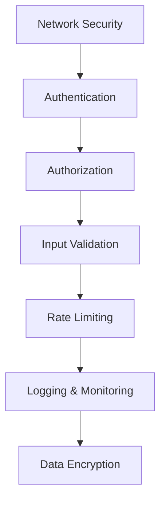

# Chapter 7: API Security

## Best Practices

### Defense in Depth Strategy

**Defense in Depth** = Multiple layers of security controls to protect APIs



### Security Layers

| Layer | Purpose | Implementation |
|-------|---------|----------------|
| **Network** | Protect data in transit | HTTPS, WAF, DDoS protection |
| **Authentication** | Verify identity | JWT, OAuth, mTLS |
| **Authorization** | Control access | RBAC, ABAC, permissions |
| **Input Validation** | Prevent injection attacks | Schema validation, sanitization |
| **Rate Limiting** | Prevent abuse | Token bucket, sliding window |
| **Encryption** | Protect data at rest | Database encryption, field-level |
| **Logging** | Detect breaches | Audit trails, monitoring |

### HTTPS Implementation

#### **SSL/TLS Configuration**

```javascript
// Express.js with HTTPS
const https = require('https');
const fs = require('fs');

const options = {
  key: fs.readFileSync('path/to/private.key'),
  cert: fs.readFileSync('path/to/certificate.crt'),
  ca: fs.readFileSync('path/to/ca_bundle.crt'),
  minVersion: 'TLSv1.2',
  ciphers: [
    'ECDHE-ECDSA-AES128-GCM-SHA256',
    'ECDHE-RSA-AES128-GCM-SHA256',
    'ECDHE-ECDSA-AES256-GCM-SHA384',
    'ECDHE-RSA-AES256-GCM-SHA384',
    'ECDHE-ECDSA-CHACHA20-POLY1305',
    'ECDHE-RSA-CHACHA20-POLY1305'
  ].join(':'),
  honorCipherOrder: true
};

const app = express();

// Security headers middleware
app.use((req, res, next) => {
  res.setHeader('Strict-Transport-Security', 'max-age=31536000; includeSubDomains');
  res.setHeader('X-Content-Type-Options', 'nosniff');
  res.setHeader('X-Frame-Options', 'DENY');
  res.setHeader('X-XSS-Protection', '1; mode=block');
  res.setHeader('Referrer-Policy', 'strict-origin-when-cross-origin');
  res.setHeader('Content-Security-Policy', "default-src 'self'");
  next();
});

https.createServer(options, app).listen(443);
```

#### **HSTS (HTTP Strict Transport Security)**

```http
# HSTS Header
Strict-Transport-Security: max-age=31536000; includeSubDomains; preload

# CSP Header
Content-Security-Policy: default-src 'self'; script-src 'self' 'unsafe-inline'; style-src 'self' 'unsafe-inline'
```

### Authentication Security

#### **Password Security**

```javascript
const bcrypt = require('bcrypt');

// Password hashing
async function hashPassword(password) {
  const saltRounds = 12; // Minimum 12 rounds
  return await bcrypt.hash(password, saltRounds);
}

// Password validation
async function validatePassword(password, hashedPassword) {
  return await bcrypt.compare(password, hashedPassword);
}

// Password policy validation
function validatePasswordPolicy(password) {
  const minLength = 12;
  const hasUpperCase = /[A-Z]/.test(password);
  const hasLowerCase = /[a-z]/.test(password);
  const hasNumbers = /\d/.test(password);
  const hasSpecialChar = /[!@#$%^&*(),.?":{}|<>]/.test(password);

  return {
    valid: password.length >= minLength && hasUpperCase && hasLowerCase && hasNumbers && hasSpecialChar,
    errors: [
      password.length < minLength ? 'Password must be at least 12 characters' : null,
      !hasUpperCase ? 'Password must contain uppercase letters' : null,
      !hasLowerCase ? 'Password must contain lowercase letters' : null,
      !hasNumbers ? 'Password must contain numbers' : null,
      !hasSpecialChar ? 'Password must contain special characters' : null
    ].filter(Boolean)
  };
}
```

#### **Multi-Factor Authentication (MFA)**

```javascript
const speakeasy = require('speakeasy');
const qrcode = require('qrcode');

// Generate TOTP secret
function generateTOTPSecret(userEmail) {
  return speakeasy.generateSecret({
    name: `MyApp (${userEmail})`,
    issuer: 'MyApp',
    length: 32
  });
}

// Generate QR code for authenticator app
async function generateQRCode(secret) {
  const otpauthUrl = speakeasy.otpauthURL({
    secret: secret.base32,
    label: secret.name,
    issuer: secret.issuer
  });

  return await qrcode.toDataURL(otpauthUrl);
}

// Verify TOTP token
function verifyTOTPToken(token, secret) {
  return speakeasy.totp.verify({
    secret: secret,
    encoding: 'base32',
    token: token,
    window: 2 // Allow 2 steps before/after for clock skew
  });
}
```

### API Key Security

#### **Secure API Key Generation**

```javascript
const crypto = require('crypto');

function generateSecureAPIKey() {
  // Generate cryptographically secure random key
  return crypto.randomBytes(32).toString('hex');
}

function hashAPIKey(apiKey) {
  return crypto.createHash('sha256').update(apiKey).digest('hex');
}

// API key storage with rate limiting
class APIKeyStore {
  constructor() {
    this.keys = new Map();
    this.rateLimits = new Map();
  }

  createKey(userId, permissions) {
    const apiKey = generateSecureAPIKey();
    const keyHash = hashAPIKey(apiKey);

    this.keys.set(keyHash, {
      userId,
      permissions,
      createdAt: new Date(),
      lastUsed: null,
      usageCount: 0
    });

    return { apiKey, keyHash };
  }

  validateKey(apiKey, endpoint) {
    const keyHash = hashAPIKey(apiKey);
    const keyData = this.keys.get(keyHash);

    if (!keyData) {
      return { valid: false, reason: 'Invalid API key' };
    }

    // Check permissions
    if (!this.checkPermissions(keyData.permissions, endpoint)) {
      return { valid: false, reason: 'Insufficient permissions' };
    }

    // Update usage
    keyData.lastUsed = new Date();
    keyData.usageCount++;

    return { valid: true, userId: keyData.userId };
  }

  checkPermissions(permissions, endpoint) {
    return permissions.includes('*') ||
           permissions.some(perm => endpoint.startsWith(perm));
  }
}
```

### Input Validation and Sanitization

#### **Request Validation**

```javascript
const Joi = require('joi');
const DOMPurify = require('isomorphic-dompurify');

// Validation schemas
const userSchema = Joi.object({
  username: Joi.string()
    .alphanum()
    .min(3)
    .max(30)
    .required(),
  email: Joi.string()
    .email({ tlds: { allow: false } })
    .required(),
  firstName: Joi.string()
    .pattern(/^[a-zA-Z\s'-]+$/)
    .max(50)
    .optional(),
  lastName: Joi.string()
    .pattern(/^[a-zA-Z\s'-]+$/)
    .max(50)
    .optional(),
  bio: Joi.string()
    .max(500)
    .optional()
    .custom((value, helpers) => {
      // Sanitize HTML content
      return DOMPurify.sanitize(value);
    })
});

// Validation middleware
function validateRequest(schema) {
  return (req, res, next) => {
    const { error, value } = schema.validate(req.body, {
      abortEarly: false,
      stripUnknown: true
    });

    if (error) {
      const errors = error.details.map(detail => ({
        field: detail.path.join('.'),
        message: detail.message,
        value: detail.context.value
      }));

      return res.status(400).json({
        error: 'Validation failed',
        errors
      });
    }

    req.body = value;
    next();
  };
}

// SQL Injection prevention
const { Pool } = require('pg');

class UserRepository {
  constructor(pool) {
    this.pool = pool;
  }

  async findUserByEmail(email) {
    // Use parameterized queries to prevent SQL injection
    const query = 'SELECT * FROM users WHERE email = $1';
    const result = await this.pool.query(query, [email]);
    return result.rows[0];
  }

  async createUser(userData) {
    const { username, email, passwordHash } = userData;
    const query = `
      INSERT INTO users (username, email, password_hash, created_at)
      VALUES ($1, $2, $3, NOW())
      RETURNING id, username, email, created_at
    `;
    const result = await this.pool.query(query, [username, email, passwordHash]);
    return result.rows[0];
  }
}
```

#### **File Upload Security**

```javascript
const multer = require('multer');
const path = require('path');

// Secure file upload configuration
const upload = multer({
  storage: multer.diskStorage({
    destination: (req, file, cb) => {
      cb(null, './secure-uploads/');
    },
    filename: (req, file, cb) => {
      // Generate unique filename
      const uniqueSuffix = Date.now() + '-' + Math.round(Math.random() * 1E9);
      const ext = path.extname(file.originalname).toLowerCase();
      cb(null, `upload-${uniqueSuffix}${ext}`);
    }
  }),
  fileFilter: (req, file, cb) => {
    // Allowed file types
    const allowedTypes = ['.jpg', '.jpeg', '.png', '.gif', '.pdf', '.doc', '.docx'];
    const ext = path.extname(file.originalname).toLowerCase();

    if (allowedTypes.includes(ext)) {
      cb(null, true);
    } else {
      cb(new Error('File type not allowed'), false);
    }
  },
  limits: {
    fileSize: 5 * 1024 * 1024, // 5MB limit
    files: 1 // Only one file at a time
  }
});

// Virus scanning integration
const ClamScan = require('clamscan');

const clamscan = await new ClamScan().init();

async function scanFile(filePath) {
  try {
    const scanResult = await clamscan.scanFile(filePath);
    return scanResult.isInfected === false;
  } catch (error) {
    console.error('Virus scan failed:', error);
    return false;
  }
}

// Secure upload endpoint
app.post('/api/upload', upload.single('file'), async (req, res) => {
  try {
    if (!req.file) {
      return res.status(400).json({ error: 'No file uploaded' });
    }

    // Scan for viruses
    const isClean = await scanFile(req.file.path);
    if (!isClean) {
      // Delete infected file
      fs.unlinkSync(req.file.path);
      return res.status(400).json({ error: 'File contains virus' });
    }

    // Process clean file
    const fileUrl = `/uploads/${req.file.filename}`;
    res.json({
      message: 'File uploaded successfully',
      fileUrl,
      filename: req.file.originalname
    });

  } catch (error) {
    // Clean up on error
    if (req.file) {
      fs.unlinkSync(req.file.path);
    }
    res.status(500).json({ error: 'Upload failed' });
  }
});
```

### Logging and Monitoring

#### **Security Logging**

```javascript
const winston = require('winston');

// Security logger configuration
const securityLogger = winston.createLogger({
  level: 'info',
  format: winston.format.combine(
    winston.format.timestamp(),
    winston.format.json()
  ),
  transports: [
    new winston.transports.File({ filename: 'security.log' }),
    new winston.transports.Console()
  ]
});

// Security event logger
function logSecurityEvent(event, details) {
  securityLogger.info({
    timestamp: new Date().toISOString(),
    event,
    ...details
  });
}

// Security middleware
function securityMiddleware() {
  return (req, res, next) => {
    // Log request details
    logSecurityEvent('API_REQUEST', {
      ip: req.ip,
      userAgent: req.get('User-Agent'),
      method: req.method,
      url: req.url,
      headers: req.headers,
      timestamp: new Date().toISOString()
    });

    // Detect suspicious patterns
    if (detectSuspiciousActivity(req)) {
      logSecurityEvent('SUSPICIOUS_ACTIVITY', {
        ip: req.ip,
        userAgent: req.get('User-Agent'),
        pattern: 'SQL injection attempt',
        url: req.url
      });
    }

    next();
  };
}

function detectSuspiciousActivity(req) {
  const suspiciousPatterns = [
    /union.*select/i,
    /drop.*table/i,
    /script.*alert/i,
    /<.*script.*>/i,
    /\.\./i
  ];

  const checkString = JSON.stringify(req.query) +
                     JSON.stringify(req.body) +
                     req.url;

  return suspiciousPatterns.some(pattern => pattern.test(checkString));
}
```

---

## Common Vulnerabilities

### OWASP API Security Top 10

#### **1. Broken Object Level Authorization (BOLA)**

**Description**: API endpoints fail to verify if the user has permission to access specific objects.

```javascript
// Vulnerable code - no authorization check
app.get('/api/users/:id', async (req, res) => {
  const user = await User.findById(req.params.id);
  res.json(user); // Any user can access any user data
});

// Secure code - proper authorization check
app.get('/api/users/:id', authenticateToken, async (req, res) => {
  const requestedUserId = parseInt(req.params.id);
  const currentUserId = req.user.id;
  const userRole = req.user.role;

  // Authorization check
  if (requestedUserId !== currentUserId && userRole !== 'admin') {
    return res.status(403).json({ error: 'Access denied' });
  }

  const user = await User.findById(requestedUserId);
  if (!user) {
    return res.status(404).json({ error: 'User not found' });
  }

  res.json({
    id: user.id,
    username: user.username,
    email: user.email,
    // Don't return sensitive data
  });
});
```

#### **2. Broken User Authentication**

**Description**: Authentication mechanisms are implemented incorrectly, allowing attackers to compromise user accounts.

```javascript
// Vulnerable - weak password requirements
app.post('/api/register', async (req, res) => {
  const { username, password } = req.body;

  // No password validation
  if (password.length < 6) { // Too weak
    return res.status(400).json({ error: 'Password too short' });
  }

  const user = await createUser(username, password);
  res.json({ user });
});

// Secure - strong authentication
app.post('/api/register',
  rateLimit({ windowMs: 15 * 60 * 1000, max: 5 }), // Limit registration attempts
  validateRequest(userRegistrationSchema),
  async (req, res) => {
    const { username, email, password } = req.body;

    // Check for existing users
    const existingUser = await User.findOne({
      $or: [{ username }, { email }]
    });

    if (existingUser) {
      return res.status(409).json({
        error: 'User already exists'
      });
    }

    // Hash password with strong algorithm
    const passwordHash = await bcrypt.hash(password, 12);

    const user = await User.create({
      username,
      email,
      passwordHash
    });

    // Don't return password hash
    const { passwordHash, ...userResponse } = user.toJSON();
    res.status(201).json({ user: userResponse });
  }
);
```

#### **3. Excessive Data Exposure**

**Description**: APIs expose more data than necessary, leading to information leakage.

```javascript
// Vulnerable - returns all user data
app.get('/api/users/:id', async (req, res) => {
  const user = await User.findById(req.params.id);
  res.json(user); // Excludes sensitive data like password, email verification, etc.
});

// Secure - returns only necessary data
app.get('/api/users/:id', async (req, res) => {
  const user = await User.findById(req.params.id);
  if (!user) {
    return res.status(404).json({ error: 'User not found' });
  }

  // Return only safe fields
  const safeUser = {
    id: user.id,
    username: user.username,
    profile: {
      firstName: user.firstName,
      lastName: user.lastName,
      avatar: user.avatar
    },
    joinedAt: user.createdAt
  };

  res.json(safeUser);
});
```

#### **4. Lack of Resources & Rate Limiting**

**Description**: APIs don't implement proper rate limiting, allowing abuse and DoS attacks.

```javascript
// Vulnerable - no rate limiting
app.get('/api/data', async (req, res) => {
  const data = await expensiveDatabaseOperation();
  res.json(data); // Can be abused to exhaust server resources
});

// Secure - multiple layers of rate limiting
const rateLimit = require('express-rate-limit');
const RedisStore = require('rate-limit-redis');

// Global rate limit
const globalLimiter = rateLimit({
  store: new RedisStore({
    client: redisClient
  }),
  windowMs: 15 * 60 * 1000, // 15 minutes
  max: 1000, // Limit each IP to 1000 requests per windowMs
  message: 'Too many requests from this IP'
});

// API-specific rate limit
const dataLimiter = rateLimit({
  store: new RedisStore({
    client: redisClient
  }),
  windowMs: 60 * 1000, // 1 minute
  max: 10, // Limit expensive endpoint to 10 requests per minute
  message: 'Data endpoint rate limit exceeded'
});

// User-specific rate limiting
async function userRateLimit(req, res, next) {
  const userId = req.user?.id;
  if (!userId) return next();

  const key = `rate_limit:user:${userId}`;
  const current = await redisClient.incr(key);

  if (current === 1) {
    await redisClient.expire(key, 3600); // 1 hour window
  }

  if (current > 100) { // 100 requests per hour per user
    return res.status(429).json({
      error: 'User rate limit exceeded',
      retryAfter: 3600
    });
  }

  next();
}

app.use('/api/', globalLimiter);
app.get('/api/data', dataLimiter, userRateLimit, async (req, res) => {
  // Expensive operation with proper rate limiting
});
```

#### **5. Broken Function Level Authorization**

**Description**: API endpoints don't properly authorize access to administrative functions.

```javascript
// Vulnerable - assumes authentication = authorization
app.delete('/api/users/:id', authenticateToken, async (req, res) => {
  // Any authenticated user can delete any user!
  await User.findByIdAndDelete(req.params.id);
  res.json({ message: 'User deleted' });
});

// Secure - proper authorization checks
app.delete('/api/users/:id', authenticateToken, async (req, res) => {
  const targetUserId = parseInt(req.params.id);
  const currentUser = req.user;

  // Authorization checks
  const canDelete =
    currentUser.role === 'admin' ||
    (currentUser.role === 'moderator' && currentUser.id !== targetUserId);

  if (!canDelete) {
    return res.status(403).json({
      error: 'Insufficient privileges to delete user'
    });
  }

  // Log administrative action
  securityLogger.info('USER_DELETED', {
    deletedBy: currentUser.id,
    deletedUser: targetUserId,
    timestamp: new Date().toISOString()
  });

  await User.findByIdAndDelete(targetUserId);
  res.json({ message: 'User deleted successfully' });
});

// Role-based authorization middleware
function requireRole(requiredRoles) {
  return (req, res, next) => {
    if (!req.user) {
      return res.status(401).json({ error: 'Authentication required' });
    }

    const hasRole = Array.isArray(requiredRoles)
      ? requiredRoles.includes(req.user.role)
      : req.user.role === requiredRoles;

    if (!hasRole) {
      return res.status(403).json({
        error: 'Insufficient privileges'
      });
    }

    next();
  };
}

// Usage
app.get('/api/admin/users',
  authenticateToken,
  requireRole(['admin', 'moderator']),
  getAdminUsers
);
```

#### **6. Mass Assignment**

**Description**: API endpoints automatically bind request data to object properties without proper filtering.

```javascript
// Vulnerable - mass assignment
app.put('/api/users/:id', async (req, res) => {
  const user = await User.findById(req.params.id);
  Object.assign(user, req.body); // Danger! Allows any field to be updated
  await user.save();
  res.json(user);
});

// Secure - explicit field assignment
app.put('/api/users/:id',
  authenticateToken,
  validateRequest(userUpdateSchema),
  async (req, res) => {
    const userId = parseInt(req.params.id);
    const currentUserId = req.user.id;

    // Authorization check
    if (userId !== currentUserId) {
      return res.status(403).json({ error: 'Can only update own profile' });
    }

    const user = await User.findById(userId);
    if (!user) {
      return res.status(404).json({ error: 'User not found' });
    }

    // Explicit field assignment
    const allowedFields = ['firstName', 'lastName', 'bio', 'avatar'];
    allowedFields.forEach(field => {
      if (req.body[field] !== undefined) {
        user[field] = req.body[field];
      }
    });

    await user.save();

    // Return safe user data
    const safeUser = {
      id: user.id,
      username: user.username,
      firstName: user.firstName,
      lastName: user.lastName,
      bio: user.bio,
      avatar: user.avatar
    };

    res.json(safeUser);
  }
);
```

#### **7. Security Misconfiguration**

**Description**: APIs have misconfigured security headers, CORS, or other security settings.

```javascript
// Vulnerable - missing security headers and misconfigured CORS
const cors = require('cors');
app.use(cors()); // Allows all origins!

// Secure - proper security configuration
const corsOptions = {
  origin: function (origin, callback) {
    const allowedOrigins = [
      'https://app.example.com',
      'https://admin.example.com'
    ];

    // Allow requests with no origin (mobile apps, curl)
    if (!origin) return callback(null, true);

    if (allowedOrigins.includes(origin)) {
      callback(null, true);
    } else {
      callback(new Error('Not allowed by CORS'));
    }
  },
  credentials: true,
  methods: ['GET', 'POST', 'PUT', 'DELETE'],
  allowedHeaders: ['Content-Type', 'Authorization']
};

app.use(cors(corsOptions));

// Security headers middleware
app.use(helmet({
  contentSecurityPolicy: {
    directives: {
      defaultSrc: ["'self'"],
      styleSrc: ["'self'", "'unsafe-inline'"],
      scriptSrc: ["'self'"],
      imgSrc: ["'self'", "data:", "https:"]
    }
  },
  hsts: {
    maxAge: 31536000,
    includeSubDomains: true,
    preload: true
  }
}));

// Disable unnecessary features
app.disable('x-powered-by');
app.set('etag', false); // Prevent information leakage through ETags
```

#### **8. Injection**

**Description**: API endpoints fail to properly sanitize input, allowing injection attacks.

```javascript
// Vulnerable - SQL injection
app.get('/api/users', async (req, res) => {
  const { role } = req.query;
  const query = `SELECT * FROM users WHERE role = '${role}'`; // SQL injection!
  const users = await db.query(query);
  res.json(users);
});

// Secure - parameterized queries
app.get('/api/users',
  validateRequest(userQuerySchema),
  async (req, res) => {
    const { role, limit = 20, offset = 0 } = req.query;

    let query = 'SELECT id, username, email FROM users';
    const params = [];

    if (role && ['user', 'admin', 'moderator'].includes(role)) {
      query += ' WHERE role = $1';
      params.push(role);
    }

    query += ' ORDER BY id LIMIT $2 OFFSET $3';
    params.push(limit, offset);

    const users = await db.query(query, params);
    res.json(users);
  }
);

// NoSQL injection protection
app.get('/api/products', async (req, res) => {
  const { category, minPrice, maxPrice } = req.query;

  // Build filter object safely
  const filter = {};

  if (category && ['electronics', 'clothing', 'books'].includes(category)) {
    filter.category = category;
  }

  if (minPrice && !isNaN(minPrice)) {
    filter.price = { ...filter.price, $gte: parseFloat(minPrice) };
  }

  if (maxPrice && !isNaN(maxPrice)) {
    filter.price = { ...filter.price, $lte: parseFloat(maxPrice) });
  }

  const products = await Product.find(filter)
    .select('name price category')
    .limit(20);

  res.json(products);
});
```

#### **9. Insufficient Logging & Monitoring**

**Description**: APIs lack proper logging and monitoring to detect and respond to security incidents.

```javascript
// Vulnerable - no security logging
app.post('/api/login', async (req, res) => {
  const { email, password } = req.body;
  const user = await User.findOne({ email });

  if (user && await bcrypt.compare(password, user.password)) {
    res.json({ token: generateToken(user) });
  } else {
    res.status(401).json({ error: 'Invalid credentials' });
  }
});

// Secure - comprehensive security logging
app.post('/api/login',
  rateLimit({
    windowMs: 15 * 60 * 1000,
    max: 5,
    message: 'Too many login attempts'
  }),
  async (req, res) => {
    const { email, password } = req.body;
    const clientIP = req.ip;
    const userAgent = req.get('User-Agent');

    // Log login attempt
    securityLogger.info('LOGIN_ATTEMPT', {
      email,
      ip: clientIP,
      userAgent,
      timestamp: new Date().toISOString()
    });

    try {
      const user = await User.findOne({ email });

      if (!user) {
        // Log failed login - user not found
        securityLogger.warn('LOGIN_FAILED_USER_NOT_FOUND', {
          email,
          ip: clientIP,
          userAgent,
          reason: 'User does not exist'
        });

        return res.status(401).json({ error: 'Invalid credentials' });
      }

      if (await bcrypt.compare(password, user.password)) {
        // Successful login
        const token = generateToken(user);

        securityLogger.info('LOGIN_SUCCESS', {
          userId: user.id,
          email: user.email,
          ip: clientIP,
          userAgent
        });

        res.json({ token, user: { id: user.id, email: user.email } });
      } else {
        // Failed login - wrong password
        securityLogger.warn('LOGIN_FAILED_WRONG_PASSWORD', {
          userId: user.id,
          email: user.email,
          ip: clientIP,
          userAgent
        });

        res.status(401).json({ error: 'Invalid credentials' });
      }
    } catch (error) {
      securityLogger.error('LOGIN_ERROR', {
        email,
        ip: clientIP,
        error: error.message
      });

      res.status(500).json({ error: 'Login failed' });
    }
  }
);
```

#### **10. Improper Assets Management**

**Description**: APIs expose sensitive information through documentation, error messages, or debug endpoints.

```javascript
// Vulnerable - exposes sensitive information
app.get('/api/health', (req, res) => {
  res.json({
    status: 'healthy',
    database: process.env.DATABASE_URL, // Exposes DB connection string!
    redisPassword: process.env.REDIS_PASSWORD, // Exposes credentials!
    environment: process.env.NODE_ENV
  });
});

// Secure - health check without sensitive data
app.get('/api/health', async (req, res) => {
  const health = {
    status: 'healthy',
    timestamp: new Date().toISOString(),
    uptime: process.uptime(),
    version: process.env.npm_package_version
  };

  try {
    // Check database connectivity without exposing credentials
    await db.query('SELECT 1');
    health.database = 'connected';
  } catch (error) {
    health.database = 'disconnected';
    health.status = 'unhealthy';
  }

  try {
    // Check Redis connectivity
    await redisClient.ping();
    health.redis = 'connected';
  } catch (error) {
    health.redis = 'disconnected';
    health.status = 'unhealthy';
  }

  const statusCode = health.status === 'healthy' ? 200 : 503;
  res.status(statusCode).json(health);
});

// Error handling without information leakage
function errorHandler(err, req, res, next) {
  securityLogger.error('API_ERROR', {
    error: err.message,
    stack: err.stack,
    url: req.url,
    method: req.method,
    ip: req.ip
  });

  // Don't expose internal error details in production
  if (process.env.NODE_ENV === 'production') {
    res.status(500).json({
      error: 'Internal server error',
      requestId: req.id
    });
  } else {
    res.status(500).json({
      error: err.message,
      stack: err.stack
    });
  }
}
```

### Security Testing

#### **Automated Security Scanning**

```javascript
// Security testing with OWASP ZAP
const ZapClient = require('zaproxy');

const zaproxy = new ZapClient({
  proxy: 'http://localhost:8080'
});

async function runSecurityScan(targetUrl) {
  try {
    // Start spidering
    const spiderId = await zaproxy.spider.scan(targetUrl);
    console.log('Spider started with ID:', spiderId);

    // Wait for spider to complete
    let progress = 0;
    while (progress < 100) {
      const status = await zaproxy.spider.status(spiderId);
      progress = status.status;
      console.log(`Spider progress: ${progress}%`);
      await new Promise(resolve => setTimeout(resolve, 1000));
    }

    // Run active scan
    const scanId = await zaproxy.ascan.scan(targetUrl);
    console.log('Active scan started with ID:', scanId);

    // Wait for scan to complete
    let scanProgress = 0;
    while (scanProgress < 100) {
      const status = await zaproxy.ascan.status(scanId);
      scanProgress = status.status;
      console.log(`Scan progress: ${scanProgress}%`);
      await new Promise(resolve => setTimeout(resolve, 5000));
    }

    // Get alerts (vulnerabilities)
    const alerts = await zaproxy.core.alerts();
    return alerts;
  } catch (error) {
    console.error('Security scan failed:', error);
    throw error;
  }
}
```

---

## Interview Questions

### **Q1: What is the OWASP API Security Top 10 and why is it important?**
**Answer:**
The OWASP API Security Top 10 is a list of the most critical security risks for APIs:
1. Broken Object Level Authorization
2. Broken User Authentication
3. Excessive Data Exposure
4. Lack of Resources & Rate Limiting
5. Broken Function Level Authorization
6. Mass Assignment
7. Security Misconfiguration
8. Injection
9. Insufficient Logging & Monitoring
10. Improper Assets Management

**Important because:** Provides a prioritized list of API security risks to focus on during development and testing.

### **Q2: How do you prevent Broken Object Level Authorization (BOLA)?**
**Answer:**
**Prevention strategies:**
- **Authorization checks**: Verify user owns/has access to requested resource
- **Indirect object references**: Use database IDs instead of direct object references
- **Access control lists**: Implement proper RBAC/ABAC systems
- **Consistent authorization**: Apply same checks across all endpoints
- **Testing**: Automated tests for authorization bypass attempts

```javascript
// Example prevention
app.get('/api/users/:id', authenticateToken, async (req, res) => {
  const requestedId = req.params.id;
  const currentUserId = req.user.id;

  if (requestedId !== currentUserId && req.user.role !== 'admin') {
    return res.status(403).json({ error: 'Access denied' });
  }
  // ... proceed with request
});
```

### **Q3: What are the best practices for API key management?**
**Answer:**
**Best practices:**
- **Secure generation**: Use cryptographically secure random key generation
- **Secure storage**: Hash keys server-side, don't store in plain text
- **Rotation**: Regular key rotation policies
- **Rate limiting**: Per-key rate limiting to prevent abuse
- **Scope limitations**: Keys should have minimum necessary permissions
- **Monitoring**: Log key usage and detect anomalies
- **Revocation**: Ability to quickly revoke compromised keys

### **Q4: How do you implement proper rate limiting for APIs?**
**Answer:**
**Implementation approaches:**
- **Multiple layers**: Global, per-IP, per-user, per-endpoint limits
- **Algorithms**: Token bucket, sliding window, fixed window
- **Storage**: Redis or similar for distributed rate limiting
- **Responses**: Include rate limit headers and retry-after
- **Monitoring**: Track rate limit violations for security monitoring

```javascript
// Token bucket implementation
class TokenBucket {
  constructor(capacity, refillRate) {
    this.capacity = capacity;
    this.tokens = capacity;
    this.refillRate = refillRate;
    this.lastRefill = Date.now();
  }

  consume() {
    this.refill();
    if (this.tokens >= 1) {
      this.tokens--;
      return true;
    }
    return false;
  }

  refill() {
    const now = Date.now();
    const timePassed = (now - this.lastRefill) / 1000;
    this.tokens = Math.min(this.capacity,
                          this.tokens + timePassed * this.refillRate);
    this.lastRefill = now;
  }
}
```

### **Q5: What security headers should be implemented for APIs?**
**Answer:**
**Essential security headers:**
- **Strict-Transport-Security**: Force HTTPS connections
- **X-Content-Type-Options**: Prevent MIME-type sniffing
- **X-Frame-Options**: Prevent clickjacking
- **X-XSS-Protection**: Enable XSS protection
- **Content-Security-Policy**: Control resource loading
- **Referrer-Policy**: Control referrer information
- **Access-Control-Allow-Origin**: Proper CORS configuration

### **Q6: How do you prevent SQL injection in APIs?**
**Answer:**
**Prevention methods:**
- **Parameterized queries**: Use prepared statements
- **ORM frameworks**: Use built-in protection
- **Input validation**: Validate and sanitize all inputs
- **Least privilege**: Database users with minimal permissions
- **Error handling**: Don't expose database errors to clients

```javascript
// Parameterized query example
const query = 'SELECT * FROM users WHERE email = $1 AND status = $2';
const result = await db.query(query, [email, 'active']);
```

### **Q7: What should be logged for API security monitoring?**
**Answer:**
**Essential logging:**
- **Authentication events**: Successful/failed logins
- **Authorization failures**: Access denied events
- **API requests**: Method, endpoint, IP, user agent
- **Rate limit violations**: Excessive usage attempts
- **Input validation failures**: Suspicious input patterns
- **Errors and exceptions**: Application errors
- **Administrative actions**: Important system changes

---

## Quick Tips & Best Practices

### **Authentication & Authorization**
✅ Use strong password policies and MFA
✅ Implement proper session management
✅ Apply principle of least privilege
✅ Regular security audits and penetration testing
✅ Keep authentication libraries updated

### **Input Validation**
✅ Validate all input data on server-side
✅ Use allowlists instead of blocklists
✅ Sanitize and escape output data
✅ Implement rate limiting to prevent abuse
✅ Use parameterized queries for database access

### **Data Protection**
✅ Encrypt data in transit with HTTPS
✅ Encrypt sensitive data at rest
✅ Implement proper error handling
✅ Avoid exposing internal system information
✅ Use secure file upload practices

### **Monitoring & Logging**
✅ Log security events centrally
✅ Monitor for suspicious activities
✅ Implement intrusion detection
✅ Regular security scanning and testing
✅ Have incident response procedures

### **Infrastructure Security**
✅ Use web application firewalls
✅ Implement DDoS protection
✅ Regular security updates
✅ Network segmentation
✅ Backup and recovery procedures

---

## Chapter Summary

Chapter 7 covers comprehensive API security:

### **Security Best Practices**

- **Defense in Depth**: Multiple security layers
- **HTTPS Implementation**: Proper SSL/TLS configuration
- **Authentication Security**: Strong passwords, MFA, secure tokens
- **Input Validation**: Prevent injection attacks
- **Rate Limiting**: Multiple layers of protection
- **Logging & Monitoring**: Security event tracking

### **Common Vulnerabilities**

- **OWASP API Top 10**: Critical security risks
- **BOLA**: Object level authorization bypasses
- **Mass Assignment**: Uncontrolled data binding
- **Security Misconfiguration**: Improper setup
- **Injection**: SQL, NoSQL, and command injection

### **Implementation Guidelines**

- **Secure by Default**: Start with secure configurations
- **Least Privilege**: Minimum necessary access
- **Defense in Depth**: Multiple security layers
- **Regular Testing**: Automated security scanning
- **Incident Response**: Prepare for security breaches

API security is an ongoing process requiring continuous monitoring, testing, and improvement. Stay updated with the latest security threats and best practices to protect your APIs and users.