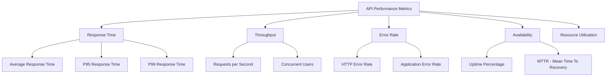
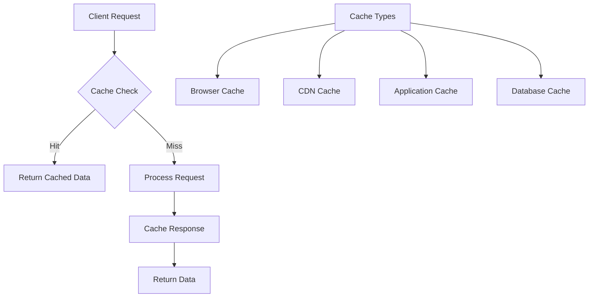

# Chapter 8: API Performance

## Performance Metrics

### Key Performance Indicators (KPIs)



### Response Time Metrics

#### **Percentile Measurements**

```javascript
// Performance monitoring implementation
class PerformanceMonitor {
  constructor() {
    this.responseTimes = [];
    this.requestCount = 0;
    this.errorCount = 0;
  }

  startTiming() {
    return {
      startTime: process.hrtime.bigint(),
      endTiming: () => this.recordTiming(this.startTime)
    };
  }

  recordTiming(startTime) {
    const endTime = process.hrtime.bigint();
    const responseTime = Number(endTime - startTime) / 1000000; // Convert to milliseconds

    this.responseTimes.push(responseTime);
    this.requestCount++;

    return responseTime;
  }

  getMetrics() {
    if (this.responseTimes.length === 0) {
      return null;
    }

    const sorted = [...this.responseTimes].sort((a, b) => a - b);
    const total = sorted.reduce((sum, time) => sum + time, 0);

    return {
      requestCount: this.requestCount,
      errorCount: this.errorCount,
      errorRate: (this.errorCount / this.requestCount) * 100,
      avgResponseTime: total / sorted.length,
      p50: sorted[Math.floor(sorted.length * 0.5)],
      p95: sorted[Math.floor(sorted.length * 0.95)],
      p99: sorted[Math.floor(sorted.length * 0.99)],
      min: Math.min(...sorted),
      max: Math.max(...sorted)
    };
  }

  recordError() {
    this.errorCount++;
  }

  reset() {
    this.responseTimes = [];
    this.requestCount = 0;
    this.errorCount = 0;
  }
}

// Express middleware
const monitor = new PerformanceMonitor();

function performanceMiddleware(req, res, next) {
  const timing = monitor.startTiming();

  // Record when response finishes
  res.on('finish', () => {
    const responseTime = timing.endTiming();

    if (res.statusCode >= 400) {
      monitor.recordError();
    }

    console.log(`${req.method} ${req.path} - ${responseTime.toFixed(2)}ms`);
  });

  next();
}
```

#### **SLA Metrics**

```javascript
// Service Level Agreement monitoring
class SLAMonitor {
  constructor() {
    this.metrics = {
      availability: 0,
      responseTimeP95: 0,
      errorRate: 0,
      uptimeStart: Date.now(),
      totalRequests: 0,
      successfulRequests: 0
    };
  }

  recordRequest(success, responseTime) {
    this.metrics.totalRequests++;

    if (success) {
      this.metrics.successfulRequests++;
    }
  }

  getAvailability() {
    const now = Date.now();
    const totalTime = now - this.metrics.uptimeStart;

    // Calculate availability based on successful requests
    return (this.metrics.successfulRequests / this.metrics.totalRequests) * 100;
  }

  checkSLA() {
    const current = this.getCurrentMetrics();

    return {
      availability: current.availability >= 99.9,
      responseTime: current.responseTimeP95 <= 200,
      errorRate: current.errorRate <= 0.1,
      overall: current.availability >= 99.9 &&
               current.responseTimeP95 <= 200 &&
               current.errorRate <= 0.1
    };
  }

  getCurrentMetrics() {
    return {
      availability: this.getAvailability(),
      responseTimeP95: this.metrics.responseTimeP95,
      errorRate: this.metrics.errorRate,
      totalRequests: this.metrics.totalRequests
    };
  }
}

// Alerting when SLA is breached
function slaAlerting(slaMonitor) {
  const checkInterval = 60000; // Check every minute

  setInterval(() => {
    const slaStatus = slaMonitor.checkSLA();

    if (!slaStatus.overall) {
      console.error('SLA BREACH DETECTED:', slaStatus);
      // Send alert to monitoring system
      sendAlert({
        type: 'SLA_BREACH',
        metrics: slaStatus,
        timestamp: new Date().toISOString()
      });
    }
  }, checkInterval);
}
```

---

## Caching Strategies

### Caching Architecture



### HTTP Caching

#### **Cache-Control Headers**

```javascript
// Express.js caching middleware
function cacheMiddleware(options = {}) {
  const {
    maxAge = 3600, // 1 hour default
    private = false,
    noCache = false,
    noStore = false,
    mustRevalidate = false
  } = options;

  return (req, res, next) => {
    if (noStore) {
      res.setHeader('Cache-Control', 'no-store, no-cache, must-revalidate, proxy-revalidate');
      res.setHeader('Pragma', 'no-cache');
      res.setHeader('Expires', '0');
    } else if (noCache) {
      res.setHeader('Cache-Control', 'no-cache, must-revalidate');
    } else {
      const directives = ['max-age=' + maxAge];

      if (private) {
        directives.push('private');
      } else {
        directives.push('public');
      }

      if (mustRevalidate) {
        directives.push('must-revalidate');
      }

      res.setHeader('Cache-Control', directives.join(', '));
      res.setHeader('Expires', new Date(Date.now() + maxAge * 1000).toUTCString());
    }

    // ETag for conditional requests
    const etag = generateETag(req.data);
    res.setHeader('ETag', etag);

    // Check if client has cached version
    if (req.headers['if-none-match'] === etag) {
      return res.status(304).end();
    }

    next();
  };
}

function generateETag(data) {
  const hash = crypto.createHash('md5');
  hash.update(JSON.stringify(data));
  return `"${hash.digest('hex')}"`;
}

// Usage examples
app.get('/api/public-data', cacheMiddleware({ maxAge: 3600, public: true }), getPublicData);

app.get('/api/user-profile',
  authenticateToken,
  cacheMiddleware({ maxAge: 300, private: true }),
  getUserProfile
);

app.get('/api/real-time', cacheMiddleware({ noStore: true }), getRealTimeData);
```

#### **Application-Level Caching**

```javascript
const NodeCache = require('node-cache');
const Redis = require('ioredis');

// Multi-layer caching strategy
class CacheManager {
  constructor() {
    // L1: In-memory cache (fastest)
    this.l1Cache = new NodeCache({
      stdTTL: 60, // 1 minute default
      checkperiod: 120, // Check for expired keys every 2 minutes
      useClones: false
    });

    // L2: Redis cache (shared across instances)
    this.l2Cache = new Redis({
      host: process.env.REDIS_HOST,
      port: process.env.REDIS_PORT,
      retryDelayOnFailover: 100,
      maxRetriesPerRequest: 3
    });
  }

  async get(key) {
    try {
      // Try L1 cache first
      let value = this.l1Cache.get(key);
      if (value !== undefined) {
        console.log(`L1 cache hit: ${key}`);
        return value;
      }

      // Try L2 cache
      value = await this.l2Cache.get(key);
      if (value !== null) {
        console.log(`L2 cache hit: ${key}`);
        // Store in L1 cache for faster future access
        this.l1Cache.set(key, JSON.parse(value));
        return JSON.parse(value);
      }

      console.log(`Cache miss: ${key}`);
      return null;
    } catch (error) {
      console.error('Cache get error:', error);
      return null;
    }
  }

  async set(key, value, ttl = 3600) {
    try {
      // Set in both cache layers
      this.l1Cache.set(key, value, Math.min(ttl, 300)); // Max 5 minutes in L1
      await this.l2Cache.setex(key, ttl, JSON.stringify(value));

      console.log(`Cache set: ${key} (TTL: ${ttl}s)`);
    } catch (error) {
      console.error('Cache set error:', error);
    }
  }

  async invalidate(pattern) {
    try {
      // Clear from L1 cache
      this.l1Cache.keys().forEach(key => {
        if (key.includes(pattern)) {
          this.l1Cache.del(key);
        }
      });

      // Clear from L2 cache
      const keys = await this.l2Cache.keys(pattern);
      if (keys.length > 0) {
        await this.l2Cache.del(...keys);
      }

      console.log(`Cache invalidated: ${pattern}`);
    } catch (error) {
      console.error('Cache invalidation error:', error);
    }
  }

  // Cache warming for frequently accessed data
  async warmCache(dataLoader) {
    const warmupKeys = [
      'popular_products',
      'featured_categories',
      'system_settings',
      'user_preferences_template'
    ];

    for (const key of warmupKeys) {
      try {
        const data = await dataLoader(key);
        await this.set(key, data);
      } catch (error) {
        console.error(`Cache warmup failed for ${key}:`, error);
      }
    }
  }
}

// Cache decorator for functions
function cached(ttl = 3600, keyGenerator = null) {
  return function(target, propertyName, descriptor) {
    const method = descriptor.value;
    const cacheManager = new CacheManager();

    descriptor.value = async function(...args) {
      const cacheKey = keyGenerator
        ? keyGenerator(...args)
        : `${propertyName}:${JSON.stringify(args)}`;

      let result = await cacheManager.get(cacheKey);

      if (result === null) {
        result = await method.apply(this, args);
        await cacheManager.set(cacheKey, result, ttl);
      }

      return result;
    };

    return descriptor;
  };
}

// Usage
class ProductService {
  @cached(1800, (categoryId) => `products:category:${categoryId}`)
  async getProductsByCategory(categoryId) {
    return await this.database.getProductsByCategory(categoryId);
  }

  @cached(3600, () => 'products:featured')
  async getFeaturedProducts() {
    return await this.database.getFeaturedProducts();
  }
}
```

#### **Database Query Caching**

```javascript
class QueryCache {
  constructor(cacheManager) {
    this.cache = cacheManager;
    this.queryStats = {
      hits: 0,
      misses: 0,
      totalQueries: 0
    };
  }

  async executeQuery(query, params, ttl = 300) {
    const cacheKey = this.generateCacheKey(query, params);
    this.queryStats.totalQueries++;

    try {
      // Try cache first
      let result = await this.cache.get(cacheKey);

      if (result) {
        this.queryStats.hits++;
        console.log(`Query cache hit: ${cacheKey}`);
        return result;
      }

      // Execute query
      this.queryStats.misses++;
      console.log(`Query cache miss: ${cacheKey}`);

      result = await this.database.query(query, params);

      // Cache the result
      await this.cache.set(cacheKey, result.rows, ttl);

      return result.rows;
    } catch (error) {
      console.error('Query execution error:', error);
      throw error;
    }
  }

  generateCacheKey(query, params) {
    const normalizedQuery = query.toLowerCase().replace(/\s+/g, ' ').trim();
    const paramString = JSON.stringify(params || []);

    const hash = crypto.createHash('sha256');
    hash.update(normalizedQuery + paramString);

    return `query:${hash.digest('hex')}`;
  }

  invalidatePattern(pattern) {
    return this.cache.invalidate(`query:*${pattern}*`);
  }

  getStats() {
    const hitRate = this.queryStats.totalQueries > 0
      ? (this.queryStats.hits / this.queryStats.totalQueries) * 100
      : 0;

    return {
      ...this.queryStats,
      hitRate: hitRate.toFixed(2) + '%'
    };
  }
}
```

---

## Load Balancing

### Load Balancing Algorithms

```javascript
class LoadBalancer {
  constructor(servers) {
    this.servers = servers;
    this.currentServer = 0;
    this.serverStats = new Map();

    // Initialize server statistics
    servers.forEach(server => {
      this.serverStats.set(server.id, {
        requests: 0,
        failures: 0,
        responseTime: 0,
        lastHealthCheck: Date.now(),
        healthy: true
      });
    });
  }

  // Round Robin
  roundRobin() {
    const server = this.servers[this.currentServer];
    this.currentServer = (this.currentServer + 1) % this.servers.length;
    return server;
  }

  // Least Connections
  leastConnections() {
    return this.servers.reduce((least, current) => {
      const leastStats = this.serverStats.get(least.id);
      const currentStats = this.serverStats.get(current.id);

      return currentStats.requests < leastStats.requests ? current : least;
    });
  }

  // Weighted Round Robin
  weightedRoundRobin() {
    const totalWeight = this.servers.reduce((sum, server) => sum + server.weight, 0);
    let random = Math.random() * totalWeight;

    for (const server of this.servers) {
      random -= server.weight;
      if (random <= 0) {
        return server;
      }
    }

    return this.servers[0];
  }

  // Response Time Based
  responseTimeBased() {
    return this.servers.reduce((fastest, current) => {
      const fastestStats = this.serverStats.get(fastest.id);
      const currentStats = this.serverStats.get(current.id);

      return currentStats.responseTime < fastestStats.responseTime ? current : fastest;
    });
  }

  // Health-aware load balancing
  getHealthyServer(algorithm = 'roundRobin') {
    const healthyServers = this.servers.filter(server =>
      this.serverStats.get(server.id).healthy
    );

    if (healthyServers.length === 0) {
      throw new Error('No healthy servers available');
    }

    const originalServers = this.servers;
    this.servers = healthyServers;

    const server = this[algorithm]();

    this.servers = originalServers;
    return server;
  }

  recordRequest(serverId, responseTime, success = true) {
    const stats = this.serverStats.get(serverId);

    stats.requests++;
    stats.responseTime = (stats.responseTime * 0.8) + (responseTime * 0.2);

    if (!success) {
      stats.failures++;
    }
  }

  getServerStats() {
    const stats = {};

    this.serverStats.forEach((stat, serverId) => {
      stats[serverId] = {
        ...stat,
        successRate: stat.requests > 0
          ? ((stat.requests - stat.failures) / stat.requests * 100).toFixed(2) + '%'
          : '0%'
      };
    });

    return stats;
  }
}

// Express proxy with load balancing
const httpProxy = require('http-proxy-middleware');
const loadBalancer = new LoadBalancer([
  { id: 'server1', url: 'http://localhost:3001', weight: 1 },
  { id: 'server2', url: 'http://localhost:3002', weight: 1 },
  { id: 'server3', url: 'http://localhost:3003', weight: 2 }
]);

const proxyOptions = {
  target: 'http://localhost:3001', // Will be overridden
  changeOrigin: true,
  router: (req) => {
    const server = loadBalancer.getHealthyServer('responseTimeBased');
    return server.url;
  },
  onError: (err, req, res) => {
    console.error('Proxy error:', err);
    res.status(502).json({ error: 'Bad Gateway' });
  }
};

const apiProxy = httpProxy.createProxyMiddleware(proxyOptions);

// Performance tracking middleware
function proxyPerformanceMiddleware(req, res, next) {
  const startTime = process.hrtime.bigint();

  res.on('finish', () => {
    const endTime = process.hrtime.bigint();
    const responseTime = Number(endTime - startTime) / 1000000;

    // Extract server ID from response headers or routing
    const serverId = req.proxyServerId || 'unknown';
    const success = res.statusCode < 500;

    loadBalancer.recordRequest(serverId, responseTime, success);
  });

  next();
}

app.use('/api', proxyPerformanceMiddleware, apiProxy);
```

### Circuit Breaker Pattern

```javascript
class CircuitBreaker {
  constructor(options = {}) {
    this.failureThreshold = options.failureThreshold || 5;
    this.timeout = options.timeout || 60000; // 1 minute
    this.monitoringPeriod = options.monitoringPeriod || 10000; // 10 seconds

    this.state = 'CLOSED'; // CLOSED, OPEN, HALF_OPEN
    this.failureCount = 0;
    this.successCount = 0;
    this.lastFailureTime = null;
    this.nextAttempt = Date.now();
  }

  async execute(operation) {
    if (this.state === 'OPEN') {
      if (Date.now() < this.nextAttempt) {
        throw new Error('Circuit breaker is OPEN');
      }

      this.state = 'HALF_OPEN';
    }

    try {
      const result = await operation();
      this.onSuccess();
      return result;
    } catch (error) {
      this.onFailure();
      throw error;
    }
  }

  onSuccess() {
    this.failureCount = 0;

    if (this.state === 'HALF_OPEN') {
      this.successCount++;

      if (this.successCount >= this.failureThreshold) {
        this.reset();
      }
    }
  }

  onFailure() {
    this.failureCount++;
    this.lastFailureTime = Date.now();

    if (this.failureCount >= this.failureThreshold) {
      this.trip();
    }
  }

  trip() {
    this.state = 'OPEN';
    this.nextAttempt = Date.now() + this.timeout;
    console.log('Circuit breaker OPENED');
  }

  reset() {
    this.state = 'CLOSED';
    this.failureCount = 0;
    this.successCount = 0;
    console.log('Circuit breaker RESET');
  }

  getState() {
    return {
      state: this.state,
      failureCount: this.failureCount,
      nextAttempt: this.nextAttempt
    };
  }
}

// Usage with API calls
class APIClient {
  constructor() {
    this.circuitBreaker = new CircuitBreaker({
      failureThreshold: 3,
      timeout: 30000,
      monitoringPeriod: 5000
    });
  }

  async makeRequest(url, options = {}) {
    return this.circuitBreaker.execute(async () => {
      const response = await fetch(url, options);

      if (!response.ok) {
        throw new Error(`HTTP error! status: ${response.status}`);
      }

      return response.json();
    });
  }
}
```

---

## Rate Limiting / Throttling

### Advanced Rate Limiting Strategies

```javascript
class AdvancedRateLimiter {
  constructor(redis) {
    this.redis = redis;
  }

  // Token Bucket Algorithm
  async tokenBucket(key, capacity, refillRate) {
    const now = Math.floor(Date.now() / 1000);
    const pipeline = this.redis.pipeline();

    // Get current bucket state
    pipeline.hgetall(key);
    const results = await pipeline.exec();
    const state = results[0][1];

    let tokens = parseFloat(state.tokens) || capacity;
    let lastRefill = parseInt(state.lastRefill) || now;

    // Refill tokens
    const timePassed = now - lastRefill;
    tokens = Math.min(capacity, tokens + (timePassed * refillRate));

    // Check if request can be processed
    if (tokens >= 1) {
      tokens -= 1;

      // Update bucket state
      await this.redis.hmset(key, {
        tokens: tokens,
        lastRefill: now
      });

      // Set expiration
      await this.redis.expire(key, Math.ceil(capacity / refillRate) + 10);

      return { allowed: true, tokens, resetTime: now + Math.ceil((1 - tokens) / refillRate) };
    }

    const resetTime = now + Math.ceil((1 - tokens) / refillRate);
    return { allowed: false, tokens, resetTime };
  }

  // Sliding Window Log
  async slidingWindowLog(key, windowSize, maxRequests) {
    const now = Date.now();
    const windowStart = now - windowSize;

    // Remove old entries
    await this.redis.zremrangebyscore(key, 0, windowStart);

    // Count current requests
    const currentRequests = await this.redis.zcard(key);

    if (currentRequests >= maxRequests) {
      // Get oldest request to calculate reset time
      const oldest = await this.redis.zrange(key, 0, 0, 'WITHSCORES');
      const resetTime = oldest.length > 0 ? parseInt(oldest[0][1]) + windowSize : now + windowSize;

      return { allowed: false, resetTime };
    }

    // Add current request
    await this.redis.zadd(key, now, `${now}-${Math.random()}`);
    await this.redis.expire(key, Math.ceil(windowSize / 1000) + 1);

    return { allowed: true };
  }

  // Sliding Window Counter
  async slidingWindowCounter(key, windowSize, maxRequests) {
    const now = Math.floor(Date.now() / 1000);
    const windowSizeSeconds = Math.ceil(windowSize / 1000);
    const currentWindow = Math.floor(now / windowSizeSeconds);
    const previousWindow = currentWindow - 1;

    const pipeline = this.redis.pipeline();

    // Get current and previous window counts
    pipeline.hget(key, currentWindow);
    pipeline.hget(key, previousWindow);

    const results = await pipeline.exec();
    const currentCount = parseInt(results[0][1]) || 0;
    const previousCount = parseInt(results[1][1]) || 0;

    // Calculate weighted average
    const elapsedInCurrent = (now % windowSizeSeconds) / windowSizeSeconds;
    const weightedCount = currentCount + (previousCount * (1 - elapsedInCurrent));

    if (weightedCount >= maxRequests) {
      return { allowed: false, resetTime: (currentWindow + 1) * windowSizeSeconds };
    }

    // Increment current window
    await this.redis.hincrby(key, currentWindow, 1);
    await this.redis.expire(key, windowSizeSeconds * 2);

    return { allowed: true };
  }

  // Adaptive Rate Limiting based on system load
  async adaptiveRateLimit(key, baseLimit, systemLoad) {
    // Adjust limit based on system load
    let adjustedLimit = baseLimit;

    if (systemLoad > 0.8) {
      adjustedLimit = Math.floor(baseLimit * 0.5); // Reduce by 50%
    } else if (systemLoad > 0.6) {
      adjustedLimit = Math.floor(baseLimit * 0.75); // Reduce by 25%
    }

    return this.slidingWindowCounter(`${key}:adaptive`, 60000, adjustedLimit);
  }
}

// Express middleware for rate limiting
function rateLimitMiddleware(limiter, options = {}) {
  const {
    keyGenerator = (req) => req.ip,
    limit = 100,
    windowMs = 60000,
    algorithm = 'tokenBucket',
    skipSuccessfulRequests = false,
    skipFailedRequests = false
  } = options;

  return async (req, res, next) => {
    const key = keyGenerator(req);
    const fullKey = `rate_limit:${key}`;

    try {
      let result;

      switch (algorithm) {
        case 'tokenBucket':
          result = await limiter.tokenBucket(fullKey, limit, limit / windowMs);
          break;
        case 'slidingWindowLog':
          result = await limiter.slidingWindowLog(fullKey, windowMs, limit);
          break;
        case 'slidingWindowCounter':
          result = await limiter.slidingWindowCounter(fullKey, windowMs, limit);
          break;
        default:
          result = await limiter.tokenBucket(fullKey, limit, limit / windowMs);
      }

      // Add rate limit headers
      res.setHeader('X-RateLimit-Limit', limit);
      res.setHeader('X-RateLimit-Remaining', Math.max(0, limit - result.current || 0));

      if (result.resetTime) {
        res.setHeader('X-RateLimit-Reset', Math.ceil(result.resetTime / 1000));
        res.setHeader('Retry-After', Math.ceil((result.resetTime - Date.now()) / 1000));
      }

      if (!result.allowed) {
        return res.status(429).json({
          error: 'Too many requests',
          retryAfter: result.resetTime ? Math.ceil((result.resetTime - Date.now()) / 1000) : 60
        });
      }

      // Track request for adaptive limiting
      res.on('finish', () => {
        const shouldCount = (skipSuccessfulRequests && res.statusCode >= 400) ||
                           (skipFailedRequests && res.statusCode < 400) ||
                           (!skipSuccessfulRequests && !skipFailedRequests);

        if (shouldCount) {
          // Request is already counted in the rate limiting algorithm
        }
      });

      next();
    } catch (error) {
      console.error('Rate limiting error:', error);
      next(); // Allow request if rate limiting fails
    }
  };
}
```

---

## Profiling and Monitoring

### Application Performance Monitoring (APM)

```javascript
class APMCollector {
  constructor() {
    this.metrics = {
      requests: new Map(),
      database: new Map(),
      cache: new Map(),
      errors: []
    };
    this.startTime = Date.now();
  }

  // Request tracing
  traceRequest(req, res, next) {
    const traceId = this.generateTraceId();
    const startTime = process.hrtime.bigint();

    req.traceId = traceId;
    res.setHeader('X-Trace-ID', traceId);

    // Store request metadata
    this.metrics.requests.set(traceId, {
      method: req.method,
      url: req.url,
      userAgent: req.get('User-Agent'),
      ip: req.ip,
      startTime: Date.now(),
      spans: []
    });

    res.on('finish', () => {
      const endTime = process.hrtime.bigint();
      const duration = Number(endTime - startTime) / 1000000;

      const request = this.metrics.requests.get(traceId);
      request.duration = duration;
      request.statusCode = res.statusCode;

      console.log(`Request ${traceId}: ${req.method} ${req.url} - ${duration.toFixed(2)}ms`);
    });

    next();
  }

  // Span for specific operations
  createSpan(traceId, operation, metadata = {}) {
    const spanId = this.generateSpanId();
    const startTime = process.hrtime.bigint();

    const span = {
      id: spanId,
      operation,
      startTime: Date.now(),
      metadata,
      startTimeNanos: startTime
    };

    const request = this.metrics.requests.get(traceId);
    if (request) {
      request.spans.push(span);
    }

    return {
      spanId,
      finish: (additionalMetadata = {}) => {
        const endTime = process.hrtime.bigint();
        span.duration = Number(endTime - span.startTimeNanos) / 1000000;
        span.metadata = { ...span.metadata, ...additionalMetadata };
        span.endTime = Date.now();
      }
    };
  }

  // Database query monitoring
  async traceQuery(traceId, query, params) {
    const span = this.createSpan(traceId, 'database_query', {
      query: query.substring(0, 100),
      paramCount: params ? params.length : 0
    });

    const startTime = process.hrtime.bigint();

    try {
      const result = await this.executeQuery(query, params);
      span.finish({ success: true, rowCount: result.rowCount });
      return result;
    } catch (error) {
      span.finish({ success: false, error: error.message });
      throw error;
    }
  }

  // Cache operation monitoring
  async traceCacheOperation(traceId, operation, key) {
    const span = this.createSpan(traceId, `cache_${operation}`, { key });

    const startTime = process.hrtime.bigint();

    try {
      const result = await this.performCacheOperation(operation, key);
      span.finish({ hit: operation === 'get' ? result !== null : true });
      return result;
    } catch (error) {
      span.finish({ success: false, error: error.message });
      throw error;
    }
  }

  // Error tracking
  trackError(error, traceId, context = {}) {
    const errorReport = {
      traceId,
      message: error.message,
      stack: error.stack,
      context,
      timestamp: Date.now()
    };

    this.metrics.errors.push(errorReport);
    console.error('Error tracked:', errorReport);
  }

  // Get performance metrics
  getMetrics() {
    const now = Date.now();
    const uptime = now - this.startTime;

    const requestMetrics = Array.from(this.metrics.requests.values());
    const successfulRequests = requestMetrics.filter(r => r.statusCode < 400);
    const errorRequests = requestMetrics.filter(r => r.statusCode >= 400);

    const responseTimes = requestMetrics.map(r => r.duration).filter(d => d);
    const avgResponseTime = responseTimes.length > 0
      ? responseTimes.reduce((sum, time) => sum + time, 0) / responseTimes.length
      : 0;

    responseTimes.sort((a, b) => a - b);
    const p95ResponseTime = responseTimes[Math.floor(responseTimes.length * 0.95)] || 0;
    const p99ResponseTime = responseTimes[Math.floor(responseTimes.length * 0.99)] || 0;

    return {
      uptime,
      totalRequests: requestMetrics.length,
      successfulRequests: successfulRequests.length,
      errorRequests: errorRequests.length,
      errorRate: requestMetrics.length > 0 ? (errorRequests.length / requestMetrics.length) * 100 : 0,
      avgResponseTime,
      p95ResponseTime,
      p99ResponseTime,
      requestsPerSecond: (requestMetrics.length / uptime) * 1000
    };
  }

  generateTraceId() {
    return `trace_${Date.now()}_${Math.random().toString(36).substr(2, 9)}`;
  }

  generateSpanId() {
    return Math.random().toString(36).substr(2, 9);
  }
}
```

### Real-time Monitoring Dashboard

```javascript
class MonitoringDashboard {
  constructor(apmCollector) {
    this.apm = apmCollector;
    this.metrics = [];
    this.alerts = [];
    this.maxDataPoints = 100;
  }

  start(intervalMs = 5000) {
    this.interval = setInterval(() => {
      this.collectMetrics();
      this.checkAlerts();
    }, intervalMs);
  }

  stop() {
    if (this.interval) {
      clearInterval(this.interval);
    }
  }

  collectMetrics() {
    const metrics = this.apm.getMetrics();
    const timestamp = Date.now();

    this.metrics.push({
      timestamp,
      ...metrics
    });

    // Keep only recent data points
    if (this.metrics.length > this.maxDataPoints) {
      this.metrics = this.metrics.slice(-this.maxDataPoints);
    }
  }

  checkAlerts() {
    const currentMetrics = this.metrics[this.metrics.length - 1];
    if (!currentMetrics) return;

    // Error rate alert
    if (currentMetrics.errorRate > 5) {
      this.addAlert({
        type: 'error_rate',
        severity: 'high',
        message: `Error rate is ${currentMetrics.errorRate.toFixed(2)}%`,
        value: currentMetrics.errorRate,
        threshold: 5
      });
    }

    // Response time alert
    if (currentMetrics.p95ResponseTime > 1000) {
      this.addAlert({
        type: 'response_time',
        severity: 'medium',
        message: `P95 response time is ${currentMetrics.p95ResponseTime.toFixed(2)}ms`,
        value: currentMetrics.p95ResponseTime,
        threshold: 1000
      });
    }

    // RPS alert
    if (currentMetrics.requestsPerSecond < 1) {
      this.addAlert({
        type: 'low_traffic',
        severity: 'low',
        message: `Low traffic: ${currentMetrics.requestsPerSecond.toFixed(2)} RPS`,
        value: currentMetrics.requestsPerSecond,
        threshold: 1
      });
    }
  }

  addAlert(alert) {
    // Check for existing similar alert
    const existingAlert = this.alerts.find(a =>
      a.type === alert.type && a.severity === alert.severity &&
      (Date.now() - a.timestamp) < 60000 // Within last minute
    );

    if (!existingAlert) {
      alert.timestamp = Date.now();
      alert.id = Math.random().toString(36).substr(2, 9);
      this.alerts.push(alert);

      // Send notification
      this.sendNotification(alert);
    }
  }

  sendNotification(alert) {
    console.log(`🚨 ALERT [${alert.severity.toUpperCase()}]: ${alert.message}`);

    // Integration with notification systems
    if (process.env.SLACK_WEBHOOK_URL) {
      this.sendSlackNotification(alert);
    }
  }

  async sendSlackNotification(alert) {
    const webhookUrl = process.env.SLACK_WEBHOOK_URL;

    const payload = {
      text: `API Alert: ${alert.message}`,
      attachments: [{
        color: alert.severity === 'high' ? 'danger' : alert.severity === 'medium' ? 'warning' : 'good',
        fields: [
          { title: 'Type', value: alert.type, short: true },
          { title: 'Severity', value: alert.severity, short: true },
          { title: 'Value', value: alert.value.toString(), short: true },
          { title: 'Threshold', value: alert.threshold.toString(), short: true }
        ],
        timestamp: Math.floor(alert.timestamp / 1000)
      }]
    };

    try {
      await fetch(webhookUrl, {
        method: 'POST',
        headers: { 'Content-Type': 'application/json' },
        body: JSON.stringify(payload)
      });
    } catch (error) {
      console.error('Failed to send Slack notification:', error);
    }
  }

  getMetricsHistory(minutes = 10) {
    const cutoff = Date.now() - (minutes * 60 * 1000);
    return this.metrics.filter(m => m.timestamp > cutoff);
  }

  getCurrentMetrics() {
    return this.metrics[this.metrics.length - 1] || null;
  }

  getActiveAlerts() {
    const cutoff = Date.now() - 300000; // Last 5 minutes
    return this.alerts.filter(a => a.timestamp > cutoff);
  }
}
```

---

## Performance Testing

### Load Testing with Artillery

```yaml
# artillery-config.yml
config:
  target: 'http://localhost:3000'
  phases:
    - duration: 60
      arrivalRate: 10
      name: "Warm up"
    - duration: 120
      arrivalRate: 50
      name: "Ramp up load"
    - duration: 300
      arrivalRate: 100
      name: "Sustained load"
    - duration: 60
      arrivalRate: 200
      name: "Peak load"
    - duration: 120
      arrivalRate: 50
      name: "Cool down"

  processor: "./test-processor.js"

scenarios:
  - name: "User Registration and Login"
    weight: 20
    flow:
      - post:
          url: "/api/auth/register"
          json:
            username: "{{ username }}"
            email: "{{ email }}"
            password: "{{ password }}"
          capture:
            - json: "$.token"
              as: "authToken"

      - get:
          url: "/api/users/profile"
          headers:
            Authorization: "Bearer {{ authToken }}"

  - name: "Browse Products"
    weight: 40
    flow:
      - get:
          url: "/api/products"
          qs:
            page: "{{ $randomInt(1, 10) }}"
            limit: "20"

      - think: 2

      - get:
          url: "/api/products/{{ $randomInt(1, 100) }}"

  - name: "API Health Check"
    weight: 40
    flow:
      - get:
          url: "/api/health"
          expect:
            - statusCode: 200
            - contentType: application/json
```

```javascript
// test-processor.js
module.exports = {
  // Generate test data
  generateTestUser() {
    const randomId = Math.random().toString(36).substr(2, 9);
    return {
      username: `user_${randomId}`,
      email: `user_${randomId}@test.com`,
      password: 'TestPassword123!'
    };
  },

  // Before each request
  beforeRequest(requestContext, ee, function() {
    const testUser = this.generateTestUser();

    requestContext.vars.username = testUser.username;
    requestContext.vars.email = testUser.email;
    requestContext.vars.password = testUser.password;

    return requestContext;
  }
};
```

### Performance Test Execution

```javascript
class PerformanceTestRunner {
  constructor() {
    this.testResults = [];
    this.metrics = {
      responseTimes: [],
      throughput: [],
      errorRates: []
    };
  }

  async runLoadTest(config) {
    console.log('Starting load test...');
    const startTime = Date.now();

    // Run Artillery test
    const { exec } = require('child_process');
    const artillery = require('artillery');

    return new Promise((resolve, reject) => {
      artillery.run(config, (err, results) => {
        if (err) {
          reject(err);
          return;
        }

        const testDuration = (Date.now() - startTime) / 1000;

        const processedResults = this.processResults(results);
        this.testResults.push({
          timestamp: Date.now(),
          duration: testDuration,
          results: processedResults
        });

        console.log('Load test completed');
        resolve(processedResults);
      });
    });
  }

  processResults(artilleryResults) {
    const aggregate = artilleryResults.aggregate;

    return {
      totalRequests: aggregate.requestsCompleted,
      totalErrors: aggregate.errors,
      testDuration: aggregate.testDuration,
      rps: aggregate.rps.mean,
      latency: {
        min: aggregate.latency.min,
        max: aggregate.latency.max,
        mean: aggregate.latency.mean,
        median: aggregate.latency.median,
        p95: aggregate.latency.p95,
        p99: aggregate.latency.p99
      },
      throughput: {
        mean: aggregate.throughput.mean,
        min: aggregate.throughput.min,
        max: aggregate.throughput.max
      },
      scenarios: this.processScenarioResults(artilleryResults.scenarios)
    };
  }

  processScenarioResults(scenarios) {
    return scenarios.map(scenario => ({
      name: scenario.name,
      count: scenario.count,
      successCount: scenario.okCount,
      errorCount: scenario.errorCount,
      latency: {
        min: scenario.latency.min,
        max: scenario.latency.max,
        mean: scenario.latency.mean,
        median: scenario.latency.median,
        p95: scenario.latency.p95,
        p99: scenario.latency.p99
      }
    }));
  }

  // Compare test results
  compareTests(baseline, current) {
    const comparison = {
      rpsChange: ((current.rps - baseline.rps) / baseline.rps * 100).toFixed(2),
      p95LatencyChange: ((current.latency.p95 - baseline.latency.p95) / baseline.latency.p95 * 100).toFixed(2),
      errorRateChange: ((current.totalErrors / current.totalRequests - baseline.totalErrors / baseline.totalRequests) * 100).toFixed(2)
    };

    return {
      ...comparison,
      performance: this.calculatePerformanceScore(comparison)
    };
  }

  calculatePerformanceScore(comparison) {
    let score = 100;

    // Deduct points for latency increase
    if (parseFloat(comparison.p95LatencyChange) > 0) {
      score -= parseFloat(comparison.p95LatencyChange);
    }

    // Deduct points for error rate increase
    if (parseFloat(comparison.errorRateChange) > 0) {
      score -= parseFloat(comparison.errorRateChange) * 10;
    }

    // Add points for throughput increase
    if (parseFloat(comparison.rpsChange) > 0) {
      score += Math.min(parseFloat(comparison.rpsChange) / 2, 10);
    }

    return Math.max(0, Math.min(100, score));
  }

  // Generate performance report
  generateReport() {
    if (this.testResults.length === 0) {
      return 'No test results available';
    }

    const latest = this.testResults[this.testResults.length - 1];
    const baseline = this.testResults[0];

    const comparison = this.testResults.length > 1
      ? this.compareTests(baseline.results, latest.results)
      : null;

    return {
      summary: {
        testDate: new Date(latest.timestamp).toISOString(),
        duration: latest.duration,
        performanceScore: comparison?.performance || 100
      },
      metrics: latest.results,
      comparison,
      recommendations: this.generateRecommendations(latest.results, comparison)
    };
  }

  generateRecommendations(results, comparison) {
    const recommendations = [];

    if (results.latency.p95 > 500) {
      recommendations.push({
        priority: 'high',
        type: 'performance',
        message: 'P95 latency is above 500ms. Consider optimizing database queries or implementing caching.'
      });
    }

    if (results.latency.p99 > 1000) {
      recommendations.push({
        priority: 'medium',
        type: 'performance',
        message: 'P99 latency is above 1s. Investigate outlier requests.'
      });
    }

    if ((results.totalErrors / results.totalRequests) > 0.01) {
      recommendations.push({
        priority: 'high',
        type: 'reliability',
        message: 'Error rate is above 1%. Review error handling and increase monitoring.'
      });
    }

    if (comparison && parseFloat(comparison.p95LatencyChange) > 20) {
      recommendations.push({
        priority: 'high',
        type: 'regression',
        message: `P95 latency increased by ${comparison.p95LatencyChange}%. Check recent changes.`
      });
    }

    if (results.rps < 100) {
      recommendations.push({
        priority: 'low',
        type: 'capacity',
        message: 'Consider load testing with higher concurrency to validate scalability.'
      });
    }

    return recommendations;
  }
}
```

---

## Error Handling / Retries

### Exponential Backoff with Jitter

```javascript
class RetryManager {
  constructor(options = {}) {
    this.maxRetries = options.maxRetries || 3;
    this.baseDelay = options.baseDelay || 1000;
    this.maxDelay = options.maxDelay || 30000;
    this.jitter = options.jitter !== false;
  }

  async execute(operation, context = {}) {
    let lastError;

    for (let attempt = 0; attempt <= this.maxRetries; attempt++) {
      try {
        const result = await operation(attempt);

        if (attempt > 0) {
          console.log(`Operation succeeded on attempt ${attempt + 1}`);
        }

        return result;
      } catch (error) {
        lastError = error;

        if (attempt === this.maxRetries) {
          console.error(`Operation failed after ${this.maxRetries + 1} attempts:`, error.message);
          throw error;
        }

        if (!this.shouldRetry(error)) {
          console.error(`Non-retryable error: ${error.message}`);
          throw error;
        }

        const delay = this.calculateDelay(attempt);
        console.log(`Attempt ${attempt + 1} failed, retrying in ${delay}ms: ${error.message}`);

        await this.sleep(delay);
      }
    }

    throw lastError;
  }

  shouldRetry(error) {
    // Retry on network errors and 5xx status codes
    if (error.code === 'ECONNRESET' ||
        error.code === 'ETIMEDOUT' ||
        error.code === 'ENOTFOUND') {
      return true;
    }

    if (error.response) {
      const status = error.response.status;
      return status >= 500 || status === 429; // Retry on server errors and rate limiting
    }

    return false;
  }

  calculateDelay(attempt) {
    // Exponential backoff with jitter
    const exponentialDelay = Math.min(
      this.baseDelay * Math.pow(2, attempt),
      this.maxDelay
    );

    if (this.jitter) {
      // Add random jitter to avoid thundering herd
      const jitterRange = exponentialDelay * 0.1;
      const jitter = Math.random() * jitterRange - jitterRange / 2;
      return Math.max(0, exponentialDelay + jitter);
    }

    return exponentialDelay;
  }

  sleep(ms) {
    return new Promise(resolve => setTimeout(resolve, ms));
  }
}

// HTTP client with retry logic
class RetryableHTTPClient {
  constructor(options = {}) {
    this.retryManager = new RetryManager(options.retry);
    this.timeout = options.timeout || 30000;
  }

  async request(url, options = {}) {
    const operation = async (attempt) => {
      const controller = new AbortController();
      const timeoutId = setTimeout(() => controller.abort(), this.timeout);

      try {
        const response = await fetch(url, {
          ...options,
          signal: controller.signal
        });

        clearTimeout(timeoutId);

        if (!response.ok) {
          const error = new Error(`HTTP ${response.status}: ${response.statusText}`);
          error.response = response;
          throw error;
        }

        return response;
      } catch (error) {
        clearTimeout(timeoutId);

        if (error.name === 'AbortError') {
          error.code = 'ETIMEDOUT';
        }

        throw error;
      }
    };

    return this.retryManager.execute(operation);
  }

  async get(url, options = {}) {
    return this.request(url, { ...options, method: 'GET' });
  }

  async post(url, data, options = {}) {
    return this.request(url, {
      ...options,
      method: 'POST',
      headers: {
        'Content-Type': 'application/json',
        ...options.headers
      },
      body: JSON.stringify(data)
    });
  }
}

// Usage examples
const httpClient = new RetryableHTTPClient({
  retry: {
    maxRetries: 3,
    baseDelay: 1000,
    maxDelay: 10000
  },
  timeout: 15000
});

async function fetchUserData(userId) {
  try {
    const response = await httpClient.get(`https://api.example.com/users/${userId}`);
    return await response.json();
  } catch (error) {
    console.error('Failed to fetch user data:', error.message);
    throw error;
  }
}
```

### Circuit Breaker with Retry Integration

```javascript
class ResilientAPIClient {
  constructor(options = {}) {
    this.circuitBreaker = new CircuitBreaker({
      failureThreshold: options.failureThreshold || 5,
      timeout: options.timeout || 60000,
      monitoringPeriod: options.monitoringPeriod || 10000
    });

    this.retryManager = new RetryManager({
      maxRetries: options.maxRetries || 3,
      baseDelay: options.baseDelay || 1000,
      maxDelay: options.maxDelay || 30000
    });

    this.httpClient = new RetryableHTTPClient({
      retry: { maxRetries: 0 }, // Disable HTTP client retries, handle at higher level
      timeout: options.requestTimeout || 30000
    });
  }

  async makeRequest(url, options = {}) {
    const operation = async (attempt) => {
      return this.circuitBreaker.execute(async () => {
        const response = await this.httpClient.request(url, options);
        return response;
      });
    };

    try {
      const response = await this.retryManager.execute(operation);
      return response;
    } catch (error) {
      // Add context to the error
      error.context = {
        url,
        method: options.method || 'GET',
        circuitBreakerState: this.circuitBreaker.getState()
      };

      throw error;
    }
  }

  async get(url, options = {}) {
    return this.makeRequest(url, { ...options, method: 'GET' });
  }

  async post(url, data, options = {}) {
    return this.makeRequest(url, {
      ...options,
      method: 'POST',
      headers: {
        'Content-Type': 'application/json',
        ...options.headers
      },
      body: JSON.stringify(data)
    });
  }

  getHealth() {
    return {
      circuitBreaker: this.circuitBreaker.getState(),
      lastRequest: this.lastRequestTime
    };
  }
}
```

---

## Best Practices

### Performance Optimization Checklist

```javascript
class PerformanceOptimizationChecker {
  constructor() {
    this.checks = [
      this.checkDatabaseQueries,
      this.checkCachingStrategy,
      this.checkResponseSize,
      this.checkConcurrentConnections,
      this.checkMemoryUsage,
      this.checkCPUUsage,
      this.checkNetworkLatency,
      this.checkErrorRates
    ];
  }

  async runAudit(app) {
    const results = {};

    for (const check of this.checks) {
      try {
        results[check.name] = await check.call(this, app);
      } catch (error) {
        results[check.name] = {
          status: 'error',
          message: error.message
        };
      }
    }

    return {
      timestamp: new Date().toISOString(),
      overallScore: this.calculateScore(results),
      checks: results,
      recommendations: this.generateRecommendations(results)
    };
  }

  async checkDatabaseQueries(app) {
    // Monitor slow queries
    const slowQueries = await app.getSlowQueries();

    return {
      status: slowQueries.length > 0 ? 'warning' : 'pass',
      message: `Found ${slowQueries.length} slow queries`,
      details: slowQueries.slice(0, 5),
      recommendations: slowQueries.length > 0 ? [
        'Add database indexes for frequently queried fields',
        'Optimize complex queries with proper joins',
        'Consider read replicas for read-heavy operations'
      ] : []
    };
  }

  async checkCachingStrategy(app) {
    const cacheStats = await app.getCacheStats();
    const hitRate = cacheStats.hits / (cacheStats.hits + cacheStats.misses) * 100;

    return {
      status: hitRate < 70 ? 'warning' : 'pass',
      message: `Cache hit rate: ${hitRate.toFixed(2)}%`,
      hitRate,
      recommendations: hitRate < 70 ? [
        'Review caching strategy for frequently accessed data',
        'Implement cache warming for popular endpoints',
        'Consider CDN for static assets'
      ] : []
    };
  }

  async checkResponseSize(app) {
    const responseStats = await app.getResponseStats();
    const avgSize = responseStats.totalBytes / responseStats.requestCount;

    return {
      status: avgSize > 100000 ? 'warning' : 'pass', // 100KB threshold
      message: `Average response size: ${(avgSize / 1024).toFixed(2)}KB`,
      avgSize,
      recommendations: avgSize > 100000 ? [
        'Implement response compression',
        'Use pagination for large datasets',
        'Consider field selection to reduce payload size'
      ] : []
    };
  }

  async checkConcurrentConnections(app) {
    const connectionStats = await app.getConnectionStats();
    const utilization = (connectionStats.active / connectionStats.max) * 100;

    return {
      status: utilization > 80 ? 'warning' : 'pass',
      message: `Connection utilization: ${utilization.toFixed(2)}%`,
      utilization,
      recommendations: utilization > 80 ? [
        'Implement connection pooling',
        'Consider horizontal scaling',
        'Add connection timeout and retry logic'
      ] : []
    };
  }

  async checkMemoryUsage(app) {
    const memoryUsage = process.memoryUsage();
    const heapUsedMB = memoryUsage.heapUsed / 1024 / 1024;
    const heapTotalMB = memoryUsage.heapTotal / 1024 / 1024;
    const utilization = (heapUsedMB / heapTotalMB) * 100;

    return {
      status: utilization > 85 ? 'warning' : 'pass',
      message: `Memory utilization: ${utilization.toFixed(2)}% (${heapUsedMB.toFixed(2)}MB used)`,
      heapUsed: heapUsedMB,
      heapTotal: heapTotalMB,
      utilization,
      recommendations: utilization > 85 ? [
        'Check for memory leaks',
        'Optimize data structures and algorithms',
        'Consider implementing streaming for large data processing'
      ] : []
    };
  }

  async checkCPUUsage(app) {
    const cpuUsage = process.cpuUsage();
    const userUsage = cpuUsage.user / 1000000; // Convert to seconds
    const systemUsage = cpuUsage.system / 1000000;

    return {
      status: (userUsage + systemUsage) > 1000 ? 'warning' : 'pass', // 1000ms threshold
      message: `CPU usage: ${(userUsage + systemUsage).toFixed(2)}ms`,
      userUsage,
      systemUsage,
      totalUsage: userUsage + systemUsage,
      recommendations: (userUsage + systemUsage) > 1000 ? [
        'Profile CPU-intensive operations',
        'Consider worker threads for heavy computations',
        'Optimize algorithms and data processing'
      ] : []
    };
  }

  calculateScore(results) {
    let totalScore = 0;
    let checkCount = 0;

    for (const [name, result] of Object.entries(results)) {
      if (result.status === 'pass') {
        totalScore += 100;
      } else if (result.status === 'warning') {
        totalScore += 50;
      }
      checkCount++;
    }

    return checkCount > 0 ? Math.round(totalScore / checkCount) : 0;
  }

  generateRecommendations(results) {
    const allRecommendations = [];

    for (const [name, result] of Object.entries(results)) {
      if (result.recommendations) {
        allRecommendations.push(...result.recommendations);
      }
    }

    // Remove duplicates and prioritize
    return [...new Set(allRecommendations)].slice(0, 10);
  }
}
```

---

## Interview Questions

### **Q1: What are the key performance metrics for APIs and why are they important?**
**Answer:**
**Key metrics:**
- **Response Time**: Time to process request (avg, P95, P99)
- **Throughput**: Requests per second (RPS)
- **Error Rate**: Percentage of failed requests
- **Availability**: Uptime percentage
- **Resource Utilization**: CPU, memory, database connections

**Importance:**
- **User Experience**: Fast responses improve user satisfaction
- **Scalability**: Metrics help plan capacity
- **SLA Compliance**: Meet service level agreements
- **Performance Tuning**: Identify bottlenecks
- **Business Impact**: Performance affects revenue

### **Q2: How do you implement effective caching strategies for APIs?**
**Answer:**
**Multi-layer caching:**
1. **Browser Cache**: HTTP headers (Cache-Control, ETag)
2. **CDN Cache**: Edge location caching
3. **Application Cache**: Redis/Memcached
4. **Database Cache**: Query result caching

**Implementation strategies:**
- **Cache-Aside**: Application manages cache
- **Write-Through**: Write to cache and database
- **Write-Behind**: Write to cache, async to database
- **Cache Invalidation**: TTL, event-driven, manual

### **Q3: What are the differences between horizontal and vertical scaling?**
**Answer:**
**Vertical Scaling:**
- Scale up: More powerful server
- Simpler architecture
- Limited by hardware
- Single point of failure

**Horizontal Scaling:**
- Scale out: More servers
- Load balancer required
- Better fault tolerance
- More complex architecture

**Choose based on:**
- Traffic patterns
- Budget constraints
- Complexity tolerance
- Reliability requirements

### **Q4: How do you implement rate limiting for APIs?**
**Answer:**
**Rate limiting algorithms:**
1. **Token Bucket**: Smooth rate limiting
2. **Sliding Window Log**: Precise tracking
3. **Sliding Window Counter**: Memory efficient
4. **Fixed Window**: Simple implementation

**Implementation considerations:**
- **Scope**: Global, per-user, per-endpoint
- **Storage**: Redis for distributed systems
- **Headers**: Communicate limits to clients
- **Adaptive**: Adjust based on system load

### **Q5: What is the Circuit Breaker pattern and when should you use it?**
**Answer:**
**Circuit Breaker Pattern:**
- **Purpose**: Prevent cascade failures
- **States**: CLOSED, OPEN, HALF_OPEN
- **Behavior**: Fail fast, automatic recovery

**When to use:**
- **Microservices**: External service dependencies
- **Unstable Services**: Unreliable third-party APIs
- **Resource Protection**: Prevent overload
- **Graceful Degradation**: Fallback behavior

### **Q6: How do you monitor and optimize API performance?**
**Answer:**
**Monitoring approach:**
1. **APM Tools**: Application performance monitoring
2. **Metrics Collection**: Response times, errors, throughput
3. **Real-time Dashboards**: Visualize performance
4. **Alerting**: Automated notifications
5. **Load Testing**: Simulate traffic patterns

**Optimization strategies:**
- **Database**: Index optimization, query tuning
- **Caching**: Multi-layer caching strategy
- **Compression**: Reduce payload sizes
- **Connection Pooling**: Reuse connections
- **Async Processing**: Non-blocking operations

### **Q7: What are the best practices for API error handling and retries?**
**Answer:**
**Error handling:**
- **Standardized format**: Consistent error responses
- **Appropriate status codes**: HTTP standards
- **Security**: Don't expose internal details
- **Logging**: Comprehensive error tracking
- **Client guidance**: Actionable error messages

**Retry strategies:**
- **Exponential backoff**: Prevent thundering herd
- **Jitter**: Randomize delays
- **Circuit breaker**: Stop retries on repeated failures
- **Idempotency**: Safe retry operations
- **Retry policies**: Different strategies per error type

---

## Quick Tips & Best Practices

### **Performance Optimization**
✅ Monitor key metrics: response time, throughput, error rate
✅ Implement multi-layer caching strategy
✅ Use connection pooling for databases
✅ Compress responses and optimize payload sizes
✅ Profile and optimize database queries

### **Scalability**
✅ Design for horizontal scaling from the start
✅ Implement proper load balancing
✅ Use stateless architecture
✅ Plan for capacity and growth
✅ Implement auto-scaling policies

### **Reliability**
✅ Use circuit breakers for external dependencies
✅ Implement proper error handling and retries
✅ Add comprehensive logging and monitoring
✅ Design for graceful degradation
✅ Test failure scenarios regularly

### **Monitoring**
✅ Set up real-time performance dashboards
✅ Implement automated alerting
✅ Track business metrics alongside technical metrics
✅ Use distributed tracing for complex systems
✅ Regular performance audits and optimization

---

## Chapter Summary

Chapter 8 covers comprehensive API performance optimization:

### **Performance Metrics**
- **Key Indicators**: Response time, throughput, error rate, availability
- **Monitoring Tools**: Real-time tracking and alerting
- **SLA Management**: Service level agreement monitoring

### **Caching Strategies**
- **Multi-layer Caching**: Browser, CDN, application, database
- **Cache Algorithms**: TTL, invalidation, warming strategies
- **Performance Impact**: Hit rates and response time improvement

### **Load Balancing**
- **Algorithms**: Round robin, least connections, weighted
- **Health Checks**: Server monitoring and failover
- **Circuit Breaker**: Failure isolation and recovery

### **Rate Limiting**
- **Strategies**: Token bucket, sliding window, adaptive limiting
- **Implementation**: Distributed rate limiting with Redis
- **Throttling**: Protect against abuse and overload

### **Monitoring & Testing**
- **APM**: Application performance monitoring
- **Load Testing**: Simulated traffic and performance validation
- **Profiling**: Identify bottlenecks and optimization opportunities

### **Error Handling**
- **Retry Logic**: Exponential backoff with jitter
- **Failure Patterns**: Circuit breakers and fallback mechanisms
- **Reliability**: Build resilient, fault-tolerant systems

Performance optimization is an ongoing process requiring continuous monitoring, testing, and improvement to meet user expectations and business requirements.