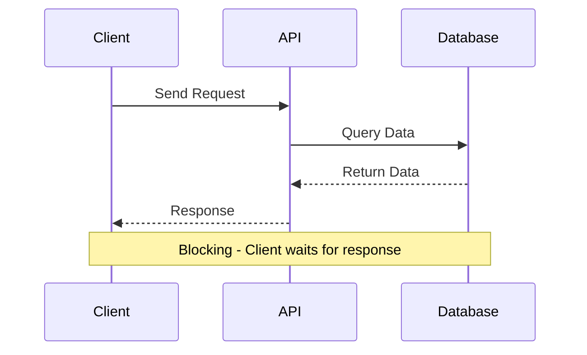
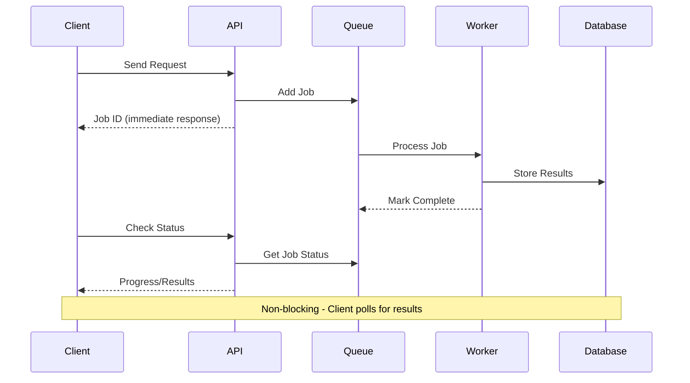
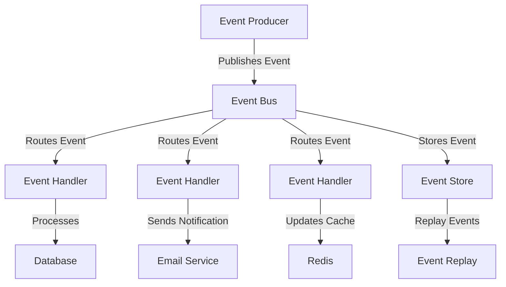
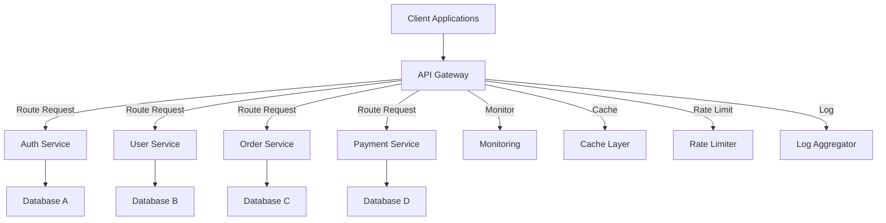
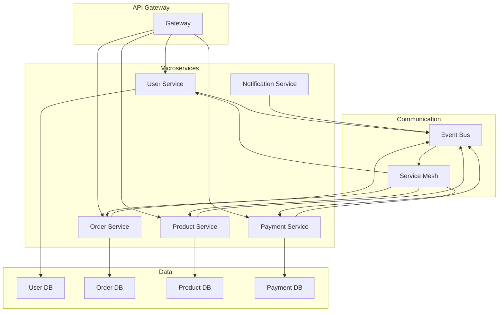
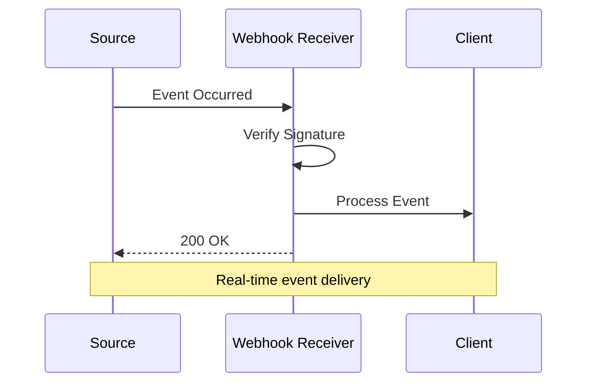

# Chapter 9: API Integration Patterns

## Synchronous vs Asynchronous APIs

### Synchronous APIs



**Characteristics:**
- **Request-Response**: Client waits for immediate response
- **Blocking**: Thread waits until operation completes
- **Real-time**: Immediate feedback
- **Simple**: Easy to understand and implement

```javascript
// Synchronous API endpoint
app.get('/api/users/:id', async (req, res) => {
  try {
    const userId = req.params.id;

    // Blocking operations
    const user = await User.findById(userId);
    const profile = await UserProfile.findOne({ userId });
    const preferences = await UserPreferences.findOne({ userId });

    // Combine and return results
    const result = {
      user,
      profile,
      preferences
    };

    res.json(result);
  } catch (error) {
    res.status(500).json({ error: error.message });
  }
});
```

### Asynchronous APIs



**Characteristics:**
- **Event-driven**: Non-blocking operations
- **Scalable**: Better resource utilization
- **Complex**: Requires job tracking and status management
- **Reliable**: Better for long-running operations

```javascript
// Asynchronous API with job queue
const Queue = require('bull');
const jobQueue = new Queue('api jobs', process.env.REDIS_URL);

app.post('/api/reports/generate', async (req, res) => {
  try {
    const { type, filters } = req.body;

    // Create job for report generation
    const job = await jobQueue.add('generateReport', {
      type,
      filters,
      userId: req.user.id
    });

    // Return immediate response with job ID
    res.status(202).json({
      jobId: job.id,
      message: 'Report generation started',
      estimatedTime: '2-5 minutes'
    });
  } catch (error) {
    res.status(500).json({ error: error.message });
  }
});

// Check job status
app.get('/api/jobs/:jobId', async (req, res) => {
  try {
    const job = await jobQueue.getJob(req.params.jobId);

    if (!job) {
      return res.status(404).json({ error: 'Job not found' });
    }

    const state = await job.getState();
    const progress = job.progress();

    let status = 'pending';
    let result = null;

    switch (state) {
      case 'completed':
        status = 'completed';
        result = job.returnvalue;
        break;
      case 'failed':
        status = 'failed';
        result = { error: job.failedReason };
        break;
      case 'active':
        status = 'processing';
        break;
    }

    res.json({
      jobId: job.id,
      status,
      progress,
      result,
      createdAt: job.timestamp,
      completedAt: job.finishedOn
    });
  } catch (error) {
    res.status(500).json({ error: error.message });
  }
});
```

### Comparison Table

| Aspect | Synchronous | Asynchronous |
|--------|-------------|--------------|
| **Response Time** | Immediate | Delayed (job processing) |
| **Complexity** | Simple | Complex (job tracking) |
| **Scalability** | Limited | High |
| **Resource Usage** | Blocking threads | Efficient |
| **User Experience** | Real-time feedback | Progress updates |
| **Reliability** | Single point of failure | Resilient |
| **Use Cases** | Quick operations | Long-running tasks |

### Hybrid Approach

```javascript
// Hybrid API with both sync and async options
app.post('/api/data/process', async (req, res) => {
  const { async: asyncMode, ...data } = req.body;

  if (asyncMode) {
    // Asynchronous processing
    const job = await jobQueue.add('processData', {
      data,
      userId: req.user.id
    });

    return res.status(202).json({
      jobId: job.id,
      message: 'Processing started asynchronously'
    });
  }

  // Synchronous processing (with timeout)
  try {
    const result = await Promise.race([
      processLargeDataset(data),
      timeout(30000) // 30 second timeout
    ]);

    res.json(result);
  } catch (error) {
    if (error.name === 'TimeoutError') {
      // Fallback to async if sync takes too long
      const job = await jobQueue.add('processData', {
        data,
        userId: req.user.id
      });

      res.status(202).json({
        jobId: job.id,
        message: 'Processing time exceeded, switched to async mode'
      });
    } else {
      res.status(500).json({ error: error.message });
    }
  }
});
```

---

## Event Driven Architecture

### Event-Driven Components



### Event Bus Implementation

```javascript
const EventEmitter = require('events');
const Redis = require('ioredis');

class EventBus {
  constructor(options = {}) {
    this.localEmitter = new EventEmitter();
    this.redis = options.redis || new Redis();
    this.subscriber = options.subscriber || new Redis();
    this.isLocal = options.local || false;

    this.setupRedis();
  }

  setupRedis() {
    if (!this.isLocal) {
      this.subscriber.subscribe('events');
      this.subscriber.on('message', (channel, message) => {
        const event = JSON.parse(message);
        this.localEmitter.emit(event.type, event.data);
      });
    }
  }

  async publish(eventType, data, options = {}) {
    const event = {
      id: this.generateEventId(),
      type: eventType,
      data,
      timestamp: new Date().toISOString(),
      version: options.version || '1.0',
      source: options.source || 'api-server',
      correlationId: options.correlationId
    };

    // Emit locally
    this.localEmitter.emit(eventType, event);

    // Publish to Redis if not local mode
    if (!this.isLocal) {
      await this.redis.publish('events', JSON.stringify(event));
    }

    return event;
  }

  subscribe(eventType, handler) {
    this.localEmitter.on(eventType, handler);

    return () => {
      this.localEmitter.off(eventType, handler);
    };
  }

  generateEventId() {
    return `evt_${Date.now()}_${Math.random().toString(36).substr(2, 9)}`;
  }
}

// Event Handlers
class EventHandler {
  constructor(eventBus) {
    this.eventBus = eventBus;
    this.setupHandlers();
  }

  setupHandlers() {
    // User events
    this.eventBus.subscribe('user.created', this.handleUserCreated.bind(this));
    this.eventBus.subscribe('user.updated', this.handleUserUpdated.bind(this));
    this.eventBus.subscribe('user.deleted', this.handleUserDeleted.bind(this));

    // Order events
    this.eventBus.subscribe('order.created', this.handleOrderCreated.bind(this));
    this.eventBus.subscribe('order.completed', this.handleOrderCompleted.bind(this));
    this.eventBus.subscribe('order.cancelled', this.handleOrderCancelled.bind(this));
  }

  async handleUserCreated(event) {
    console.log('User created event received:', event);

    try {
      // Update user statistics
      await this.updateUserStats(event.data);

      // Send welcome email
      await this.sendWelcomeEmail(event.data);

      // Update search index
      await this.updateSearchIndex(event.data);

      // Log event
      await this.logEvent(event);
    } catch (error) {
      console.error('Error handling user created event:', error);
    }
  }

  async handleOrderCreated(event) {
    console.log('Order created event received:', event);

    try {
      // Update inventory
      await this.updateInventory(event.data.items);

      // Reserve payment
      await this.reservePayment(event.data);

      // Send confirmation
      await this.sendOrderConfirmation(event.data);

      // Update analytics
      await this.updateAnalytics(event.data);
    } catch (error) {
      console.error('Error handling order created event:', error);
    }
  }

  async updateUserStats(userData) {
    await UserStats.increment('totalUsers');
    await UserStats.increment('newUsersToday');
  }

  async sendWelcomeEmail(userData) {
    await EmailService.sendWelcomeEmail(userData.email, userData.name);
  }

  async updateSearchIndex(userData) {
    await SearchService.indexUser(userData);
  }

  async updateInventory(items) {
    for (const item of items) {
      await InventoryService.reserveItem(item.productId, item.quantity);
    }
  }
}

// API Integration with Events
class APIEventIntegration {
  constructor(eventBus, eventHandler) {
    this.eventBus = eventBus;
    this.eventHandler = eventHandler;
  }

  // POST /api/users
  async createUser(req, res) {
    try {
      const userData = req.body;

      // Create user in database
      const user = await User.create(userData);

      // Publish user created event
      await this.eventBus.publish('user.created', {
        userId: user.id,
        email: user.email,
        name: user.name,
        createdAt: user.createdAt
      });

      res.status(201).json({
        message: 'User created successfully',
        user: {
          id: user.id,
          email: user.email,
          name: user.name
        }
      });
    } catch (error) {
      res.status(500).json({ error: error.message });
    }
  }

  // POST /api/orders
  async createOrder(req, res) {
    try {
      const orderData = req.body;

      // Create order in database
      const order = await Order.create({
        ...orderData,
        userId: req.user.id,
        status: 'pending'
      });

      // Publish order created event
      await this.eventBus.publish('order.created', {
        orderId: order.id,
        userId: order.userId,
        items: order.items,
        total: order.total,
        createdAt: order.createdAt
      });

      res.status(201).json({
        message: 'Order created successfully',
        orderId: order.id
      });
    } catch (error) {
      res.status(500).json({ error: error.message });
    }
  }
}
```

### Event Sourcing Pattern

```javascript
class EventStore {
  constructor(redis) {
    this.redis = redis;
  }

  async saveEvents(aggregateId, events, expectedVersion) {
    const key = `events:${aggregateId}`;

    // Check for concurrency conflicts
    const currentVersion = await this.getVersion(aggregateId);
    if (expectedVersion !== null && currentVersion !== expectedVersion) {
      throw new Error('Concurrency conflict detected');
    }

    const pipeline = this.redis.pipeline();

    for (const event of events) {
      const eventData = {
        id: this.generateEventId(),
        aggregateId,
        type: event.type,
        data: event.data,
        version: currentVersion + 1,
        timestamp: new Date().toISOString()
      };

      // Add to stream
      pipeline.xadd(key, '*',
        'id', eventData.id,
        'type', eventData.type,
        'data', JSON.stringify(eventData.data),
        'version', eventData.version,
        'timestamp', eventData.timestamp
      );
    }

    await pipeline.exec();
    return currentVersion + events.length;
  }

  async getEvents(aggregateId, fromVersion = 0) {
    const key = `events:${aggregateId}`;
    const events = await this.redis.xrange(key, '+', '-', 'COUNT', 1000);

    return events.map(([id, fields]) => {
      const event = {};
      for (let i = 0; i < fields.length; i += 2) {
        event[fields[i]] = fields[i + 1];
      }

      return {
        id: event.id,
        aggregateId,
        type: event.type,
        data: JSON.parse(event.data),
        version: parseInt(event.version),
        timestamp: event.timestamp
      };
    }).filter(event => event.version > fromVersion);
  }

  async getVersion(aggregateId) {
    const events = await this.getEvents(aggregateId);
    return events.length > 0 ? Math.max(...events.map(e => e.version)) : 0;
  }

  generateEventId() {
    return `evt_${Date.now()}_${Math.random().toString(36).substr(2, 9)}`;
  }
}

// Aggregate Root with Event Sourcing
class UserAggregate {
  constructor(id) {
    this.id = id;
    this.version = 0;
    this.events = [];
    this.state = null;
  }

  static async rehydrate(id, eventStore) {
    const aggregate = new UserAggregate(id);
    const events = await eventStore.getEvents(id);

    for (const event of events) {
      aggregate.apply(event);
      aggregate.version = event.version;
    }

    return aggregate;
  }

  async save(eventStore) {
    if (this.events.length === 0) {
      return this.version;
    }

    this.version = await eventStore.saveEvents(
      this.id,
      this.events,
      this.version
    );

    this.events = [];
    return this.version;
  }

  apply(event) {
    const handler = this[`handle${event.type}`];
    if (handler) {
      handler.call(this, event.data);
    }
    this.state = this.getCurrentState();
  }

  // Event methods
  create(userData) {
    this.addEvent('UserCreated', {
      ...userData,
      createdAt: new Date().toISOString()
    });
  }

  updateProfile(profileData) {
    this.addEvent('UserProfileUpdated', {
      ...profileData,
      updatedAt: new Date().toISOString()
    });
  }

  deactivate(reason) {
    this.addEvent('UserDeactivated', {
      reason,
      deactivatedAt: new Date().toISOString()
    });
  }

  addEvent(type, data) {
    this.events.push({ type, data });
  }

  // Event handlers
  handleUserCreated(data) {
    this.name = data.name;
    this.email = data.email;
    this.status = 'active';
    this.createdAt = data.createdAt;
  }

  handleUserProfileUpdated(data) {
    Object.assign(this, data);
    this.updatedAt = data.updatedAt;
  }

  handleUserDeactivated(data) {
    this.status = 'inactive';
    this.deactivatedAt = data.deactivatedAt;
    this.deactivationReason = data.reason;
  }

  getCurrentState() {
    return {
      id: this.id,
      name: this.name,
      email: this.email,
      status: this.status,
      createdAt: this.createdAt,
      updatedAt: this.updatedAt
    };
  }
}
```

---

## API Gateways

### API Gateway Architecture



### API Gateway Implementation

```javascript
const express = require('express');
const httpProxy = require('http-proxy-middleware');
const Redis = require('ioredis');

class APIGateway {
  constructor(config) {
    this.app = express();
    this.redis = new Redis(config.redis);
    this.services = config.services;
    this.rateLimiter = new RateLimiter(this.redis);
    this.cacheManager = new CacheManager(this.redis);

    this.setupMiddleware();
    this.setupRoutes();
  }

  setupMiddleware() {
    // Request logging
    this.app.use((req, res, next) => {
      console.log(`${req.method} ${req.path} - ${new Date().toISOString()}`);
      next();
    });

    // Rate limiting
    this.app.use('/api', this.rateLimiter.middleware());

    // Request validation
    this.app.use(express.json({ limit: '10mb' }));
    this.app.use(express.urlencoded({ extended: true }));

    // CORS handling
    this.app.use((req, res, next) => {
      res.header('Access-Control-Allow-Origin', '*');
      res.header('Access-Control-Allow-Methods', 'GET, PUT, POST, DELETE, OPTIONS');
      res.header('Access-Control-Allow-Headers', 'Content-Type, Authorization');

      if (req.method === 'OPTIONS') {
        res.sendStatus(200);
      } else {
        next();
      }
    });
  }

  setupRoutes() {
    // Health check
    this.app.get('/health', (req, res) => {
      res.json({ status: 'healthy', timestamp: new Date().toISOString() });
    });

    // Service routes
    Object.entries(this.services).forEach(([name, config]) => {
      const proxyOptions = {
        target: config.url,
        changeOrigin: true,
        pathRewrite: {
          [`^/api/${name}`]: config.path || ''
        },
        onError: (err, req, res) => {
          console.error(`Proxy error for ${name}:`, err);
          res.status(502).json({
            error: 'Service unavailable',
            service: name
          });
        },
        onProxyReq: (proxyReq, req, res) => {
          // Add service identification header
          proxyReq.setHeader('X-Gateway-Service', name);
          proxyReq.setHeader('X-Request-ID', req.id);
        },
        onProxyRes: (proxyRes, req, res) => {
          // Add response time header
          res.setHeader('X-Response-Time', Date.now() - req.startTime);
        }
      };

      const proxy = httpProxy.createProxyMiddleware(proxyOptions);

      // Route with caching and authentication
      this.app.use(`/api/${name}`,
        this.authenticate,
        this.cache(name),
        this.validateRequest,
        proxy
      );
    });

    // Fallback route
    this.app.use('*', (req, res) => {
      res.status(404).json({ error: 'Service not found' });
    });
  }

  authenticate = (req, res, next) => {
    // Skip auth for health and public endpoints
    if (req.path.includes('/health') || req.path.includes('/public')) {
      return next();
    }

    const token = req.headers.authorization?.replace('Bearer ', '');

    if (!token) {
      return res.status(401).json({ error: 'Authentication required' });
    }

    // Verify token (simplified - in production, use proper JWT verification)
    this.verifyToken(token)
      .then(user => {
        req.user = user;
        req.startTime = Date.now();
        next();
      })
      .catch(error => {
        res.status(401).json({ error: 'Invalid token' });
      });
  };

  cache(serviceName) {
    return async (req, res, next) => {
      // Only cache GET requests
      if (req.method !== 'GET') {
        return next();
      }

      const cacheKey = `gateway:${serviceName}:${req.url}`;

      try {
        const cachedResponse = await this.cacheManager.get(cacheKey);

        if (cachedResponse) {
          console.log(`Cache hit for ${cacheKey}`);
          res.set(cachedResponse.headers);
          return res.status(200).json(cachedResponse.data);
        }
      } catch (error) {
        console.error('Cache error:', error);
      }

      // Override res.json to cache the response
      const originalJson = res.json;
      res.json = (data) => {
        const response = {
          data,
          headers: {
            'Content-Type': res.get('Content-Type'),
            'X-Cache': 'MISS'
          }
        };

        // Cache successful responses for 5 minutes
        if (res.statusCode === 200) {
          this.cacheManager.set(cacheKey, response, 300)
            .catch(error => console.error('Cache set error:', error));
        }

        return originalJson.call(res, data);
      };

      next();
    };
  }

  validateRequest = (req, res, next) => {
    // Basic request validation
    const maxSize = 10 * 1024 * 1024; // 10MB
    const contentLength = parseInt(req.headers['content-length'] || 0);

    if (contentLength > maxSize) {
      return res.status(413).json({ error: 'Request too large' });
    }

    // Validate content type for POST/PUT requests
    if (['POST', 'PUT'].includes(req.method)) {
      const contentType = req.headers['content-type'];
      const validTypes = ['application/json', 'application/x-www-form-urlencoded'];

      if (!validTypes.some(type => contentType?.includes(type))) {
        return res.status(415).json({ error: 'Unsupported media type' });
      }
    }

    next();
  };

  async verifyToken(token) {
    // Simplified token verification - use proper JWT verification in production
    try {
      const decoded = jwt.verify(token, process.env.JWT_SECRET);
      return decoded;
    } catch (error) {
      throw new Error('Invalid token');
    }
  }

  start(port) {
    this.app.listen(port, () => {
      console.log(`API Gateway running on port ${port}`);
    });
  }
}

// Service configuration
const gatewayConfig = {
  redis: {
    host: process.env.REDIS_HOST,
    port: process.env.REDIS_PORT
  },
  services: {
    'users': {
      url: 'http://localhost:3001',
      path: '/api'
    },
    'orders': {
      url: 'http://localhost:3002',
      path: '/api'
    },
    'payments': {
      url: 'http://localhost:3003',
      path: '/api'
    },
    'products': {
      url: 'http://localhost:3004',
      path: '/api'
    }
  }
};

// Start gateway
const gateway = new APIGateway(gatewayConfig);
gateway.start(3000);
```

### Load Balancing and Circuit Breaking

```javascript
class ServiceRegistry {
  constructor(redis) {
    this.redis = redis;
    this.services = new Map();
    this.healthCheckInterval = 30000; // 30 seconds
  }

  async register(serviceName, instanceId, url, metadata = {}) {
    const key = `services:${serviceName}:${instanceId}`;

    await this.redis.hset(key, {
      url,
      metadata: JSON.stringify(metadata),
      registeredAt: new Date().toISOString(),
      lastHealthCheck: new Date().toISOString()
    });

    await this.redis.expire(key, 60); // Expire after 60 seconds if no heartbeat

    console.log(`Service registered: ${serviceName}:${instanceId} at ${url}`);
  }

  async discover(serviceName) {
    const pattern = `services:${serviceName}:*`;
    const keys = await this.redis.keys(pattern);

    const instances = [];

    for (const key of keys) {
      const serviceData = await this.redis.hgetall(key);
      if (serviceData.url) {
        instances.push({
          instanceId: key.split(':')[2],
          url: serviceData.url,
          metadata: JSON.parse(serviceData.metadata || '{}'),
          lastHealthCheck: serviceData.lastHealthCheck
        });
      }
    }

    return instances;
  }

  async healthCheck(serviceName, instanceId) {
    const key = `services:${serviceName}:${instanceId}`;
    const exists = await this.redis.exists(key);

    if (exists) {
      await this.redis.hset(key, 'lastHealthCheck', new Date().toISOString());
      return true;
    }

    return false;
  }
}

class LoadBalancedProxy {
  constructor(serviceRegistry) {
    this.serviceRegistry = serviceRegistry;
    this.circuitBreakers = new Map();
    this.loadBalancingStrategy = 'roundRobin';
    this.currentIndexes = new Map();
  }

  async forwardRequest(serviceName, req, res) {
    const instances = await this.serviceRegistry.discover(serviceName);

    if (instances.length === 0) {
      return res.status(503).json({
        error: 'No healthy instances available',
        service: serviceName
      });
    }

    const instance = this.selectInstance(serviceName, instances);

    try {
      const circuitBreaker = this.getCircuitBreaker(instance.instanceId);

      const result = await circuitBreaker.execute(async () => {
        return this.makeRequest(instance.url, req);
      });

      res.status(result.status).set(result.headers).json(result.data);
    } catch (error) {
      console.error(`Request failed for ${serviceName}:`, error.message);
      res.status(502).json({
        error: 'Service temporarily unavailable',
        service: serviceName
      });
    }
  }

  selectInstance(serviceName, instances) {
    switch (this.loadBalancingStrategy) {
      case 'roundRobin':
        return this.roundRobinSelect(serviceName, instances);
      case 'leastConnections':
        return this.leastConnectionsSelect(instances);
      case 'weighted':
        return this.weightedSelect(instances);
      default:
        return instances[0];
    }
  }

  roundRobinSelect(serviceName, instances) {
    const currentIndex = this.currentIndexes.get(serviceName) || 0;
    const selectedInstance = instances[currentIndex % instances.length];

    this.currentIndexes.set(serviceName, currentIndex + 1);
    return selectedInstance;
  }

  leastConnectionsSelect(instances) {
    // Simplified - in production, track actual connection counts
    return instances.reduce((least, current) =>
      (current.metadata.connections || 0) < (least.metadata.connections || 0)
        ? current : least
    );
  }

  weightedSelect(instances) {
    const totalWeight = instances.reduce((sum, instance) =>
      sum + (instance.metadata.weight || 1), 0
    );

    let random = Math.random() * totalWeight;

    for (const instance of instances) {
      random -= (instance.metadata.weight || 1);
      if (random <= 0) {
        return instance;
      }
    }

    return instances[0];
  }

  getCircuitBreaker(instanceId) {
    if (!this.circuitBreakers.has(instanceId)) {
      this.circuitBreakers.set(instanceId, new CircuitBreaker({
        failureThreshold: 5,
        timeout: 60000,
        monitoringPeriod: 10000
      }));
    }

    return this.circuitBreakers.get(instanceId);
  }

  async makeRequest(url, req) {
    const targetUrl = url + req.url.replace(/^\/api\/[^\/]+/, '');

    const response = await fetch(targetUrl, {
      method: req.method,
      headers: {
        ...req.headers,
        host: new URL(url).host
      },
      body: req.method !== 'GET' ? JSON.stringify(req.body) : undefined
    });

    const data = await response.json();

    return {
      status: response.status,
      headers: Object.fromEntries(response.headers.entries()),
      data
    };
  }
}
```

---

## Microservices Architecture

### Service Communication Patterns



### Microservice Implementation

```javascript
class MicroserviceBase {
  constructor(config) {
    this.name = config.name;
    this.version = config.version;
    this.port = config.port;
    this.database = config.database;
    this.eventBus = config.eventBus;
    this.serviceRegistry = config.serviceRegistry;
    this.app = express();

    this.setupMiddleware();
    this.setupRoutes();
    this.setupHealthChecks();
  }

  setupMiddleware() {
    this.app.use(express.json());
    this.app.use(this.requestLogger());
    this.app.use(this.errorHandler());
  }

  requestLogger() {
    return (req, res, next) => {
      const start = Date.now();

      res.on('finish', () => {
        const duration = Date.now() - start;
        console.log(`${this.name} ${req.method} ${req.path} - ${res.statusCode} (${duration}ms)`);
      });

      next();
    };
  }

  errorHandler() {
    return (error, req, res, next) => {
      console.error(`${this.name} error:`, error);

      res.status(error.status || 500).json({
        error: error.message || 'Internal server error',
        service: this.name,
        timestamp: new Date().toISOString()
      });
    };
  }

  setupHealthChecks() {
    this.app.get('/health', async (req, res) => {
      try {
        const health = {
          service: this.name,
          version: this.version,
          status: 'healthy',
          timestamp: new Date().toISOString(),
          checks: {
            database: await this.checkDatabase(),
            eventBus: await this.checkEventBus(),
            memory: this.checkMemory()
          }
        };

        const allHealthy = Object.values(health.checks).every(check => check.status === 'healthy');
        health.status = allHealthy ? 'healthy' : 'unhealthy';

        res.status(allHealthy ? 200 : 503).json(health);
      } catch (error) {
        res.status(503).json({
          service: this.name,
          status: 'unhealthy',
          error: error.message
        });
      }
    });

    this.app.get('/ready', async (req, res) => {
      // Check if service is ready to handle requests
      const ready = await this.isReady();
      res.status(ready ? 200 : 503).json({
        service: this.name,
        ready
      });
    });
  }

  async checkDatabase() {
    try {
      await this.database.raw('SELECT 1');
      return { status: 'healthy' };
    } catch (error) {
      return { status: 'unhealthy', error: error.message };
    }
  }

  async checkEventBus() {
    try {
      await this.eventBus.publish('health-check', { service: this.name });
      return { status: 'healthy' };
    } catch (error) {
      return { status: 'unhealthy', error: error.message };
    }
  }

  checkMemory() {
    const usage = process.memoryUsage();
    const heapUsedMB = usage.heapUsed / 1024 / 1024;
    const heapTotalMB = usage.heapTotal / 1024 / 1024;

    const healthy = heapUsedMB < heapTotalMB * 0.8;

    return {
      status: healthy ? 'healthy' : 'unhealthy',
      heapUsed: `${heapUsedMB.toFixed(2)}MB`,
      heapTotal: `${heapTotalMB.toFixed(2)}MB`,
      utilization: `${((heapUsedMB / heapTotalMB) * 100).toFixed(2)}%`
    };
  }

  async isReady() {
    try {
      await this.checkDatabase();
      return true;
    } catch (error) {
      return false;
    }
  }

  async start() {
    await this.registerService();

    this.app.listen(this.port, () => {
      console.log(`${this.name} v${this.version} started on port ${this.port}`);
    });
  }

  async registerService() {
    if (this.serviceRegistry) {
      const instanceId = `${this.name}-${Date.now()}`;
      await this.serviceRegistry.register(
        this.name,
        instanceId,
        `http://localhost:${this.port}`,
        {
          version: this.version,
          port: this.port
        }
      );
    }
  }
}

// User Service Example
class UserService extends MicroserviceBase {
  constructor(config) {
    super(config);
    this.setupUserRoutes();
    this.setupEventHandlers();
  }

  setupUserRoutes() {
    // GET /users
    this.app.get('/users', async (req, res) => {
      try {
        const { page = 1, limit = 20, search } = req.query;

        let query = this.database('users').select('id', 'name', 'email', 'created_at');

        if (search) {
          query = query.where('name', 'ilike', `%${search}%`)
                     .orWhere('email', 'ilike', `%${search}%`);
        }

        const users = await query
          .orderBy('created_at', 'desc')
          .limit(limit)
          .offset((page - 1) * limit);

        const total = await this.database('users')
          .where(search ? this.database.raw('(name ILIKE ? OR email ILIKE ?)', [`%${search}%`, `%${search}%`]) : {})
          .count('* as count')
          .first();

        res.json({
          users,
          pagination: {
            page: parseInt(page),
            limit: parseInt(limit),
            total: parseInt(total.count),
            totalPages: Math.ceil(total.count / limit)
          }
        });
      } catch (error) {
        next(error);
      }
    });

    // POST /users
    this.app.post('/users', async (req, res, next) => {
      try {
        const { name, email, password } = req.body;

        // Validate input
        if (!name || !email || !password) {
          return res.status(400).json({
            error: 'Missing required fields: name, email, password'
          });
        }

        // Check if user exists
        const existingUser = await this.database('users')
          .where('email', email)
          .first();

        if (existingUser) {
          return res.status(409).json({
            error: 'User with this email already exists'
          });
        }

        // Hash password
        const passwordHash = await bcrypt.hash(password, 12);

        // Create user
        const [user] = await this.database('users')
          .insert({
            name,
            email,
            password_hash: passwordHash,
            created_at: new Date(),
            updated_at: new Date()
          })
          .returning(['id', 'name', 'email', 'created_at']);

        // Publish event
        await this.eventBus.publish('user.created', {
          userId: user.id,
          name: user.name,
          email: user.email,
          createdAt: user.created_at
        });

        res.status(201).json(user);
      } catch (error) {
        next(error);
      }
    });

    // GET /users/:id
    this.app.get('/users/:id', async (req, res, next) => {
      try {
        const userId = parseInt(req.params.id);

        const user = await this.database('users')
          .where('id', userId)
          .select('id', 'name', 'email', 'created_at', 'updated_at')
          .first();

        if (!user) {
          return res.status(404).json({
            error: 'User not found'
          });
        }

        res.json(user);
      } catch (error) {
        next(error);
      }
    });
  }

  setupEventHandlers() {
    // Handle user events from other services
    this.eventBus.subscribe('order.created', this.handleOrderCreated.bind(this));
    this.eventBus.subscribe('payment.completed', this.handlePaymentCompleted.bind(this));
  }

  async handleOrderCreated(event) {
    const { userId, orderData } = event.data;

    try {
      // Update user statistics
      await this.database('users')
        .where('id', userId)
        .increment('order_count', 1);

      console.log(`Updated order count for user ${userId}`);
    } catch (error) {
      console.error('Error handling order created event:', error);
    }
  }

  async handlePaymentCompleted(event) {
    const { userId, amount } = event.data;

    try {
      // Update user total spent
      await this.database('users')
        .where('id', userId)
        .increment('total_spent', amount);

      console.log(`Updated total spent for user ${userId}: ${amount}`);
    } catch (error) {
      console.error('Error handling payment completed event:', error);
    }
  }
}

// Service orchestration with API Gateway
class ServiceOrchestrator {
  constructor(eventBus) {
    this.eventBus = eventBus;
    this.orderService = new OrderService();
    this.paymentService = new PaymentService();
    this.inventoryService = new InventoryService();
    this.notificationService = new NotificationService();
  }

  async processOrder(orderData) {
    const { userId, items, paymentMethod } = orderData;

    try {
      // Step 1: Create order
      const order = await this.orderService.createOrder({
        userId,
        items,
        status: 'pending'
      });

      // Step 2: Reserve inventory
      for (const item of items) {
        const reserved = await this.inventoryService.reserveItem(
          item.productId,
          item.quantity
        );

        if (!reserved) {
          throw new Error(`Insufficient inventory for product ${item.productId}`);
        }
      }

      // Step 3: Process payment
      const payment = await this.paymentService.processPayment({
        orderId: order.id,
        userId,
        amount: order.total,
        paymentMethod
      });

      if (payment.status !== 'completed') {
        throw new Error(`Payment failed: ${payment.error}`);
      }

      // Step 4: Update order status
      await this.orderService.updateOrderStatus(order.id, 'completed');

      // Step 5: Send confirmation
      await this.notificationService.sendOrderConfirmation({
        userId,
        orderId: order.id,
        items
      });

      return {
        orderId: order.id,
        status: 'completed',
        paymentId: payment.id
      };

    } catch (error) {
      // Handle compensation (rollback)
      await this.compensateOrder(orderData, error);
      throw error;
    }
  }

  async compensateOrder(orderData, error) {
    console.error('Order processing failed, initiating compensation:', error);

    try {
      // Release inventory reservations
      for (const item of orderData.items) {
        await this.inventoryService.releaseItem(
          item.productId,
          item.quantity
        );
      }

      // Cancel payment if processed
      if (orderData.paymentId) {
        await this.paymentService.cancelPayment(orderData.paymentId);
      }

      // Update order status
      if (orderData.orderId) {
        await this.orderService.updateOrderStatus(orderData.orderId, 'cancelled');
      }

    } catch (compensationError) {
      console.error('Compensation failed:', compensationError);
      // This would trigger manual intervention
    }
  }
}
```

---

## Webhooks vs Polling

### Webhook Implementation



```javascript
class WebhookManager {
  constructor() {
    this.webhooks = new Map();
    this.eventQueue = [];
    this.retryQueue = [];
    this.isProcessing = false;
  }

  registerWebhook(eventType, url, config = {}) {
    const webhookId = this.generateId();

    const webhook = {
      id: webhookId,
      eventType,
      url,
      secret: config.secret || this.generateSecret(),
      headers: config.headers || {},
      retryConfig: {
        maxRetries: config.maxRetries || 3,
        retryDelay: config.retryDelay || 1000,
        backoffMultiplier: config.backoffMultiplier || 2
      },
      active: config.active !== false
    };

    this.webhooks.set(webhookId, webhook);
    return webhookId;
  }

  async triggerEvent(eventType, data) {
    const webhooks = Array.from(this.webhooks.values())
      .filter(webhook => webhook.eventType === eventType && webhook.active);

    for (const webhook of webhooks) {
      const payload = {
        id: this.generateId(),
        eventType,
        data,
        timestamp: new Date().toISOString()
      };

      this.eventQueue.push({
        webhook,
        payload,
        attempts: 0
      });
    }

    if (!this.isProcessing) {
      this.processQueue();
    }
  }

  async processQueue() {
    this.isProcessing = true;

    while (this.eventQueue.length > 0 || this.retryQueue.length > 0) {
      // Process retry queue first
      if (this.retryQueue.length > 0) {
        const retryItem = this.retryQueue.shift();
        await this.processWebhook(retryItem);
        continue;
      }

      // Process normal queue
      const item = this.eventQueue.shift();
      await this.processWebhook(item);
    }

    this.isProcessing = false;
  }

  async processWebhook(item) {
    const { webhook, payload, attempts } = item;

    try {
      const signature = this.generateSignature(JSON.stringify(payload), webhook.secret);

      const response = await fetch(webhook.url, {
        method: 'POST',
        headers: {
          'Content-Type': 'application/json',
          'X-Webhook-Signature': signature,
          'X-Event-Type': payload.eventType,
          ...webhook.headers
        },
        body: JSON.stringify(payload)
      });

      if (response.ok) {
        console.log(`Webhook delivered successfully: ${webhook.url}`);
        await this.logDelivery(webhook.id, payload.id, 'success', response.status);
      } else {
        throw new Error(`HTTP ${response.status}: ${response.statusText}`);
      }

    } catch (error) {
      const maxRetries = webhook.retryConfig.maxRetries;

      if (attempts < maxRetries) {
        const delay = this.calculateRetryDelay(attempts, webhook.retryConfig);

        console.log(`Webhook delivery failed, retrying in ${delay}ms: ${webhook.url}`);

        // Add to retry queue with delay
        setTimeout(() => {
          this.retryQueue.push({
            webhook,
            payload,
            attempts: attempts + 1
          });
        }, delay);

      } else {
        console.error(`Webhook delivery failed after ${maxRetries} attempts: ${webhook.url}`);
        await this.logDelivery(webhook.id, payload.id, 'failed', 0, error.message);
      }
    }
  }

  generateSignature(payload, secret) {
    return crypto.createHmac('sha256', secret)
      .update(payload)
      .digest('hex');
  }

  calculateRetryDelay(attempts, config) {
    return config.retryDelay * Math.pow(config.backoffMultiplier, attempts);
  }

  async logDelivery(webhookId, eventId, status, httpStatus, error = null) {
    const logEntry = {
      webhookId,
      eventId,
      status,
      httpStatus,
      error,
      timestamp: new Date().toISOString()
    };

    // Store in database or logging system
    console.log('Webhook delivery log:', logEntry);
  }

  generateId() {
    return Math.random().toString(36).substr(2, 9);
  }

  generateSecret() {
    return crypto.randomBytes(32).toString('hex');
  }
}

// Webhook endpoint for receiving webhooks
app.post('/webhooks/:event', async (req, res) => {
  const event = req.params.event;
  const signature = req.headers['x-webhook-signature'];
  const secret = process.env.WEBHOOK_SECRET;

  // Verify signature
  const expectedSignature = crypto
    .createHmac('sha256', secret)
    .update(JSON.stringify(req.body))
    .digest('hex');

  if (signature !== expectedSignature) {
    return res.status(401).json({ error: 'Invalid signature' });
  }

  try {
    // Process the webhook event
    await handleWebhookEvent(event, req.body);

    res.status(200).json({ status: 'received' });
  } catch (error) {
    console.error('Webhook processing error:', error);
    res.status(500).json({ error: 'Processing failed' });
  }
});
```

### Polling Implementation

```javascript
class PollingManager {
  constructor() {
    this.pollers = new Map();
  }

  createPoller(config) {
    const pollerId = this.generateId();

    const poller = {
      id: pollerId,
      url: config.url,
      interval: config.interval || 30000, // 30 seconds default
      method: config.method || 'GET',
      headers: config.headers || {},
      lastPoll: null,
      lastData: null,
      isPolling: false,
      callbacks: {
        onSuccess: config.onSuccess || (() => {}),
        onError: config.onError || (() => {}),
        onChange: config.onChange || (() => {})
      }
    };

    this.pollers.set(pollerId, poller);
    return pollerId;
  }

  startPolling(pollerId) {
    const poller = this.pollers.get(pollerId);
    if (!poller || poller.isPolling) {
      return false;
    }

    poller.isPolling = true;
    this.poll(poller);
    return true;
  }

  stopPolling(pollerId) {
    const poller = this.pollers.get(pollerId);
    if (!poller) {
      return false;
    }

    poller.isPolling = false;
    return true;
  }

  async poll(poller) {
    if (!poller.isPolling) {
      return;
    }

    try {
      const response = await fetch(poller.url, {
        method: poller.method,
        headers: poller.headers
      });

      if (!response.ok) {
        throw new Error(`HTTP ${response.status}: ${response.statusText}`);
      }

      const data = await response.json();
      poller.lastPoll = new Date();

      // Check if data has changed
      if (JSON.stringify(data) !== JSON.stringify(poller.lastData)) {
        const oldData = poller.lastData;
        poller.lastData = data;

        // Call change callback
        poller.callbacks.onChange(data, oldData);
      }

      // Call success callback
      poller.callbacks.onSuccess(data);

    } catch (error) {
      console.error(`Polling error for ${poller.url}:`, error);
      poller.callbacks.onError(error);
    }

    // Schedule next poll
    setTimeout(() => {
      this.poll(poller);
    }, poller.interval);
  }

  getPollerStatus(pollerId) {
    const poller = this.pollers.get(pollerId);
    if (!poller) {
      return null;
    }

    return {
      id: poller.id,
      url: poller.url,
      isPolling: poller.isPolling,
      lastPoll: poller.lastPoll,
      interval: poller.interval
    };
  }

  generateId() {
    return `poller_${Date.now()}_${Math.random().toString(36).substr(2, 9)}`;
  }
}
```

### Comparison: Webhooks vs Polling

| Aspect | Webhooks | Polling |
|--------|----------|---------|
| **Latency** | Real-time | Delayed (polling interval) |
| **Server Load** | Event-driven | Continuous requests |
| **Complexity** | Higher (signature verification) | Simpler |
| **Reliability** | Need retry mechanism | Simpler failure handling |
| **Network Usage** | Efficient | Higher bandwidth usage |
| **Scalability** | Better for high volume | Limited by polling rate |
| **Implementation** | Client handles webhooks | Server provides endpoint |

### Hybrid Approach

```javascript
class HybridEventDelivery {
  constructor() {
    this.webhookManager = new WebhookManager();
    this.pollingManager = new PollingManager();
    this.subscriptions = new Map();
  }

  subscribe(eventType, config) {
    const subscriptionId = this.generateId();

    const subscription = {
      id: subscriptionId,
      eventType,
      method: config.method || 'webhook', // 'webhook' or 'polling'
      url: config.url,
      interval: config.interval,
      fallbackToPolling: config.fallbackToPolling || false,
      lastDelivery: null,
      deliveryAttempts: 0
    };

    if (subscription.method === 'webhook') {
      const webhookId = this.webhookManager.registerWebhook(
        eventType,
        subscription.url,
        config
      );
      subscription.webhookId = webhookId;
    } else {
      const pollerId = this.pollingManager.createPoller({
        url: `${config.url}/events/${eventType}`,
        interval: subscription.interval,
        onChange: (data) => this.handlePollingData(subscriptionId, data)
      });
      subscription.pollerId = pollerId;
      this.pollingManager.startPolling(pollerId);
    }

    this.subscriptions.set(subscriptionId, subscription);
    return subscriptionId;
  }

  async deliverEvent(eventType, data) {
    const subscribers = Array.from(this.subscriptions.values())
      .filter(sub => sub.eventType === eventType);

    for (const subscription of subscribers) {
      try {
        if (subscription.method === 'webhook') {
          await this.webhookManager.triggerEvent(eventType, data);
          subscription.lastDelivery = new Date();
          subscription.deliveryAttempts = 0;
        }
      } catch (error) {
        subscription.deliveryAttempts++;

        // Fallback to polling if configured and webhook fails repeatedly
        if (subscription.fallbackToPolling &&
            subscription.deliveryAttempts >= 3) {
          console.log(`Webhook failed for ${subscription.id}, switching to polling`);
          await this.switchToPolling(subscription);
        }
      }
    }
  }

  async switchToPolling(subscription) {
    // Remove webhook
    if (subscription.webhookId) {
      this.webhookManager.webhooks.delete(subscription.webhookId);
    }

    // Create poller
    subscription.method = 'polling';
    const pollerId = this.pollingManager.createPoller({
      url: subscription.url,
      interval: subscription.interval || 60000,
      onChange: (data) => this.handlePollingData(subscription.id, data)
    });

    subscription.pollerId = pollerId;
    this.pollingManager.startPolling(pollerId);
    subscription.deliveryAttempts = 0;
  }

  handlePollingData(subscriptionId, data) {
    const subscription = this.subscriptions.get(subscriptionId);
    if (subscription) {
      subscription.lastDelivery = new Date();
      console.log(`Data received via polling for ${subscriptionId}`);
    }
  }

  generateId() {
    return Math.random().toString(36).substr(2, 9);
  }
}
```

---

## Batch Processing

### Batch Job Implementation

```javascript
class BatchProcessor {
  constructor(options = {}) {
    this.batchSize = options.batchSize || 100;
    this.concurrency = options.concurrency || 5;
    this.maxRetries = options.maxRetries || 3;
    this.retryDelay = options.retryDelay || 1000;
    this.jobQueue = [];
    this.processing = false;
    this.stats = {
      total: 0,
      processed: 0,
      failed: 0,
      retries: 0
    };
  }

  async addJob(jobData) {
    const job = {
      id: this.generateJobId(),
      data: jobData,
      status: 'pending',
      attempts: 0,
      createdAt: new Date(),
      startedAt: null,
      completedAt: null
    };

    this.jobQueue.push(job);
    this.stats.total++;

    if (!this.processing) {
      this.startProcessing();
    }

    return job.id;
  }

  async addBatch(jobDataArray) {
    const jobIds = [];

    for (const data of jobDataArray) {
      const jobId = await this.addJob(data);
      jobIds.push(jobId);
    }

    return jobIds;
  }

  async startProcessing() {
    if (this.processing) {
      return;
    }

    this.processing = true;
    console.log(`Starting batch processing (batch size: ${this.batchSize}, concurrency: ${this.concurrency})`);

    while (this.jobQueue.length > 0) {
      const batch = this.jobQueue.splice(0, this.batchSize);
      await this.processBatch(batch);
    }

    this.processing = false;
    console.log('Batch processing completed', this.stats);
  }

  async processBatch(batch) {
    const promises = batch.map(job => this.processJob(job));
    await Promise.allSettled(promises);
  }

  async processJob(job) {
    job.status = 'processing';
    job.startedAt = new Date();

    try {
      const result = await this.executeJob(job.data);

      job.status = 'completed';
      job.completedAt = new Date();
      job.result = result;

      this.stats.processed++;

      console.log(`Job ${job.id} completed successfully`);

    } catch (error) {
      job.error = error.message;
      job.attempts++;

      if (job.attempts < this.maxRetries) {
        // Retry job
        job.status = 'pending';
        this.jobQueue.push(job);
        this.stats.retries++;

        console.log(`Job ${job.id} failed, retrying (${job.attempts}/${this.maxRetries})`);

        // Add delay before retry
        await this.sleep(this.retryDelay * Math.pow(2, job.attempts - 1));

      } else {
        // Mark as failed
        job.status = 'failed';
        job.completedAt = new Date();
        this.stats.failed++;

        console.error(`Job ${job.id} failed permanently:`, error.message);
      }
    }
  }

  async executeJob(jobData) {
    // Override this method in subclasses
    throw new Error('executeJob method must be implemented');
  }

  sleep(ms) {
    return new Promise(resolve => setTimeout(resolve, ms));
  }

  generateJobId() {
    return `job_${Date.now()}_${Math.random().toString(36).substr(2, 9)}`;
  }

  getStats() {
    return {
      ...this.stats,
      queueLength: this.jobQueue.length,
      processing: this.processing
    };
  }

  getJobStatus(jobId) {
    return this.jobQueue.find(job => job.id === jobId) ||
           this.completedJobs?.find(job => job.id === jobId);
  }
}

// Example: Email Batch Processor
class EmailBatchProcessor extends BatchProcessor {
  constructor(options = {}) {
    super(options);
    this.emailService = options.emailService;
    this.templateEngine = options.templateEngine;
  }

  async executeJob(jobData) {
    const { to, template, data, attachments } = jobData;

    // Render email template
    const html = await this.templateEngine.render(template, data);

    // Send email
    const result = await this.emailService.send({
      to,
      subject: data.subject,
      html,
      attachments
    });

    return {
      messageId: result.messageId,
      status: 'sent'
    };
  }
}

// Example: Database Migration Batch Processor
class MigrationBatchProcessor extends BatchProcessor {
  constructor(options = {}) {
    super(options);
    this.sourceDatabase = options.sourceDatabase;
    this.targetDatabase = options.targetDatabase;
  }

  async executeJob(jobData) {
    const { tableName, recordIds } = jobData;

    // Fetch records from source database
    const records = await this.sourceDatabase(tableName)
      .whereIn('id', recordIds)
      .select();

    // Transform and insert into target database
    const transformedRecords = records.map(record =>
      this.transformRecord(record, tableName)
    );

    const result = await this.targetDatabase(tableName)
      .insert(transformedRecords)
      .returning('id');

    return {
      migratedCount: result.length,
      tableName
    };
  }

  transformRecord(record, tableName) {
    // Apply transformation logic based on table
    switch (tableName) {
      case 'users':
        return {
          id: record.id,
          email: record.email.toLowerCase(),
          full_name: `${record.first_name} ${record.last_name}`,
          created_at: new Date(record.created_at),
          updated_at: new Date()
        };
      case 'products':
        return {
          id: record.id,
          name: record.name.trim(),
          price: parseFloat(record.price),
          category: record.category.toLowerCase(),
          created_at: new Date(record.created_at)
        };
      default:
        return record;
    }
  }
}

// Usage example for large data processing
async function processLargeDataset(dataArray, processorOptions = {}) {
  const processor = new BatchProcessor({
    batchSize: 50,
    concurrency: 3,
    maxRetries: 2,
    ...processorOptions
  });

  // Add all jobs to the queue
  const jobIds = await processor.addBatch(dataArray);

  // Monitor progress
  const progressInterval = setInterval(() => {
    const stats = processor.getStats();
    const progress = (stats.processed / stats.total) * 100;

    console.log(`Progress: ${progress.toFixed(2)}% (${stats.processed}/${stats.total})`);

    if (stats.processed === stats.total || stats.queueLength === 0) {
      clearInterval(progressInterval);
    }
  }, 5000);

  return new Promise((resolve) => {
    const checkInterval = setInterval(() => {
      const stats = processor.getStats();
      if (!stats.processing && stats.queueLength === 0) {
        clearInterval(checkInterval);
        resolve(stats);
      }
    }, 1000);
  });
}
```

---

## Messaging Queues

### RabbitMQ Implementation

```javascript
const amqp = require('amqplib');

class RabbitMQManager {
  constructor(config) {
    this.config = config;
    this.connection = null;
    this.channel = null;
    this.queues = new Map();
    this.exchanges = new Map();
  }

  async connect() {
    try {
      this.connection = await amqp.connect({
        hostname: this.config.host,
        port: this.config.port,
        username: this.config.username,
        password: this.config.password
      });

      this.channel = await this.connection.createChannel();

      // Set prefetch count for fair dispatch
      await this.channel.prefetch(this.config.prefetch || 1);

      console.log('Connected to RabbitMQ');
    } catch (error) {
      console.error('Failed to connect to RabbitMQ:', error);
      throw error;
    }
  }

  async declareExchange(name, type = 'direct', options = {}) {
    try {
      await this.channel.assertExchange(name, type, {
        durable: true,
        ...options
      });

      this.exchanges.set(name, { name, type, options });
      console.log(`Exchange ${name} declared`);
    } catch (error) {
      console.error(`Failed to declare exchange ${name}:`, error);
      throw error;
    }
  }

  async declareQueue(name, options = {}) {
    try {
      await this.channel.assertQueue(name, {
        durable: true,
        ...options
      });

      this.queues.set(name, { name, options });
      console.log(`Queue ${name} declared`);
    } catch (error) {
      console.error(`Failed to declare queue ${name}:`, error);
      throw error;
    }
  }

  async bindQueue(queueName, exchangeName, routingKey = '') {
    try {
      await this.channel.bindQueue(queueName, exchangeName, routingKey);
      console.log(`Queue ${queueName} bound to exchange ${exchangeName} with routing key ${routingKey}`);
    } catch (error) {
      console.error(`Failed to bind queue ${queueName}:`, error);
      throw error;
    }
  }

  async publish(exchangeName, routingKey, message, options = {}) {
    try {
      const messageBuffer = Buffer.from(JSON.stringify(message));

      const publishOptions = {
        persistent: true,
        timestamp: Date.now(),
        ...options
      };

      const published = this.channel.publish(
        exchangeName,
        routingKey,
        messageBuffer,
        publishOptions
      );

      if (!published) {
        console.warn('Message could not be published - channel flow controlled');
      }

      console.log(`Message published to exchange ${exchangeName} with routing key ${routingKey}`);
      return published;
    } catch (error) {
      console.error('Failed to publish message:', error);
      throw error;
    }
  }

  async consume(queueName, handler, options = {}) {
    try {
      const consumeOptions = {
        noAck: false,
        ...options
      };

      await this.channel.consume(queueName, async (msg) => {
        if (!msg) {
          console.log('Consumer cancelled');
          return;
        }

        try {
          const message = JSON.parse(msg.content.toString());
          console.log(`Message received from queue ${queueName}:`, message);

          // Call the handler
          await handler(message, msg);

          // Acknowledge message
          this.channel.ack(msg);
          console.log(`Message acknowledged from queue ${queueName}`);

        } catch (error) {
          console.error('Error processing message:', error);

          // Reject message (with requeue option)
          const requeue = options.requeueOnFailure !== false;
          this.channel.nack(msg, false, requeue);
          console.log(`Message rejected from queue ${queueName} (requeue: ${requeue})`);
        }
      }, consumeOptions);

      console.log(`Consumer started for queue ${queueName}`);
    } catch (error) {
      console.error(`Failed to start consumer for queue ${queueName}:`, error);
      throw error;
    }
  }

  async createRPCServer(exchangeName, queueName, handlers) {
    await this.declareExchange(exchangeName, 'direct');
    await this.declareQueue(queueName);
    await this.bindQueue(queueName, exchangeName, queueName);

    await this.consume(queueName, async (message, msg) => {
      const { replyTo, correlationId } = msg.properties;
      const { method, params } = message;

      if (!handlers[method]) {
        throw new Error(`Unknown RPC method: ${method}`);
      }

      try {
        const result = await handlers[method](params);

        // Send response back
        await this.publish('', replyTo, {
          success: true,
          result,
          correlationId
        });

      } catch (error) {
        await this.publish('', replyTo, {
          success: false,
          error: error.message,
          correlationId
        });
      }
    });
  }

  async callRPC(exchangeName, queueName, method, params, timeout = 30000) {
    const correlationId = this.generateCorrelationId();
    const replyQueue = `${queueName}_reply_${correlationId}`;

    await this.declareQueue(replyQueue, { exclusive: true, autoDelete: true });

    return new Promise((resolve, reject) => {
      const timeoutId = setTimeout(() => {
        reject(new Error(`RPC call timeout: ${method}`));
      }, timeout);

      // Set up consumer for reply
      this.consume(replyQueue, (message) => {
        if (message.correlationId === correlationId) {
          clearTimeout(timeoutId);

          if (message.success) {
            resolve(message.result);
          } else {
            reject(new Error(message.error));
          }
        }
      });

      // Publish RPC request
      this.publish(exchangeName, queueName, {
        method,
        params,
        correlationId
      }, {
        replyTo: replyQueue,
        correlationId
      });
    });
  }

  generateCorrelationId() {
    return `rpc_${Date.now()}_${Math.random().toString(36).substr(2, 9)}`;
  }

  async close() {
    try {
      if (this.channel) {
        await this.channel.close();
      }
      if (this.connection) {
        await this.connection.close();
      }
      console.log('Disconnected from RabbitMQ');
    } catch (error) {
      console.error('Error closing RabbitMQ connection:', error);
    }
  }
}

// Usage examples
async function setupMessagingSystem() {
  const rabbitMQ = new RabbitMQManager({
    host: process.env.RABBITMQ_HOST,
    port: process.env.RABBITMQ_PORT,
    username: process.env.RABBITMQ_USER,
    password: process.env.RABBITMQ_PASS,
    prefetch: 10
  });

  await rabbitMQ.connect();

  // Declare exchanges
  await rabbitMQ.declareExchange('user.events', 'topic');
  await rabbitMQ.declareExchange('order.events', 'topic');
  await rabbitMQ.declareExchange('notifications', 'topic');

  // Declare queues
  await rabbitMQ.declareQueue('user.created.email');
  await rabbitMQ.declareQueue('order.processed');
  await rabbitMQ.declareQueue('analytics.events');

  // Bind queues to exchanges
  await rabbitMQ.bindQueue('user.created.email', 'user.events', 'user.created');
  await rabbitMQ.bindQueue('order.processed', 'order.events', 'order.completed');
  await rabbitMQ.bindQueue('analytics.events', 'user.events', 'user.*');
  await rabbitMQ.bindQueue('analytics.events', 'order.events', 'order.*');

  // Set up consumers
  await rabbitMQ.consume('user.created.email', async (message) => {
    await EmailService.sendWelcomeEmail(message.email);
  });

  await rabbitMQ.consume('order.processed', async (message) => {
    await InventoryService.updateStock(message.items);
    await NotificationService.sendOrderConfirmation(message);
  });

  await rabbitMQ.consume('analytics.events', async (message) => {
    await AnalyticsService.trackEvent(message);
  });

  // RPC server example
  await rabbitMQ.createRPCServer('user.rpc', 'user.service', {
    getUser: async (params) => {
      return await UserService.findById(params.userId);
    },
    updateUser: async (params) => {
      return await UserService.update(params.userId, params.data);
    }
  });

  return rabbitMQ;
}
```

### Kafka Implementation

```javascript
const { Kafka } = require('kafkajs');

class KafkaManager {
  constructor(config) {
    this.kafka = new Kafka({
      clientId: config.clientId,
      brokers: config.brokers,
      ssl: config.ssl,
      sasl: config.sasl
    });

    this.producer = null;
    this.consumers = new Map();
    this.topics = new Map();
  }

  async connect() {
    try {
      this.producer = this.kafka.producer({
        maxInFlightRequests: 5,
        idempotent: true,
        transactionTimeout: 30000
      });

      await this.producer.connect();
      console.log('Connected to Kafka');
    } catch (error) {
      console.error('Failed to connect to Kafka:', error);
      throw error;
    }
  }

  async createTopic(topicName, options = {}) {
    const admin = this.kafka.admin();

    try {
      await admin.connect();

      await admin.createTopics({
        topics: [{
          topic: topicName,
          numPartitions: options.numPartitions || 3,
          replicationFactor: options.replicationFactor || 2,
          config: {
            'retention.ms': options.retentionMs || 604800000, // 7 days
            'segment.ms': options.segmentMs || 86400000, // 1 day
            'cleanup.policy': options.cleanupPolicy || 'delete'
          }
        }]
      });

      this.topics.set(topicName, options);
      console.log(`Topic ${topicName} created`);
    } catch (error) {
      if (error.type === 'TOPIC_ALREADY_EXISTS') {
        console.log(`Topic ${topicName} already exists`);
      } else {
        console.error(`Failed to create topic ${topicName}:`, error);
        throw error;
      }
    } finally {
      await admin.disconnect();
    }
  }

  async produce(topicName, message, key = null, headers = {}) {
    try {
      const messageValue = JSON.stringify(message);
      const messageKey = key ? key.toString() : null;

      const record = {
        topic: topicName,
        messages: [{
          key: messageKey,
          value: messageValue,
          headers: {
            timestamp: Date.now().toString(),
            ...headers
          }
        }]
      };

      const result = await this.producer.send(record);

      console.log(`Message produced to topic ${topicName}, partition ${result[0].partition}, offset ${result[0].offset}`);

      return result[0];
    } catch (error) {
      console.error(`Failed to produce message to topic ${topicName}:`, error);
      throw error;
    }
  }

  async produceBatch(topicName, messages) {
    try {
      const records = {
        topic: topicName,
        messages: messages.map(msg => ({
          key: msg.key ? msg.key.toString() : null,
          value: JSON.stringify(msg.value),
          headers: {
            timestamp: Date.now().toString(),
            ...msg.headers
          }
        }))
      };

      const results = await this.producer.send(records);

      console.log(`Batch of ${messages.length} messages produced to topic ${topicName}`);

      return results;
    } catch (error) {
      console.error(`Failed to produce batch to topic ${topicName}:`, error);
      throw error;
    }
  }

  async createConsumer(groupId, topics, handler, options = {}) {
    const consumer = this.kafka.consumer({
      groupId,
      sessionTimeout: options.sessionTimeout || 30000,
      heartbeatInterval: options.heartbeatInterval || 3000,
      maxWaitTimeInMs: options.maxWaitTime || 5000
    });

    try {
      await consumer.connect();

      if (Array.isArray(topics)) {
        await consumer.subscribe({ topics });
      } else {
        await consumer.subscribe({ topic: topics });
      }

      await consumer.run({
        eachMessage: async ({ topic, partition, message }) => {
          try {
            const messageValue = JSON.parse(message.value.toString());

            console.log(`Message received from topic ${topic}, partition ${partition}, offset ${message.offset}`);

            await handler({
              topic,
              partition,
              offset: message.offset,
              key: message.key?.toString(),
              value: messageValue,
              headers: message.headers,
              timestamp: parseInt(message.headers.timestamp)
            });

          } catch (error) {
            console.error(`Error processing message from topic ${topic}:`, error);

            // In production, implement dead letter queue
            throw error;
          }
        },
        eachBatch: async ({ batch }) => {
          // Process multiple messages at once for better performance
          if (options.batchHandler) {
            await options.batchHandler(batch);
          }
        }
      });

      this.consumers.set(groupId, consumer);
      console.log(`Consumer ${groupId} started for topics: ${Array.isArray(topics) ? topics.join(', ') : topics}`);

      return consumer;
    } catch (error) {
      console.error(`Failed to create consumer ${groupId}:`, error);
      throw error;
    }
  }

  async createTransaction() {
    const transaction = this.producer.transaction();
    await transaction.init();
    return transaction;
  }

  async runInTransaction(operations) {
    const transaction = await this.createTransaction();

    try {
      for (const operation of operations) {
        await transaction.send(operation);
      }

      await transaction.commit();
      console.log('Transaction committed successfully');
    } catch (error) {
      await transaction.abort();
      console.error('Transaction aborted:', error);
      throw error;
    }
  }

  async getTopicMetadata(topicName) {
    const admin = this.kafka.admin();

    try {
      await admin.connect();
      const metadata = await admin.fetchTopicMetadata({ topics: [topicName] });
      return metadata.topics[0];
    } finally {
      await admin.disconnect();
    }
  }

  async listTopics() {
    const admin = this.kafka.admin();

    try {
      await admin.connect();
      const metadata = await admin.listTopics();
      return metadata;
    } finally {
      await admin.disconnect();
    }
  }

  async close() {
    try {
      // Close all consumers
      for (const [groupId, consumer] of this.consumers) {
        await consumer.disconnect();
        console.log(`Consumer ${groupId} disconnected`);
      }

      // Close producer
      if (this.producer) {
        await this.producer.disconnect();
        console.log('Producer disconnected');
      }

      console.log('Disconnected from Kafka');
    } catch (error) {
      console.error('Error closing Kafka connection:', error);
    }
  }
}

// Usage examples
async function setupKafkaSystem() {
  const kafka = new KafkaManager({
    clientId: 'api-service',
    brokers: [process.env.KAFKA_BROKER_1, process.env.KAFKA_BROKER_2],
    ssl: true,
    sasl: {
      mechanism: 'plain',
      username: process.env.KAFKA_USERNAME,
      password: process.env.KAFKA_PASSWORD
    }
  });

  await kafka.connect();

  // Create topics
  await kafka.createTopic('user-events', {
    numPartitions: 6,
    replicationFactor: 3,
    retentionMs: 2592000000 // 30 days
  });

  await kafka.createTopic('order-events', {
    numPartitions: 12,
    replicationFactor: 3,
    retentionMs: 7776000000 // 90 days
  });

  await kafka.createTopic('notifications', {
    numPartitions: 3,
    replicationFactor: 2,
    cleanupPolicy: 'compact'
  });

  // Create consumers
  await kafka.createConsumer('email-service', ['user-events'], async (message) => {
    if (message.key === 'user_created') {
      await EmailService.sendWelcomeEmail(message.value);
    } else if (message.key === 'user_updated') {
      await EmailService.sendProfileUpdateEmail(message.value);
    }
  }, {
    sessionTimeout: 60000,
    heartbeatInterval: 5000
  });

  await kafka.createConsumer('analytics-service', ['user-events', 'order-events'], async (message) => {
    await AnalyticsService.trackEvent({
      type: message.key,
      data: message.value,
      topic: message.topic,
      timestamp: message.timestamp
    });
  });

  // Transactional example
  const orderProcessingService = {
    async processOrder(orderData) {
      await kafka.runInTransaction([
        {
          topic: 'order-events',
          messages: [{
            key: 'order_created',
            value: orderData
          }]
        },
        {
          topic: 'user-events',
          messages: [{
            key: 'order_placed',
            value: {
              userId: orderData.userId,
              orderId: orderData.id,
              total: orderData.total
            }
          }]
        }
      ]);
    }
  };

  return { kafka, orderProcessingService };
}
```

---

## Interview Questions

### **Q1: When would you choose synchronous vs asynchronous APIs?**
**Answer:**
**Use Synchronous when:**
- Immediate response required
- Simple request-response pattern
- Real-time user interaction
- Operations complete quickly (< 2 seconds)

**Use Asynchronous when:**
- Long-running operations (> 30 seconds)
- Resource-intensive tasks
- Batch processing
- User can be notified later

**Examples:**
- **Sync**: User login, profile updates
- **Async**: Report generation, video processing, email sending

### **Q2: What is the role of an API Gateway in microservices architecture?**
**Answer:**
**Key responsibilities:**
- **Request Routing**: Route to appropriate microservice
- **Authentication/Authorization**: Centralized security
- **Rate Limiting**: Protect services from abuse
- **Load Balancing**: Distribute traffic across instances
- **Response Aggregation**: Combine multiple service responses
- **Protocol Translation**: Convert between different protocols
- **Logging/Monitoring**: Centralized request tracking

**Benefits:**
- Simplifies client complexity
- Improves security
- Enables better monitoring
- Reduces coupling between services

### **Q3: How do webhooks differ from polling, and when would you use each?**
**Answer:**
**Webhooks:**
- Event-driven, server pushes data
- Lower latency, real-time
- More complex implementation
- Requires retry mechanisms

**Polling:**
- Client periodically requests data
- Higher latency
- Simpler implementation
- Predictable server load

**Use cases:**
- **Webhooks**: Payment notifications, real-time updates
- **Polling**: Status checks, periodic data sync, simple integrations

### **Q4: What are the key considerations for implementing message queues?**
**Answer:**
**Technical considerations:**
- **Message Ordering**: FIFO or ordering guarantees
- **Durability**: Persistent storage for messages
- **Scalability**: Handle increasing message volume
- **Monitoring**: Queue depth, processing times
- **Dead Letter Queues**: Handle failed messages
- **Transaction Support**: Atomic operations

**Operational considerations:**
- **Message Schema**: Versioning and backward compatibility
- **Retry Logic**: Exponential backoff, max retries
- **Consumer Groups**: Load balancing consumers
- **Partitioning**: Parallel processing
- **Security**: Authentication, encryption

### **Q5: How do you handle message ordering in distributed systems?**
**Answer:**
**Approaches:**
1. **Single Partition**: Messages with same key go to same partition
2. **Sequence Numbers**: Include ordering information in message
3. **Timestamp Ordering**: Sort by timestamp on consumer side
4. **Ordering Guarantees**: Use systems with built-in ordering (Kafka)
5. **Two-Phase Commit**: Ensure atomic ordering across systems

**Example (Kafka):**
```javascript
// Ensure order for user-specific events
await producer.send({
  topic: 'user-events',
  messages: [{
    key: userId, // Same key = same partition = ordered
    value: event
  }]
});
```

### **Q6: What is event sourcing and what are its benefits?**
**Answer:**
**Event Sourcing:**
- Store all changes as immutable events
- Reconstruct current state from events
- Complete audit trail of changes

**Benefits:**
- **Audit Trail**: Complete history of all changes
- **Debugging**: Replay events to understand issues
- **Temporal Queries**: Query state at any point in time
- **Scalability**: Event streams can be partitioned
- **Recovery**: Rebuild state from events

**Challenges:**
- Event versioning
- Schema evolution
- Snapshot management
- Complexity

### **Q7: How do you implement fault tolerance in distributed systems?**
**Answer:**
**Patterns:**
1. **Circuit Breakers**: Fail fast when services are down
2. **Retry with Backoff**: Exponential backoff for retries
3. **Bulkheads**: Isolate failures
4. **Timeouts**: Prevent hanging requests
5. **Fallbacks**: Alternative paths when primary fails
6. **Health Checks**: Monitor service health
7. **Redundancy**: Multiple instances

**Implementation:**
```javascript
// Circuit breaker example
const circuitBreaker = new CircuitBreaker({
  failureThreshold: 5,
  timeout: 60000,
  onFallback: () => getCachedData()
});
```

---

## Quick Tips & Best Practices

### **Integration Architecture**
✅ Choose integration patterns based on requirements
✅ Design for loose coupling between services
✅ Implement proper error handling and retries
✅ Use appropriate communication styles (sync/async)
✅ Plan for scalability from the start

### **Message Queues**
✅ Design message schemas for evolution
✅ Implement dead letter queues
✅ Monitor queue depth and processing times
✅ Use consumer groups for load balancing
✅ Set appropriate retention policies

### **API Gateways**
✅ Centralize cross-cutting concerns
✅ Implement proper rate limiting
✅ Use caching strategically
✅ Monitor gateway performance
✅ Plan for gateway high availability

### **Event-Driven Architecture**
✅ Design events as immutable facts
✅ Include correlation IDs for tracing
✅ Handle duplicate events
✅ Plan for event versioning
✅ Implement proper error handling

### **Microservices**
✅ Keep services small and focused
✅ Design for failure
✅ Implement proper monitoring
✅ Use service discovery
✅ Plan for data consistency

---

## Chapter Summary

Chapter 9 explores comprehensive API integration patterns:

### **Communication Patterns**
- **Synchronous vs Asynchronous**: Choose based on requirements and use cases
- **Event-Driven Architecture**: Loose coupling, real-time processing
- **API Gateways**: Centralized management, routing, and security

### **Messaging Systems**
- **Webhooks vs Polling**: Real-time vs periodic updates
- **Message Queues**: Reliable, asynchronous communication
- **Batch Processing**: Efficient large-scale data processing
- **Event Sourcing**: Complete audit trail and state reconstruction

### **Distributed Systems**
- **Microservices**: Service decomposition and communication
- **Load Balancing**: Distribute traffic and handle failures
- **Circuit Breakers**: Fault tolerance and failure isolation
- **Transactions**: Data consistency across services

### **Implementation Patterns**
- **RabbitMQ**: Feature-rich message broker
- **Kafka**: High-throughput streaming platform
- **Hybrid Approaches**: Combine multiple patterns
- **Scalability**: Design for growth and performance

Integration patterns enable building robust, scalable, and maintainable distributed systems that can handle complex business requirements while maintaining loose coupling and high availability.