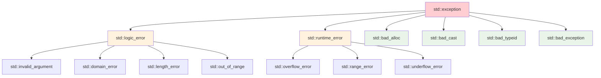
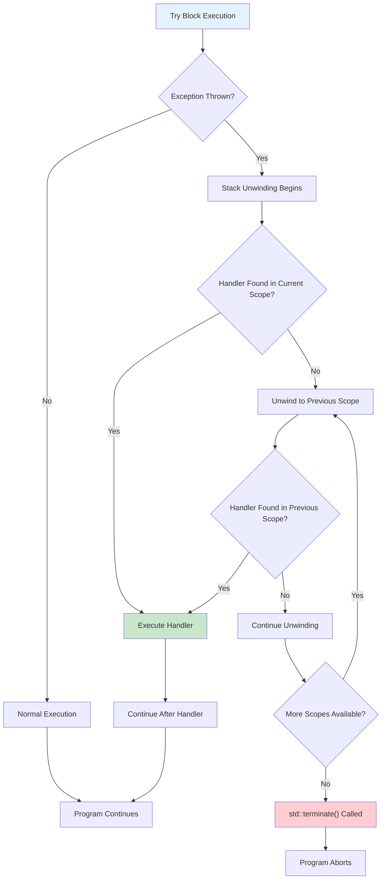

# Chapter 10: Exception Handling (Interview Revision)

## Core Concepts

### Exit Codes

| Exit Code | Meaning | Common Usage |
|-----------|---------|--------------|
| **0** | Success | Normal program termination |
| **1** | General error | Default error case |
| **2** | Misuse of shell commands | Command line errors |
| **126** | Command not executable | Permission/existence issues |
| **127** | Command not found | Invalid command |
| **130** | Ctrl+C termination | User interruption |
| **>128** | Fatal signal | Program killed by signal |

```cpp
#include <cstdlib>

int main() {
    // Successful execution
    // return 0;  // Implicit if no return statement

    // Error conditions
    if (error_condition) {
        return 1;  // General error
    }

    if (file_not_found) {
        return 2;  // File system error
    }

    return EXIT_SUCCESS;  // Portable success (usually 0)
}
```

### Exception Handling Mechanism

#### Try-Catch Blocks
```cpp
#include <iostream>
#include <stdexcept>
#include <fstream>

void divideNumbers(int a, int b) {
    if (b == 0) {
        throw std::runtime_error("Division by zero!");
    }

    std::cout << "Result: " << a / b << std::endl;
}

int main() {
    try {
        divideNumbers(10, 2);   // Works fine
        divideNumbers(10, 0);   // Throws exception
        divideNumbers(5, 2);    // Never reached
    }
    catch (const std::runtime_error& e) {
        std::cout << "Caught exception: " << e.what() << std::endl;
    }
    catch (const std::exception& e) {
        std::cout << "Caught standard exception: " << e.what() << std::endl;
    }
    catch (...) {
        std::cout << "Caught unknown exception" << std::endl;
    }

    return 0;
}
```

### Standard Exception Hierarchy



### Custom Exception Classes
```cpp
#include <string>
#include <exception>

// Base custom exception
class GameException : public std::exception {
private:
    std::string message;
public:
    GameException(const std::string& msg) : message(msg) {}
    const char* what() const noexcept override {
        return message.c_str();
    }
};

// Specific exceptions
class InsufficientResourcesException : public GameException {
public:
    InsufficientResourcesException(const std::string& resource)
        : GameException("Insufficient " + resource) {}
};

class InvalidStateException : public GameException {
public:
    InvalidStateException(const std::string& state)
        : GameException("Invalid state: " + state) {}
};

class NetworkException : public GameException {
private:
    int errorCode;
public:
    NetworkException(const std::string& msg, int code)
        : GameException(msg), errorCode(code) {}

    int getErrorCode() const { return errorCode; }
};
```

## Error Handling Strategies

### Exception Handling vs Error Codes

| Approach | Pros | Cons | Best Use Case |
|----------|------|------|---------------|
| **Exceptions** | Clean code flow, Rich error info, RAII integration | Performance overhead, Can't be ignored | Exceptional circumstances |
| **Error Codes** | No overhead, Explicit handling, Predictable | Can be ignored, No call stack info | Expected failures, Performance-critical |
| **Assertions** | Debug-time checks, No release overhead | Crashes program, Not for user errors | Internal invariants, Debug builds |
| **std::optional** | Explicit error handling, No exceptions | Limited to single value | Functions that may not return value |

### Exception Safety Levels

| Level | Guarantee | Description |
|--------|-----------|-------------|
| **No guarantee** | None | May leak resources, leave invalid state |
| **Basic guarantee** | No leaks | No resource leaks, object may be in valid but unspecified state |
| **Strong guarantee** | Commit/rollback | Operation either completes fully or has no effect |
| **No-throw guarantee** | Never throws | Operations guaranteed not to throw exceptions |

```cpp
// Example: Exception safety levels
class SafeContainer {
private:
    std::unique_ptr<int[]> data;
    size_t size;
    size_t capacity;

public:
    // No-throw guarantee
    size_t getSize() const noexcept { return size; }

    // Strong guarantee
    void push_back(int value) {
        std::unique_ptr<int[]> newData = std::make_unique<int[]>(capacity * 2);
        std::copy(data.get(), data.get() + size, newData.get());

        // If we reach here, no exceptions can occur
        data = std::move(newData);
        capacity *= 2;
        data[size++] = value;
    }

    // Basic guarantee
    void riskyOperation() {
        try {
            // Operation that might throw
            performRiskyTask();
        } catch (...) {
            // Object remains valid, but state may be unspecified
            // Resources are not leaked due to RAII
            throw;
        }
    }
};
```

## Access Violations and Memory Issues

### Common Access Violations

| Error Type | Cause | Symptoms | Prevention |
|------------|-------|----------|-------------|
| **Null pointer dereference** | Using nullptr | Segmentation fault | Check pointers before use |
| **Dangling pointer** | Pointer to freed memory | Undefined behavior | Set pointers to nullptr |
| **Buffer overflow** | Writing past array bounds | Memory corruption | Bounds checking |
| **Stack overflow** | Too deep recursion/stack allocation | Program crash | Limit recursion depth |
| **Use after free** | Using deleted object | Undefined behavior | Smart pointers, RAII |

```cpp
// Common access violation examples
void demonstrateAccessViolations() {
    // 1. Null pointer dereference
    int* ptr = nullptr;
    // *ptr = 42;  // Segmentation fault!

    // 2. Dangling pointer
    int* dangling = new int(42);
    delete dangling;
    // *dangling = 100;  // Undefined behavior!

    // 3. Buffer overflow
    int arr[5];
    // arr[10] = 42;  // Memory corruption!

    // 4. Stack overflow (deep recursion)
    // infiniteRecursion();  // Stack overflow!
}

// Safe alternatives
void safePointerHandling() {
    // 1. Check pointers
    int* ptr = getPointer();
    if (ptr != nullptr) {
        *ptr = 42;
    }

    // 2. Use smart pointers
    std::unique_ptr<int> safe = std::make_unique<int>(42);
    // Automatically cleaned up, no dangling

    // 3. Bounds checking
    std::vector<int> safeVec(5);
    if (safeVec.size() > 10) {
        safeVec[10] = 42;  // Safe check first
    }

    // 4. Safe recursion with depth limit
    safeRecursion(0, 1000);  // Depth-limited recursion
}
```

### Signal Handling

```cpp
#include <csignal>
#include <iostream>
#include <stdexcept>

// Signal handler for segmentation violations
void segfaultHandler(int signal) {
    std::cout << "Segmentation fault caught! Signal: " << signal << std::endl;
    std::cout << "Possible causes:" << std::endl;
    std::cout << "- Null pointer dereference" << std::endl;
    std::cout << "- Dangling pointer access" << std::endl;
    std::cout << "- Buffer overflow" << std::endl;

    // In real applications, you might want to:
    // 1. Log detailed error information
    // 2. Generate crash dump
    // 3. Attempt graceful shutdown

    std::exit(1);  // Exit with error code
}

void setupSignalHandlers() {
    std::signal(SIGSEGV, segfaultHandler);  // Segmentation fault
    std::signal(SIGINT, [](int) {           // Ctrl+C
        std::cout << "Interrupted by user" << std::endl;
        std::exit(130);
    });
}

void demonstrateSignalHandling() {
    setupSignalHandlers();

    // This would trigger the signal handler:
    // int* ptr = nullptr;
    // *ptr = 42;
}
```

## Exception Handling Flow



## RAII and Exception Safety

### RAII (Resource Acquisition Is Initialization)

```cpp
#include <fstream>
#include <memory>
#include <mutex>

// RAII Examples

// 1. File handling
void processFileRAII(const std::string& filename) {
    std::ifstream file(filename);  // Resource acquired
    if (!file.is_open()) {
        throw std::runtime_error("Cannot open file");
    }

    // Process file...
    // File automatically closed when leaving scope
    // Even if exception occurs!
}

// 2. Memory management
void processMemoryRAII() {
    auto resource = std::make_unique<int[]>(1000);  // Resource acquired

    // Process memory...
    throw std::runtime_error("Something went wrong");
    // Memory automatically freed despite exception
}

// 3. Mutex locking
std::mutex globalMutex;

void threadSafeOperation() {
    std::lock_guard<std::mutex> lock(globalMutex);  // Lock acquired

    // Critical section...
    throw std::exception();  // Exception occurs
    // Mutex automatically unlocked despite exception
}

// Custom RAII class
class DatabaseConnection {
private:
    bool connected;
public:
    DatabaseConnection(const std::string& connString) {
        // Connect to database
        connected = true;
        std::cout << "Database connected" << std::endl;
    }

    ~DatabaseConnection() {
        if (connected) {
            // Disconnect from database
            connected = false;
            std::cout << "Database disconnected" << std::endl;
        }
    }

    void executeQuery(const std::string& query) {
        if (!connected) {
            throw std::runtime_error("Not connected to database");
        }
        // Execute query...
    }
};

void useDatabase() {
    DatabaseConnection db("connection_string");
    db.executeQuery("SELECT * FROM users");
    throw std::runtime_error("Database error");
    // Database automatically disconnected
}
```

## Key Interview Points

### Exception Specification (C++11+)
```cpp
// C++11 removed dynamic exception specifications
// Old way (deprecated):
// void oldFunction() throw(std::runtime_error, std::logic_error);

// New way: noexcept specifier
void safeFunction() noexcept {
    // Function guaranteed not to throw
    // If it does throw, std::terminate() is called
}

void conditionalNoexcept(bool safe) noexcept(safe) {
    // noexcept depending on condition
    if (!safe) {
        throw std::runtime_error("Unsafe operation");
    }
}

// noexcept operator (compile-time check)
template<typename T>
void swapValues(T& a, T& b) noexcept(noexcept(std::swap(a, b))) {
    std::swap(a, b);
}
```

### Exception Performance Considerations
- **Zero-cost principle**: Exceptions don't cost when not thrown
- **Throw overhead**: Stack unwinding, exception object creation
- **Try block overhead**: Minimal (compiler-dependent)
- **Table vs Setjmp**: Different implementation strategies

## Interview Questions

### Q1: When should you use exceptions vs error codes?
**Answer:**
**Use Exceptions for:**
- **Exceptional circumstances**: Things that shouldn't normally happen
- **Constructor failures**: Can't return error codes from constructors
- **Deep call stacks**: Propagate errors up through many levels
- **Resource cleanup**: RAII ensures proper cleanup during stack unwinding

```cpp
// Good: Exception for exceptional case
class NetworkConnection {
public:
    void sendData(const std::string& data) {
        if (!isConnected()) {
            throw NetworkException("Connection lost", 1001);
        }
        // Send data...
    }
};

// Good: Constructor failure
class Database {
public:
    Database(const std::string& connString) {
        if (!connect(connString)) {
            throw std::runtime_error("Database connection failed");
        }
    }
};
```

**Use Error Codes for:**
- **Expected failures**: Things that happen in normal operation
- **Performance-critical code**: Exceptions have overhead when thrown
- **API boundaries**: Clear interface between modules
- **Simple functions**: When overhead of exceptions isn't justified

```cpp
// Good: Error code for expected failure
enum class FileResult {
    SUCCESS,
    FILE_NOT_FOUND,
    PERMISSION_DENIED,
    DISK_FULL
};

FileResult readFile(const std::string& filename, std::string& content) {
    std::ifstream file(filename);
    if (!file.is_open()) {
        return FileResult::FILE_NOT_FOUND;  // Expected failure
    }

    content.assign(std::istreambuf_iterator<char>(file),
                   std::istreambuf_iterator<char>());
    return FileResult::SUCCESS;
}
```

### Q2: What is stack unwinding and how does it work?
**Answer:**
**Stack unwinding** is the process of calling destructors for automatic objects when an exception is thrown, going up the call stack until a handler is found.

**Stack Unwinding Process:**
1. **Exception thrown**: Current function stops execution
2. **Destructors called**: Objects on stack are destroyed in reverse order
3. **Stack frames removed**: Function calls are popped off the stack
4. **Handler search**: Continue up call stack looking for catch block
5. **Handler execution**: Found handler executes exception handling code

```cpp
void functionC() {
    std::string str = "Hello";  // Destructor will be called
    std::unique_ptr<int> ptr = std::make_unique<int>(42);  // Will be deleted
    throw std::runtime_error("Error in C");  // Exception thrown
}

void functionB() {
    std::ofstream file("temp.txt");  // Destructor (file close) will be called
    functionC();  // Exception propagates through here
}

void functionA() {
    try {
        functionB();  // Exception caught here
    }
    catch (const std::runtime_error& e) {
        std::cout << "Caught: " << e.what() << std::endl;
    }
}

// Execution order:
// 1. functionC() throws exception
// 2. std::unique_ptr destructor called (memory freed)
// 3. std::string destructor called
// 4. functionC() stack frame removed
// 5. std::ofstream destructor called (file closed)
// 6. functionB() stack frame removed
// 7. Handler found in functionA()
// 8. Catch block executes
```

### Q3: What are the different levels of exception safety?
**Answer:**

**1. No Guarantee:**
- May leak resources, leave object in invalid state
- Worst level, should be avoided

```cpp
// Bad: No exception safety
class BadContainer {
    int* data1;
    int* data2;
public:
    BadContainer(size_t size) {
        data1 = new int[size];      // Might throw std::bad_alloc
        data2 = new int[size];      // If this throws, data1 leaks!
    }
};
```

**2. Basic Guarantee:**
- No resource leaks
- Object remains in valid state (but possibly unspecified)

```cpp
// Better: Basic guarantee
class BasicContainer {
    std::unique_ptr<int[]> data1;
    std::unique_ptr<int[]> data2;
public:
    BasicContainer(size_t size) {
        data1 = std::make_unique<int[]>(size);  // Exception safe
        data2 = std::make_unique<int[]>(size);  // If this throws, data1 cleaned up
    }
};
```

**3. Strong Guarantee:**
- Operation either completes fully or has no effect
- Commit/rollback semantics

```cpp
// Best: Strong guarantee
class StrongContainer {
    std::unique_ptr<int[]> data;
    size_t size;

public:
    void resize(size_t newSize) {
        // Create new resource first
        auto newData = std::make_unique<int[]>(newSize);

        // Copy old data
        std::copy(data.get(), data.get() + std::min(size, newSize), newData.get());

        // If we reach here, no exceptions can occur
        // Commit the changes
        data = std::move(newData);
        size = newSize;
    }
};
```

**4. No-throw Guarantee:**
- Operations guaranteed not to throw exceptions

```cpp
// No-throw operations
class NoThrowContainer {
public:
    size_t size() const noexcept { return data_size; }  // Guaranteed no throw

    void swap(NoThrowContainer& other) noexcept {
        using std::swap;
        swap(data, other.data);
        swap(data_size, other.data_size);
    }
};
```

### Q4: What is RAII and why is it important for exception safety?
**Answer:**
**RAII (Resource Acquisition Is Initialization)** is a programming paradigm where resource acquisition is tied to object lifetime. Resources are acquired in constructors and released in destructors.

**Why RAII is Important:**
1. **Automatic cleanup**: Resources released when objects go out of scope
2. **Exception safety**: Cleanup happens even when exceptions are thrown
3. **No manual resource management**: Prevents resource leaks
4. **Deterministic cleanup**: Predictable resource release

```cpp
// Without RAII - error prone
void processFileWithoutRAII(const std::string& filename) {
    FILE* file = fopen(filename.c_str(), "r");
    if (!file) return;

    char* buffer = new char[1024];

    // If exception occurs here, file and buffer leak!
    processFileData(file, buffer);

    delete[] buffer;  // Might not be reached
    fclose(file);     // Might not be reached
}

// With RAII - exception safe
void processFileWithRAII(const std::string& filename) {
    std::ifstream file(filename);     // RAII: file closed automatically
    std::vector<char> buffer(1024);  // RAII: memory freed automatically

    processFileData(file, buffer.data());
    // All resources cleaned up automatically, even if exception occurs
}

// Custom RAII class
class DatabaseTransaction {
private:
    bool committed = false;

public:
    DatabaseTransaction() {
        beginTransaction();  // Acquire resource
    }

    ~DatabaseTransaction() {
        if (!committed) {
            rollbackTransaction();  // Release resource
        }
    }

    void commit() {
        saveChanges();
        committed = true;  // Prevent rollback in destructor
    }

    // Prevent copying
    DatabaseTransaction(const DatabaseTransaction&) = delete;
    DatabaseTransaction& operator=(const DatabaseTransaction&) = delete;
};

void updateDatabase() {
    DatabaseTransaction transaction;

    // Update database...
    updateUserData();
    updateOrderData();

    if (allUpdatesSuccessful) {
        transaction.commit();  // Commit changes
    }
    // If function exits early (exception), transaction rolls back automatically
}
```

## Practical Code Examples

### Complete Exception-Safe File Processor
```cpp
#include <fstream>
#include <iostream>
#include <string>
#include <vector>
#include <memory>

class FileProcessingException : public std::exception {
private:
    std::string message;
    std::string filename;
    int lineNumber;

public:
    FileProcessingException(const std::string& msg, const std::string& file, int line)
        : message(msg), filename(file), lineNumber(line) {}

    const char* what() const noexcept override {
        static std::string fullMsg = message + " in file " + filename +
                                   " at line " + std::to_string(lineNumber);
        return fullMsg.c_str();
    }

    const std::string& getFilename() const { return filename; }
    int getLineNumber() const { return lineNumber; }
};

class FileProcessor {
private:
    std::ifstream file;
    std::string filename;
    std::vector<std::string> lines;

    void validateFile() {
        if (!file.is_open()) {
            throw FileProcessingException("Cannot open file", filename, 0);
        }
    }

    void readAllLines() {
        std::string line;
        int lineNum = 1;

        while (std::getline(file, line)) {
            if (line.empty()) {
                throw FileProcessingException("Empty line encountered", filename, lineNum);
            }

            lines.push_back(line);
            lineNum++;
        }
    }

    void processData() {
        for (size_t i = 0; i < lines.size(); i++) {
            try {
                processLine(lines[i], i + 1);
            }
            catch (const std::exception& e) {
                throw FileProcessingException(e.what(), filename, static_cast<int>(i + 1));
            }
        }
    }

    void processLine(const std::string& line, int lineNum) {
        // Example processing: validate line format
        if (line.length() > 100) {
            throw std::length_error("Line too long");
        }

        // Process line content...
        std::cout << "Processing line " << lineNum << ": " << line.substr(0, 20) << "..." << std::endl;
    }

public:
    FileProcessor(const std::string& fname) : filename(fname) {
        file.open(filename);
        validateFile();
    }

    void process() {
        try {
            readAllLines();
            processData();
        }
        catch (const FileProcessingException&) {
            throw;  // Re-throw our custom exception
        }
        catch (const std::exception& e) {
            throw FileProcessingException(e.what(), filename, 0);
        }
    }

    size_t getLineCount() const {
        return lines.size();
    }

    const std::string& getLine(size_t index) const {
        if (index >= lines.size()) {
            throw std::out_of_range("Line index out of range");
        }
        return lines[index];
    }
};

void demonstrateFileProcessing() {
    try {
        FileProcessor processor("example.txt");
        processor.process();

        std::cout << "Successfully processed " << processor.getLineCount() << " lines" << std::endl;

        // Access processed data
        for (size_t i = 0; i < processor.getLineCount(); i++) {
            std::cout << "Line " << (i + 1) << ": " << processor.getLine(i) << std::endl;
        }
    }
    catch (const FileProcessingException& e) {
        std::cout << "File processing error: " << e.what() << std::endl;
        std::cout << "File: " << e.getFilename() << std::endl;
    }
    catch (const std::exception& e) {
        std::cout << "General error: " << e.what() << std::endl;
    }
}
```

### Exception-Safe Container Implementation
```cpp
#include <memory>
#include <algorithm>

template<typename T>
class ExceptionSafeVector {
private:
    std::unique_ptr<T[]> data;
    size_t currentSize;
    size_t currentCapacity;

    void reallocate(size_t newCapacity) {
        // Strong guarantee: allocate first, then move
        auto newData = std::make_unique<T[]>(newCapacity);

        // Move elements (may throw, but newData handles cleanup)
        std::move(data.get(), data.get() + currentSize, newData.get());

        // If we reach here, no exceptions can occur
        // Commit the changes
        data = std::move(newData);
        currentCapacity = newCapacity;
    }

public:
    ExceptionSafeVector() : data(nullptr), currentSize(0), currentCapacity(0) {}

    explicit ExceptionSafeVector(size_t initialSize)
        : data(std::make_unique<T[]>(initialSize)),
          currentSize(initialSize),
          currentCapacity(initialSize) {}

    // Strong guarantee for push_back
    void push_back(const T& value) {
        if (currentSize >= currentCapacity) {
            size_t newCapacity = currentCapacity == 0 ? 1 : currentCapacity * 2;
            reallocate(newCapacity);  // Strong guarantee
        }

        // If we reach here, we have space and no exceptions will occur
        data[currentSize] = value;
        currentSize++;
    }

    void push_back(T&& value) {
        if (currentSize >= currentCapacity) {
            size_t newCapacity = currentCapacity == 0 ? 1 : currentCapacity * 2;
            reallocate(newCapacity);
        }

        data[currentSize] = std::move(value);
        currentSize++;
    }

    // No-throw guarantee for operations that can't fail
    size_t size() const noexcept {
        return currentSize;
    }

    size_t capacity() const noexcept {
        return currentCapacity;
    }

    bool empty() const noexcept {
        return currentSize == 0;
    }

    // Basic guarantee for element access (throws if out of range)
    T& at(size_t index) {
        if (index >= currentSize) {
            throw std::out_of_range("Index out of range");
        }
        return data[index];
    }

    const T& at(size_t index) const {
        if (index >= currentSize) {
            throw std::out_of_range("Index out of range");
        }
        return data[index];
    }

    // No-throw operations (no bounds checking)
    T& operator[](size_t index) noexcept {
        return data[index];
    }

    const T& operator[](size_t index) const noexcept {
        return data[index];
    }

    // Strong guarantee for clear
    void clear() noexcept {
        currentSize = 0;  // Can't throw
    }

    // No-throw swap
    void swap(ExceptionSafeVector& other) noexcept {
        using std::swap;
        swap(data, other.data);
        swap(currentSize, other.currentSize);
        swap(currentCapacity, other.currentCapacity);
    }
};
```

## Common Mistakes & Solutions

### Mistake 1: Catching by Value
```cpp
// ❌ Problem: Catching by value (slicing)
void badExceptionHandling() {
    try {
        throw NetworkException("Connection failed", 1001);
    }
    catch (std::exception e) {  // ❌ Caught by value, sliced!
        std::cout << e.what() << std::endl;
        // Lost NetworkException-specific information
        // std::cout << e.getErrorCode();  // Error: not available
    }
}

// ✅ Solution: Catch by reference
void goodExceptionHandling() {
    try {
        throw NetworkException("Connection failed", 1001);
    }
    catch (const std::exception& e) {  // ✅ Caught by reference
        std::cout << e.what() << std::endl;

        // Can still access derived class information
        if (auto netEx = dynamic_cast<const NetworkException*>(&e)) {
            std::cout << "Error code: " << netEx->getErrorCode() << std::endl;
        }
    }
}
```

### Mistake 2: Swallowing Exceptions
```cpp
// ❌ Problem: Swallowing exceptions without handling
void badErrorHandling() {
    try {
        riskyOperation();
    }
    catch (...) {
        // Empty catch block - error is lost!
        // Program continues in potentially invalid state
    }
}

// ✅ Solution: Properly handle or rethrow
void goodErrorHandling() {
    try {
        riskyOperation();
    }
    catch (const std::runtime_error& e) {
        // Handle specific error
        logError(e.what());
        recoverFromError();
    }
    catch (const std::exception& e) {
        // Handle other standard exceptions
        logError(e.what());
        throw;  // Re-throw if we can't handle it
    }
    catch (...) {
        // Handle unknown exceptions
        logError("Unknown exception occurred");
        throw;
    }
}
```

### Mistake 3: Throwing in Destructors
```cpp
// ❌ Problem: Throwing in destructor
class BadClass {
public:
    ~BadClass() {
        if (error_condition) {
            throw std::runtime_error("Error in destructor");  // Very bad!
        }
    }
};

void problematicFunction() {
    BadClass obj1;
    BadClass obj2;

    throw std::runtime_error("Error in function");

    // What happens:
    // 1. Exception thrown from function
    // 2. Stack unwinding starts
    // 3. obj2 destructor throws ANOTHER exception
    // 4. std::terminate() called - program crashes!
}

// ✅ Solution: Don't throw in destructors
class GoodClass {
public:
    ~GoodClass() noexcept {  // Mark as noexcept
        try {
            cleanupOperation();
        }
        catch (...) {
            // Log error but don't throw
            std::cerr << "Error during cleanup" << std::endl;
            // Or call std::terminate if unrecoverable
            // std::terminate();
        }
    }
};
```

### Mistake 4: Exceptions and Constructors
```cpp
// ❌ Problem: Constructor failure without proper cleanup
class BadResource {
private:
    int* resource1;
    int* resource2;

public:
    BadResource(size_t size) {
        resource1 = new int[size];      // May throw std::bad_alloc
        resource2 = new int[size * 2];  // If this throws, resource1 leaks!
    }
};

// ✅ Solution: RAII in constructors
class GoodResource {
private:
    std::unique_ptr<int[]> resource1;
    std::unique_ptr<int[]> resource2;

public:
    GoodResource(size_t size)
        : resource1(std::make_unique<int[]>(size)),
          resource2(std::make_unique<int[]>(size * 2)) {
        // If resource2 allocation fails, resource1 is automatically cleaned up
    }
};

// Alternative: Use member initializer list with proper ordering
class AlternativeGoodResource {
private:
    int* resource1;
    int* resource2;

public:
    AlternativeGoodResource(size_t size)
        : resource1(nullptr), resource2(nullptr) {  // Initialize to safe values

        resource1 = new int[size];
        try {
            resource2 = new int[size * 2];
        }
        catch (...) {
            delete[] resource1;  // Clean up resource1
            resource1 = nullptr;
            throw;  // Re-throw exception
        }
    }

    ~AlternativeGoodResource() {
        delete[] resource1;
        delete[] resource2;
    }
};
```

## Performance Considerations

### Exception Overhead Analysis
```cpp
#include <chrono>
#include <iostream>

void benchmarkErrorHandling() {
    const int iterations = 1000000;

    // Benchmark error codes (fast path)
    auto start = std::chrono::high_resolution_clock::now();

    for (int i = 0; i < iterations; i++) {
        if (i % 100 == 0) {  // 1% error rate
            // Handle error code
            int error = processWithErrorCodes(i);
            if (error != 0) {
                // Handle error
            }
        } else {
            processWithErrorCodes(i);
        }
    }

    auto end = std::chrono::high_resolution_clock::now();
    auto duration = std::chrono::duration_cast<std::chrono::microseconds>(end - start);
    std::cout << "Error codes: " << duration.count() << " microseconds" << std::endl;

    // Benchmark exceptions (fast path)
    start = std::chrono::high_resolution_clock::now();

    for (int i = 0; i < iterations; i++) {
        try {
            processWithExceptions(i);
        }
        catch (const std::exception&) {
            // Handle exception
        }
    }

    end = std::chrono::high_resolution_clock::now();
    duration = std::chrono::duration_cast<std::chrono::microseconds>(end - start);
    std::cout << "Exceptions: " << duration.count() << " microseconds" << std::endl;
}

// Note: When exceptions are NOT thrown, overhead is minimal
// When exceptions ARE thrown, overhead is significant (stack unwinding)
```

## Quick Reference

### Standard Exception Hierarchy
```cpp
std::exception
├── std::logic_error
│   ├── std::invalid_argument
│   ├── std::domain_error
│   ├── std::length_error
│   └── std::out_of_range
├── std::runtime_error
│   ├── std::overflow_error
│   ├── std::range_error
│   └── std::underflow_error
├── std::bad_alloc
├── std::bad_cast
├── std::bad_typeid
└── std::bad_exception
```

### Exception Safety Patterns
```cpp
// Basic guarantee
void basicGuarantee() {
    Resource r1;  // RAII cleanup
    Resource r2;  // RAII cleanup
    riskyOperation();  // May throw, but resources cleaned up
}

// Strong guarantee
void strongGuarantee() {
    auto backup = createBackup();  // Create backup first
    try {
        riskyOperation();
        commit();  // Commit changes
    }
    catch (...) {
        restore(backup);  // Rollback on exception
        throw;  // Re-throw
    }
}

// No-throw guarantee
void noThrowGuarantee() noexcept {
    // Operations that cannot throw
    return;  // Simple return
}
```

### Exception Handling Best Practices
```cpp
// 1. Catch by reference
catch (const std::exception& e) { }

// 2. Order catches from most specific to most general
catch (const NetworkException& e) { }
catch (const std::runtime_error& e) { }
catch (const std::exception& e) { }
catch (...) { }

// 3. Use noexcept when appropriate
void safeFunction() noexcept { }

// 4. Don't throw from destructors
~SafeClass() noexcept {
    // Don't throw here
}
```

## Final Interview Tips

1. **RAII is fundamental**: Understand how it enables exception safety
2. **Exception safety levels**: Know basic, strong, and no-throw guarantees
3. **Stack unwinding**: Understand destructor calls during exception propagation
4. **Resource management**: Use smart pointers and RAII for automatic cleanup
5. **Exception vs error codes**: Know when to use each approach
6. **noexcept**: Understand when and why to use it
7. **Custom exceptions**: Create meaningful exception hierarchies

---

**Remember**: Exception safety is about writing robust code that handles errors gracefully without resource leaks!