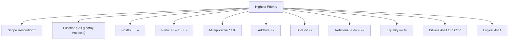
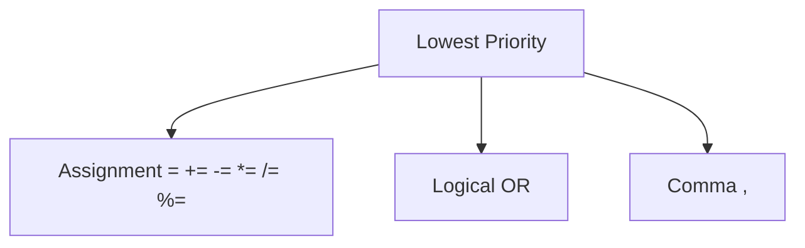

# Chapter 3: Basic Operations (Interview Revision)

## Core Concepts

### Arithmetic Operators
| Operator | Name | Example | Result |
|----------|------|---------|--------|
| `+` | Addition | `5 + 3` | 8 |
| `-` | Subtraction | `5 - 3` | 2 |
| `*` | Multiplication | `5 * 3` | 15 |
| `/` | Division | `5 / 2` | 2 (integer) |
| `%` | Modulo | `5 % 2` | 1 |

### Logical Operators
| Operator | Name | Example | Result |
|----------|------|---------|--------|
| `&&` | Logical AND | `true && false` | false |
| <code>&#124;&#124;</code> | Logical OR | <code>true &#124;&#124; false</code> | true |
| `!` | Logical NOT | `!true` | false |

### Bitwise Operators
| Operator | Name | Example | Binary | Result |
|----------|------|---------|--------|--------|
| `&` | Bitwise AND | `5 & 3` | `0101 & 0011` | `0001` (1) |
| <code>&#124;</code> | Bitwise OR | <code>5 &#124; 3</code> | <code>0101 &#124; 0011</code> | `0111` (7) |
| `^` | Bitwise XOR | `5 ^ 3` | `0101 ^ 0011` | `0110` (6) |
| `~` | Bitwise NOT | `~5` | `~0101` | `1010` (-6) |
| `<<` | Left Shift | `5 << 1` | `0101 << 1` | `1010` (10) |
| `>>` | Right Shift | `5 >> 1` | `0101 >> 1` | `0010` (2) |

## Operator Precedence (Highest to Lowest)

### High Priority Operators



### Low Priority Operators



## Key Interview Points

### Must-Know Concepts
- **Integer division**: Truncates toward zero (not floor)
- **Modulo with negatives**: Result sign matches dividend
- **Short-circuit evaluation**: `&&` and `||` stop early
- **Bit manipulation**: Essential for optimization
- **Operator precedence**: Know common pitfalls

### Critical Memory Points
```cpp
// Integer division
int result = 5 / 2;      // result = 2 (not 2.5)
double result = 5.0 / 2; // result = 2.5

// Modulo with negatives
int r1 = 5 % 3;   // r1 = 2
int r2 = -5 % 3;  // r2 = -2 (matches dividend)
int r3 = 5 % -3;  // r3 = 2 (matches dividend)
```

### Short-Circuit Evaluation
```cpp
int x = 0;
bool result = (x != 0) && (10 / x > 2);  // No division by zero!
// First condition is false, so second is never evaluated

result = (x == 0) || (10 / x > 2);       // No division by zero!
// First condition is true, so second is never evaluated
```

## Interview Questions

### Q1: What's the difference between `&` and `&&`?
**Answer:**
- `&` is **bitwise AND**: Operates on individual bits
- `&&` is **logical AND**: Operates on boolean values
- `&&` has short-circuit evaluation, `&` doesn't
- `&&` converts to bool, `&` works on integral types

```cpp
int a = 5, b = 3;
int bitwise = a & b;      // 1 (binary: 0101 & 0011 = 0001)
bool logical = (a && b);  // true (both non-zero)
```

### Q2: What is the result of `++i` vs `i++`?
**Answer:**
- **Prefix `++i`**: Increment first, then use value
- **Postfix `i++`**: Use value first, then increment

```cpp
int i = 5;
int j = ++i;  // i = 6, j = 6 (increment first)

int k = 5;
int l = k++;  // k = 6, l = 5 (use original value)
```

### Q3: Explain bit manipulation for checking if a number is even/odd
**Answer:**
```cpp
// Using bitwise AND
bool isEven = (num & 1) == 0;  // If last bit is 0, number is even
bool isOdd = (num & 1) == 1;   // If last bit is 1, number is odd

// This is faster than num % 2
```

### Q4: How do you swap two numbers without a temporary variable?
**Answer:**
```cpp
// Method 1: Using XOR (only works for integers)
a = a ^ b;
b = a ^ b;
a = a ^ b;

// Method 2: Using arithmetic (can overflow)
a = a + b;
b = a - b;
a = a - b;

// Method 3: Modern C++ (recommended)
std::swap(a, b);
```

## Practical Code Examples

### Bit Manipulation Patterns
```cpp
// Set nth bit
num |= (1 << n);

// Clear nth bit
num &= ~(1 << n);

// Toggle nth bit
num ^= (1 << n);

// Check nth bit
bool isSet = (num & (1 << n)) != 0;

// Get lowest set bit
int lowest = num & -num;

// Remove lowest set bit
num &= num - 1;

// Count set bits (Brian Kernighan's algorithm)
int countSetBits(int num) {
    int count = 0;
    while (num) {
        num &= num - 1;
        count++;
    }
    return count;
}
```

### Common Operator Mistakes
```cpp
// ❌ Mistake: Using = instead of ==
if (x = 5) { ... }  // Always true (assignment + check)

// ✅ Correct: Comparison
if (x == 5) { ... }

// ❌ Mistake: Operator precedence confusion
int result = a + b * c;  // b*c first, then + a

// ✅ Clear: Use parentheses
int result = a + (b * c);

// ❌ Mistake: Integer division
double avg = a + b / 2;  // Wrong!

// ✅ Correct: Cast or use floating point
double avg = (a + b) / 2.0;
```

### Bitwise Visual Examples
```cpp
// Visual representation
int a = 12;  // Binary: 1100
int b = 10;  // Binary: 1010

// AND: 1100 & 1010 = 1000 (8)
int and_result = a & b;   // 8

// OR:  1100 | 1010 = 1110 (14)
int or_result = a | b;    // 14

// XOR: 1100 ^ 1010 = 0110 (6)
int xor_result = a ^ b;   // 6
```

## Common Mistakes & Solutions

### Mistake 1: Integer overflow in arithmetic
```cpp
// ❌ Problem: Overflow
int max_int = INT_MAX;
int result = max_int + 1;  // Overflow!

// ✅ Solution: Check before operation
if (max_int < INT_MAX - 1) {
    result = max_int + 1;
}
```

### Mistake 2: Wrong operator precedence
```cpp
// ❌ Problem: Wrong precedence
bool check = x & 1 == 0;  // == has higher precedence!

// ✅ Solution: Use parentheses
bool check = (x & 1) == 0;
```

### Mistake 3: Mixing signed and unsigned
```cpp
// ❌ Problem: Unexpected behavior
unsigned int u = 10;
int s = -5;
if (s < u) {  // s converted to unsigned, becomes large positive number
    // Never executes!
}

// ✅ Solution: Use consistent types
if (s < static_cast<int>(u)) {
    // Works as expected
}
```

## Performance Tips

### Bit Operations vs Arithmetic
```cpp
// Faster alternatives
bool isEven = (num & 1) == 0;    // vs num % 2 == 0
bool isPowerOf2 = (num & (num - 1)) == 0;  // vs logarithm check
int multiplyBy2 = num << 1;       // vs num * 2
int divideBy2 = num >> 1;         // vs num / 2 (for positive numbers)
```

### Short-Circuit Benefits
```cpp
// Order conditions by likelihood
bool isValid = (ptr != nullptr) && (ptr->data > 0);
// Check nullptr first, more likely to fail and skip second check

bool isInRange = (value >= 0) && (value < size) && (array[value] == target);
// Most restrictive checks first
```

## Quick Reference

### Bitwise Cheat Sheet
```cpp
// Common bit patterns
MASK_1ST_BIT   = 1 << 0;   // 0001
MASK_2ND_BIT   = 1 << 1;   // 0010
MASK_3RD_BIT   = 1 << 2;   // 0100
MASK_4TH_BIT   = 1 << 3;   // 1000

// Clear all bits except last 3
num = num & 0x7;  // 0111 in binary

// Set all bits to 1
num = ~0;  // All bits set to 1
```

### Common Formulas
```cpp
// Absolute value (without branching)
int abs(int x) {
    int mask = x >> 31;
    return (x + mask) ^ mask;
}

// Minimum of two numbers
int min(int a, int b) {
    return b + ((a - b) & ((a - b) >> 31));
}

// Maximum of two numbers
int max(int a, int b) {
    return a - ((a - b) & ((a - b) >> 31));
}
```

## Final Interview Tips

1. **Know operator precedence** - common source of bugs
2. **Understand short-circuit evaluation** - optimization opportunity
3. **Master bit manipulation** - frequently asked in interviews
4. **Remember integer division rules** - truncates toward zero
5. **Practice bit manipulation patterns** - set/clear/toggle bits
6. **Know the difference between `&` and `&&`** - classic interview question

---

**Remember**: Bit operations are fast and powerful - interviewers love to test bitwise knowledge!