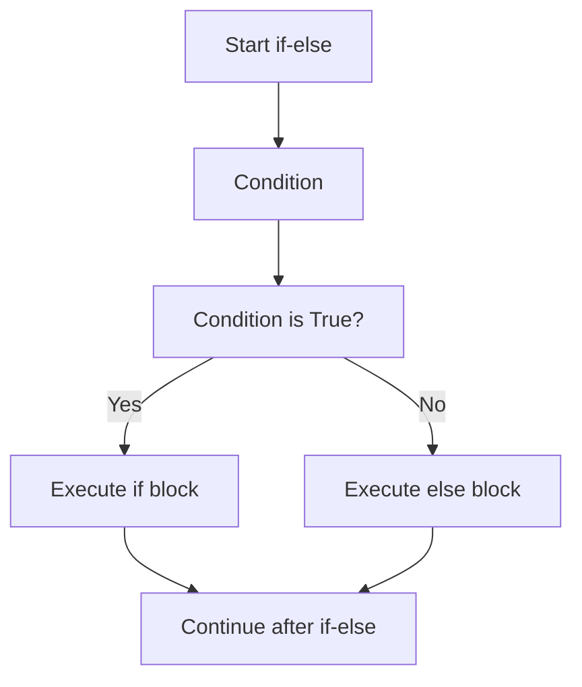
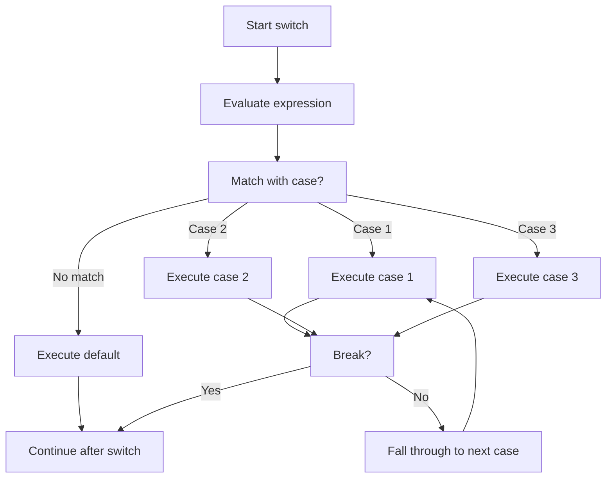
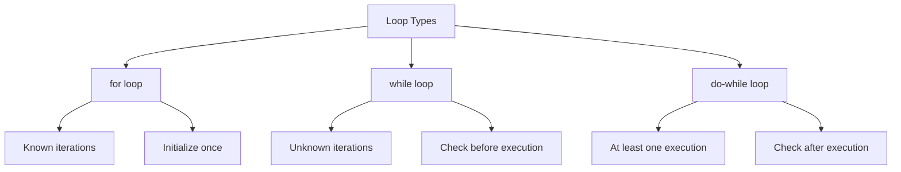

# Chapter 4: Control Flow & Statements (Interview Revision)

## Core Concepts

### Conditional Statements

#### if-else Statement
```cpp
if (condition) {
    // Execute if condition is true
} else if (another_condition) {
    // Execute if another_condition is true
} else {
    // Execute if all conditions are false
}
```

#### switch Statement
```cpp
switch (expression) {
    case constant1:
        // Execute if expression == constant1
        break;
    case constant2:
        // Execute if expression == constant2
        break;
    default:
        // Execute if no cases match
}
```

#### goto Statement (Use Sparingly)
```cpp
goto label;
// ... some code
label:
    // Code continues here
```

### Loop Statements

#### for Loop
```cpp
for (initialization; condition; increment) {
    // Loop body
}

// Range-based for loop (C++11)
for (auto& element : container) {
    // Process element
}
```

#### while Loop
```cpp
while (condition) {
    // Loop body (executes while condition is true)
}
```

#### do-while Loop
```cpp
do {
    // Loop body (executes at least once)
} while (condition);
```

## Control Flow Visualizations

### Conditional Statements Flow



### switch Statement Flow



### Loop Comparison



## Key Interview Points

### Must-Know Concepts
- **Short-circuit evaluation**: `&&` and `||` stop early
- **Switch case requirements**: Must be constant expressions
- **Fall-through behavior**: Without `break`, execution continues
- **Loop termination**: Must have condition to avoid infinite loops
- **Range-based for**: Modern C++ preferred for containers

### Performance Considerations
- **switch vs if-else**: switch can be optimized with jump tables
- **Loop unrolling**: Compiler optimization technique
- **Branch prediction**: CPU performance impact

## Interview Questions

### Q1: What's the difference between while and do-while loops?
**Answer:**
- **while loop**: Checks condition before execution (0+ iterations)
- **do-while loop**: Checks condition after execution (1+ iterations)
- **Use case**: do-when when you need at least one execution

```cpp
// while loop - may never execute
while (false) {
    // Never reached
}

// do-while loop - executes once
do {
    // Executes once
} while (false);
```

### Q2: Explain switch statement fall-through and how to prevent it
**Answer:**
**Fall-through**: Without `break`, execution continues to next case

```cpp
// ❌ Problem: Fall-through
switch (value) {
    case 1:
        cout << "One";
    case 2:
        cout << "Two";  // Executes for both case 1 and 2
        break;
}

// ✅ Solution: Add break
switch (value) {
    case 1:
        cout << "One";
        break;
    case 2:
        cout << "Two";
        break;
}
```

### Q3: When should you use goto statement?
**Answer:**
**Generally avoid goto**, but acceptable in specific cases:
- **Error handling**: Jumping to cleanup code
- **Breaking out of nested loops**: When `break` is insufficient
- **State machines**: Simple state transitions

```cpp
// Acceptable use: Error cleanup
int function() {
    char* buffer = new char[100];
    FILE* file = fopen("data.txt", "r");

    if (!file) {
        goto cleanup;  // Jump to cleanup
    }

    // ... process file

cleanup:
    delete[] buffer;
    if (file) fclose(file);
    return -1;
}
```

### Q4: What's the difference between break and continue?
**Answer:**
- **break**: Exit the entire loop/switch immediately
- **continue**: Skip current iteration, continue with next iteration

```cpp
for (int i = 0; i < 10; i++) {
    if (i == 3) continue;  // Skip iteration 3
    if (i == 7) break;     // Exit loop at i = 7
    cout << i << " ";      // Prints: 0 1 2 4 5 6
}
```

## Practical Code Examples

### Nested Control Structures
```cpp
// Finding prime numbers
for (int num = 2; num <= 100; num++) {
    bool is_prime = true;

    for (int i = 2; i * i <= num; i++) {
        if (num % i == 0) {
            is_prime = false;
            break;  // Exit inner loop
        }
    }

    if (is_prime) {
        cout << num << " is prime" << endl;
    }
}
```

### Modern C++ Range-based For
```cpp
#include <vector>
#include <string>

void process_data() {
    std::vector<std::string> names = {"Alice", "Bob", "Charlie"};

    // Modern C++ - preferred
    for (const auto& name : names) {
        cout << "Hello, " << name << endl;
    }

    // Traditional way - avoid for containers
    for (size_t i = 0; i < names.size(); i++) {
        cout << "Hello, " << names[i] << endl;
    }
}
```

### Switch Statement Patterns
```cpp
// Multiple cases with same action
switch (grade) {
    case 'A':
    case 'B':
    case 'C':
        cout << "Pass" << endl;
        break;
    case 'D':
    case 'F':
        cout << "Fail" << endl;
        break;
    default:
        cout << "Invalid grade" << endl;
}

// Enum switch (type-safe)
enum class Color { RED, GREEN, BLUE };

Color getColor() {
    // ... return color
}

void processColor(Color color) {
    switch (color) {
        case Color::RED:
            cout << "Red color" << endl;
            break;
        case Color::GREEN:
            cout << "Green color" << endl;
            break;
        case Color::BLUE:
            cout << "Blue color" << endl;
            break;
    }
}
```

## Common Mistakes & Solutions

### Mistake 1: Forgetting break in switch
```cpp
// ❌ Problem: Fall-through bug
switch (option) {
    case 1:
        process_option1();
    case 2:
        process_option2();  // Also executes for case 1
        break;
}

// ✅ Solution: Add break
switch (option) {
    case 1:
        process_option1();
        break;
    case 2:
        process_option2();
        break;
}
```

### Mistake 2: Infinite loops
```cpp
// ❌ Problem: No condition change
while (true) {
    // Process data
    // Never exits!
}

// ✅ Solution: Proper exit condition
while (has_more_data) {
    process_data();
    has_more_data = check_for_more();
}
```

### Mistake 3: Off-by-one errors in loops
```cpp
// ❌ Problem: Wrong condition
for (int i = 0; i <= size; i++) {  // One too many iterations
    array[i] = value;  // Array overflow!
}

// ✅ Solution: Correct condition
for (int i = 0; i < size; i++) {  // Correct iterations
    array[i] = value;
}
```

### Mistake 4: Using = instead of ==
```cpp
// ❌ Problem: Assignment instead of comparison
if (x = 5) {  // Always true (assigns 5 to x)
    // Always executes
}

// ✅ Solution: Proper comparison
if (x == 5) {  // Compare x with 5
    // Executes only when x equals 5
}

// ✅ Better: Put constant first (prevents typo)
if (5 == x) {  // Compiler error if you use =
    // Safe comparison
}
```

## Performance Tips

### Switch Optimization
```cpp
// Compiler can optimize with jump table
switch (value) {  // Good: Small integer range
    case 0: case 1: case 2: case 3:
    case 4: case 5: case 6: case 7:
        // Fast jump table lookup
        break;
}

// Chain of if-else - slower
if (value == 0) { ... }
else if (value == 1) { ... }
// ... sequential comparisons
```

### Loop Optimization
```cpp
// ❌ Inefficient: Repeated calculation
for (int i = 0; i < vector.size(); i++) {
    // vector.size() called every iteration
}

// ✅ Efficient: Cache calculation
int size = vector.size();
for (int i = 0; i < size; i++) {
    // Size calculated once
}

// ✅ Better: Range-based for
for (const auto& item : vector) {
    // Most readable and efficient
}
```

## Advanced Patterns

### State Machine with Switch
```cpp
enum class State { IDLE, PROCESSING, DONE, ERROR };

State process_data(State current_state, int input) {
    switch (current_state) {
        case State::IDLE:
            return (input > 0) ? State::PROCESSING : State::ERROR;

        case State::PROCESSING:
            return (input == 0) ? State::DONE : State::PROCESSING;

        case State::DONE:
        case State::ERROR:
            return State::IDLE;
    }
    return State::ERROR;
}
```

### Nested Loop Exit Strategy
```cpp
// Breaking out of nested loops
bool found = false;
for (int i = 0; i < rows && !found; i++) {
    for (int j = 0; j < cols; j++) {
        if (matrix[i][j] == target) {
            found = true;
            break;  // Exit inner loop
        }
    }
}

// Alternative: goto (acceptable for deep nesting)
for (int i = 0; i < rows; i++) {
    for (int j = 0; j < cols; j++) {
        if (matrix[i][j] == target) {
            goto found;
        }
    }
}
found:
// Continue processing
```

## Quick Reference

### Control Flow Cheatsheet
```cpp
// Decision making
if (condition) { ... } else if (condition) { ... } else { ... }
switch (expression) { case value: ... break; default: ... }

// Loops
for (init; condition; increment) { ... }
for (auto& item : container) { ... }  // C++11
while (condition) { ... }
do { ... } while (condition);

// Jump statements
break;      // Exit loop/switch
continue;   // Next iteration
return;     // Exit function
goto label; // Jump to label
```

### Best Practices
1. **Prefer range-based for** for containers
2. **Always use break** in switch cases
3. **Use const&** in range-based for to avoid copies
4. **Avoid goto** except for error cleanup
5. **Put constants first** in comparisons to prevent typos
6. **Use braces** even for single statements

## Final Interview Tips

1. **Know the difference** between while and do-while loops
2. **Understand switch fall-through** and how to prevent it
3. **Master break vs continue** - classic interview question
4. **Know when goto is acceptable** (error handling, nested loops)
5. **Prefer modern C++** range-based for loops
6. **Understand performance implications** of different control structures

---

**Remember**: Control flow is fundamental - interviewers test your understanding of execution flow and common pitfalls!