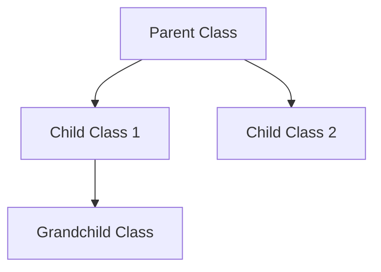
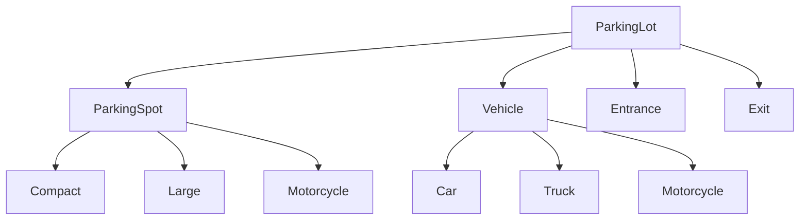

# OOPS (C++) and Low Level Design

## OOPS Fundamentals

### Core Concepts

#### 1. Classes and Objects
- **Class**: Blueprint/template for creating objects
- **Object**: Instance of a class with actual data
- **Key Points**:
  - Objects occupy memory
  - Multiple objects can be created from same class
  - Each object has its own state (data)

```cpp
class Car {
    string color;
    int speed;
public:
    void accelerate() { speed += 10; }
};

Car myCar;  // Object creation
```

#### 2. Encapsulation
- **Definition**: Binding data and methods together
- **Access Specifiers**:
  - `public`: Accessible everywhere
  - `private`: Accessible only within class
  - `protected`: Accessible in class and derived classes

#### 3. Inheritance
- **Definition**: One class acquiring properties of another
- **Types**:
  - **Single**: One parent, one child
  - **Multiple**: Multiple parents, one child
  - **Multilevel**: Grandparent → Parent → Child
  - **Hierarchical**: One parent, multiple children



#### 4. Polymorphism
- **Compile Time**: Function overloading, operator overloading
- **Runtime**: Virtual functions, function overriding

#### 5. Abstraction
- **Definition**: Hiding implementation details
- **Achieved through**: Abstract classes, interfaces

## C++ Specific Concepts

### 1. Constructor and Destructor

| Feature | Constructor | Destructor |
|---------|-------------|------------|
| Purpose | Initialize object | Clean up resources |
| Name | Same as class | Same as class with ~ |
| Return Type | No return type | No return type |
| Parameters | Can have parameters | No parameters |
| Calling | Automatic on creation | Automatic on destruction |

```cpp
class MyClass {
public:
    MyClass() { cout << "Constructor called"; }
    ~MyClass() { cout << "Destructor called"; }
};
```

### 2. Virtual Functions

```cpp
class Animal {
public:
    virtual void makeSound() { cout << "Animal sound"; }
    virtual ~Animal() {} // Virtual destructor
};

class Dog : public Animal {
public:
    void makeSound() override { cout << "Bark"; }
};
```

### 3. Smart Pointers (C++11+)

| Type | Ownership | Use Case |
|------|-----------|----------|
| `unique_ptr` | Exclusive | Single ownership |
| `shared_ptr` | Shared | Multiple owners |
| `weak_ptr` | Non-owning | Observer, avoid cycles |

```cpp
#include <memory>
unique_ptr<int> ptr1 = make_unique<int>(10);
shared_ptr<int> ptr2 = make_shared<int>(20);
```

## Low Level Design (LLD)

### Design Principles

#### SOLID Principles

1. **S** - Single Responsibility: One reason to change
2. **O** - Open/Closed: Open for extension, closed for modification
3. **L** - Liskov Substitution: Subtypes must be substitutable
4. **I** - Interface Segregation: Small, focused interfaces
5. **D** - Dependency Inversion: Depend on abstractions

### Design Patterns

#### 1. Creational Patterns

**Singleton Pattern**
```cpp
class Logger {
private:
    static Logger* instance;
    Logger() {} // Private constructor
public:
    static Logger* getInstance() {
        if (!instance) {
            instance = new Logger();
        }
        return instance;
    }
};
```

**Factory Pattern**
```cpp
class Vehicle {
public:
    virtual void create() = 0;
};

class Car : public Vehicle {
public:
    void create() override { cout << "Car created"; }
};

class VehicleFactory {
public:
    static Vehicle* createVehicle(string type) {
        if (type == "car") return new Car();
        // Add more vehicle types
        return nullptr;
    }
};
```

#### 2. Structural Patterns

**Adapter Pattern**
```cpp
class MediaPlayer {
public:
    virtual void play(string audioType) = 0;
};

class Mp3Player : public MediaPlayer {
public:
    void play(string audioType) override {
        if (audioType == "mp3") cout << "Playing MP3";
    }
};
```

#### 3. Behavioral Patterns

**Observer Pattern**
```mermaid
graph TD
    A[Subject] --> B[Observer 1]
    A --> C[Observer 2]
    A --> D[Observer 3]
    A --> E[notify()]
    B --> F[update()]
    C --> F
    D --> F
```

## Interview Questions

### Basic OOPS Questions

**Q1: What is the difference between class and object?**
- **Answer**: Class is blueprint, object is instance
- **Follow-up**: Can objects exist without classes? (No in C++)

**Q2: Why do we need virtual functions?**
- **Answer**: To achieve runtime polymorphism
- **Follow-up**: How does vtable work internally?

**Q3: What is abstract class vs interface?**
- **Answer**: Abstract class can have implementation, interface cannot
- **Follow-up**: When to use which?

### C++ Specific Questions

**Q4: What is RAII?**
- **Answer**: Resource Acquisition Is Initialization
- **Key Point**: Resources tied to object lifetime
- **Example**: Smart pointers, file handles

**Q5: Difference between `struct` and `class`?**
- **Answer**: Default access (public in struct, private in class)
- **Follow-up**: When would you prefer struct over class?

**Q6: What is move semantics?**
- **Answer**: Transferring ownership instead of copying
- **Key Points**:
  - `std::move` converts to rvalue reference
  - Improves performance for expensive objects

```cpp
vector<string> createVector() {
    vector<string> vec = {"a", "b", "c"};
    return vec; // Move semantics automatically
}
```

### LLD Questions

**Q7: Design a parking lot system**


**Key Components:**
- `ParkingSpot`: spotId, isOccupied, vehicleType
- `Vehicle`: licensePlate, type
- `ParkingLot`: spots, capacity, entry/exit points

**Follow-up Questions:**
- How to handle different vehicle sizes?
- How to implement payment system?
- How to find nearest available spot?

**Q8: Design an elevator system**
```cpp
class Elevator {
    int currentFloor;
    Direction direction;
    vector<int> requests;

public:
    void addRequest(int floor);
    void move();
    vector<int> getRequests();
};
```

**Key Features:**
- Multiple elevators coordination
- Request prioritization
- Direction optimization
- Emergency handling

**Q9: Design a URL shortener**
**Components:**
- Original URL → Short URL mapping
- Hash function or counter-based approach
- Database for persistence
- Analytics for click tracking

```cpp
class URLShortener {
    unordered_map<string, string> shortToLong;
    unordered_map<string, string> longToShort;
    string generateShortURL(string longURL);
    string getLongURL(string shortURL);
};
```

### Advanced Questions

**Q10: What is the Rule of Three/Five?**
- **Rule of Three**: If you need destructor, copy constructor, or copy assignment, you need all three
- **Rule of Five**: Add move constructor and move assignment (C++11+)

```cpp
class MyClass {
    int* data;
public:
    ~MyClass() { delete[] data; } // Need Rule of Five
    MyClass(const MyClass& other); // Copy constructor
    MyClass& operator=(const MyClass& other); // Copy assignment
    MyClass(MyClass&& other) noexcept; // Move constructor
    MyClass& operator=(MyClass&& other) noexcept; // Move assignment
};
```

**Q11: What is perfect forwarding?**
- **Answer**: Preserves value category during template argument deduction
- **Uses**: `std::forward` and universal references

```cpp
template<typename T>
void wrapper(T&& arg) {
    func(std::forward<T>(arg)); // Perfect forwarding
}
```

### Common Mistakes to Avoid

1. **Memory Leaks**: Always pair new/delete, use smart pointers
2. **Dangling Pointers**: Set pointers to nullptr after deletion
3. **Slicing**: Use references/pointers for polymorphism
4. **Virtual Destructor**: Always make base class destructor virtual
5. **Exception Safety**: Use RAII for resource management

### Quick Reference

| Concept | Key Points | Interview Focus |
|---------|------------|-----------------|
| Encapsulation | Data hiding, access control | Real-world examples |
| Inheritance | Code reuse, IS-A relationship | Diamond problem |
| Polymorphism | One interface, multiple forms | vtable, virtual functions |
| Abstraction | Hide complexity, show essentials | Abstract classes vs interfaces |
| RAII | Resource management | Smart pointers, file handles |

### Code Templates for Interviews

```cpp
// Template for class design
class ClassName {
private:
    // Private members
    dataType member1;

public:
    // Constructor
    ClassName(dataType param);

    // Public interface
    returnType method1();

    // Destructor if needed
    ~ClassName();

private:
    // Helper methods
    void helperMethod();
};

// Template for design pattern implementation
class PatternName {
private:
    static PatternName* instance; // For Singleton

public:
    static PatternName* getInstance();
    void executePattern();
};
```

**Remember**: In interviews, focus on:
1. Understanding requirements clearly
2. Identifying entities and relationships
3. Applying appropriate design patterns
4. Considering edge cases and scalability
5. Writing clean, maintainable code