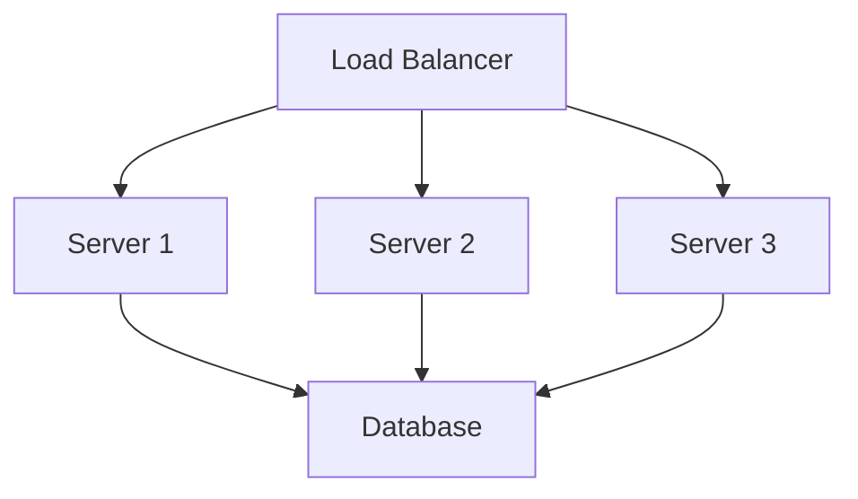
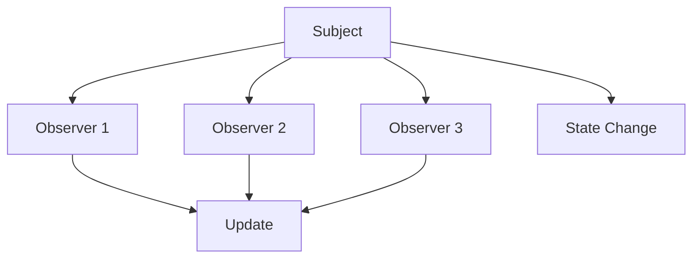
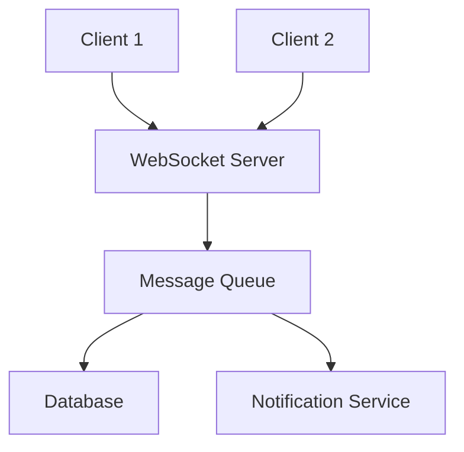
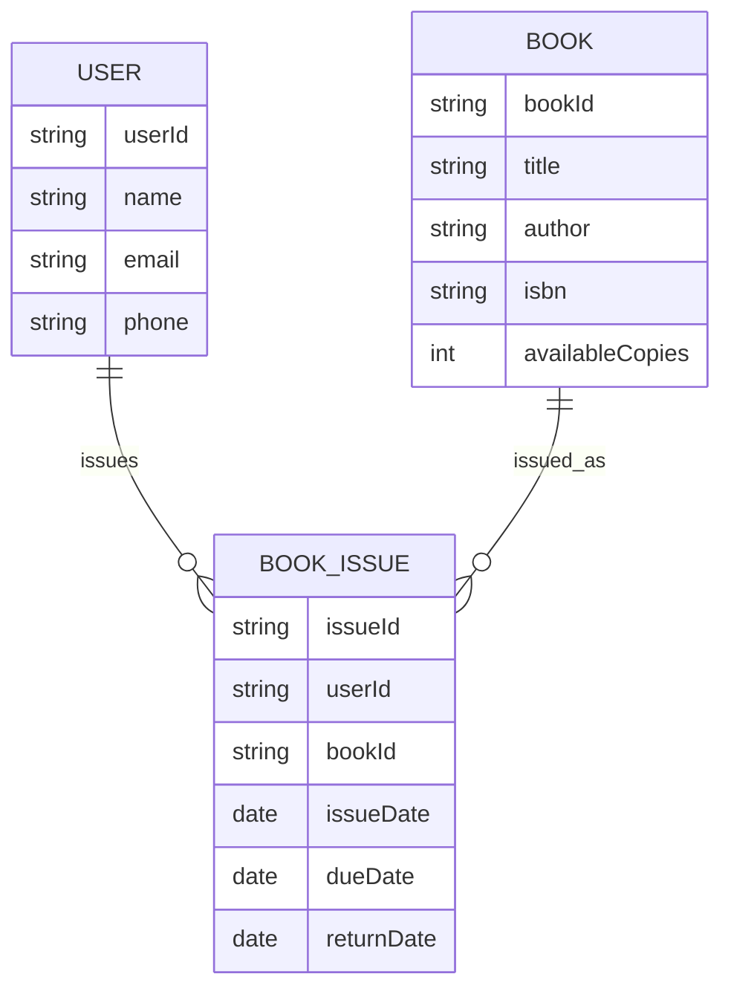
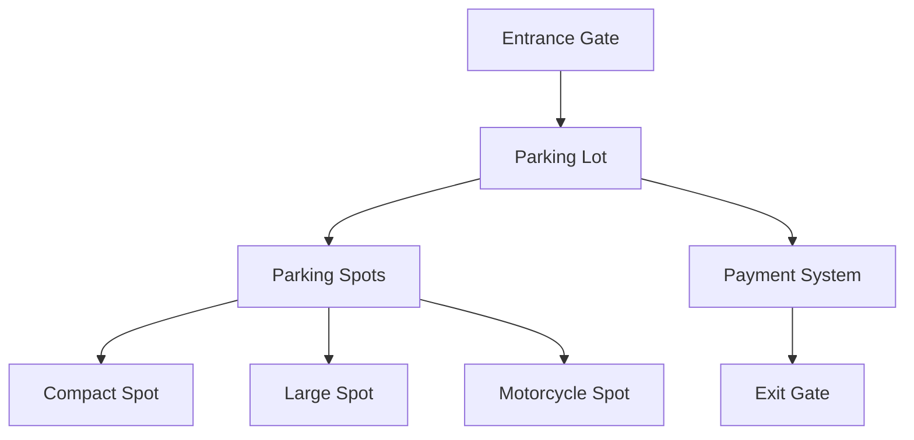
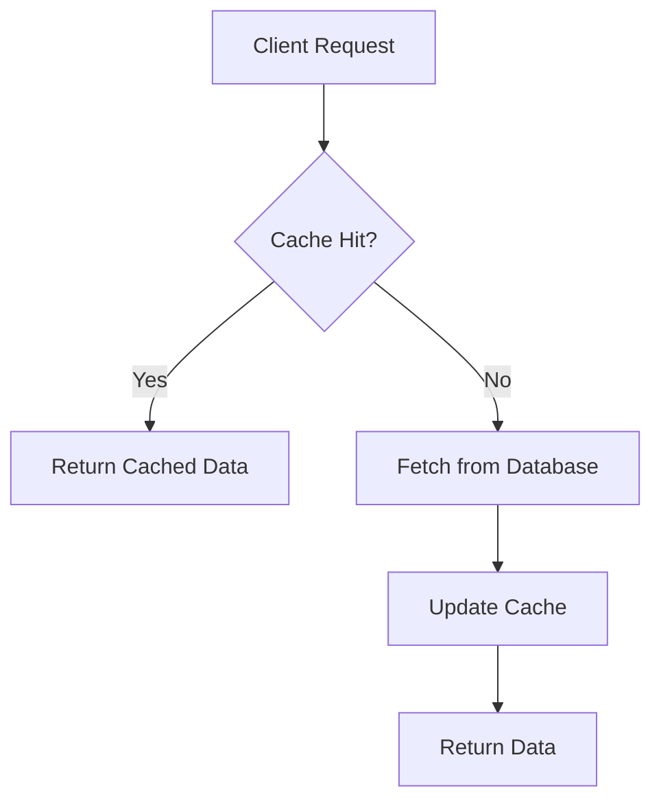

# System Design Fundamentals

## Introduction

System Design is the process of defining the architecture, components, and interfaces of a system. For freshers, focus on **Low-Level Design (LLD)** rather than High-Level Design.

## System Design Components

### 1. Scalability
- **Vertical Scaling**: Increase resources of single machine
- **Horizontal Scaling**: Add more machines



### 2. Key Components

| Component | Purpose | Examples |
|-----------|---------|----------|
| **Load Balancer** | Distribute traffic | NGINX, AWS ELB |
| **Database** | Store data | MySQL, MongoDB |
| **Cache** | Improve performance | Redis, Memcached |
| **Message Queue** | Async communication | RabbitMQ, Kafka |

## Design Patterns for Freshers

### 1. Singleton Pattern
**Use Case**: Database connection pool, logger

```cpp
class DatabaseConnection {
private:
    static DatabaseConnection* instance;
    DatabaseConnection() {} // Private constructor

public:
    static DatabaseConnection* getInstance() {
        if (!instance) {
            instance = new DatabaseConnection();
        }
        return instance;
    }
};
```

### 2. Factory Pattern
**Use Case**: Creating different types of objects

```cpp
class Notification {
public:
    virtual void send(string message) = 0;
};

class EmailNotification : public Notification {
public:
    void send(string message) override {
        cout << "Email: " << message << endl;
    }
};

class SMSNotification : public Notification {
public:
    void send(string message) override {
        cout << "SMS: " << message << endl;
    }
};

class NotificationFactory {
public:
    static Notification* createNotification(string type) {
        if (type == "email") return new EmailNotification();
        if (type == "sms") return new SMSNotification();
        return nullptr;
    }
};
```

### 3. Observer Pattern
**Use Case**: Event handling, notification systems



## Common System Design Questions for Freshers

### 1. Design a URL Shortener

**Requirements:**
- Convert long URLs to short URLs
- Redirect short URLs to original URLs
- Handle high traffic

**Components:**
```cpp
class URLShortener {
private:
    unordered_map<string, string> shortToLong;
    unordered_map<string, string> longToShort;
    string characters = "abcdefghijklmnopqrstuvwxyzABCDEFGHIJKLMNOPQRSTUVWXYZ0123456789";

public:
    string generateShortURL(string longURL) {
        if (longToShort.find(longURL) != longToShort.end()) {
            return longToShort[longURL];
        }

        string shortURL;
        do {
            shortURL = generateRandomString(6);
        } while (shortToLong.find(shortURL) != shortToLong.end());

        shortToLong[shortURL] = longURL;
        longToShort[longURL] = shortURL;

        return shortURL;
    }

private:
    string generateRandomString(int length) {
        string result;
        for (int i = 0; i < length; i++) {
            result += characters[rand() % characters.length()];
        }
        return result;
    }
};
```

**Follow-up Questions:**
- How to handle collisions? (Use different algorithms or increase length)
- How to make it distributed? (Use distributed cache)
- What about analytics? (Track clicks, timestamps)

### 2. Design a Simple Chat Application

**Requirements:**
- Users can send messages
- Real-time messaging
- Online/Offline status

**Architecture:**


**Key Classes:**
```cpp
class User {
    string userId;
    string username;
    bool isOnline;
    vector<string> contacts;
};

class Message {
    string messageId;
    string senderId;
    string receiverId;
    string content;
    long timestamp;
    MessageStatus status; // SENT, DELIVERED, READ
};

class ChatService {
    unordered_map<string, User> users;
    unordered_map<string, vector<Message>> conversations;

public:
    void sendMessage(string from, string to, string content);
    vector<Message> getMessages(string user1, string user2);
    void setUserOnline(string userId, bool online);
};
```

### 3. Design a Library Management System

**Requirements:**
- Add/remove books
- Issue/return books
- Track availability
- Search books

**Entity Relationships:**


**Key Classes:**
```cpp
class Book {
    string bookId;
    string title;
    string author;
    string isbn;
    int totalCopies;
    int availableCopies;

public:
    bool isAvailable() { return availableCopies > 0; }
    void issueBook() { availableCopies--; }
    void returnBook() { availableCopies++; }
};

class User {
    string userId;
    string name;
    vector<string> issuedBooks;

public:
    bool canIssueBook() { return issuedBooks.size() < 5; }
    void issueBook(string bookId) { issuedBooks.push_back(bookId); }
    void returnBook(string bookId) { /* remove from vector */ }
};

class Library {
    unordered_map<string, Book> books;
    unordered_map<string, User> users;

public:
    void addBook(Book book);
    void issueBook(string userId, string bookId);
    void returnBook(string userId, string bookId);
    vector<Book> searchBooks(string query);
};
```

### 4. Design a Parking Lot System

**Requirements:**
- Different vehicle types (Car, Motorcycle, Truck)
- Multiple parking spot sizes
- Entry/exit points
- Payment system

**Architecture:**


**Implementation:**
```cpp
enum VehicleType { CAR, MOTORCYCLE, TRUCK };
enum SpotType { COMPACT, LARGE, MOTORCYCLE };

class Vehicle {
    string licensePlate;
    VehicleType type;

public:
    Vehicle(string plate, VehicleType t) : licensePlate(plate), type(t) {}
    VehicleType getType() { return type; }
    string getLicensePlate() { return licensePlate; }
};

class ParkingSpot {
    string spotId;
    SpotType type;
    bool isOccupied;
    Vehicle* parkedVehicle;

public:
    ParkingSpot(string id, SpotType t) : spotId(id), type(t), isOccupied(false), parkedVehicle(nullptr) {}

    bool canParkVehicle(Vehicle* vehicle) {
        return !isOccupied && isCompatible(vehicle->getType());
    }

    void parkVehicle(Vehicle* vehicle) {
        isOccupied = true;
        parkedVehicle = vehicle;
    }

    void removeVehicle() {
        isOccupied = false;
        parkedVehicle = nullptr;
    }

private:
    bool isCompatible(VehicleType vehicleType) {
        if (type == MOTORCYCLE) return vehicleType == MOTORCYCLE;
        if (type == COMPACT) return vehicleType == CAR || vehicleType == MOTORCYCLE;
        if (type == LARGE) return true; // Can accommodate any vehicle
        return false;
    }
};

class ParkingLot {
    vector<ParkingSpot> spots;
    unordered_map<string, ParkingSpot*> vehicleToSpot;

public:
    bool parkVehicle(Vehicle* vehicle) {
        for (auto& spot : spots) {
            if (spot.canParkVehicle(vehicle)) {
                spot.parkVehicle(vehicle);
                vehicleToSpot[vehicle->getLicensePlate()] = &spot;
                return true;
            }
        }
        return false;
    }

    bool removeVehicle(string licensePlate) {
        if (vehicleToSpot.find(licensePlate) != vehicleToSpot.end()) {
            ParkingSpot* spot = vehicleToSpot[licensePlate];
            spot->removeVehicle();
            vehicleToSpot.erase(licensePlate);
            return true;
        }
        return false;
    }
};
```

## Design Principles

### 1. Single Responsibility Principle
- Each class should have one reason to change
- Example: Separate authentication from user management

### 2. Open/Closed Principle
- Open for extension, closed for modification
- Example: Add new notification types without changing existing code

### 3. Dependency Inversion
- Depend on abstractions, not concretions
- Example: Use interfaces instead of concrete classes

## Database Design Basics

### Normalization
- **1NF**: Atomic values
- **2NF**: No partial dependencies
- **3NF**: No transitive dependencies

### Indexing
- **Purpose**: Faster data retrieval
- **Trade-off**: Slower writes, more storage

## Performance Considerations

### Caching Strategy


### Load Balancing
- **Round Robin**: Distribute requests evenly
- **Least Connections**: Send to server with fewest active connections
- **IP Hash**: Send requests from same IP to same server

## Interview Preparation Tips

### Questions to Ask Interviewer
1. What are the expected scale/traffic?
2. What are the functional requirements?
3. What are the non-functional requirements?
4. What are the constraints (budget, timeline)?

### Common Follow-up Questions
1. How would you handle scale?
2. What are the bottlenecks?
3. How would you test this system?
4. What are the security considerations?

### Answer Structure
1. **Clarify Requirements**: Ask questions
2. **High-Level Design**: Identify components
3. **Detailed Design**: Class diagrams, algorithms
4. **Trade-offs**: Discuss pros and cons
5. **Scalability**: How to handle growth

## Quick Reference

| Pattern | Use Case | Key Benefit |
|---------|----------|-------------|
| Singleton | One instance needed | Global access, controlled instance |
| Factory | Object creation | Decouples creation from usage |
| Observer | Event handling | Loose coupling between components |
| Strategy | Algorithm selection | Easy to add new algorithms |
| Adapter | Interface compatibility | Reuse existing code |

### System Design Checklist

**Requirements Analysis:**
- [ ] Functional requirements identified
- [ ] Non-functional requirements identified
- [ ] Edge cases considered

**Architecture Design:**
- [ ] Components identified
- [ ] Relationships defined
- [ ] Data flow clear

**Scalability:**
- [ ] Horizontal scaling possible
- [ ] Load balancing strategy
- [ ] Caching strategy

**Database:**
- [ ] Schema designed
- [ ] Indexes identified
- [ ] Query optimization considered

**Security:**
- [ ] Authentication considered
- [ ] Authorization defined
- [ ] Data protection planned

Remember: For fresher interviews, focus on **clarity of thought**, **systematic approach**, and **fundamental understanding** rather than complex solutions.