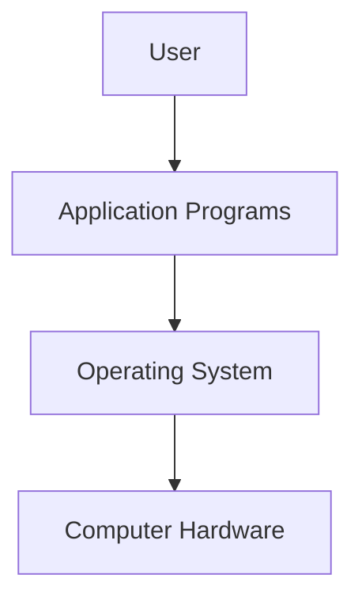
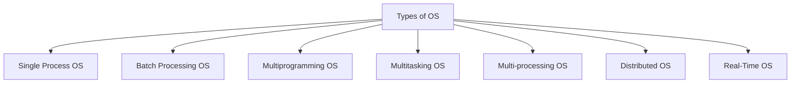

# Chapter 1: Introduction to Operating Systems

## What is an Operating System?

An **Operating System (OS)** is system software that manages all hardware and software resources of a computer system and provides an environment for executing user programs conveniently and efficiently.

### Key Characteristics
- **Resource Manager**: Manages memory, devices, files, security, and processes
- **Abstraction Layer**: Hides underlying hardware complexity
- **Interface Provider**: Acts as an interface between user and hardware
- **Isolation & Protection**: Facilitates safe execution of application programs

## Why Do We Need an OS?

### Without an OS:
1. **Bulky Applications**: Hardware interaction code must be in app's codebase
2. **Resource Exploitation**: One app can monopolize all resources
3. **No Memory Protection**: Processes can interfere with each other

### What is an OS Made Of?
- Collection of system software components

## OS Goals

| Goal | Description |
|------|-------------|
| Maximum CPU Utilization | Keep CPU busy as much as possible |
| Less Process Starvation | Fair resource allocation to all processes |
| Higher Priority Job Execution | Prioritize important tasks |

## Types of Operating Systems

### 1. Single Process Operating System
- Only **one process** executes at a time from ready queue
- **Example**: MS-DOS (1981)
- Oldest type of OS

### 2. Batch Processing Operating System

**Working**:
1. User prepares job using punch cards
2. Submits job to computer operator
3. Operator collects jobs from different users
4. Jobs sorted into batches with similar needs
5. Batches submitted to processor one by one

**Disadvantages**:
- ❌ Priorities cannot be set
- ❌ May lead to starvation (batch takes long time)
- ❌ CPU becomes idle during I/O operations

**Example**: ATLAS (Manchester Univ., late 1950s - early 1960s)

### 3. Multiprogramming Operating System

**Key Concept**: Increases CPU utilization by keeping **multiple jobs in memory** so CPU always has one to execute when another is busy with I/O.

**Characteristics**:
- Single CPU
- Context switching for processes
- Switch happens when current process goes to **wait state**
- Reduces CPU idle time

**Example**: THE (Dijkstra, early 1960s)

### 4. Multitasking Operating System

**Key Concept**: Logical extension of multiprogramming - can run **more than one task simultaneously**.

**Characteristics**:
- Single CPU
- Uses **context switching** and **time sharing**
- Increases responsiveness
- Further reduces CPU idle time

**Example**: CTSS (MIT, early 1960s)

### 5. Multi-processing Operating System

**Key Concept**: More than **one CPU** in a single computer.

**Advantages**:
- ✅ Increased **reliability** (if 1 CPU fails, others continue)
- ✅ Better **throughput**
- ✅ Lesser process **starvation**

**Example**: Windows NT

### 6. Distributed Operating System

**Key Concept**: OS manages resources across multiple computer nodes.

**Characteristics**:
- Multiple CPUs, memories, GPUs
- **Loosely connected** autonomous, interconnected computer nodes
- Collection of independent, networked, communicating nodes

**Example**: LOCUS

### 7. Real-Time Operating System (RTOS)

**Key Concept**: **Error-free** computations within **tight time boundaries**.

**Characteristics**:
- Time-critical operations
- Deterministic behavior
- Immediate response required

**Examples**: Air Traffic Control System, ROBOTS, Industrial Control Systems

## Interview Questions

### Q1: What is the difference between system software and application software?
**Answer**:
- **System Software**: Operates and controls the computer system, provides platform for applications (e.g., OS, drivers)
- **Application Software**: Performs specific tasks for users (e.g., browsers, word processors)

### Q2: Explain the main functions of an Operating System.
**Answer**: The OS performs five main functions:
1. **Access to Hardware**: Direct interaction with computer hardware
2. **User Interface**: Provides interface between user and hardware
3. **Resource Management**: Manages memory, devices, files, security, processes
4. **Abstraction**: Hides hardware complexity
5. **Isolation & Protection**: Ensures safe execution of programs

### Q3: What is the difference between multiprogramming and multitasking?
**Answer**:

| Multiprogramming | Multitasking |
|------------------|--------------|
| Multiple programs in memory | Logical extension of multiprogramming |
| Switch on wait state | Switch on wait state + time quantum |
| Focuses on CPU utilization | Focuses on responsiveness |
| No time sharing | Uses time sharing |

### Q4: What is the convoy effect in batch processing systems?
**Answer**: Convoy effect occurs when many processes needing a resource for short time are blocked by one process holding that resource for long time, leading to poor resource management and increased average wait time.

### Q5: Why is multi-processing more reliable than multiprogramming?
**Answer**: Multi-processing has multiple CPUs, so if one CPU fails, other CPUs can continue working. This redundancy increases system reliability. Multiprogramming has only one CPU, so CPU failure stops the entire system.

### Q6: What are the key differences between distributed OS and multi-processing OS?
**Answer**:
- **Multi-processing**: Multiple CPUs in a **single computer** sharing same memory
- **Distributed OS**: Multiple **independent computers** (nodes) connected via network, each with own CPU and memory

### Q7: Give real-world examples where RTOS is essential.
**Answer**:
- Air Traffic Control Systems (real-time tracking of aircraft)
- Medical devices (pacemakers, ventilators)
- Industrial robots (assembly line automation)
- Anti-lock Braking Systems (ABS) in vehicles

### Q8: What would happen if there were no operating system?
**Answer**: Without an OS:
- Applications would be bulky (containing hardware interaction code)
- No resource protection (one app could monopolize all resources)
- No memory protection (processes could corrupt each other's data)
- No standardized interface for hardware access

### Q9: Explain the OS architecture layers.
**Answer**: From top to bottom:
1. **User** (topmost)
2. **Application Programs**
3. **Operating System**
4. **Computer Hardware** (bottommost)

Each layer provides services to the layer above it.

### Q10: What is the primary goal of modern operating systems?
**Answer**: Modern OS aims to achieve:
- **Maximum CPU utilization** (keep CPU busy)
- **Minimize process starvation** (fair scheduling)
- **Execute higher priority jobs** first
- **Provide good user experience** (responsiveness)
