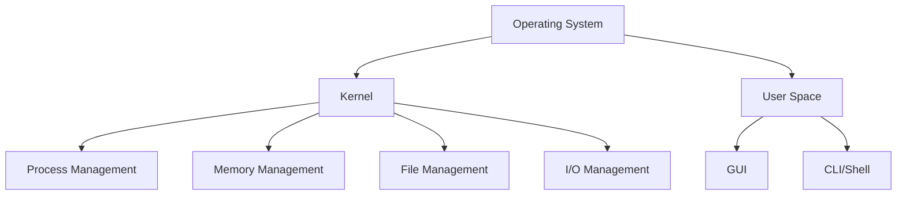
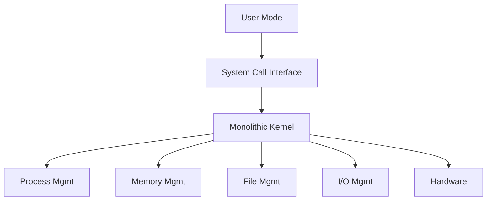

# Chapter 2: Multi-Tasking vs Multi-Threading & OS Components

## Program vs Process vs Thread

### Program
- **Executable file** containing instructions to complete specific operations
- Compiled code ready to be executed
- Stored in **Disk** (secondary storage)

### Process
- **Program under execution**
- Resides in computer's primary memory (**RAM**)
- Active entity with allocated resources

### Thread
- **Single sequence stream** within a process
- Independent **path of execution** in a process
- **Light-weight process**
- Used to achieve parallelism by dividing process tasks

**Example**: Multiple tabs in browser, spell-checking while typing in text editor

## Multi-Tasking vs Multi-Threading

| Aspect | Multi-Tasking | Multi-Threading |
|--------|---------------|-----------------|
| **Definition** | Execution of more than one task simultaneously | A process divided into sub-tasks (threads) with own execution path |
| **Concept** | More than 1 process context switched | More than 1 thread context switched |
| **CPU Count** | 1 CPU | ≥ 1 CPU (better with multiple) |
| **Isolation** | Memory protection exists | No isolation - shared memory |
| **Memory Allocation** | Separate memory per process | Threads share process memory |
| **Resource Management** | OS allocates separate resources | Threads share process resources |

## Thread Scheduling

- Threads scheduled based on **priority**
- All threads assigned **processor time slices** by OS
- Similar to process scheduling but lighter weight

## Context Switching Comparison

### Thread Context Switching

| Feature | Thread Context Switching | Process Context Switching |
|---------|-------------------------|---------------------------|
| **State Save** | Save current thread state | Save current process state |
| **Switching To** | Another thread of same process | Another process entirely |
| **Memory Address Space** | NOT switched | Switched |
| **Registers, PC, Stack** | Saved and restored | Saved and restored |
| **Speed** | ⚡ Fast | 🐌 Slow |
| **CPU Cache** | Preserved | Flushed |

## OS Components

### 1. Kernel

**Definition**: The **core component** of OS that interacts directly with hardware and performs critical tasks.

**Characteristics**:
- Heart of OS
- **First part** to load on startup
- Runs in privileged mode

### 2. User Space

**Definition**: Environment where application software runs without privileged hardware access.

**Components**:
- **GUI** (Graphical User Interface)
- **CLI** (Command Line Interface)

**Shell**: Command interpreter that receives commands from users and executes them.

## Functions of Kernel

### 1. Process Management
- Scheduling processes and threads on CPUs
- Creating & deleting user and system processes
- Suspending and resuming processes
- Providing **process synchronization** and **communication** mechanisms

### 2. Memory Management
- Allocating and deallocating memory as needed
- Tracking which memory parts are in use and by which process

### 3. File Management
- Creating and deleting files
- Creating and deleting directories
- Mapping files to secondary storage
- Backup support on stable storage media

### 4. I/O Management
Manages I/O operations and devices through:

#### a) Spooling
- Between **different speed** devices
- **Examples**: Print spooling, mail spooling

#### b) Buffering
- Within **one job**
- **Example**: YouTube video buffering

#### c) Caching
- Temporary storage for faster access
- **Examples**: Memory caching, web caching

## Types of Kernels

### 1. Monolithic Kernel

| Aspect | Details |
|--------|---------|
| **Structure** | All functions in kernel itself |
| **Size** | Bulky |
| **Memory Required** | High |
| **Reliability** | ❌ Less reliable (one module crash → whole kernel down) |
| **Performance** | ✅ High (fast communication, less mode switching overhead) |
| **Examples** | Linux, Unix, MS-DOS |

### 2. Micro Kernel

| Aspect | Details |
|--------|---------|
| **Structure** | Only major functions in kernel (Memory & Process mgmt) |
| **File & I/O Management** | In User space |
| **Size** | Smaller |
| **Reliability** | ✅ More reliable |
| **Stability** | ✅ More stable |
| **Performance** | ❌ Slow (overhead switching between modes) |
| **Examples** | L4 Linux, Symbian OS, MINIX |

**Core Functions in Kernel**:
- Memory Management
- Process Management

**Functions in User Space**:
- File Management
- I/O Management

### 3. Hybrid Kernel

**Concept**: Combines advantages of both monolithic and micro kernels.

| Aspect | Details |
|--------|---------|
| **Approach** | Combined approach |
| **Speed & Design** | From monolithic |
| **Modularity & Stability** | From micro |
| **File Management** | In User space |
| **Other Functions** | In Kernel space |
| **IPC** | Present but with lesser overhead |
| **Examples** | macOS, Windows NT/7/10 |

### 4. Nano/Exo Kernels
Minimalistic kernels with extremely small footprint (not commonly used).

## Inter-Process Communication (IPC)

**Question**: How does communication happen between user mode and kernel mode?

**Answer**: Through **Inter-Process Communication (IPC)**

### Why IPC?
- Two processes execute independently with **memory protection**
- Sometimes processes need to **communicate to work together**

### IPC Methods

1. **Shared Memory**
   - Common memory region accessible to multiple processes
   - Fast but requires synchronization

2. **Message Passing**
   - Processes exchange messages via OS
   - Safer but slower than shared memory

## Interview Questions

### Q1: What is the difference between a program, process, and thread?
**Answer**:
- **Program**: Compiled executable code stored on disk
- **Process**: Program loaded in RAM and under execution
- **Thread**: Lightweight execution unit within a process, sharing process resources

### Q2: Why is thread context switching faster than process context switching?
**Answer**:
- Thread switching doesn't involve **memory address space** switching
- CPU cache is **preserved** (not flushed)
- Only PC, registers, and stack need to be saved/restored
- Threads of same process share memory, reducing overhead

### Q3: Will a single CPU system gain performance from multi-threading?
**Answer**: **No**. Two threads must context switch for the single CPU, creating overhead without gaining parallelism benefits. Multi-threading benefits require multiple CPUs/cores.

### Q4: Explain the key functions of the kernel.
**Answer**: Four main functions:
1. **Process Management**: Scheduling, creation, deletion, synchronization
2. **Memory Management**: Allocation, deallocation, tracking usage
3. **File Management**: File/directory operations, storage mapping
4. **I/O Management**: Buffering, caching, spooling

### Q5: What is the difference between spooling, buffering, and caching?
**Answer**:
- **Spooling**: Between different speed devices (e.g., print queue)
- **Buffering**: Within one job for smooth data flow (e.g., video buffering)
- **Caching**: Temporary storage of frequently accessed data for faster retrieval

### Q6: Compare monolithic and micro kernels.
**Answer**:

| Feature | Monolithic | Micro |
|---------|-----------|-------|
| Size | Large | Small |
| Performance | Fast | Slow |
| Reliability | Low | High |
| Stability | Low | High |
| All functions in kernel | Yes | No (only core functions) |

### Q7: Why are hybrid kernels popular in modern OS?
**Answer**: Hybrid kernels combine:
- **Speed and design** of monolithic kernels
- **Modularity and stability** of micro kernels
- This provides optimal balance between performance and reliability

### Q8: What is IPC and why is it needed?
**Answer**: IPC (Inter-Process Communication) allows processes with independent memory spaces to communicate. Needed because:
- Processes have memory protection (isolation)
- Some tasks require cooperation between processes
- Implemented via shared memory or message passing

### Q9: What is a shell and what does it do?
**Answer**: A **shell** (command interpreter) is part of user space that:
- Receives commands from users
- Translates them to system calls
- Gets them executed by the kernel
- Examples: Bash, PowerShell, Zsh

### Q10: Why do threads share memory while processes don't?
**Answer**:
- **Threads** exist within a single process, so they naturally share that process's memory space and resources
- **Processes** are independent entities with separate memory protection to prevent interference and ensure isolation

### Q11: What happens during a context switch?
**Answer**: Context switching involves:
1. **Save current state** (PC, registers, stack) to PCB/TCB
2. **Update process/thread state** (running → ready)
3. **Select next process/thread** to run
4. **Load saved state** from PCB/TCB
5. **Resume execution** of new process/thread

### Q12: What are the benefits of multi-threading?
**Answer**:
- ✅ **Responsiveness**: Program remains responsive during blocking operations
- ✅ **Resource Sharing**: Efficient sharing of memory and resources
- ✅ **Economy**: Cheaper to create/switch than processes
- ✅ **Scalability**: Can utilize multiple processors effectively
