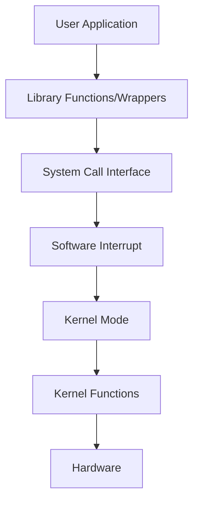
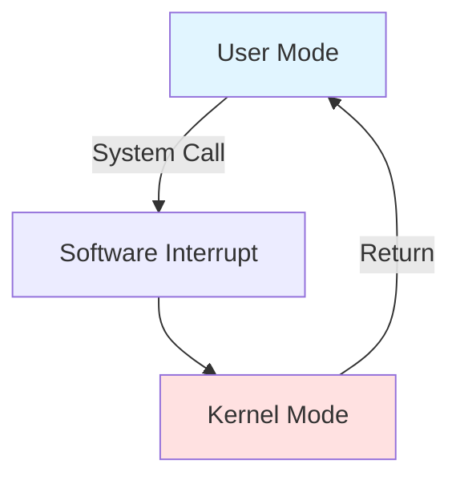
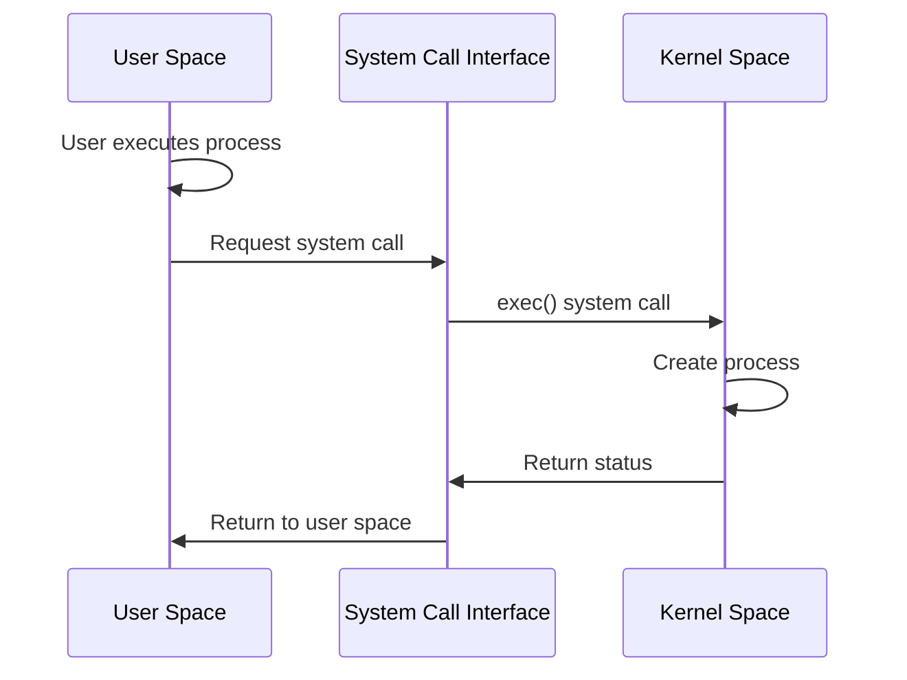
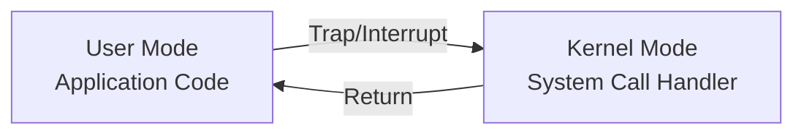

# Chapter 3: System Calls

## What are System Calls?

**System Call**: A mechanism through which a user program requests services from the kernel for operations it doesn't have permission to perform.

### Key Points
- User programs **cannot directly** access I/O devices or communicate with other programs
- System calls are the **only way** a process can transition from **user mode** to **kernel mode**
- Implemented in **C language**
- Provide controlled access to kernel services

## How Apps Interact with Kernel

### Example: `mkdir` command
1. User executes `mkdir laks` (User Space)
2. `mkdir` is a wrapper around actual system call
3. System call invoked (User Space)
4. **Software interrupt** triggers mode switch
5. Execute system call in Kernel Space
6. Return to User Space

## User Mode vs Kernel Mode

### Architecture

| Layer | Content |
|-------|---------|
| **User Mode** | User App, Glibc (library) |
| **Software Interrupt** | ⬇️ Transition mechanism |
| **Kernel Mode** | System Call Interface (SCI), Kernel, Hardware |

## Types of System Calls

### 1. Process Control
- `end`, `abort`
- `load`, `execute`
- `create process`, `terminate process`
- `get/set process attributes`
- `wait for time`, `wait event`, `signal event`
- `allocate and free memory`

### 2. File Management
- `create file`, `delete file`
- `open`, `close`
- `read`, `write`, `reposition`
- `get/set file attributes`

### 3. Device Management
- `request device`, `release device`
- `read`, `write`, `reposition`
- `get/set device attributes`
- `logically attach/detach devices`

### 4. Information Maintenance
- `get/set time or date`
- `get/set system data`
- `get/set process, file, or device attributes`

### 5. Communication Management
- `create/delete communication connection`
- `send/receive messages`
- `transfer status information`
- `attach/detach remote devices`

## System Call Examples

### Windows vs Unix

| Category | Windows | Unix |
|----------|---------|------|
| **Process Control** | `CreateProcess()`, `ExitProcess()`, `WaitForSingleObject()` | `fork()`, `exit()`, `wait()` |
| **File Management** | `CreateFile()`, `ReadFile()`, `WriteFile()`, `CloseHandle()` | `open()`, `read()`, `write()`, `close()` |
| **File Security** | `SetFileSecurity()`, `InitializeSecurityDescriptor()` | `chmod()`, `umask()`, `chown()` |
| **Device Management** | `SetConsoleMode()`, `ReadConsole()`, `WriteConsole()` | `ioctl()`, `read()`, `write()` |
| **Information** | `GetCurrentProcessID()`, `SetTimer()`, `Sleep()` | `getpid()`, `alarm()`, `sleep()` |
| **Communication** | `CreatePipe()`, `CreateFileMapping()`, `MapViewOfFile()` | `pipe()`, `shmget()`, `mmap()` |

## System Call Workflow

### Creating a Process Example

**Steps**:
1. User executes a process (User Space)
2. Gets system call (User Space)
3. Execute `exec()` system call (Kernel Space)
4. Process created
5. Return to User Space

## Transitions via Software Interrupts

**Mode switching** from User Space to Kernel Space is done by **software interrupts** (traps).

## Interview Questions

### Q1: What is a system call and why is it needed?
**Answer**: A system call is a programmatic way for a user program to request services from the OS kernel. It's needed because:
- User programs lack permissions for privileged operations (I/O, memory management)
- Provides controlled, secure access to hardware
- Maintains system stability through isolation

### Q2: How does a system call differ from a regular function call?
**Answer**:

| Regular Function Call | System Call |
|----------------------|-------------|
| Stays in user mode | Switches to kernel mode |
| Fast execution | Slower (mode switching overhead) |
| No privilege change | Requires privilege escalation |
| Library function | Kernel function |

### Q3: What is the role of software interrupts in system calls?
**Answer**: Software interrupts (traps) are the mechanism that transitions execution from user mode to kernel mode. When a system call is invoked:
1. Software interrupt is triggered
2. CPU switches to kernel mode
3. Control transfers to kernel's interrupt handler
4. System call executes in kernel mode
5. Returns to user mode after completion

### Q4: Explain the `fork()` system call in Unix.
**Answer**: `fork()` creates a new process (child) by duplicating the calling process (parent):
- Child gets a copy of parent's address space
- Returns **0** to child process
- Returns **child's PID** to parent process
- Returns **-1** on failure
- Both processes continue execution from the point after `fork()`

### Q5: What is the difference between `exec()` and `fork()`?
**Answer**:
- **`fork()`**: Creates a new process (duplicate of parent)
- **`exec()`**: Replaces current process image with a new program
- Common pattern: `fork()` then `exec()` to run a new program in child process

### Q6: Why can't user applications directly access hardware?
**Answer**: Direct hardware access by user applications would:
- Compromise system security
- Allow processes to interfere with each other
- Cause system instability
- Prevent proper resource management
- System calls provide controlled, safe access through kernel

### Q7: What happens during a system call execution?
**Answer**: Complete flow:
1. Application invokes wrapper function (e.g., `printf`)
2. Library prepares system call
3. Software interrupt triggered
4. CPU switches to kernel mode
5. Kernel validates request
6. Kernel executes requested operation
7. Results returned to user space
8. CPU switches back to user mode
9. Control returns to application

### Q8: List 5 commonly used system calls and their purposes.
**Answer**:
1. **`fork()`**: Create a new process
2. **`open()`**: Open a file
3. **`read()`**: Read from file/device
4. **`write()`**: Write to file/device
5. **`exit()`**: Terminate process

### Q9: What is the difference between `chmod()` and `chown()` in Unix?
**Answer**:
- **`chmod()`**: Changes file **permissions** (read, write, execute)
- **`chown()`**: Changes file **ownership** (user and group)

### Q10: How are system calls different from library functions?
**Answer**:

| System Calls | Library Functions |
|--------------|-------------------|
| Kernel-level operations | User-level operations |
| Mode switch required | No mode switch |
| Limited in number | Unlimited |
| OS-dependent | Can be portable |
| Examples: `fork()`, `open()` | Examples: `printf()`, `strlen()` |

### Q11: What system call would you use to get the current process ID?
**Answer**:
- **Unix/Linux**: `getpid()`
- **Windows**: `GetCurrentProcessID()`

### Q12: Explain the purpose of `pipe()` system call.
**Answer**: `pipe()` creates a unidirectional communication channel between two related processes:
- Creates two file descriptors: read end and write end
- Used for Inter-Process Communication (IPC)
- Commonly used between parent and child processes
- Example: Shell pipes (`ls | grep txt`)

### Q13: Why are system calls expensive operations?
**Answer**: System calls are expensive because they involve:
- **Mode switching** (user → kernel → user)
- **Context preservation** (saving/restoring state)
- **Parameter validation** (security checks)
- **Potential blocking** (waiting for I/O)
- Overhead is much higher than regular function calls

### Q14: What is the difference between `read()` and `ReadFile()`?
**Answer**:
- **`read()`**: Unix/Linux system call
- **`ReadFile()`**: Windows system call
- Both perform the same function (read from file) but are OS-specific implementations

### Q15: How does the kernel ensure system call security?
**Answer**: Kernel ensures security through:
- **Parameter validation**: Checking all system call arguments
- **Permission checks**: Verifying process has required privileges
- **Memory protection**: Ensuring valid memory addresses
- **Sandboxing**: Isolating process execution
- **Audit trails**: Logging critical system calls
