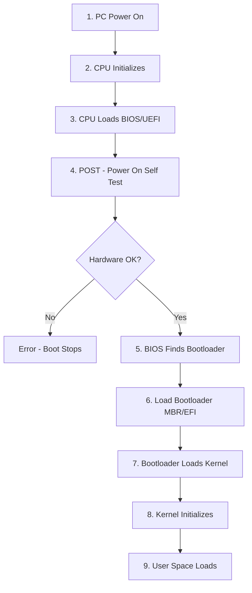

# Chapter 4: Boot Process & 32-bit vs 64-bit Architecture

## Computer Boot Process

### Step-by-Step Boot Sequence

### Detailed Steps

#### 1. PC Power On
Computer receives power and starts initialization.

#### 2. CPU Initializes
- CPU initializes itself
- Looks for **firmware program** stored in BIOS chip

#### 3. CPU Loads BIOS/UEFI
- **BIOS** (Basic Input-Output System): ROM chip on motherboard allowing system access at basic level
- **Modern PCs**: Use UEFI (Unified Extensible Firmware Interface)
  - More advanced than BIOS
  - Acts like a tiny operating system
  - Provides features like Intel Management Engine

#### 4. POST (Power-On Self-Test)
- CPU runs BIOS which tests and initializes system hardware
- BIOS loads configuration settings
- **If hardware issue detected** (e.g., missing RAM):
  - Error thrown
  - Boot process stopped

#### 5. BIOS Hands Off to Bootloader
BIOS examines storage device to find bootloader program

**Two approaches**:

**Legacy BIOS Method**:
- Looks at **MBR** (Master Boot Record)
- Special boot sector at beginning of disk
- MBR contains code to load rest of OS (**bootloader**)

**UEFI Method**:
- Looks for program on **EFI system partition**
- More modern and flexible approach

#### 6. Bootloader Execution
Small program with large responsibility of booting the rest of OS

| OS | Bootloader Name |
|----|----|
| Windows | Windows Boot Manager (Bootmgr.exe) |
| Linux | GRUB (GRand Unified Bootloader) |
| macOS | boot.efi |

#### 7. Loading Kernel and User Space
- Bootloader loads **Kernel** into memory
- Kernel initializes
- Then loads **User Space** components
- System becomes ready for user interaction

## 32-bit vs 64-bit Operating Systems

### Register Size and Memory Addressing

| Feature | 32-bit OS | 64-bit OS |
|---------|-----------|-----------|
| **Register Size** | 32-bit registers | 64-bit registers |
| **Addressable Memory** | 2³² = 4 GB | 2⁶⁴ = 17,179,869,184 GB |
| **CPU Architecture** | Processes 32 bits of data | Processes 64 bits of data |

### Advantages of 64-bit over 32-bit

#### 1. Addressable Memory
- **32-bit**: Can access up to **4 GB** physical memory (2³² unique addresses)
- **64-bit**: Can access up to **17+ billion GB** (2⁶⁴ unique addresses)
- Practically unlimited memory support

#### 2. Resource Usage
- **32-bit**: Installing more than 4GB RAM shows **no performance impact**
- **64-bit**: Can effectively utilize large amounts of RAM
- Better performance with excess RAM

#### 3. Performance
- **Calculation Speed**:
  - **32-bit**: Executes 4 bytes of data in 1 instruction cycle
  - **64-bit**: Executes 8 bytes of data in 1 instruction cycle
- Larger registers allow larger calculations simultaneously
- Billions of instruction cycles per second

#### 4. Compatibility
- **64-bit CPU**: Can run both 32-bit and 64-bit OS
- **32-bit CPU**: Can only run 32-bit OS
- Backward compatibility maintained

#### 5. Better Graphics Performance
- 8-byte graphics calculations process faster
- Graphics-intensive applications run significantly better

### Comparison Table

| Aspect | 32-bit | 64-bit |
|--------|--------|--------|
| **Max RAM** | 4 GB | 17+ billion GB |
| **Data per Cycle** | 4 bytes | 8 bytes |
| **CPU Compatibility** | 32-bit OS only | Both 32-bit & 64-bit |
| **Performance** | Standard | Superior |
| **Graphics** | Standard | Enhanced |
| **Modern Support** | Declining | Standard |

## Key Components Summary

### BIOS (Basic Input-Output System)
- ROM chip on motherboard
- First code executed on startup
- Initializes and tests hardware
- Loads bootloader

### UEFI (Unified Extensible Firmware Interface)
- Modern replacement for BIOS
- More features and capabilities
- Tiny operating system itself
- Better security (Secure Boot)

### MBR (Master Boot Record)
- Special boot sector on disk
- Contains bootloader code
- Legacy boot method
- Limited to 2TB disk size

### EFI System Partition
- Modern boot partition
- Used by UEFI
- Supports larger disks (>2TB)
- More flexible than MBR

## Interview Questions

### Q1: What happens when you press the power button on a computer?
**Answer**: Step-by-step process:
1. **Power On**: Electricity flows to components
2. **CPU Initializes**: CPU starts and looks for BIOS/UEFI
3. **Firmware Loads**: BIOS/UEFI loads from ROM chip
4. **POST**: Power-On Self-Test checks hardware
5. **Bootloader Found**: BIOS locates bootloader (MBR or EFI partition)
6. **Bootloader Executes**: Loads operating system kernel
7. **Kernel Loads**: OS kernel initializes
8. **User Space**: GUI/CLI becomes available

### Q2: What is POST and why is it important?
**Answer**: POST (Power-On Self-Test) is a diagnostic process where:
- BIOS tests system hardware (RAM, storage, etc.)
- Initializes hardware components
- Loads configuration settings
- If any critical hardware is missing/faulty, **boot process stops**
- Ensures system stability before OS loads

### Q3: What is the difference between BIOS and UEFI?
**Answer**:

| BIOS | UEFI |
|------|------|
| Legacy firmware | Modern firmware |
| 16-bit mode | 32/64-bit mode |
| Slower boot | Faster boot |
| MBR partition (2TB limit) | GPT partition (>2TB support) |
| Text interface | GUI support |
| No Secure Boot | Secure Boot feature |

### Q4: What is a bootloader and what does it do?
**Answer**: A bootloader is a **small program** that:
- Loads after BIOS/UEFI completes POST
- Has the critical task of loading the OS kernel
- Bridges firmware and operating system
- Examples: GRUB (Linux), Bootmgr.exe (Windows), boot.efi (macOS)

### Q5: Can a 32-bit CPU run a 64-bit OS? Vice versa?
**Answer**:
- **32-bit CPU with 64-bit OS**: ❌ **NO** - CPU lacks required instruction set
- **64-bit CPU with 32-bit OS**: ✅ **YES** - Backward compatibility maintained
- **64-bit CPU with 64-bit OS**: ✅ **YES** - Optimal configuration

### Q6: Why does a 32-bit OS have a 4GB memory limit?
**Answer**: 32-bit OS has 32-bit registers, meaning it can generate **2³² unique memory addresses**:
- 2³² = 4,294,967,296 addresses
- Each address points to 1 byte
- Total addressable memory = 4 GB
- This is a hardware limitation, not software

### Q7: What are the performance benefits of 64-bit systems?
**Answer**:
1. **Larger data processing**: 8 bytes per instruction vs 4 bytes
2. **More memory**: Can utilize >4GB RAM effectively
3. **Better graphics**: Faster graphics calculations
4. **Larger registers**: Can perform bigger calculations
5. **Modern software optimization**: Most new software is 64-bit optimized

### Q8: What is MBR and what does it contain?
**Answer**: MBR (Master Boot Record) is:
- **Special boot sector** at the beginning of a storage device
- Contains **bootloader code** (first stage)
- Contains **partition table** (disk layout information)
- **512 bytes** in size
- Used in legacy BIOS systems
- **Limitation**: Cannot handle disks >2TB

### Q9: Explain the role of the kernel in the boot process.
**Answer**: After bootloader loads the kernel:
1. **Kernel initializes** hardware drivers
2. **Mounts root filesystem**
3. **Starts init process** (PID 1)
4. **Loads system services**
5. **Initializes user space**
6. **Starts login manager/shell**
7. System becomes ready for user interaction

### Q10: What is the difference between firmware and software?
**Answer**:

| Firmware | Software |
|----------|----------|
| Stored in ROM/Flash memory | Stored on disk/SSD |
| Permanent (semi-permanent) | Easily modifiable |
| Low-level hardware control | High-level functionality |
| Examples: BIOS, UEFI | Examples: OS, applications |
| Updated rarely | Updated frequently |

### Q11: Why do modern systems use UEFI instead of BIOS?
**Answer**: UEFI advantages:
- **Faster boot times** (parallelized initialization)
- **Larger disk support** (GPT vs MBR)
- **Secure Boot** (prevents malware at boot)
- **Better graphics** (GUI support)
- **Network capabilities** (remote diagnostics)
- **More features** (acts like mini-OS)

### Q12: How many instruction cycles does a CPU execute per second?
**Answer**: Modern CPUs execute **billions of instruction cycles per second**:
- Measured in GHz (GigaHertz)
- 1 GHz = 1 billion cycles per second
- Example: 3.5 GHz CPU = 3.5 billion cycles/second
- Each cycle can process 4 bytes (32-bit) or 8 bytes (64-bit)

### Q13: What happens if POST fails?
**Answer**: If POST detects hardware issues:
- **Beep codes** emitted (pattern indicates error type)
- **Error message** displayed (if display works)
- **Boot process halts** immediately
- System won't proceed to bootloader
- Common causes: RAM failure, missing components, hardware malfunction

### Q14: Can you install 32-bit applications on 64-bit OS?
**Answer**: **Yes**, most 64-bit operating systems support running 32-bit applications through:
- **Windows**: WoW64 (Windows 32-bit on Windows 64-bit) subsystem
- **Linux**: Multi-lib support
- Some performance overhead due to translation layer
- Not vice versa (64-bit apps won't run on 32-bit OS)

### Q15: What is the role of Intel Management Engine mentioned in UEFI?
**Answer**: Intel Management Engine is:
- **Separate processor** within Intel CPUs
- Runs independently of main CPU
- Provides **remote management** capabilities
- Allows IT to manage business PCs remotely
- Can operate even when PC is powered off
- Part of Intel Active Management Technology (AMT)
