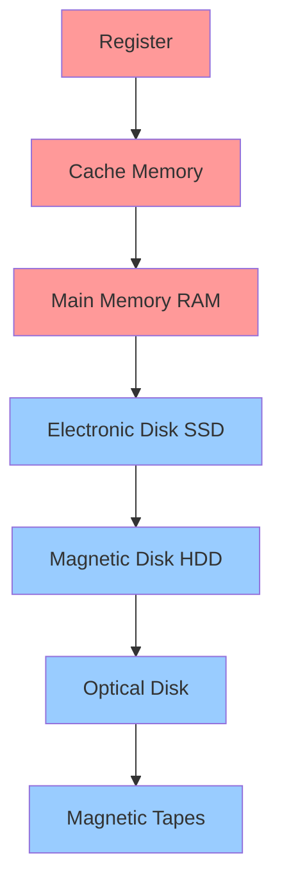
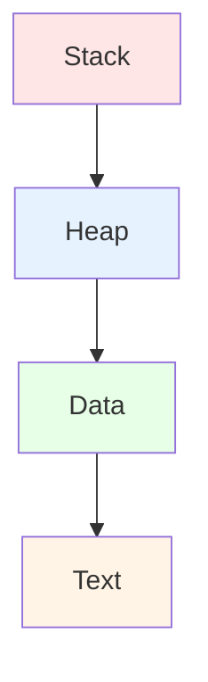
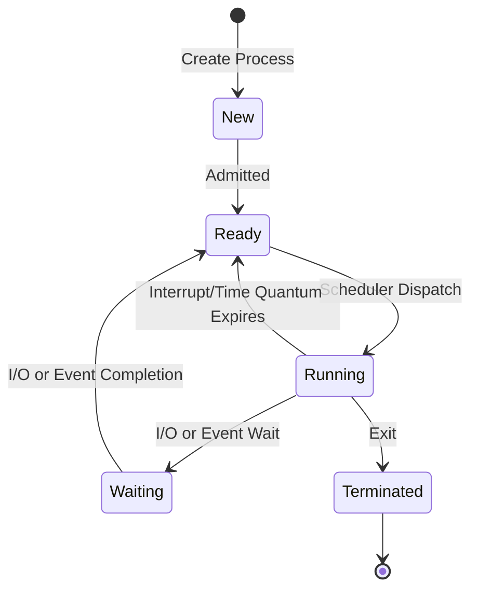

# Chapter 5: Storage Devices & Process Basics

## Memory Hierarchy

### Primary Memory (Volatile)
- Register
- Cache
- Main Memory (RAM)

### Secondary Memory (Non-Volatile)
- Electronic Disk (SSD)
- Magnetic Disk (HDD)
- Optical Disk (CD/DVD)
- Magnetic Tapes

## Memory Types

### 1. Register
- **Smallest unit** of storage
- Part of **CPU itself**
- Holds instructions, storage addresses, or data (bit sequences/characters)
- **Fastest** access speed
- Temporarily stores data being immediately used by CPU

### 2. Cache
- **High-speed memory** between CPU and RAM
- Stores **frequently used** instructions and data
- Enables quicker processing by CPU
- Multiple levels: L1, L2, L3

### 3. Main Memory (RAM)
- **Random Access Memory**
- Volatile (loses data when power off)
- Stores currently executing programs and data
- Direct CPU access

### 4. Secondary Memory
- **Non-volatile** storage (persists without power)
- Stores programs and data permanently
- Examples: HDD, SSD, optical disks

## Memory Comparison

| Parameter | Primary Memory | Secondary Memory |
|-----------|----------------|------------------|
| **Cost** | Expensive (especially registers) | Cheaper |
| **Access Speed** | Very Fast | Slower |
| **Storage Size** | Limited (GBs) | Large (TBs) |
| **Volatility** | Volatile | Non-volatile |
| **Examples** | Register, Cache, RAM | HDD, SSD, DVD |

### Speed Hierarchy
**Fastest to Slowest**: Register > Cache > Main Memory > SSD > HDD > Optical Disk > Magnetic Tape

## Process Management

### How OS Creates a Process

**Steps**:
1. **Load** program and static data into memory
2. Allocate **runtime stack** (local variables, function parameters)
3. Allocate **heap memory** (dynamic memory)
4. Perform **I/O tasks**
5. OS hands off control to **main()** function

### Process Memory Architecture

| Section | Contents |
|---------|----------|
| **Stack** | Local variables, function arguments & return values |
| **Heap** | Dynamically allocated variables |
| **Data** | Global & static data |
| **Text** | Compiled code (loaded from disk) |

## Process Attributes (PCB)

### Process Control Block (PCB)

**PCB**: Data structure storing information/attributes of a process.

| Attribute | Description |
|-----------|-------------|
| **Process ID** | Unique identifier |
| **Program Counter (PC)** | Next instruction address |
| **Process State** | Current state (new/ready/running/waiting/terminated) |
| **Priority** | Scheduling priority |
| **Registers** | CPU register values |
| **Open Files List** | Files currently opened by process |
| **Open Devices List** | Devices currently used |

### Purpose of Registers in PCB
When a process is **context switched**:
1. Current register values saved to PCB
2. Process swapped out
3. When process scheduled again:
   - Register values read from PCB
   - Written to CPU registers
4. Process continues execution

## Process States

### State Descriptions

| State | Description |
|-------|-------------|
| **New** | Process being created, OS converting program to process |
| **Ready** | Process in memory, waiting for CPU |
| **Running** | Instructions being executed, CPU allocated |
| **Waiting** | Waiting for I/O operation or event |
| **Terminated** | Process finished execution, PCB removed |

## Process Queues

### 1. Job Queue
- Processes in **New** state
- Located in **secondary memory**
- **Job Scheduler (Long-Term Scheduler)** picks processes and loads them into memory

### 2. Ready Queue
- Processes in **Ready** state
- Located in **main memory**
- **CPU Scheduler (Short-Term Scheduler)** picks process and dispatches to CPU

### 3. Waiting Queue
- Processes in **Waiting** state
- Blocked on I/O or event

### Degree of Multi-programming
- **Number of processes** in memory
- Controlled by **Long-Term Scheduler (LTS)**

### Dispatcher
- Module that gives **CPU control** to process selected by Short-Term Scheduler
- Performs context switching

## Interview Questions

### Q1: What is the difference between primary and secondary memory?
**Answer**:

| Primary Memory | Secondary Memory |
|----------------|------------------|
| Volatile (RAM, Cache) | Non-volatile (HDD, SSD) |
| Fast access | Slower access |
| Directly accessed by CPU | Not directly accessed |
| Expensive | Cheaper per GB |
| Limited capacity | Large capacity |
| Stores running programs | Stores permanent data |

### Q2: Why is register the fastest memory?
**Answer**: Registers are:
- **Part of CPU** itself (no bus transfer needed)
- Made of **expensive semiconductors**
- **Smallest in size** (fastest access)
- Directly used in instruction execution
- No memory hierarchy traversal required

### Q3: Explain the memory hierarchy from fastest to slowest.
**Answer**:
1. **Register** (fastest, most expensive)
2. **Cache** (L1 > L2 > L3)
3. **Main Memory** (RAM)
4. **SSD** (solid state)
5. **HDD** (mechanical)
6. **Optical Disk** (CD/DVD)
7. **Magnetic Tape** (slowest, cheapest)

### Q4: What is the purpose of cache memory?
**Answer**: Cache memory:
- Stores **frequently accessed** data/instructions
- Bridges speed gap between CPU and RAM
- Reduces average memory access time
- **Principle of locality**: Programs access small portions of address space at any time
- Multiple levels (L1, L2, L3) for optimization

### Q5: How does OS convert a program into a process?
**Answer**: Conversion steps:
1. **Load** program code from disk to memory
2. **Allocate stack** for local variables/function calls
3. **Allocate heap** for dynamic memory
4. Set up **I/O structures** (file descriptors)
5. Create **PCB** with process metadata
6. Add process to **ready queue**
7. **Handoff** control to main() function

### Q6: What information is stored in PCB?
**Answer**: PCB contains:
- **Process ID**: Unique identifier
- **Program Counter**: Next instruction address
- **Process State**: Current state
- **Priority**: Scheduling priority
- **CPU Registers**: Saved register values
- **Memory Management Info**: Page tables, segment tables
- **I/O Status**: Open files, devices
- **Accounting Info**: CPU time used, time limits

### Q7: Explain the difference between stack and heap.
**Answer**:

| Stack | Heap |
|-------|------|
| Fixed size | Dynamic size |
| LIFO structure | Unordered |
| Local variables, function calls | Dynamic allocations (malloc/new) |
| Fast access | Slower access |
| Automatically managed | Manual management required |
| Limited size | Larger size |

### Q8: What is a process state and list all possible states?
**Answer**: Process state indicates current activity of process:
1. **New**: Being created
2. **Ready**: Waiting for CPU
3. **Running**: Executing on CPU
4. **Waiting**: Blocked on I/O/event
5. **Terminated**: Finished execution

### Q9: What is the difference between job scheduler and CPU scheduler?
**Answer**:

| Job Scheduler (LTS) | CPU Scheduler (STS) |
|---------------------|---------------------|
| Long-term scheduler | Short-term scheduler |
| Selects from job queue (disk) | Selects from ready queue (RAM) |
| Controls degree of multiprogramming | Decides which process gets CPU |
| Invoked infrequently | Invoked very frequently |
| Loads process into memory | Dispatches process to CPU |

### Q10: What is the role of dispatcher?
**Answer**: Dispatcher:
- Gives **CPU control** to process selected by CPU scheduler
- Performs **context switching**:
  - Saves current process state
  - Loads new process state
- Switches to **user mode**
- Jumps to proper location in new process
- **Dispatch latency**: Time to stop one process and start another

### Q11: Why is secondary storage non-volatile?
**Answer**: Secondary storage (HDD, SSD) is non-volatile because:
- Uses **magnetic/electrical** storage mechanisms that persist without power
- **HDDs**: Store data magnetically on platters
- **SSDs**: Use flash memory cells that retain charge
- Unlike RAM (capacitors that need constant refresh)
- Essential for **permanent data** storage

### Q12: What happens when a process state changes from running to waiting?
**Answer**: When process enters waiting state:
1. Process **gives up CPU** (voluntarily or forced)
2. State changed to **Waiting**
3. Process moved to **waiting queue**
4. CPU scheduler selects **another process** from ready queue
5. Original process waits for **I/O completion** or event
6. Once event occurs, process moves to **ready queue**

### Q13: What is degree of multi-programming?
**Answer**:
- **Number of processes** currently in main memory
- Controlled by **Long-Term Scheduler**
- Higher degree = more processes in memory
- Trade-off: More processes vs thrashing
- Optimal degree depends on system resources

### Q14: Why are registers expensive?
**Answer**: Registers are expensive because:
- Made of **high-speed semiconductors**
- **Complex manufacturing** process
- Limited **production capacity**
- Require **precise engineering**
- **Size constraints** (must fit in CPU)
- **Labor-intensive** to design and fabricate

### Q15: What is the difference between program counter and instruction register?
**Answer**:
- **Program Counter (PC)**: Holds **address** of next instruction to execute
- **Instruction Register (IR)**: Holds the **current instruction** being executed
- PC increments after each instruction
- IR gets loaded with instruction fetched from memory at PC address
