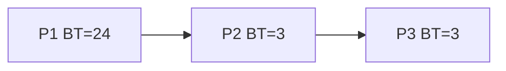
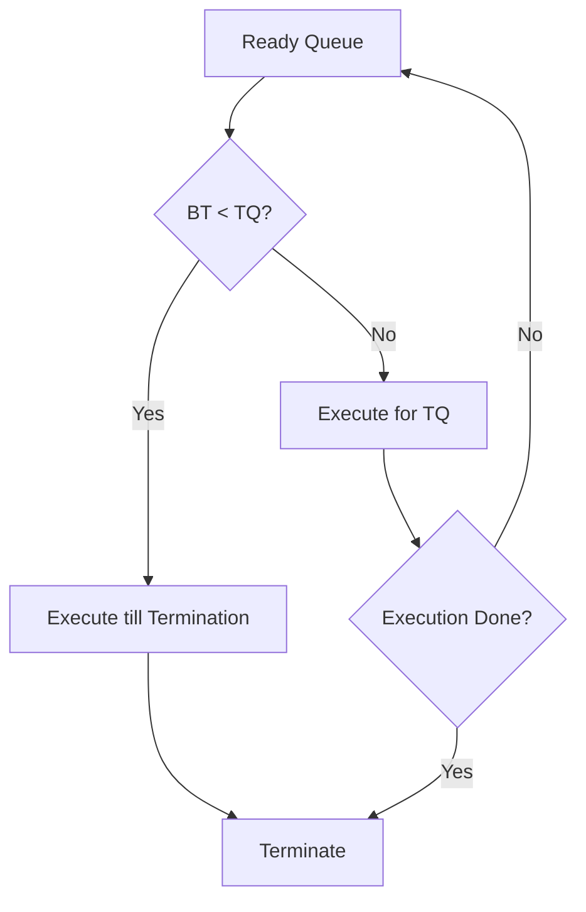
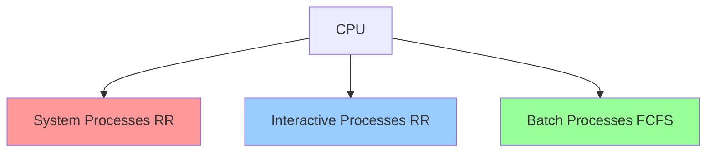
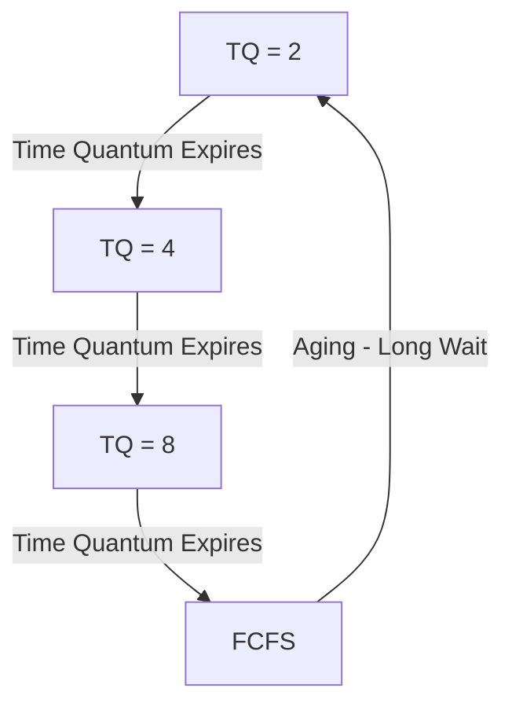

# Chapter 6: Process Scheduling Algorithms

## Process Scheduling

**Purpose**: Basis of multi-programming OS - switch CPU among processes to make computer more productive.

### CPU Scheduler (Short-Term Scheduler)
- Selects process from **ready queue** when CPU becomes idle
- Makes scheduling decision very frequently (milliseconds)

## Scheduling Types

### Preemptive Scheduling
- CPU can be **taken away** from process
- Taken after time quantum expires OR when higher priority process arrives
- **Advantages**:
  - ✅ Less starvation
  - ✅ High CPU utilization
  - ✅ Better response time

### Non-Preemptive Scheduling
- CPU allocated until process **releases** it (terminates or waits)
- **Disadvantages**:
  - ❌ Starvation possible
  - ❌ Low CPU utilization
  - ❌ Poor response time

## Goals of CPU Scheduling

| Goal | Description |
|------|-------------|
| **Maximum CPU Utilization** | Keep CPU as busy as possible |
| **Minimum Turnaround Time** | Time from submission to completion |
| **Minimum Wait Time** | Time spent waiting in ready queue |
| **Minimum Response Time** | Time from submission to first response |
| **Maximum Throughput** | Number of processes completed per unit time |

## Scheduling Metrics

| Metric | Formula | Description |
|--------|---------|-------------|
| **Arrival Time (AT)** | - | When process enters ready queue |
| **Burst Time (BT)** | - | Time required for execution |
| **Completion Time (CT)** | - | When process finishes execution |
| **Turnaround Time (TAT)** | CT - AT | Total time from arrival to completion |
| **Wait Time (WT)** | TAT - BT | Time spent waiting for CPU |
| **Response Time (RT)** | - | Time from arrival to first CPU allocation |

## Scheduling Algorithms

### 1. First Come First Serve (FCFS)

**Concept**: Process that arrives first gets CPU first.

**Characteristics**:
- **Non-preemptive**
- Simple to implement
- Uses FIFO queue

**Disadvantages**:
- ❌ **Convoy Effect**: Long process blocks shorter ones
- ❌ High average wait time
- ❌ Poor CPU utilization

**Convoy Effect Example**:
If P1 (BT=24) arrives before P2 (BT=3) and P3 (BT=3):
- Average WT = (0 + 24 + 27) / 3 = 17
- If order was P2, P3, P1: Average WT = (0 + 3 + 6) / 3 = 3

### 2. Shortest Job First (SJF) - Non-Preemptive

**Concept**: Process with **shortest burst time** gets CPU first.

**Characteristics**:
- Selects job with minimum BT from ready queue
- Requires BT estimation (usually impossible in practice)
- Criteria: AT + BT

**Advantages**:
- ✅ **Optimal** - gives minimum average wait time

**Disadvantages**:
- ❌ **Convoy effect** if first process has long BT
- ❌ **Starvation** possible (long processes may never execute)
- ❌ Difficult to estimate BT accurately

### 3. Shortest Remaining Time First (SRTF/Preemptive SJF)

**Concept**: Preemptive version of SJF - process with shortest **remaining** time gets CPU.

**Characteristics**:
- **Preemptive**
- Current process preempted if new process has shorter remaining time

**Advantages**:
- ✅ Less starvation
- ✅ No convoy effect
- ✅ **Minimum average wait time** for given set of processes

### 4. Priority Scheduling - Non-Preemptive

**Concept**: Each process assigned a **priority**; highest priority process gets CPU.

**Characteristics**:
- SJF is special case (priority ∝ 1/BT)
- Usually: Lower number = Higher priority

**Disadvantage**:
- ❌ **Indefinite waiting (Starvation)** for low priority processes

**Solution**: **Aging**
- Gradually increase priority of waiting processes
- Example: Increase priority by 1 every 15 minutes

### 5. Priority Scheduling - Preemptive

**Characteristics**:
- Current process preempted if higher priority process arrives
- Starvation still possible

### 6. Round Robin (RR)

**Concept**: Like FCFS but **preemptive** - each process gets small time quantum.

**Characteristics**:
- **Preemptive**
- Designed for **time-sharing** systems
- Criteria: AT + Time Quantum (TQ)
- Most popular scheduling algorithm

**Advantages**:
- ✅ **No starvation** (every process gets CPU eventually)
- ✅ **No convoy effect**
- ✅ Fair allocation
- ✅ Easy to implement

**Disadvantages**:
- ❌ Small TQ → More **context switching overhead**
- ❌ Large TQ → Approaches FCFS
- ❌ Average WT can be high

**Time Quantum Selection**:
- Too small: Excessive context switching
- Too large: Poor response time
- Typical: 10-100 milliseconds

### 7. Multi-Level Queue (MLQ)

**Concept**: Ready queue divided into **multiple sub-queues** based on process properties.

**Characteristics**:
- Processes **permanently** assigned to one queue
- Each queue has its own scheduling algorithm
- Scheduling among queues: **Fixed priority preemptive**

**Queue Types**:
1. **System Processes** (Highest priority) - RR
2. **Interactive Processes** (Foreground) - RR
3. **Batch Processes** (Background) - FCFS

**Disadvantages**:
- ❌ **Starvation** for lower priority queues
- ❌ **Convoy effect** present

### 8. Multi-Level Feedback Queue (MLFQ)

**Concept**: Like MLQ but processes can **move between queues**.

**Characteristics**:
- Processes separated based on **burst time characteristics**
- CPU-bound processes → Lower priority queues
- I/O-bound processes → Higher priority queues

**Advantages**:
- ✅ **Less starvation** (aging mechanism)
- ✅ **Flexible** (processes move between queues)
- ✅ Adapts to process behavior

**Movement Rules**:
- Process uses too much CPU → moved to lower queue
- Process waits too long → moved to higher queue (**aging**)

## Algorithm Comparison

| Algorithm | Preemption | Convoy Effect | Overhead | Design Complexity |
|-----------|------------|---------------|----------|-------------------|
| **FCFS** | No | Yes | No | Simple |
| **SJF** | No | Yes | No | Complex |
| **SRTF** | Yes | No | Yes | Complex |
| **Priority** | No | Yes | No | Complex |
| **P-Priority** | Yes | Yes | Yes | Complex |
| **RR** | Yes | No | Yes | Simple |
| **MLQ** | Yes | Yes | Yes | Complex |
| **MLFQ** | Yes | Yes | Yes | Complex |

## Interview Questions

### Q1: What is the convoy effect and which algorithms suffer from it?
**Answer**: Convoy effect occurs when many short processes are blocked by one long process holding the CPU, causing poor resource management and high average wait time.

**Algorithms with convoy effect**:
- FCFS
- SJF (non-preemptive)
- Priority (non-preemptive)
- MLQ

**Algorithms without convoy effect**:
- SRTF (preemptive SJF)
- Round Robin
- MLFQ

### Q2: Why is SJF called optimal?
**Answer**: SJF gives **minimum average wait time** for a given set of processes because:
- Scheduling short job before long job decreases wait time of short job **more** than it increases wait time of long job
- This minimizes total wait time
- However, it's only optimal if all processes arrive simultaneously

### Q3: What is starvation and how can it be prevented?
**Answer**:
**Starvation**: A process waits indefinitely because other processes continuously get priority.

**Occurs in**:
- Priority Scheduling (low priority processes)
- SJF (long burst time processes)

**Prevention**: **Aging**
- Gradually increase priority of waiting processes
- Example: Increase priority by 1 every 15 minutes
- Eventually, even low priority processes get CPU

### Q4: Calculate average TAT and WT for given processes with FCFS.
**Example**:

| Process | AT | BT |
|---------|----|----|
| P1 | 0 | 4 |
| P2 | 1 | 3 |
| P3 | 2 | 1 |

**Answer**:
- Execution order: P1 → P2 → P3
- CT: P1=4, P2=7, P3=8
- TAT: P1=4, P2=6, P3=6 → Avg = 5.33
- WT: P1=0, P2=3, P3=5 → Avg = 2.67

### Q5: Differentiate between preemptive and non-preemptive scheduling.
**Answer**:

| Preemptive | Non-Preemptive |
|------------|----------------|
| CPU can be taken away | Process holds CPU until release |
| Time quantum or priority | Only termination or wait state |
| More context switching | Less context switching |
| Better response time | Poor response time |
| Examples: RR, SRTF | Examples: FCFS, SJF |

### Q6: What is the ideal time quantum for Round Robin?
**Answer**: Time quantum selection:
- **Too small** (< 10ms): Excessive context switching overhead
- **Too large** (> 100ms): Becomes FCFS, poor response time
- **Ideal**: 10-100 milliseconds
- Should be **slightly larger** than context switch time
- Depends on process characteristics and system requirements

### Q7: How does MLFQ prevent starvation?
**Answer**: MLFQ prevents starvation through **aging**:
- Process waiting too long in lower queue → **promoted** to higher queue
- This ensures even CPU-intensive processes eventually get CPU
- Aging parameters are tunable (wait time threshold, promotion amount)

### Q8: Why is burst time estimation difficult in SJF?
**Answer**: Burst time estimation is difficult because:
- **Future is unpredictable**: Can't know how long process will run
- **Varies with input**: Same program, different inputs = different BT
- **User behavior**: Interactive processes depend on user actions
- In practice: Use **exponential averaging** of past burst times
- Formula: τ(n+1) = α × t(n) + (1-α) × τ(n)

### Q9: What is the difference between MLQ and MLFQ?
**Answer**:

| MLQ | MLFQ |
|-----|------|
| Processes **permanently** in one queue | Processes can **move** between queues |
| Inflexible | Flexible |
| More starvation | Less starvation (aging) |
| Simpler implementation | Complex implementation |
| Fixed process characteristics | Adapts to process behavior |

### Q10: Which scheduling algorithm is best for time-sharing systems?
**Answer**: **Round Robin** is best for time-sharing systems because:
- Ensures **fairness**: Every process gets CPU
- **Responsive**: Short time quantum ensures quick response
- **No starvation**: All processes eventually execute
- **Simple**: Easy to implement and understand
- Used in modern OS (Windows, Linux) with modifications

### Q11: What is throughput and how is it calculated?
**Answer**:
**Throughput**: Number of processes completed per unit time

**Formula**: Throughput = Number of processes completed / Total time

**Example**: If 5 processes complete in 50 seconds:
- Throughput = 5/50 = 0.1 processes/second = 6 processes/minute

Higher throughput = Better CPU utilization

### Q12: How does priority scheduling differ from SJF?
**Answer**:
- **SJF**: Priority based **only** on burst time (shorter BT = higher priority)
- **Priority Scheduling**: Priority based on various factors:
  - Process importance
  - User privilege level
  - Resource requirements
  - Deadline requirements
- SJF is a **special case** of priority scheduling where priority = 1/BT

### Q13: What is response time and why is it important?
**Answer**:
**Response Time**: Time from process submission to **first CPU allocation**

**Importance**:
- Critical for **interactive systems** (user experience)
- Different from TAT (which includes entire execution)
- RR has better response time than FCFS
- Important for real-time systems

**Example**:
- Process arrives at t=0, first runs at t=5
- Response time = 5

### Q14: Can average wait time be negative?
**Answer**: **No**, wait time cannot be negative because:
- WT = TAT - BT
- TAT = CT - AT
- Since CT ≥ AT + BT (process can't complete before arriving and executing)
- Therefore, WT ≥ 0
- Minimum WT = 0 (process gets CPU immediately)

### Q15: How does context switching affect scheduling performance?
**Answer**: Context switching impact:
- **Overhead**: Time to save/restore process state (not productive work)
- **Cache pollution**: CPU cache flushed, cold cache for new process
- **TLB flush**: Translation Lookaside Buffer invalidated
- **Frequent switching**: More overhead → Less throughput
- **Trade-off**: Responsiveness vs Efficiency
- Typical context switch: 1-1000 microseconds
