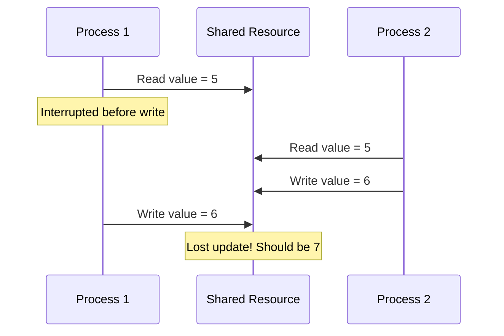
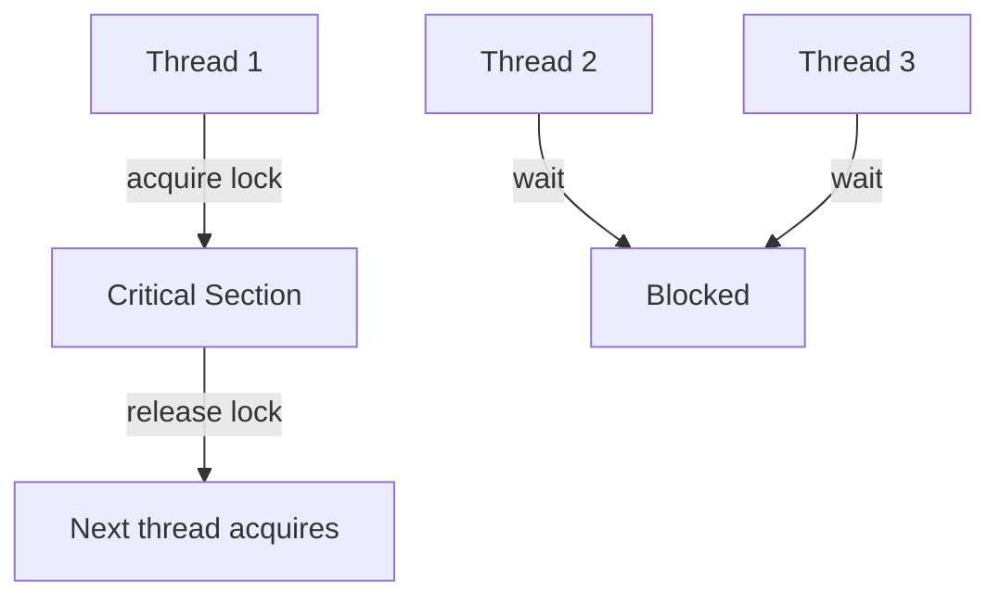
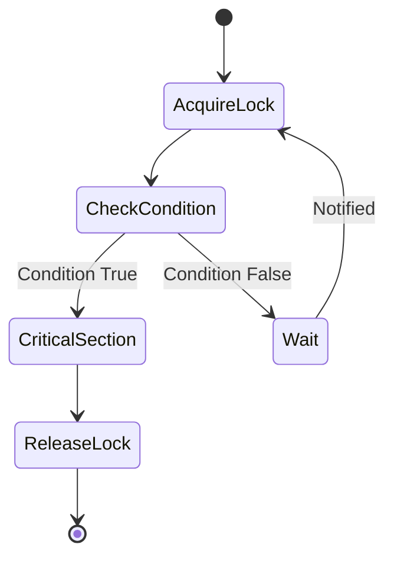
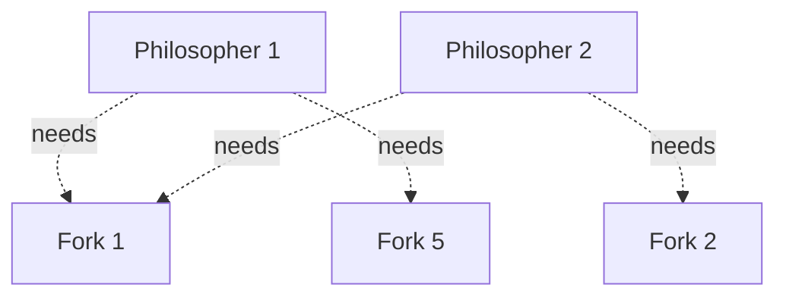

# Chapter 7: Concurrency & Synchronization

## Concurrency

**Concurrency**: Execution of multiple instruction sequences (threads/processes) at the same time.

**Occurs when**: Multiple process threads running in parallel in the OS.

## Critical Section Problem

### Critical Section (CS)
**Definition**: Segment of code where processes access **shared resources** and perform **write operations**.

**Problem**: Since processes execute concurrently, any process can be interrupted mid-execution, leading to **inconsistent data**.



## Race Condition

**Race Condition**: When two or more threads access shared data and try to change it simultaneously.

**Result**: Depends on thread scheduling algorithm - threads are "racing" to access/change data.

**Example - Bank Account Problem**:
```
Initial balance = 100
Thread 1: Deposit 50 (read 100, add 50, write 150)
Thread 2: Withdraw 30 (read 100, subtract 30, write 70)

Expected: 120
Actual (with race): Could be 150, 70, or 120 (unpredictable)
```

## Solutions to Race Condition

### 1. Atomic Operations
- Make critical section an **atomic operation**
- Executed in **one CPU cycle**
- No interruption possible
- Hardware support required

### 2. Mutual Exclusion using Locks
- Only **one thread** accesses critical section at a time
- Others must wait

### 3. Semaphores
- Synchronization primitive for controlling access
- Can allow multiple concurrent accesses

## Mutex/Locks

**Mutex (Mutual Exclusion)**: Allows only one thread to access critical section.



### Lock Mechanism
```
lock.acquire()
// Critical Section
lock.release()
```

### Disadvantages of Mutex

| Issue | Description |
|-------|-------------|
| **Contention** | Threads busy waiting; if lock-holding thread dies → infinite wait |
| **Deadlocks** | Circular waiting for locks |
| **Debugging** | Difficult to debug race conditions |
| **Priority Inversion** | High priority threads blocked by low priority |

## Conditional Variable

**Purpose**: Avoid **busy waiting** while using locks.

**Concept**: Thread can enter wait state only when it has acquired lock.

### Working
1. Thread acquires lock
2. Checks condition
3. If condition false: **releases lock** and **waits**
4. When notified: re-acquires lock and continues



**Advantages**:
- ✅ No busy waiting
- ✅ No contention when waiting
- ✅ Efficient resource usage

## Semaphores

**Semaphore**: Integer variable representing number of available resources.

### Operations
- **wait()** or **P()**: Decrement semaphore (acquire resource)
- **signal()** or **V()**: Increment semaphore (release resource)

```
wait(S):
    while S <= 0:
        // busy wait
    S = S - 1

signal(S):
    S = S + 1
```

### Types of Semaphores

#### 1. Binary Semaphore (Mutex)
- Value: **0 or 1**
- Equivalent to mutex locks
- Allows only one process

#### 2. Counting Semaphore
- Value: **Unrestricted range**
- Controls access to resource with **finite instances**
- Example: 5 identical printers → semaphore = 5

### Semaphore vs Mutex

| Semaphore | Mutex |
|-----------|-------|
| Can allow multiple threads | Only one thread |
| Integer value (0 to N) | Binary (0 or 1) |
| Signaling mechanism | Locking mechanism |
| Can be signaled by any thread | Must be released by owner |
| Resource counting | Resource locking |

### Avoiding Busy Waiting in Semaphores

Instead of busy waiting:
1. Block the process (move to **waiting queue**)
2. Change state to **Waiting**
3. Transfer control to CPU scheduler
4. When resource available: **wakeup()** operation
5. Move process from Waiting to **Ready** state

**Modified Operations**:
```
wait(S):
    S.value = S.value - 1
    if S.value < 0:
        block this process
        add to S.waiting_queue

signal(S):
    S.value = S.value + 1
    if S.value <= 0:
        remove process P from S.waiting_queue
        wakeup(P)
```

## Classic Synchronization Problems

### 1. Producer-Consumer Problem

**Setup**:
- Shared **bounded buffer**
- Producers add items
- Consumers remove items

**Constraints**:
- Producer can't add if buffer full
- Consumer can't remove if buffer empty

**Solution using Semaphores**:
```
Semaphore mutex = 1        // Mutual exclusion
Semaphore empty = N        // Empty slots
Semaphore full = 0         // Filled slots

Producer:
    wait(empty)
    wait(mutex)
    // Add item to buffer
    signal(mutex)
    signal(full)

Consumer:
    wait(full)
    wait(mutex)
    // Remove item from buffer
    signal(mutex)
    signal(empty)
```

### 2. Readers-Writers Problem

**Setup**:
- Multiple readers can read simultaneously
- Writer needs exclusive access

**Constraints**:
- Multiple readers allowed
- Only one writer at a time
- No readers when writer is writing

### 3. Dining Philosophers Problem

**Setup**: 5 philosophers, 5 forks (one between each pair)



**Problem**: All pick up left fork → **Deadlock** (can't pick up right fork)

**Solutions**:
1. **At most 4 philosophers** sit at table
2. **Atomic pickup**: Both forks picked in critical section
3. **Odd-Even rule**:
   - Odd numbered: Pick left then right
   - Even numbered: Pick right then left

## Interview Questions

### Q1: What is a race condition? Give a real-world example.
**Answer**: Race condition occurs when multiple threads access shared data simultaneously and outcome depends on thread scheduling.

**Example - Counter Increment**:
```
Shared variable: count = 0
Thread 1: count++  (read, increment, write)
Thread 2: count++  (read, increment, write)

Expected: count = 2
Actual: Could be 1 or 2 depending on interleaving
```

If both read 0, increment to 1, and write 1 → Lost update!

### Q2: What is the difference between mutex and semaphore?
**Answer**:

| Mutex | Semaphore |
|-------|-----------|
| Binary (locked/unlocked) | Integer (0 to N) |
| Ownership (thread that locks must unlock) | No ownership |
| Only one thread in CS | Multiple threads possible |
| **Locking** mechanism | **Signaling** mechanism |
| Used for mutual exclusion | Used for synchronization |

### Q3: What is busy waiting and why is it bad?
**Answer**:
**Busy Waiting**: Thread continuously checks condition in a loop while waiting.

**Problems**:
- ❌ Wastes CPU cycles (thread keeps running)
- ❌ Prevents other threads from using CPU
- ❌ Increases power consumption
- ❌ No progress made

**Solution**: Use conditional variables or blocking semaphores.

### Q4: Explain the Producer-Consumer problem.
**Answer**: Classic synchronization problem:
- **Producers** generate data and put in buffer
- **Consumers** take data from buffer
- **Buffer** has fixed size

**Challenges**:
- Producer must wait if buffer full
- Consumer must wait if buffer empty
- Mutual exclusion needed for buffer access

**Solution**: Use 3 semaphores (mutex, empty, full)

### Q5: What is a critical section?
**Answer**: Critical section is a code segment where:
- Process accesses **shared resources**
- Performs **write operations**
- Must be executed **atomically** (no interruption)
- Only **one process** should execute at a time

**Requirements for CS solution**:
1. **Mutual Exclusion**: Only one process in CS
2. **Progress**: Selection of next process can't be postponed indefinitely
3. **Bounded Waiting**: Limit on number of times other processes can enter CS

### Q6: How do conditional variables avoid busy waiting?
**Answer**: Conditional variables work with locks:
1. Thread **acquires lock**
2. Checks condition
3. If false: **Releases lock** and **blocks** (sleeps)
4. When condition becomes true: Another thread **signals**
5. Blocked thread **wakes up**, re-acquires lock, continues

**No busy waiting** because thread blocks (doesn't consume CPU).

### Q7: What happens if you forget to release a mutex?
**Answer**: Consequences:
- ❌ **Deadlock**: Other threads wait forever
- ❌ **Resource starvation**: Threads can't access resource
- ❌ **System hang**: If critical resources affected
- ❌ **Impossible to recover** (unless thread terminates)

**Prevention**: Use RAII (Resource Acquisition Is Initialization) pattern or try-finally blocks.

### Q8: Explain the Dining Philosophers problem and one solution.
**Answer**:
**Problem**: 5 philosophers, 5 forks. Each needs 2 forks to eat. If all pick up left fork simultaneously → Deadlock.

**Solution - Odd-Even Rule**:
- **Odd numbered philosophers**: Pick left fork first, then right
- **Even numbered philosophers**: Pick right fork first, then left

**Why it works**: Prevents circular wait condition.

### Q9: What is priority inversion?
**Answer**: **Priority Inversion**: High priority task blocked because low priority task holds a lock.

**Example**:
1. Low priority task L acquires lock
2. High priority task H needs lock → **blocked**
3. Medium priority task M preempts L
4. H waits for L, but L can't run because M is running
5. **Inversion**: H (highest priority) waits for M (medium priority)

**Solution**: Priority inheritance or priority ceiling protocols.

### Q10: Can a semaphore value be negative?
**Answer**: **Yes**, in implementation with blocking:
- **Positive**: Number of available resources
- **Zero**: No resources available
- **Negative**: Absolute value = number of waiting processes

**Example**: Semaphore = -3 means 3 processes waiting.

### Q11: What is the difference between wait() and signal() operations?
**Answer**:
- **wait(S)** or **P(S)**:
  - **Decrements** semaphore
  - **Acquires** resource
  - **Blocks** if S ≤ 0

- **signal(S)** or **V(S)**:
  - **Increments** semaphore
  - **Releases** resource
  - **Wakes up** waiting process if any

### Q12: Why can't we use a simple flag variable to solve race conditions?
**Answer**: Simple flag doesn't work because:
- Checking and setting flag are **two separate operations**
- Both operations can be interrupted
- Creates another race condition on the flag itself!

**Example**:
```
if flag == 0:      // Thread 1 checks
    // Interrupted here!
                   // Thread 2 checks flag == 0
    flag = 1       // Thread 1 sets
                   // Thread 2 also sets flag = 1
    // Both enter CS!
```

Need **atomic** test-and-set operation (hardware support).

### Q13: What is a spinlock?
**Answer**: **Spinlock**: Lock that uses busy waiting.

**Characteristics**:
- Thread **spins** in a loop checking lock
- Doesn't yield CPU
- Used when wait time is **very short**
- Common in multiprocessor systems

**When to use**:
- ✅ Critical section is very short
- ✅ Multiple CPUs available
- ❌ Don't use on single CPU (wastes cycles)

### Q14: How does semaphore prevent race conditions in Producer-Consumer?
**Answer**: Using 3 semaphores:

1. **mutex (= 1)**: Ensures mutual exclusion for buffer
2. **empty (= N)**: Counts empty slots
3. **full (= 0)**: Counts filled slots

**Producer**:
- wait(empty) → Ensures space available
- wait(mutex) → Locks buffer
- Add item
- signal(mutex) → Unlocks buffer
- signal(full) → Increment filled count

**Consumer**: Opposite operations

**No race condition** because mutex ensures atomicity.

### Q15: What is the difference between deadlock and starvation?
**Answer**:

| Deadlock | Starvation |
|----------|------------|
| Processes waiting for each other | Process waits indefinitely |
| **Circular wait** | Continuously **preempted** by others |
| **No process** makes progress | **Other processes** make progress |
| All involved processes blocked | Only low priority process affected |
| System stuck | System functional |
| Requires recovery | Can be solved by aging |
